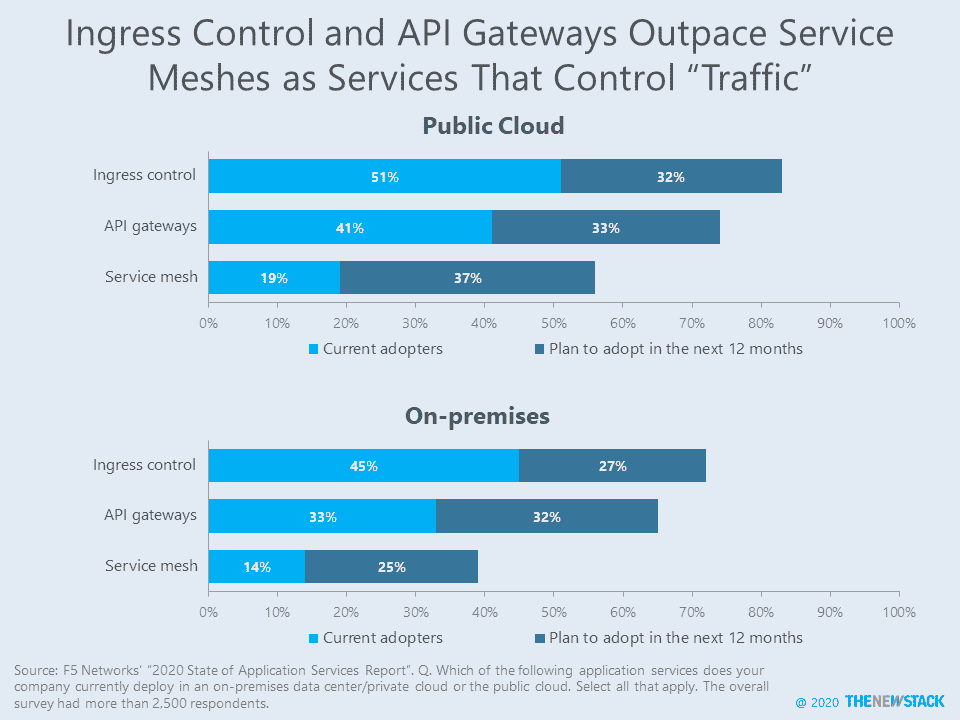
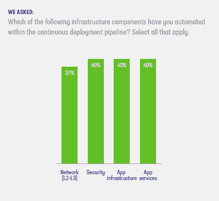
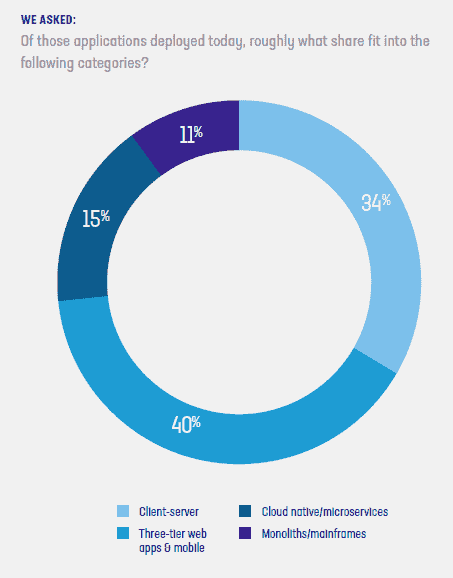

# 像 Service Mesh 这样的 App 服务会增长多少？

> 原文：<https://thenewstack.io/how-much-will-app-services-like-service-mesh-grow/>

现代架构的网络管理服务，如服务网格和 API 网关，越来越多地出现在 IT 专业人员的路线图上，尤其是在公共云环境中。值得注意的是，37%的 IT 专业人员预计明年开始在公共云中使用服务网格，但如果该技术的宣传泡沫破裂，实际采用率可能会显著降低。这些是我们从 F5 Networks 的“ [2020 年应用服务状态，](https://www.f5.com/state-of-application-services-report)”中获得的两个信息，该调查基于对 2，500 多名 IT 专业人员的调查，其中 34%的人从事网络相关的工作。

根据调查，51%的企业目前在公共云中使用入口控制服务，41%使用 API 网关，19%使用服务网格。对于内部环境，这些数字要低得多。然而，采用更传统的服务，如 SSL VPN 和通用安全服务(如防火墙、防病毒)更有可能在内部环境中使用。例如，81%的企业在内部使用 SSL VPN，而在公共云中这一比例为 67%。这是一种不同的模式。尽管我们无法访问特定数据，但内部不太可能需要较新类别的应用服务，因为内部运行的工作负载不太可能经过重构以利用云原生架构。

根据一项指标，服务网格的采用可能逐年下降。2019 年的研究发现，27%的人在使用服务网格，但没有区分公共环境和内部环境中的使用。每月 API 调用超过 1000 万次的 10%受访者更有可能已经在公共云中部署了入口控制(67%)和服务网格(54%)。

正如最近由 Citrix 赞助的[系列文章](https://thenewstack.io/part-4-when-a-service-mesh-lite-proxy-is-right-for-your-organization/)中所解释的，服务网格是用于交付基于微服务的应用的代理架构的一部分。该调查并未详细说明服务网格在多大程度上有望补充而非取代其他交通管理方法的使用。37%的受访者不太可能在明年开始使用服务网格，但如果他们这样做，那么到 2020 年底，将有高达 56%的受访者在公共云中使用服务网格。

去年的调查也询问了这些应用服务，但没有区分位置。因此，很难比较真正的收养随着时间的推移发生了怎样的变化。带着这个警告，让我们看看采用率是如何逐年变化的:

*   API 网关从 42%(所有云)略微下降到 41%(公共云)
*   入口控制从 42%(所有云)略微上升到 47%(公共云)
*   服务网格从 27%(所有云)略微下降到 19%(公共云)

F5 Networks 将从不断增长的应用流量管理服务需求中受益。去年，F5 Networks [收购了](https://thenewstack.io/why-f5-networks-bought-nginx-containers-and-existing-user-base/) NGINX，后者支持常用于入口控制和 API 网关的开源软件。它还收购了 [Aspen Mesh](https://aspenmesh.io/) ，这是一家领先于[服务网格领域](https://thenewstack.io/top-three-service-mesh-developments-in-2019/)的初创公司。

我们将继续调查这些话题。与此同时，以下是我们对报告其他部分的更多分析:

*   网络自动化的增长率不确定。与去年相比，部署管道中第 4-7 层应用服务的自动化程度实际上从 42%降至 40%。网络服务(第 2-3 层)也下降了一个百分点。相对较少的组织使用付费代码库，如 GitHub Enterprise (12%)和 GitLab Enterprise (8%)作为网络自动化过程的一部分。一项由社区发起的关于 NetDevOps 的调查产生了相互矛盾的结果。该研究的 293 名参与者在一系列网络自动化活动中显示出显著增长，但这一增长是与 2016 年相比的，2016 年是之前进行调查的时间。NetDevOps 调查的受访者似乎在采用基础设施作为代码方面更先进，这可以实现网络自动化。
*   **微服务 vs .单片辩论忽略了更大的画面。**在一般的应用程序组合中，15%是基于微服务的，11%是单片或托管在大型机上的。这意味着 74%的普通企业应用程序使用客户机-服务器或三层架构。最近的一份网络安全管理软件产品报告也显示，应用程序组合具有压倒性的异构性，但一份 Logz.io 报告暗示，开发人员可能开始回避使用混合整体/微服务架构创建应用程序的复杂性。
*   安全问题减少。的确，58%的受访者表示在云计算环境中维护安全性、策略和合规性具有挑战性。总体而言，62%的受访者对自己保护内部数据中心应用的能力充满信心，这一比例高于去年调查中的 53%。45%的人对驻留在公共云中的应用程序的安全性有信心，但这仍然比去年报告的 38%要好。

来源:F5 Networks 的“2020 年应用服务状态报告”。

来源:NetDevOps 2019 年调查

来源:F5 Networks 的“2020 年应用服务状态报告”。

Citrix 是新堆栈的赞助商。F5 Networks 拥有 AspenMesh，该公司是新堆栈的赞助商。

来自 Pixabay 的 Engin_Akyurt 的特征图像。

<svg xmlns:xlink="http://www.w3.org/1999/xlink" viewBox="0 0 68 31" version="1.1"><title>Group</title> <desc>Created with Sketch.</desc></svg>