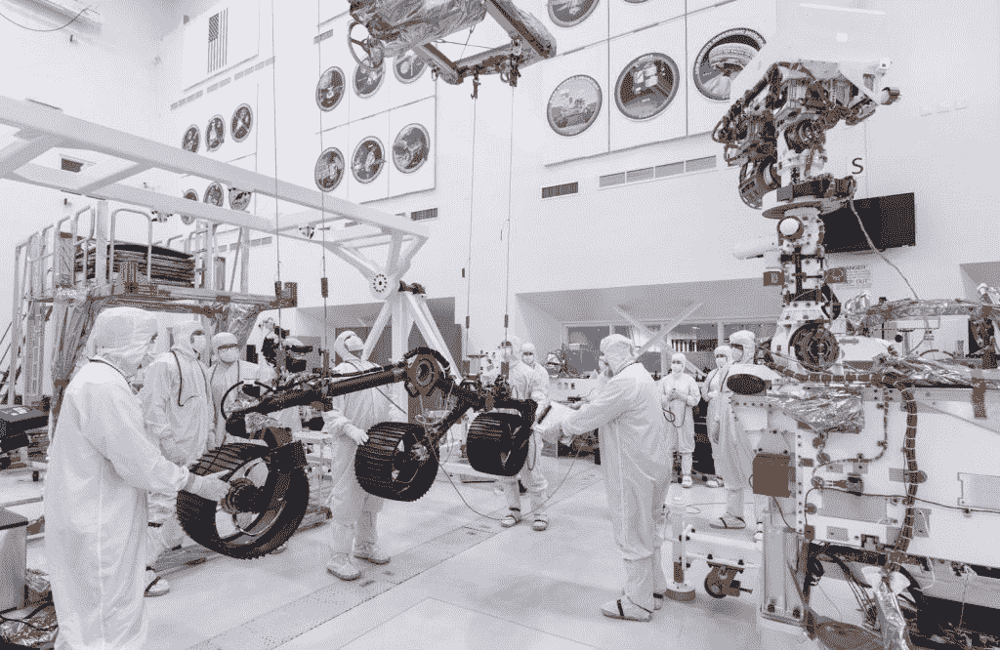

# 美国宇航局的下一个火星探测器将如何在这颗红色星球上寻找过去生命的迹象

> 原文：<https://thenewstack.io/how-nasas-next-mars-rover-will-look-for-signs-of-past-life-on-the-red-planet/>

外层空间总是给人类带来终极挑战:我们能否利用我们最好的技术来解开我们银河系的秘密？面对近乎无限的距离，需要跨越数百万英里的远程操作，在最恶劣的环境中使用有限的硬件资源。

但是美国宇航局及其合作者并没有停止好奇——他们现在正在组装和测试他们最新的仪器集合，以部署在 3900 万英里以外的火星表面。他们在网上与世界各地好奇的人们和下一代求知者分享这些准备工作。

美国国家航空航天局称其为“寻找红色星球上过去生命迹象的第一次任务”

## 火星任务

那么，当我们的野心和好奇心相遇时，会发生什么呢？在加利福尼亚州 La Cañ ada Flintridge 的某个地方，“火星 2020”漫游者已经在美国宇航局的喷气推进实验室完成了最后的驾驶测试。漫游者的下一站将是佛罗里达州的卡纳维拉尔角，美国宇航局在肯尼迪航天中心的“发射服务项目”将帮助它实现其雄心勃勃的行程:

*   2020 年 7 月 17 日——离开地球。
*   2021 年 2 月 18 日——抵达火星。

根据非营利组织行星协会的说法，从 7 月 17 日开始，为期 19 天的发射窗口将用于搭载火星车的定制航天器。这艘小型飞船将花费 7 个月的时间从地球旅行到火星——但它命运般的 216 天飞行已经到来了很长时间。

美国国家航空航天局[有一个完整的网页](https://mars.nasa.gov/mars-exploration/missions/?page=0&per_page=99&order=date+desc&search=&category=172)致力于过去 44 年间登陆火星的探测任务。有海盗 1 号和 2 号(1975 年)，探路者(1997 年)，极地登陆者(1999 年)，勇气号和火星车(2004 年)，凤凰号(2008 年)，好奇号(2012 年)，和洞察号(2018 年)。行星协会指出，环绕火星的卫星现在已经向地球发回了数千万亿比特的数据。“我们现在有从 1997 年开始的连续天气记录。我们非常了解火星的大气——它的成分、压力、温度，以及这些如何随季节变化。"

但是这辆火星漫游车将在一个 28 英里宽的陨石坑着陆，这个精心挑选的地点被美国宇航局描述为“可能是寻找远古生命迹象的最佳地点之一”35 亿年前，这里有一个湖泊和一个古老的河流三角洲，这里仍然有*的碳酸盐矿物沉积物，“像浴缸环一样沿着 Jezero 的海岸线”*

“一个古老的湖泊是追寻我们寻找可能的火星生命的目标的一个奇妙的地方，”美国宇航局的一个视频解释道[。“在地球上，湖泊里充满了生物。生命的证据通常保存在沉积在湖底的泥沙中。所以我们使用漫游者的仪器来探索古老湖床的岩石。”](https://www.youtube.com/watch?v=JgMXPXdqJn8&feature=emb_rel_pause)

[https://www.youtube.com/embed/qnZ_sidmr4Y?feature=oembed](https://www.youtube.com/embed/qnZ_sidmr4Y?feature=oembed)

视频

有史以来第一次，这辆火星车还将携带一个新的钻机，“可以收集最有希望的岩石和土壤的核心样本，”美国宇航局的一页解释道，“并将它们放在火星表面的一个‘缓存’中。”

根据行星科学杂志《伊卡洛斯》最近的一篇论文，这是火星上唯一已知的既有碳酸盐又有过去湖泊地质特征的地点。美国宇航局的新闻稿还指出，他们早期的好奇号探测器已经发现了微生物生命可能在数十亿年前存在于火星上的迹象。“火星 2020 将寻找过去微生物生命的实际迹象，采集岩石核心样本，这些样本将存放在火星表面的金属管中。”美国宇航局的“样本缓存系统”[使用了 17 种不同的马达](https://mars.nasa.gov/news/8451/mars-2020-rover-gets-its-wheels/)，样本将被“[严格记录](https://mars.jpl.nasa.gov/mars2020/mission/science/objectives/)并可回收。”

行星协会指出，美国宇航局和欧洲航天局已经就[*如何取回这些样本*](https://www.planetary.org/blogs/guest-blogs/what-comes-next-on-mars.html)*进行了讨论，其中一个想法是在 2026 年发射，2031 年返回样本。西班牙 INTA 航天局有效载荷和空间科学部主任写道:“一个表面回收着陆器将部署一个样本采集漫游车，花 6 个月时间收集样本，并将它们装入一个篮球大小的样本罐中，由火箭从着陆器甲板上发射。”"样本返回轨道飞行器将在火星轨道上与罐子会合，然后把它送回地球。"*

 *火星车还将携带一个小型(3 公斤)[探地雷达](https://mars.nasa.gov/mars2020/mission/instruments/rimfax/)，它可以搜索埋藏在干燥的火星表面下的水或冰——这是美国宇航局首次向火星发送雷达工具。“没有人知道火星表面下有什么，”火星地下实验雷达成像仪(或“RIMFAX”)团队的首席研究员 Svein-Erik Hamran 说。“现在，我们终于可以看到那里有什么了，”他在美国宇航局的雷达成像仪官方页面上解释道。

但这并不是这辆 2020 漫游车为未来探险铺平道路的唯一方式。事实上，美国国家航空航天局已经明确表示，这个漫游者的科学任务将有助于“人类探索火星的准备工作”具体来说，它将测试原位资源利用技术是否可以从火星大气(其中 96%是二氧化碳)中产生可消耗的氧气(和/或推进剂)。

## **火星测试**

根据约翰·霍普金斯大学应用物理实验室首席专业科学家的一篇博客文章，去年 2 月在美国西南部的一个沙漠中，项目小组模拟了从火星上看到的景象[这是与分散在世界各地的科学家合作](https://www.planetary.org/blogs/guest-blogs/2019/practicing-mars-2020-ops.html)来练习他们如何处理来自火星车的照片和其他数据。

"几个健壮的灰胡子可以追溯到 20 世纪 70 年代末的维京任务。"

然后在 12 月，美国宇航局宣布漫游者“[通过了第一次驾驶测试](https://www.jpl.nasa.gov/news/news.php?release=2019-251)，因为设备“在加利福尼亚州帕萨迪纳的美国宇航局喷气推进实验室的一个干净的房间里前后滚动并旋转。或者，正如项目经理约翰·麦克纳米所说，“漫游者需要滚动…”

"我们迫不及待地想在它的轮子下放一些红色的火星泥土."

测试的视频让我们感受到了火星车的大小。它将近 10 英尺长，超过 7 英尺高——所以“大约有一辆小型汽车那么大，”行星协会网站的一页上的[解释道。但它的重量约为 2315 磅——或者说“比一辆小型汽车轻”(约 660 磅)。当完全伸展时，它的机械臂伸展近 7 英尺。甚至还有一个记录着陆声音的麦克风，“也可能捕捉到火星车工作时的声音，这将为工程师提供有关火星车健康和操作的线索。”](https://www.planetary.org/explore/space-topics/space-missions/mars2020.html)

几个月来，漫游者的实验室一直是紧张研究的现场。甚至有一个来自美国宇航局喷气推进实验室的[直播节目](https://mars.nasa.gov/mars2020/mission/where-is-the-rover/)，定期安排他们回答所有问题。(下一次是太平洋标准时间周一上午 11 点)

美国宇航局指出它与以前的漫游者有什么不同。2020 年火星车的自动导航软件将比以往任何一辆火星车都更能自主做出驾驶决定。它的高分辨率、宽视角导航相机将把数据传送给美国宇航局称之为“处理图像和制作地图的额外计算机‘大脑’”，总是小心翼翼地避免倾斜超过 30 度

事实上，这个漫游者携带了一套全新的科学仪器，包括一个 [Mastcam-Z 相机系统](https://www.planetary.org/explore/projects/mars-2020/)，除了放大还可以拍摄彩色、立体、3D、[照片，根据行星协会](https://www.planetary.org/explore/space-topics/space-missions/mars2020.html)。作为该相机的教育和公共宣传合作伙伴之一，他们写道，相机应该提供“令人惊叹的表面彩色图像”，并包括几个过滤器，以帮助它研究火星地质。有一个 X 射线荧光光谱仪和成像仪，加上一个独立的拉曼光谱仪和成像仪，可以[探测样本的化学成分](https://www.sciencedirect.com/topics/neuroscience/raman-spectroscopy)。

此外，尚未命名的火星漫游者还将运送一架用于实验飞行测试的小型直升机。

## **‘小飞行机器人’**

事实上，在着陆器在火星上的第一个 90 天里，它会围绕着直升机，直到它最终将直升机轻轻地降落到地面，然后开走，给它一条清晰的飞行路径。漫游者将通过测量风和大气条件来提供帮助，并最终将美国宇航局地球工程师的初始命令传递给直升机(并接收回其传输的图像和其他信息)。但是来自地球的信号至少需要 4 分钟才能到达——或者长达 21 分钟，这取决于行星在轨道上偏离的距离。因此，直升机必须根据其机载系统对下方地形的分析，自行决定在哪里着陆。

美国宇航局将其描述为“小型飞行机器人”。

但是它面临着任何飞行机器人从未面临过的挑战。这个四磅重、垒球大小的立方体有坚硬的四英尺长的叶片和一个超高速的转子，专门适应稀薄的火星大气。“在每分钟 2800 转的速度下，它的旋转速度大约是地球直升机的 10 倍……”美国宇航局的一篇博客文章解释道。"在火星上的 30 天时间里，直升机将尝试多达 5 次飞行，每次都比上一次飞得更远。"

它将携带一个 1300 万像素的小型摄像头——“与今天智能手机中常见的类型相同。”

邮报指出，该项目的副总工程师 Joe Melko 说，他们必须发明一种在地球上测试直升机的方法。他们设计、建造并测试了一系列原型，经常在 JPL 模拟火星大气的模拟器中或模拟零下 130 度夜晚的冷室内飞行。直升机太阳能电池板的大部分能量将用于夜间保暖。他们甚至进行了辐射测试，“更多的测试将会看到它在类似火星的风和其他条件下的表现。”

在美国宇航局的博客文章中，JPL 该项目的首席工程师鲍勃·巴拉拉姆说，这种迷你直升机可能成为对地球进行更广泛探索的先驱。

"有一天，如果我们派遣宇航员，这些可能是穿越火星的宇航员的眼睛."

* * *

# WebReduce

<svg xmlns:xlink="http://www.w3.org/1999/xlink" viewBox="0 0 68 31" version="1.1"><title>Group</title> <desc>Created with Sketch.</desc></svg>*