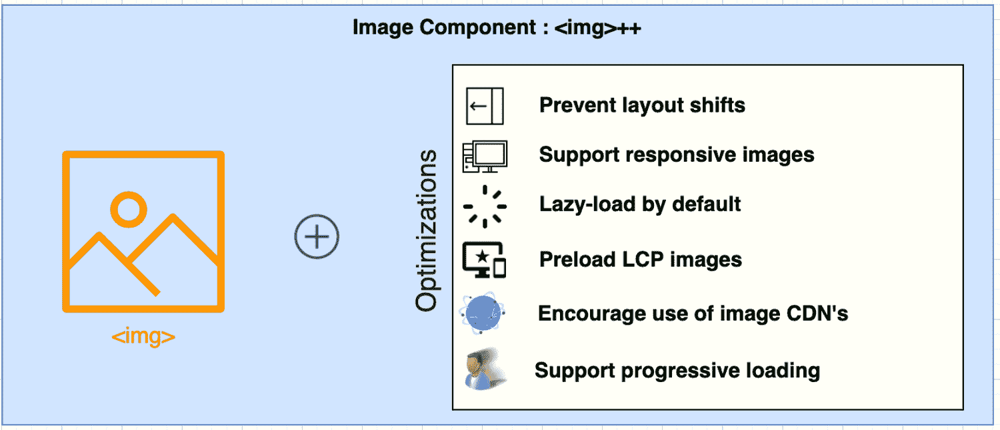

# Next.js 12 如何连接到低代码和可视化设计工具

> 原文：<https://thenewstack.io/how-next-js-12-connects-to-low-code-and-visual-design-tools/>

 [理查德·麦克马努斯

理查德是 New Stack 的高级编辑，每周撰写一篇关于网络和应用程序发展趋势的专栏文章。此前，他在 2003 年创立了读写网，并将其打造为全球最具影响力的科技新闻和分析网站之一。在 Twitter @ricmac 上关注他。](https://twitter.com/ricmac) 

上周，Vercel 发布了 Next.js 12，这是其基于 React 库的 JavaScript 框架的最新版本。Vercel 的首席执行官和 Next.js 的创建者 Guillermo Rauch 将第 12 版定位为“第一个网络 SDK”——大概是基于其不断增加的功能集，我将在本专栏中详细介绍。同样值得注意的是，劳赫强调了 Next.js 12 速度的提高，他说这有助于开发者通过谷歌的核心网站要害获得更好的网站排名。谷歌和脸书都是 Next.js 的重要支持者

在 Next.js 12 发布之前，我在一次 Zoom 电话会议上与劳奇进行了交谈，以了解关于最新版本的更多信息——包括它如何对非开发人员更具吸引力。

劳奇首先告诉我现代网络开发的规模问题。他说，开发人员正在用代码库“突破极限”，这些代码库有“数千个页面入口点，数十万个组件——或者数万个组件。”他认为开发人员正在“触及基于 JS 的工具的极限”

出于这些原因，Next.js 在这个版本中已经转向了“原生工具”——特别是随着使用流行的编程语言 Rust 构建的编译器的发布，Rust 以其“[超快的](https://thenewstack.io/rust-by-the-numbers-the-rust-programming-language-in-2021/)”性能而闻名。

“Next.js 12 结合了一个基于 Rust 的编译引擎和一些现有的 js 基础设施，这也是优化的，”Rauch 说。“基本上，开发速度快了三倍，构建速度快了五倍，而一些特定的流程已经快了十倍，比如缩小捆绑包。”

## 扩充和优化

Next.js 的吸引力一直在于，它不仅抽象出了用 JavaScript 和 React 开发的一些复杂性，而且增强了 web 标准的基本功能。例如，它鼓励开发人员使用“基于 React 的图像组件”，作为 HTML 中常见的标签的替代品。Next.js 标签是 HTML 标签的抽象，所以最终它都归结为 web 标准。但是 Next.js 的目标是在幕后优化 HTML 标签所能做的事情——这样 web 开发人员就不用自己做这些工作了。Next.js 12 为[带来了对图像功能的进一步改进](https://web.dev/image-component/)，包括 [AVIF 支持](https://twitter.com/addyosmani/status/1453059712862154755)。

来源:谷歌的 web.dev

Next.js 12 并不缺少其他的[新特性](https://nextjs.org/blog/next-12)。例如，ES 模块和 URL 导入、即时热模块替换(HMR)，以及一种叫做“[中间件](https://nextjs.org/docs/middleware)的东西，它使您能够“在请求完成之前运行代码”

以下是对中间件的简明解释:

## 与设计师和商业用户合作

因此，Next.js 中有大量内容可供铁杆 web 开发人员钻研。但在我们的通话中，Rauch 解释说，Next.js 也在“融合无代码开发和设计工具”。他的意思是，即使非开发人员也被鼓励使用 Next.js，即使他们只是为了与开发人员合作而使用这些工具。

新的 URL 导入功能是这种转变的一个方面，其用户中包括非开发人员。在上周举行的 Next.js Conf 的主题演讲中，劳赫表示，URL 导入可以“实现与无代码和设计工具(如 Framer)的无缝集成。”

[框架器](https://www.framer.com/fp/)是设计师用来制作组件或产品原型的工具。它有一个可视化的用户界面，所以代码是隐藏的。在我们的讨论中，Rauch 解释了 Next.js 12 中的 URL 导入如何使用户能够导入在 Framer 这样的工具中可视化设计的组件。

“你可以设计你的组件，就像一个草图，”他告诉我，关于使用 Framer。在复制了草图的 URL 之后，他继续说道，“你回到你的代码库，导入那个 URL，现在你有了一个可视化设计的组件树。”

认为非开发人员可以轻松使用 Next.js 来构建应用程序仍然是一个挑战，但 URL 导入是朝着这种“低代码”功能迈出的一步。

## Next.js Live:开发者在掌控

Rauch 还提到了 Next.js Live，这是一个基于 web 的 IDE(集成开发环境)，是另一种让非开发人员更多参与项目的方式。由于不需要工具设置——您只需要使用浏览器登录——理论上，设计师和商业用户在这种环境中与开发人员一起工作会感觉更舒服。他们能够与开发人员聊天，并在 Live 工具的屏幕上画图。Rauch 在他的主题演讲中解释说，Next.js Live 是使用现代 web 技术构建的，如 es 模块(JavaScript 模块的 web 标准)和 WebAssembly，以及其新的 Rust 编译器基础设施。

“Live 正在帮助工程师提高工作效率，”劳赫在主题演讲中说，“但也让设计师、产品经理、文案和其他许多人更接近前端。”

我问这些新的业务协作特性与市场上其他低代码工具相比如何，其中许多工具也鼓励开发人员和业务用户之间的协作。劳赫回答说，在 Next.js 中，开发人员始终保持对底层代码的控制。

“开发者仍然是控制和操纵一切的人。他们可以了解代码是否正确，是否有良好的性能，是否是一个可以长期持续的抽象概念。”

他建议，对于现有的低代码方法，你必须“在以下两者之间进行权衡，哦，我可以在视觉上快速移动，但我甚至不知道那个东西输出的是什么。”换句话说，让开发人员控制代码——包括准确知道输出的是什么代码——是 Next.js Live 中协作成功的关键。

## 开发人员有大量选择

Next.js 在 10 月份已经五岁了，从那时起，它已经发展成为一个广泛的 JavaScript 框架。当它在 2016 年 10 月宣布的时候，它是“一个服务器渲染的通用 JavaScript web 应用的小框架。”现在它肯定不是一个小框架——见鬼，它甚至有中间件！玩笑归玩笑，有了“React 服务器组件”和“Edge 函数”这样的新功能，Next.js 现在能为开发者做的事情有很多细微差别。

不要担心视觉设计师和商业用户不一定理解这个高级功能，因为 Next.js 开发人员已经控制了一切。

<svg xmlns:xlink="http://www.w3.org/1999/xlink" viewBox="0 0 68 31" version="1.1"><title>Group</title> <desc>Created with Sketch.</desc></svg>