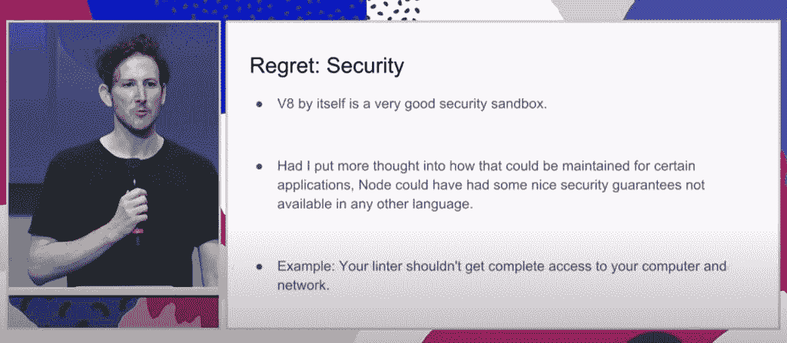

# Node.js 如何应对 Ryan Dahl 的 Deno 的挑战

> 原文：<https://thenewstack.io/how-node-js-is-addressing-the-challenge-of-ryan-dahls-deno/>

开源 JavaScript 运行时 Node.js 于上周发布了第 15 个版本。如今，Node.js 已进入第 11 个年头，一如既往地受欢迎，但在 2020 年，一个新贵竞争者已经出现。 [Deno](https://deno.land/) ，五月份发布的开源 JavaScript 运行时，是由 Node.js 的原作者[瑞安·达尔](https://tinyclouds.org/)创建的。比拥有一个对你的产品了如指掌的竞争对手更糟糕的是，Deno 是专门为解决达尔认为的 Node.js 的关键弱点而创建的[——包括安全问题、中央存储系统(npm)的使用和“高压工具”](https://deno.land/posts/v1)

为了了解当前这一代 Node.js 维护者如何应对新的挑战者，以及他们正在采取什么措施来回应达尔的批评，我采访了 Red Hat 的高级软件工程师兼 Node.js 技术指导委员会成员[贝瑟尼·格里戈斯](https://twitter.com/BethGriggs_)。格里戈斯自 2016 年以来一直参与 Node.js 项目，主要是 Node.js 发布工作组。

 [理查德·麦克马努斯

Richard 是 New Stack 的高级编辑，每周撰写一篇专栏文章，探讨云计算原生互联网的未来。此前，他在 2003 年创立了读写网，并将其打造为全球最具影响力的科技新闻和分析网站之一。](https://twitter.com/ricmac) 

Node.js 使开发人员能够在 web 浏览器之外执行 JavaScript 代码。它最初的目的是在发送到浏览器之前，在服务器上创建动态网页；这意味着 JavaScript 代码在服务器端执行，而不是在客户端。更一般地说，Node.js 已经成为后端 web 编程的默认(而 React 和 Angular 之类的用于前端)。想法是开发者可以在后端和前端使用相同的语言，JavaScript。

Node.js 还具有高度可伸缩性和事件驱动的编程模型，这两者都使它非常适合云原生应用程序。

“Node.js 仍然是构建云原生微服务和后端应用的领先运行时之一，”格里戈斯告诉我。她补充说，“它在物联网项目中也很受欢迎——我最喜欢的[例子之一](https://openjsf.org/wp-content/uploads/sites/84/2020/02/Case_Study-Node.js-NASA.pdf)是美国宇航局使用 Node.js 监控太空服数据。”

撇开太空服不谈，Node.js 不再被视为 JavaScript 开发的热门新事物(Next.js，一个前端 React 框架，可能已经[继承了这个衣钵](https://thenewstack.io/vercels-frontend-and-the-rise-of-the-hybrid-developer/))。与 Deno 的前沿特性相比——例如，Deno 是用流行的新编程语言 Rust 编写的——node . js 项目如今遵循相对保守的开发路线。所以 Node.js 的 15 版本是增量升级也就不足为奇了。

格里戈斯称“对未处理的拒绝默认抛出”是 v15 中最重要的更新。这意味着开发人员现在可以获得“早期反馈，他们忽略了应用程序中的错误处理。”毫无疑问，这是一个有价值的技术更新，但不太可能在科技 Twitter 上引发热烈讨论。

## 回应瑞安·达尔的批评

我更好奇的是，Node.js 项目团队是否进行了任何新的开发或修复，以解决 Ryan Dahl 在过去几年中提出的一些问题？

几年前，达尔在[做了一个关于他在创建 Node.js 后的遗憾的演讲](https://www.youtube.com/watch?v=M3BM9TB-8yA&feature=youtu.be)，其中一个主要的遗憾是他没有让运行时尽可能安全——这是他在创建 Deno 时解决的问题，Deno 被宣传为“默认安全”Deno 的安全方法是围绕数据访问设置安全围栏；如 [its 手册](https://deno.land/manual)中所述，“Deno 要求文件、网络和环境访问的明确许可。”

Ryan Dahl 在 JSConf EU 2018 上。

在外交上，格里戈斯告诉我，Node.js 将在这个问题和其他问题上“从 Deno 那里获得灵感”。然而，她说 Node.js 项目“在 Deno 宣布之前就已经有了围绕安全执行和限制访问 API 的讨论历史。”她指出了安全方面的几个“实验性特征”([例 1](https://nodejs.org/dist/latest-v15.x/docs/api/cli.html#cli_frozen_intrinsics) 、[例 2](https://nodejs.org/dist/latest-v15.x/docs/api/policy.html) )。

此外，格里戈斯并不认为 Deno 的安全第一的访问方法对 Node.js 是正确的。“在实际应用中，”她说，“你很快就不得不退回到授予对许多 API 的访问权限，所以净价值与复杂性的比值会很低。”

尽管 Node.js 项目组对试验更强的安全特性感兴趣，但据格里戈斯称，“还没有一个令人信服的案例来采用与 Deno 相同的权衡。”

至于达尔批评 npm 是一个封闭的模块生态系统，格里戈斯认为 Node.js 没有理由改变这一点。

“关于如何管理模块，模块生态系统是 Node.js 成功的一大部分。虽然围绕客户端(服务于模块的注册中心)的集成正在进行讨论，但主要焦点一直是增加对 ES6[JavaScript 规范的第 6 版]模块的支持，而不是改变它们的管理方式。”

Deno 没有使用 npm，而是选择使用模块作为 URL 或文件路径。

## 服务器端 JavaScript 仍然很强大

随着当前像 Next.js 和 Gatsby 这样的 JavaScript 框架的流行，以及[jam stack](https://thenewstack.io/why-netlify-is-tech-agnostic-and-its-role-in-jamstack-development/)及其静态站点生成方法的兴起，我问格里戈斯这是否影响了服务器端 JavaScript 的用例？

“使用服务器端渲染的模板引擎之类的东西可能会减少，”她说，“但 Node.js 仍被大量用于构建支持静态页面的微服务，这些静态页面可能会使用 Jamstack 等方法进行部署。Node.js 也继续在构成客户端 JavaScript 开发管道的工具中大量使用。

## Node.js 和 Deno 的未来

那么 Node.js 的下一步是什么？在[关于第 15 版的公告帖](https://nodejs.medium.com/node-js-v15-0-0-is-here-deb00750f278)中，格里戈斯写道，在去年庆祝 Node.js 十周年之后，“该项目开启了 Node.js 下一个 10 年的努力。”

我问格里戈斯，项目成员打算在未来十年实施什么样的计划？

“到目前为止，我们已经将我们的优先事项定义为开发人员体验、稳定性、操作质量、Node.js 维护人员体验以及最新的技术和 API，”她回答道。

这些在 GitHub 的一份名为[价值观和优先事项](https://github.com/nodejs/next-10/blob/master/VALUES_AND_PRIORITIZATION.md)的文档中有所概述。安全性被提到过一次，作为“操作质量”的一个子类，并且简单地陈述:“以负责任的方式解决安全漏洞。”

这似乎不是未来十年的高标准目标，尤其是与 Deno 试图首先避免漏洞的更雄心勃勃的目标相比。

但既然 Node.js 是一个稳定且运行时间相对较长的项目，并且迎合了一些非常大的企业软件供应商(比如 Grigg 的雇主 Red Hat)，你就不能怪维护者保守。尽管它确实为其他人对服务器端 JavaScript 的未来进行更大、更大胆的思考留下了空间——这正是 Dahl 和他的 Deno 项目正在做的。

<svg xmlns:xlink="http://www.w3.org/1999/xlink" viewBox="0 0 68 31" version="1.1"><title>Group</title> <desc>Created with Sketch.</desc></svg>