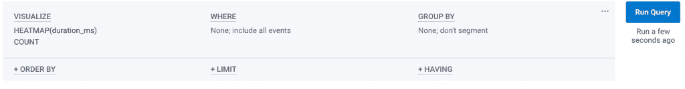
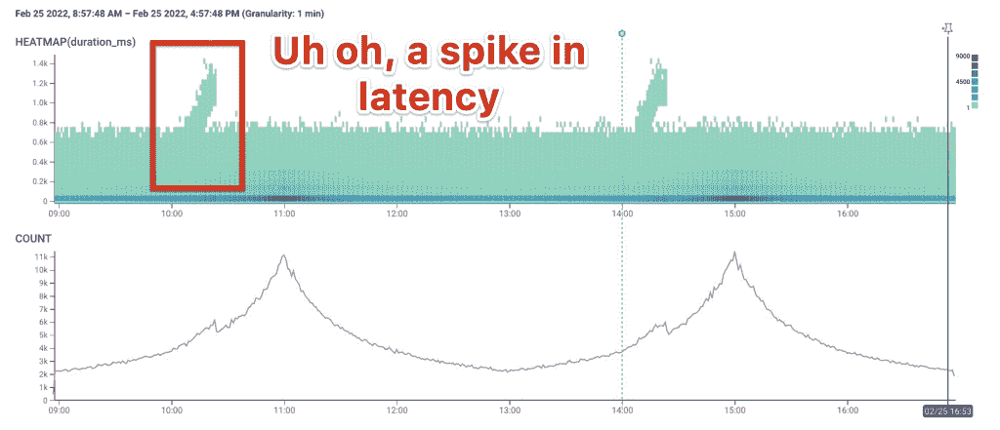
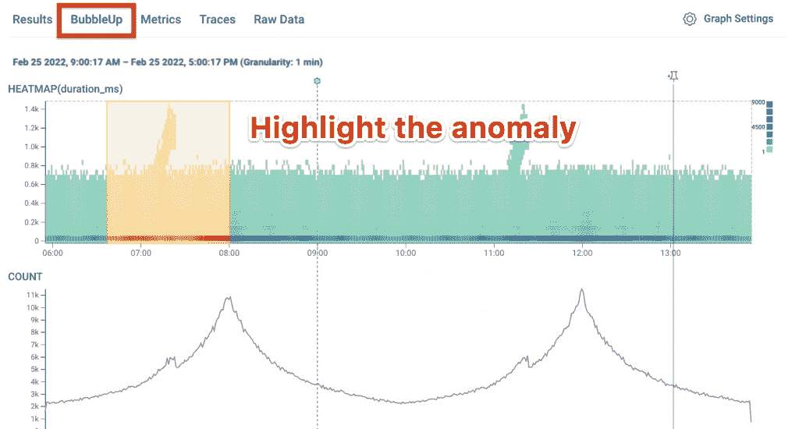
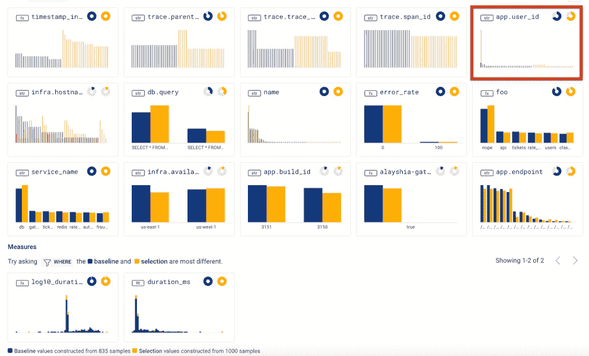
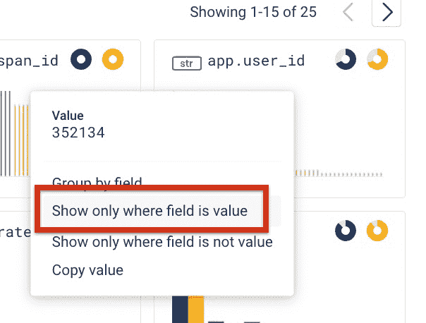
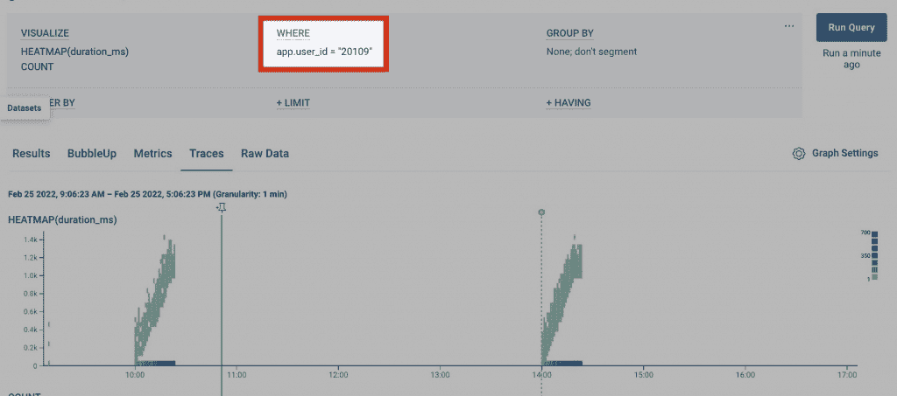
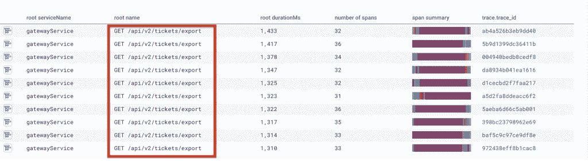

# 可观察性如何帮助更快地排除事件故障

> 原文：<https://thenewstack.io/how-observability-helps-troubleshoot-incidents-faster/>

这一切都始于可怕的警报。出了问题，需要尽快解决。无论是在午夜，您是随叫随到的响应者，还是在下午，您的整个团队都在一起工作以运送一捆 diffs，事件的发生对您的业务具有极大的破坏性，并且通常非常昂贵，因此每一分钟都很重要。

那么可观察性(简称 o11y)如何帮助团队节省宝贵的时间并更快地解决事件呢？首先，让我们探索一下从监控到可观察的变化。

## 使用传统监控工具进行调试

 [萨凡纳·摩根

Savannah 是 Honeycomb 的高级技术客户成功经理。她热衷于帮助用户找到复杂问题的创造性解决方案。下班后，萨凡纳会和家人一起在公园里，疯狂地看着网飞或者宠爱她的大狗狗布鲁斯。](https://www.linkedin.com/in/savannah-m-morgan) 

快速解决一个事件的关键是快速理解*为什么*出错，*在你的代码中什么地方*出错，最重要的是，*谁*受到影响，以及*如何*修复它。

我们大多数人都学会了使用静态仪表板进行调试，这些仪表板由基于指标的监控工具支持，如 Prometheus 或 Datadog，加上大量的本能和直觉——您的经验越多，您就越能猜到发生了什么。这并不是最科学或最有条理的方法。您不能使用静态仪表板来分割、深入挖掘数据或跟踪从问题到原因的线索，因为它们就是静态的。你能做的是建立一个过去发生过的事情的心理图书馆，并善于从一个事件到下一个事件匹配仪表盘。

*嗯，你可能会想，“这感觉就像去年感恩节我们遇到的缓存问题，当时这个分片的 MySQL 副本开始滞后*。*“然后，您深入仪表板，挖掘缓存延迟和 MySQL 复制延迟的图表，瞧！—希望它们能证实你的直觉。*

 *## 什么时候行得通，什么时候行不通

当您的系统以可预测的方式反复失败时，这种方法相当有效。这是有意义的，因为传统的监控工具——仪表板、日志和指标——最初是为移动部件少得多的整体系统构建的。很长一段时间以来，应用程序的大部分复杂性都局限在应用程序代码本身，而且组件类型相对较少。

例如，在 LAMP stack 模型中，您通常有一个 web 层、负载平衡器、一个数据库和您的应用程序代码，在某种程度上，您甚至可以将其视为一个黑盒。您将对每一层进行监控检查(数据库的连接计数、web 的请求/错误/延迟、健康统计数据以及应用程序的一些其他指标)，以及一个可靠的行动手册，涵盖如何对每个警报做出反应并解决它们。

但是现代系统是非常不同的。现代系统并不复杂，是*复杂*，不会以熟悉的方式一次又一次的失败。您可能有多个存储系统，而不是一个数据库；您的服务可能是短暂的、动态的、自动伸缩的——而且有很多这样的服务。您可以依赖第三方 API、无服务器或其他供应商托管的组件。你不可能写一个剧本来涵盖所有的失败场景。每次你得到的警报，很可能是你从未经历过，也不可能预测到的事情。

你不能依靠你的直觉，也不能期望能够先验地推理这些系统，或者以前亲身经历过这些失败。相反，你需要学会依赖你的工具。让你的遥测成为你的眼睛和耳朵。你需要学习如何提出问题，形成假设，使用你的工具快速验证或否定它们，并有条不紊地遵循数据，一步一步地找到你的问题的答案。

## 测量指标与事件

这怎么可能呢？答案在于快速的反馈循环、可探索性和系统内部生活的丰富视角，这些只有通过观察才能获得。解释我们如何从仪器的高层次概述开始，以及它与监控和可观察性有何不同。

监控工具建立在一种称为“度量”的数据类型之上，这是一个附加了一些标签的数字。例如，这里有三个自定义指标:

```
requests_received_count  =  2
requests_duration_avg  =  320ms
user_id  =  ‘123456’

```

当您检测您的代码时，您可能会使用类似这样的代码来创建和提交那些自定义指标:

```
statsd.increment(‘requests_received_count.increment’)
statsd.distribution(‘requests_duration_avg’,  secs)
statsd.set(‘user_id’,  my.user_id)

```

您可以为预先定义的任何自定义指标或自定义指标组合绘制图表。例如，我可以绘制一段时间内收到的请求数，或者绘制请求持续时间的平均值、第 50 个百分点、第 90 个百分点、第 95 个百分点、第 99 个百分点。然而，我可以*而不是*绘制我的用户 ID 收到的请求计数，或者我的用户的请求持续时间；我也不能做类似“`statsd.set`('`username`，`my.name`)”的事情，然后使用类似“`prefix matches ch*`”或“`contains within charity`”的字符串操作符。我受限于我预先定义的指标。

用于可观测性的仪器工作方式有点不同。o11y 不是基于度量，而是基于[任意宽度的结构化数据 blob](https://charity.wtf/2019/02/05/logs-vs-structured-events/)(也称为事件)，如图所示，每个服务的每个请求一个 blob:

```
[
{
"BrowserName":  "Chrome",
"BrowserOS":  "Windows",
"BrowserVersion":  "Chrome/97.0.4692.71",
"app.environment.id":  19281,
"app.environment.name":  "",
"app.environment.slug":  "$legacy$",
"app.error":  "not found",
"app.flag.charge-sales-tax":  true,
"app.flag.disable-recent-activity":  false,
"app.flag.downshift-time-select":  false,
"app.flag.duplicate-span-id-warning":  true,
"app.flag.editable-column-aliases":  false,
"app.flag.embedded-query-runs":  false,
...
"request_duration_ms"  15.38775,
"user_id":  1234556,
}
]

```

不是在检测代码时随机触发 StatsD 指标，而是在请求进入服务时初始化一个空的结构化事件，然后用任何您想要的遥测数据填充该事件——任何参数，但也可以是任何看起来对您将来追溯您的步骤或理解您的代码有用的东西:购物车 ID、用户 ID、语言内部信息、环境细节，任何您喜欢的东西。越多越好(如果您没有使用像 Honeycomb 这样的帮助工具，请确保包含唯一的请求 ID 和跟踪 ID！)此外，一定要检测任何数据库查询、web 请求等等，捕获运行时间、原始查询、规范化查询和 blob 中的响应。

然后，当请求准备从服务中退出或出错时，它被打包并作为单个事件发送到您的可观察性工具。(你在上面看到的样本斑点在一个真实的、活动的仪器系统中会有数百个维度。)

以这种方式收集数据的好处在于，所执行的唯一聚合是围绕请求路径进行的，正如您的最终用户所体验的那样。所有这些细节都被转换成丰富的用户上下文，如果您将上下文作为参数传递，它甚至会从一跳到另一跳、从一个服务到另一个服务保持不变！

## 为什么仪器仪表至关重要

指标之间没有联系。在执行请求时，您可能会发出 35 个不同的指标。尽管如此，你还是不能从另一方面问问题，比如，“嘿，有没有哪种客户端浏览器在执行相同的请求时会慢很多？”或者“500 个响应代码是针对特定端点还是针对某个特定用户？”事件有结缔组织。你可以使用你认为在你的事件中收集的任何细节的组合，整天切割和切割并问自己新的问题。

还有？你必须管理自定义指标核心的成本爆炸，而为广泛的活动添加更多维度实际上是免费的。

所以你测试代码和收集数据的方式是*巨大的*。但这并不是可观察性的全部。您还必须将这些数据传输到能够充分处理它们的工具中。

## 可观察性数据=高基数和高维度

监控和可观察性工具之间的实质性差异可以归结为:可观察性工具处理高基数和高维度的数据，并通过鼓励探索性和实验性来实现，而不是静态仪表板。

这些都是相当大的词，所以让我们从定义它们开始。

“高基数”是指集合中唯一元素的数量。假设您有一个数据集，其中包含大约 1 亿用户的大量数据。低基数字段或维度可能没有太多可能的值。就像，“`number_of_hands`”可能只有 0、1 或 2 的可能值，而“`species`”的唯一值大概是“`human`”。像“`favorite_dessert`”或“`pairs_of_shoes`”这样的其他维度可能有更高的基数，任何唯一 ID 的维度(像“`social_security_number`”)都将是可能的最高基数。

这很重要，因为度量存储引擎是为处理低基数维度而设计的，当您向它们提供高基数值时，它们就会崩溃——它们会耗尽它们的键空间并向您发送一份巨额账单，然后很快就完全停止接受读取和写入。然而，应该已经很清楚，高基数维度对于调试来说是最有用的，因为它们最容易识别。跟踪一个有问题的请求到一个唯一的 trace_id 比跟踪使用五个存储引擎之一的请求要好。

真正的可观测性解决方案会欣然接受高基数维度——而不仅仅是象征性的一个、两个或三个。任何维度都应该能够支持无限高的基数，否则就是不可观测。

“高维度”是高基数的兄弟。可以这样想:可观察性所基于的广泛结构化的事件由许多键-值对组成，基数指的是值(每个键允许有多少个)，而维度指的是键(每个事件允许有多少个)。

这很重要，因为你的活动范围越广，你收集的关于正在发生的事情和你的用户正在经历的事情的上下文就越多。因此，你可以提出更有力的问题，关联更多的异常值，并最终更深入地理解正在发生的事情。

O11y 收集所有宝贵的上下文，并按照最终用户的体验，围绕请求路径对其进行组织。能够理解每个用户如何实时体验您的代码并关联任何和所有离群维度，提供了一种理解极其复杂和不可预测的系统的根本不同的方式(用户肯定是一个高基数维度；)).如果传统的静态仪表板像大锤一样传递钝力，相比之下，o11y 工具就像手术刀。

## 可探索性定义了可观察性用户体验

在即将出版的 O'Reilly 书籍[“可观察性工程:实现卓越生产](https://info.honeycomb.io/observability-engineering-oreilly-book-preview-0)”中，作者解释说，每当部署新代码时，良好的仪器允许工程师回答以下问题:

*   你的代码做了你期望的事情了吗？
*   与之前的版本相比如何？
*   用户在积极使用你的代码吗？
*   是否有任何新出现的异常情况？

正如作者指出的，如果你在你的请求的上下文中捕捉到足够的工具，你就可以系统地从任何问题的边缘开始，每次都找到正确的答案，不需要猜测、直觉或先验知识——不需要魔法，只需要科学。

而不是盯着静态的仪表盘，然后凭直觉直接跳到最后("*我知道！这听起来像一个 Redis 问题*"，相反，你用大量的上下文和线索装备你的代码，然后把它输入到一个可观察性工具，让你切片和切块，开放式地探索遥测技术。

这允许您从边缘开始(“有一个延迟峰值”或“用户报告超时”)，并通过一个接一个地问问题来有条不紊地找到答案。例如:“是所有端点的延迟变慢了，还是只有一个端点的延迟变慢了？”答:似乎只是票务/出口/端点。好的，它是跨所有主机，还是仅跨一台主机答:它似乎存在于所有主机中。"好的，是所有用户超时还是只有一个用户超时？"答:只有一个用户超时。“好吧，我能看看一个样本痕迹，看看时间是怎么走的吗？”回答:我已经发现了解决这个问题所需的所有信息。

简而言之，在仪器代码上投入时间是可观察性的关键。这种投资将在一次事件中得到回报，并且它将继续帮助团队解决事件并理解他们的软件在未来的行为。你会用复利赚回你的时间很多倍。

## 可观察性如何帮助加快事件解决

我将非常坦率地说:o11y 实际上并没有全面加快事件解决时间。如果你以前已经经历过这个问题，可以直接跳到答案，这总比解决问题并调试它要快。抱歉。

如果我总是花一到三分钟来分析我的遥测数据并找到特定错误尖峰或延迟突发的来源，如果我习惯于凭直觉找到解决方案并在 10 到 30 秒内找到答案，这可能不会感觉很好。

但是如果你习惯于严重依赖你的直觉，问问你自己现在它有多可靠——以及你需要多长时间来依靠你的工具。一到三分钟要比一个疯狂的、无止境的小时或更长时间，或者整个团队“所有人都在甲板上”要好。

另外，你可以教人们使用工具。你不能将自己的精神状态与新员工同步，但你可以分享你的书签、评论和文档。

当您的组织拥有端到端的可观测性，并且您对遥测工具都很熟悉时，就没有必要在黑暗中猜测或摸索了，或者希望您组织中的某个人已经经历了这种特定的中断，并在操作手册中留下了线索。

## 现实生活中的一个例子

在这个场景中，我们将使用 Honeycomb 带您经历一个事件，在这个事件中，您注意到了一个延迟尖峰，并且您想要跟踪其来源。我们的这项服务的延迟是通过“`duration_ms`”来衡量的，所以首先，让我们生成一个热图:




现在，你*可以*开始遍历所有其他维度，看看哪些维度与延迟峰值相关，但是，让我们使用 [BubbleUp](https://docs.honeycomb.io/working-with-your-data/bubbleup/) 作为捷径。它预先计算所有尺寸，并区分黄色高亮框内的尺寸和框外的基线。BubbleUp 然后将区分和整理这些维度，以查看您选择的区域的所有不同之处，所有这些都在一个简单的点击动作中完成。



我们可以立即看到该热图中突出显示的与基线事件的潜在偏差。在这种情况下，它向我们展示了`trace.parent_id`、`trace.trace_id`、`trace.span_id`、`app.user_id`、`infra.hostname`与我们的基线不同。但是差别最大并且可能造成最大影响的是`app.user_id`。



现在让我们探究一下为什么`app.user_id`会给我们带来麻烦。Honeycomb 作为一个可观察性工具，而不是一个静态仪表板的一个特点是，您可以随时探索和深入挖掘。你越深入，你就越能理解发生了什么，有什么不同，有什么影响。要更仔细地查看，只需点击这个框，让 Honeycomb 放大包含这个有问题的字段的事件。



Honeycomb 自动调整查询以包含异常值`user_id`。



进一步放大，您可以转到 Traces，您会注意到它们都来自 ticket API。

几秒钟后，您现在就知道哪个用户可能经历了该事件、他们参与的终端以及与该问题相关的跟踪事件。这是巨大的！您可能会继续调查各个跟踪，以查找确切的错误和具有最高延迟的范围。

## 现代系统需要更现代的解决方案

有了可观察性，就不需要在文件中搜寻神奇的字符串了。同样，也不需要猜测；简单地跟随数据的踪迹。

可观察性通过引导你完成问题-回答-问题循环，让你快速轻松地重复[核心调查分析循环](https://www.honeycomb.io/blog/heatmaps-make-analysis-better-or-the-core-analysis-loop/)。此外，因为 Honeycomb 是一个处理高基数和高维数据的可观察性工具，所以您可以明确指出*为什么*出错，*代码中的*哪里出错，最重要的是，*谁*受到了影响，以及*如何*修复它。

## 想亲自尝试观察吗？

[注册一个免费的 Honeycomb 账户，立即开始以你想要的任何方式(当然，一旦数据被检测)从切片和切块中获得洞察力。如果这是一个太大的承诺，请查看](https://ui.honeycomb.io/signup) [Honeycomb Play，](https://www.honeycomb.io/play/)这是一个自我指导的演示，展示了可观察性如何更快地发现问题，从而更快地解决问题。

最后，Honeycomb 很高兴赞助新堆栈即将于周五(4 月 1 日)举行的 IRConf。在这里了解更多:[https://www.irconf.io/#speakers](https://www.irconf.io/#speakers)

<svg xmlns:xlink="http://www.w3.org/1999/xlink" viewBox="0 0 68 31" version="1.1"><title>Group</title> <desc>Created with Sketch.</desc></svg>*