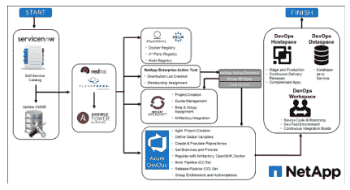

# 一名工程师如何引领单一 DevOps 平台的开发

> 原文：<https://thenewstack.io/how-one-engineer-spearheaded-the-development-of-a-single-devops-platform/>

[Mohan Raj](https://www.linkedin.com/in/mohanraj00/)

[Mohan Raj 是 NetApp NGDC 开发人员体验部门的 IT 高级经理。Mohan 和他的团队规划、设计和部署平台和虚拟化环境解决方案。他们提供将遗留系统迁移到云的专业知识，以及合适的工具和平台选项。Mohan 拥有超过 25 年的 IT 经验。](https://www.linkedin.com/in/mohanraj00/)

DevOps 软件开发人员和运营人员现在被要求从始至终在项目上协同工作。手动启动应用程序的问题是人的速度和带宽的问题。这也是对本可用于开发新功能或纠正错误的时间的误用。

令人欣慰的是，使用在使用云的容器中运行的微服务架构来快速创建和更改软件的努力正在取代传统的孤岛和治理方法。这一趋势在 [NetApp](https://www.netapp.com/us/solutions/devops/index.aspx) 也是如此，作为 NetApp ITI 的高级经理级开发人员，我将我的经验应用于尽可能好地实现转变。

在过去的两年里，我参与了一项 NetApp IT 计划，旨在构建一个 [DevOps 平台](https://www.netapp.com/us/solutions/devops/index.aspx)，为需要构建云原生应用的应用开发团队提供云服务、自动化和 CI/CD 发布模型。这种想法的动力始于一个内部试验台，正如在办公室里雄辩地说的，“吃我们自己的狗粮。”也就是说，使用 NetApp 技术和工具创建一个他们会自豪地推荐给客户的平台。此外，这种类型的服务平台需要在云中自动部署应用程序，以保持市场竞争力。如果没有与云的链接，这个平台就会降低可用性和便利性。

我领导开发的新平台叫做 CloudOne。无论目标是私有云还是公共云，它都能提供一致的开发人员体验。这为开发人员释放了宝贵的空间，不必担心存储限制、数据如何流动或在需要时获取数据。这和用钢梁加固住宅地基没什么区别；房子没有它们也不会倒塌，但它创造了一种更好的可靠性。

我的团队还自动化了将[板载应用程序装载到 CloudOne 平台](https://blog.netapp.com/devops-automation)的流程，以及持续集成和持续部署 [(CI/CD)流程，以快速将应用程序更改转移到生产](https://blog.netapp.com/rapid-frequent-ci-cd-with-cloudone)。

当开发团队访问自助服务目录以确定要加入的应用程序类型，并围绕应用程序堆栈类型和应用程序的环境规模要求进行选择时，加入流程就开始了。这将启动一个更新 CMDB(真实信息的单一来源)的自动化工作流，以便在入职流程中创建的任何资产都不会丢失。

使用 API，团队然后移交给 Red Hat CloudForms，它调用 Ansible 自动化。Ansible Tower 执行四个关键例程:

1.  使用 jFrog Artifactory 为所有二进制文件创建存储库，在应用程序 CI/CD 过程中，所有存储的二进制文件都在这个位置创建。在这个步骤中，为应用程序建立 Docker 注册中心、第三方注册中心和 Helm 注册中心。Helm 用于管理 Kubernetes 应用程序。
2.  使用电子邮件分发列表(通过 Active Directory)创建访问组，以便对 OpenShift 和 Azure DevOps 进行基于角色的授权。重要的是，我们在流程中嵌入了明确定义的角色，以便在没有适当通知和批准的情况下，不会在生产中进行更改。它是一种基于预先分配的职责和责任的嵌入式制衡机制。
3.  配置创建和管理容器的 Red Hat OpenShift 环境。它管理配额、分配角色和组，并与 Artifactory 集成。
4.  配置 Azure DevOps 项目以创建开发人员环境，包括从[代码库](https://www.netapp.com/us/solutions/devops/code-and-artifact-repository.aspx)到代码分支再到为应用程序创建的 CI/CD 流程本身的一切。

通过这一自动化流程加载应用程序大约需要 30 分钟，该流程会创建工作区、主机空间，如果需要，还会创建数据空间。

工作区:开发人员在应用程序上线之前进行工作的地方。这就是非生产环境。例如，开发人员可以创建代码分支、开发代码、创建拉式请求和触发持续集成构建。在这里，他们可以使用我们基于标准的技术产品目录测试新功能、修复错误或尝试新功能。

主机空间:阶段和生产应用程序运行的地方，以及连续交付版本最终达到顶点的地方。目标是接受开发人员在工作空间中所做的工作，并通过 CI/CD 流程，将变更过渡到阶段和生产主机空间。

数据空间:表示数据库即服务(DBaaS)，它提供数据库所需的生产力、性能和数据安全性。

在完成此入职流程后，将创建工作区和主机空间，以便 CI/CD 流程可以自动进行。一旦完成，开发团队可以使用 CloudOne 快速将应用程序更改转移到生产环境中。最终结果反映了精心设计的[持续集成、持续部署](https://www.netapp.com/us/solutions/devops/continuous-integration-and-continuous-delivery.aspx) (CI/CD)平台与公共云和私有云连接的内在力量。

<svg xmlns:xlink="http://www.w3.org/1999/xlink" viewBox="0 0 68 31" version="1.1"><title>Group</title> <desc>Created with Sketch.</desc></svg>