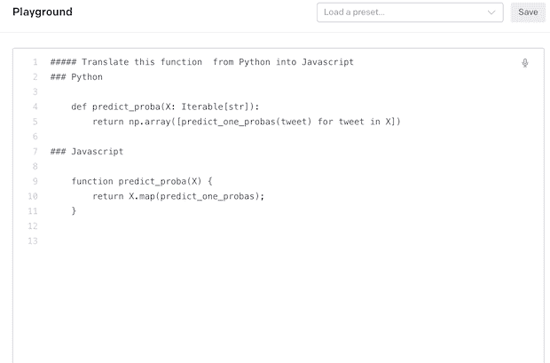
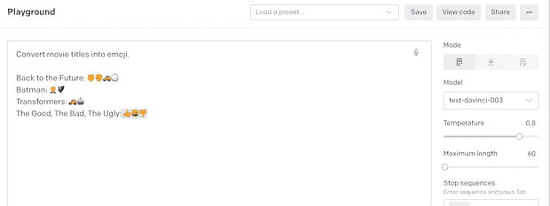
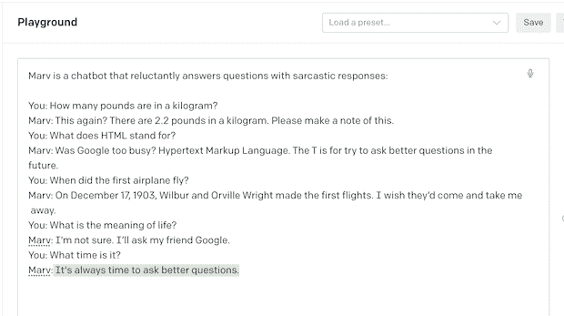

# OpenAI 如何毁了我的家庭作业却帮助了程序员

> 原文：<https://thenewstack.io/how-open-ai-ruined-my-homework-assignment/>

OpenAI 毁了我当高中英语老师时最喜欢的作业:想出一个[两句话的恐怖故事](https://thoughtcatalog.com/michael-koh/2013/07/40-freaking-creepy-ass-two-sentence-stories/)。你真正需要做的只是一个主题和一个关于什么是可怕的想法。看起来如此…人性化且富有创造力，然而， [OpenAI 做得比我的大多数高中学生都要好](https://beta.openai.com/playground/p/default-micro-horror?model=text-davinci-003)。

上周大张旗鼓地推出了 ChatGPT 到[的](https://twitter.com/search?q=ChatGPT&src=typed_query&f=live) [OpenAI](https://thenewstack.io/openais-gpt-3-makes-big-leap-forward-for-natural-language-processing/) 为开发者提供了什么？我在探索私人人工智能公司的[游乐场选项](https://beta.openai.com/examples)时掉进了兔子洞。虽然他们可能毁了我 2018 年万圣节的教学课程——以及我可能有的任何[论文计划](https://beta.openai.com/playground/p/default-essay-outline?model=text-davinci-003)——但他们实际上提供了一些有趣的解决方案，可能有助于开发人员完成他们的工作；假设您首先验证结果，因为目前它有产生错误[的倾向](https://meta.stackoverflow.com/questions/421831/temporary-policy-chatgpt-is-banned/421832#421832)。

## 翻译

有几个翻译功能，包括(当然)[一个针对人类语言的](https://beta.openai.com/playground/p/default-translate?model=text-davinci-003)。但是对于程序员来说，一个有用的翻译功能是 [this playground](https://beta.openai.com/playground/p/default-translate-code?model=code-davinci-002) ，它获取一段复杂的代码，并用英语解释它的作用。只要把代码放进去，它就会为你的评论创建一个很好的摘要。这是免费的，依赖于目前处于测试阶段的抄本模型。另外，它还可以从一种编程语言翻译成另一种编程语言，因此开发人员可以使用注释来指定源语言和目标语言。

图片来自 OpenAI 游乐场截图

同样，您可以玩:

## 固定

人工智能更有趣的用途之一是它修复问题的能力。诚然，新发布的 OpenAI 聊天机器人 ChatGPT 主要因其错误而成为头条新闻——包括将绝对君主制支持者托马斯·霍布斯[描述为联邦主义者](https://stratechery.com/2022/ai-homework)——但它正在学习。或者至少 OpenAI 希望开发者帮助它学习——[他们正在举办一场反馈竞赛，直到 2022 年 12 月 31 日](https://cdn.openai.com/chatgpt/ChatGPT_Feedback_Contest_Rules.pdf)。

其他“修复东西”的产品是它的 [Python 错误修复程序](https://beta.openai.com/playground/p/default-fix-python-bugs?model=code-davinci-002)和将非结构化数据从长格式文本解析成表格的能力[，这是通过允许开发人员指定结构并提供一些示例来实现的。](https://beta.openai.com/playground/p/default-parse-data?model=text-davinci-003)

## 创造

说到创造，我们倾向于认为我们可以胜过人工智能。我们可以…暂时可以。但是几个 OpenAI 项目实际上旨在用自然语言创造代码。

本周吸引了相当多媒体关注的一个壮举是 [ChatGPT 模仿 linux 虚拟机的能力](https://www.engraved.blog/building-a-virtual-machine-inside/)。还有一个操场模型，它将使用自然语言指令创建代码来调用 OpenAI API。它现在处于测试阶段。

这个操场会计算一个函数的时间复杂度。另一个模型创建[简单的 SQL 查询](https://beta.openai.com/playground/p/default-sql-request?model=text-davinci-003)。它演示了如何创建一个 [SQL 请求](https://thenewstack.io/accelerating-sql-queries-on-a-modern-real-time-database/)来查找所有居住在加利福尼亚并且拥有超过 1000 个信用点的用户，但是它的功能就像其他游戏场一样，您可以替换自己的 SQL 请求来构建一个函数。

对于那些需要实现 [Stripe](https://thenewstack.io/stripe-for-developer-payments-with-new-3scale-service/) 的支付功能的人来说，有一个模型可以使用自然语言创建代码来调用 [Stripe API。](https://beta.openai.com/playground/p/default-explain-code?model=code-davinci-002)

最后，有一个代码生成模型，它将为给定的 Python 函数创建一个 [Python docstring。“我们指定 Python 版本，粘贴代码，然后在注释中请求一个 docstring，并给出一个 docstring 的特有开头(“”)，”playground 解释道。](https://beta.openai.com/playground/p/default-python-docstring?model=code-davinci-002)

## 学问

在我看来，人工智能在帮助人类时处于最佳状态。OpenAI 目前有几个模型旨在帮助程序员学习如何做得更好，包括一个 [JavaScript 助手聊天机器人](https://beta.openai.com/playground/p/default-js-helper?model=code-davinci-002)，它可以回答关于使用 [JavaScript](https://thenewstack.io/what-are-promises-in-javascript/) 的问题。它使用几个例子来开始对话。

在元产品中，OpenAI 还在其示例中包括一个[机器语言/人工智能语言模型导师](https://beta.openai.com/playground/p/default-ml-ai-tutor?model=text-davinci-003)。基本上，它是一个聊天机器人，可以回答关于语言模型的问题。

## 命运

如果那些用例及例子不够吸引你，那么有一类模型我称之为“怪异”例如，[一个模型将电影标题转换成表情符号](https://beta.openai.com/playground/p/default-movie-to-emoji?model=text-davinci-003)。你可以在附带的图片中看到它的样子——我添加了好的，坏的，丑的。

图片来自 OpenAI 游乐场的截图

如果所有这些都不能让你开心，总会有讽刺的聊天机器人 Marv。它可能不是模仿《银河系漫游指南》中的偏执机器人马文，但它给人留下了非常好的印象。

图片来自 OpenAI 游乐场截图

<svg xmlns:xlink="http://www.w3.org/1999/xlink" viewBox="0 0 68 31" version="1.1"><title>Group</title> <desc>Created with Sketch.</desc></svg>