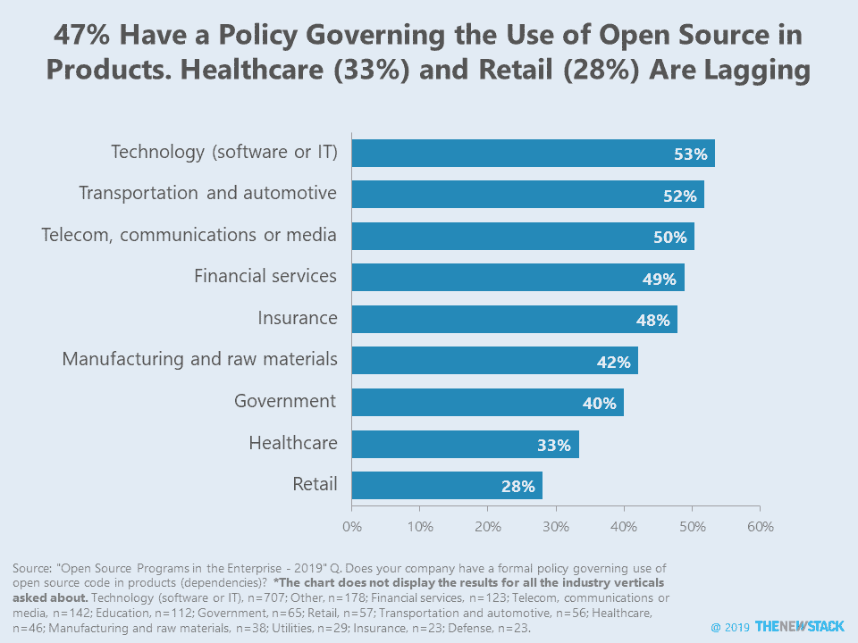
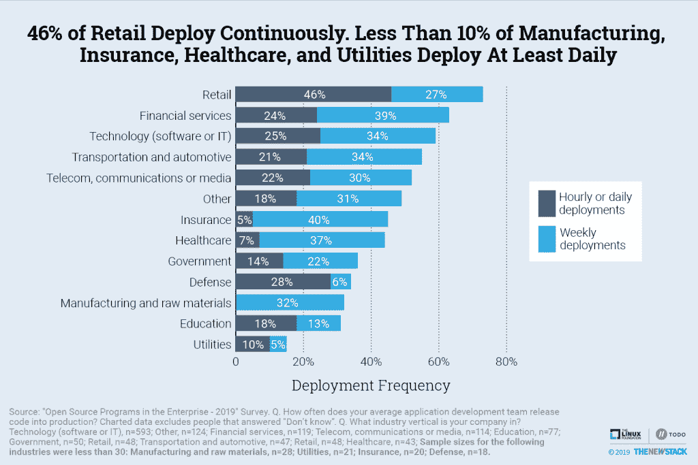
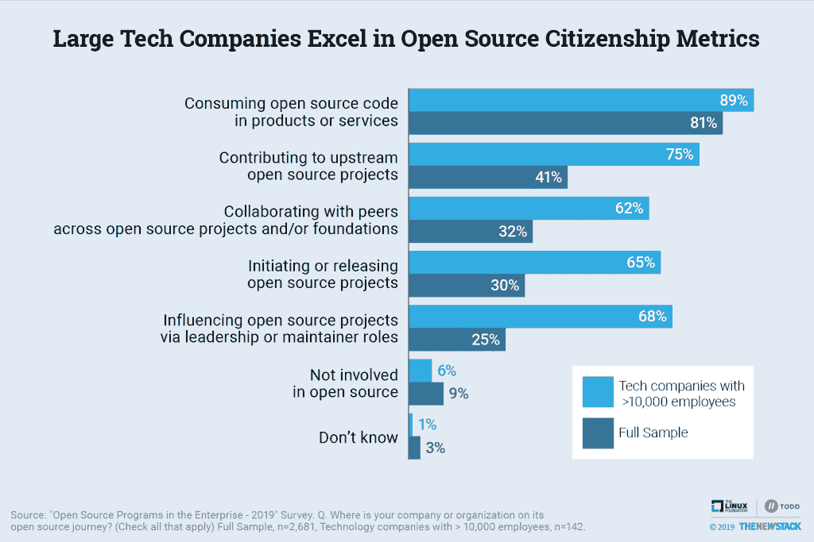
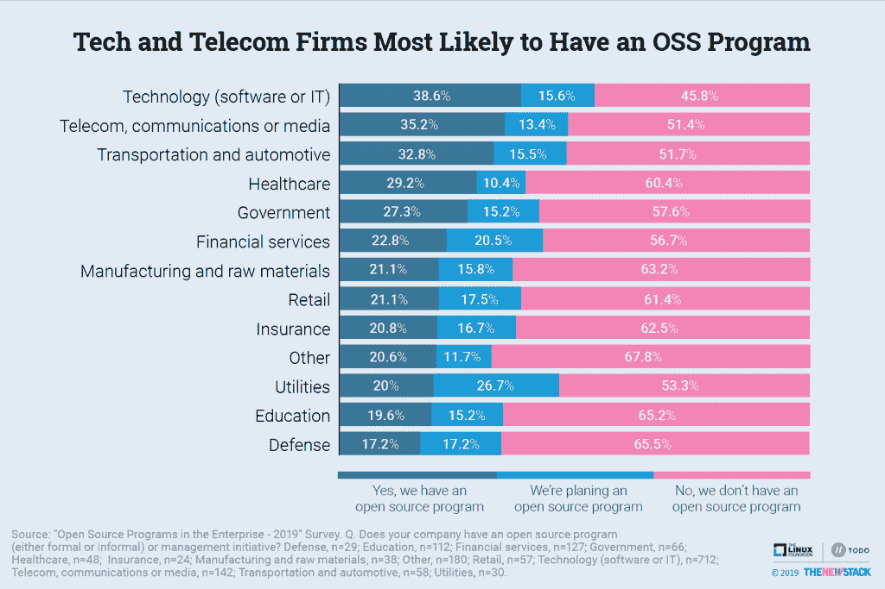
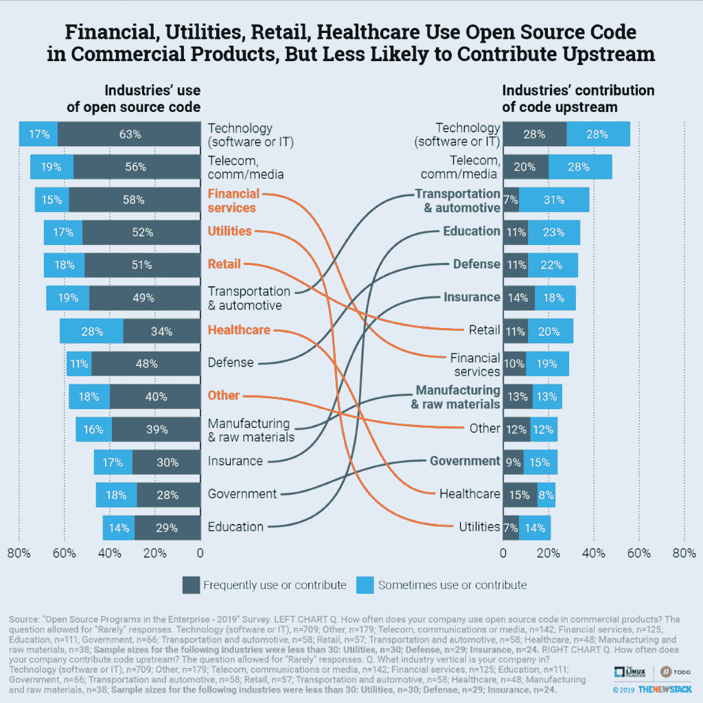

# 开源政策在不同的垂直行业中有何不同

> 原文：<https://thenewstack.io/how-open-source-policies-vary-across-industry-verticals/>

我们已经到了不同行业开源使用水平相对相似的地步。在一系列垂直行业中，企业越来越多地开发与软件行业领导者相同的云原生和开源实践。然而，在垂直行业如何采用特定的政策来促进和支持开源方面，仍然存在很大的差异。

一般来说，使用开源代码的公司也更有可能为上游项目做出贡献。软件、IT、电信和媒体公司在开源的采用和贡献方面都处于领先地位。可以理解的是，这些行业的公司也更有可能创建了一个开放项目办公室，或者至少是正式的开源政策。

传统上，由于法律和安全问题，受监管的行业采用开源技术的速度较慢。对于大多数行业来说，随着对开放源码许可和合规性的认识和接受程度的提高，法律障碍似乎至少部分被克服了。然而，仍然有例外。

例如，在由 Linux 基金会的 TODO Group、VMware 和 The New Stack 进行的一项开源调查中，47%的受访者已经表示，他们的公司有正式的政策来管理商业产品中开源代码(依赖项)的使用。然而，医疗保健和零售公司不太可能走这么远。关于垂直行业的更多细节可以在我们关于这项研究的上一篇[文章](/open-source-programs-shift-from-legal-to-engineering-productivity-focus/)中找到。此外，以下是之前发布的三个图表的链接，提供了更多行业视角:

## 奖金图表

一些行业从开源中获取的比他们赚的还多。例如，就在商业产品中使用开放源码而言，金融服务在 13 个国家中排名第三，但就上游贡献而言，排名第八。公用事业的差距甚至更大。另一方面，像教育这样的行业不太可能在商业代码中使用开源，至少部分是因为他们不太可能维持盈利性的提供。

Linux 基金会和 VMware 是新堆栈的赞助商。

通过 Pixabay 的特征图像

<svg xmlns:xlink="http://www.w3.org/1999/xlink" viewBox="0 0 68 31" version="1.1"><title>Group</title> <desc>Created with Sketch.</desc></svg>