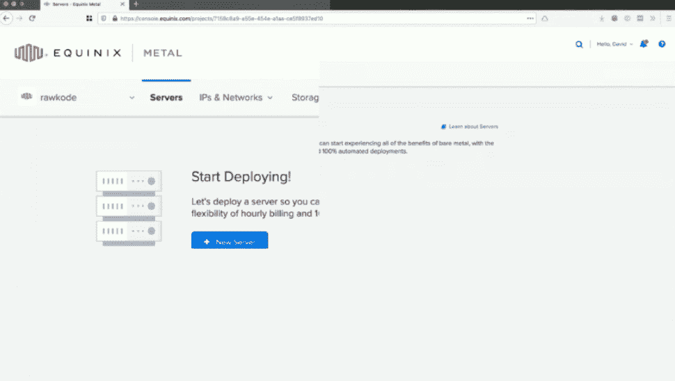
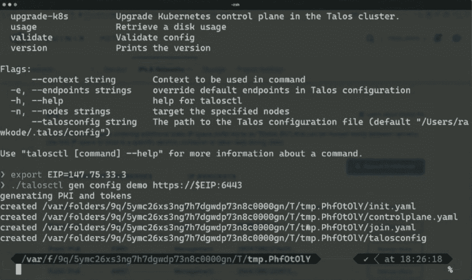
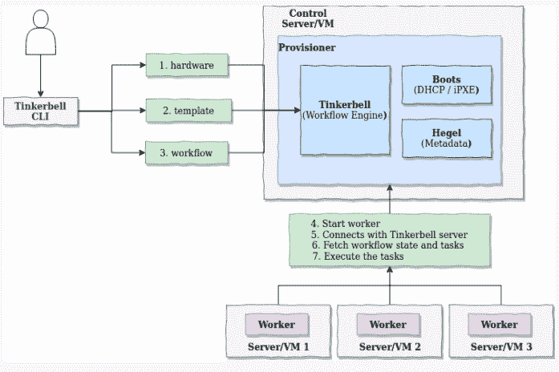

# 如何创建开源的 Tinkerbell 来简化裸机供应

> 原文：<https://thenewstack.io/how-open-source-tinkerbell-was-created-to-make-bare-metal-provisioning-easier/>

Tinkerbell 开始兑现其承诺，为云原生环境提供裸机服务器和其他设备。在 11 月成为[云原生计算基金会](https://cncf.io/?utm_content=inline-mention) (CNCF)沙盒项目后，[小叮当](https://tinkerbell.org/?ls=Public%20Relations&lsd=21q2__digital-infrastructure+metal__pr-equinix_pr-newswire_press-release__us-en_AMER_Tinkerbell_awareness&utm_campaign=us-en__press-release_Tinkerbell_pr-equinix_awareness&utm_source=&utm_medium=press-release&utm_content=digital-infrastructure+metal_)，本月在 [Apache 2.0 许可下](https://www.apache.org/licenses/LICENSE-2.0)更新了许多新的测试版功能。

这个想法是为了帮助 DevOps 团队，他们正在努力解决配置裸机计算服务器和其他设备这一众所周知的困难任务——或者“将服务器带入生活以供软件消费”,正如 Equinix 的高级员工工程师 Gianluca Arbezzano 在最近的[博客帖子](https://metal.equinix.com/blog/how-tinkerbell-got-its-wings/)中所描述的那样(Equinix 在 2020 年购买了包[,这是技术](https://www.datacenterknowledge.com/equinix/equinix-s-335m-packet-acquisition-closed-here-s-what-s-next)的起源)。

Equinix 开发人员关系高级总监 Mark Coleman 告诉新的堆栈，虽然传统上配置服务器是一个手动过程，但 Tinkerbell 可以自动执行其中的许多任务，无论它们是发生在公共云上，还是发生在数据中心或边缘设备上。

科尔曼说，裸机的生命周期可以用三种方式来描述:

科尔曼说:“大多数具有足够规模的公司都在各种平台上运行工作负载，从公共云到主机托管。

**边缘计算**:“从[美国职业棒球大联盟](https://www.mlb.com/)体育场到购物中心，公司都想知道如何让硬件更贴近用户，虽然像最近宣布的亚马逊 EKS-A 这样的工具会有所帮助，但运营团队仍然需要让他们的服务器进入可部署状态，仍然需要处理维护和升级，”科尔曼说。

科尔曼说:“虽然混合云工具的主要驱动力是公司收购其他拥有不同公共云背景的公司，但现在我们看到公司积极研究公共云何时适合(或不适合)各种工作负载。”。“对于混合云等式中的非公共云部分，仍然需要有人来管理这些机器。”

使用 Tinkerbell 来帮助创建用于部署和扩展 Kubernetes 集群的底层服务器基础设施解决了一个“重大痛点”，[企业管理协会(EMA)](https://www.enterprisemanagement.com/) 的分析师 [Torsten Volk](https://www.linkedin.com/in/torstenvolk) 告诉新堆栈。例如，DevOps 团队通常很难弥合 Kubernetes 的声明式和策略驱动的横向扩展世界与“数据中心和不同公共云上的基础架构供应的黑暗、灰暗和极不一致的世界”之间的差距，Volk 说。

“许多 Kubernetes 问题发生在 Linux 和 Kubernetes 之间的接口上，因此持续标准化这个接口的配置应该有助于消除许多这样的问题，”Volk 告诉新的堆栈。

## 服务器和设备供应

虽然仍处于测试阶段，但 Equinix 在本月传达了许多未来生产版本的功能。其中包括:

**使用 [Hook](https://github.com/tinkerbell/hook)** 提供裸机:用户现在可以利用 Tinkerbell 在 edge 设备上生命周期硬件和安装操作系统，包括 x86 服务器和基于 Arm 的设备，如 [Raspberry Pis](https://www.raspberrypi.org/products/) ，不到一分钟，该公司表示。Coleman 说，Hook 利用 LinuxKit 快速创建一个轻量级的安装环境，而不管环境如何。

科尔曼说:“速度总是很重要——当操作变得更快时，团队就有可能探索更多的部署、管理和开发选项。“Hook 大大减少了在 Tinkerbell 上部署操作系统所需的时间(大约减少了 90%的配置时间),并为添加和部署新操作系统的新方法打开了大门。”

该特性应该有助于为 edge 添加应用程序所需一致性级别，以便在各种不同的设备上可靠地运行。同时，边缘设备功能允许 DevOps 团队根据需要公开调整操作系统配置，Volk 说。

“这听起来像是把网格计算带到了边缘，这是非常令人兴奋的，”Volk 说。

**为 Kubernetes 部署和其他现代数据中心工作负载提供服务器的 API**:虽然集群 API 使 DevOps 团队能够配置 Kubernetes 集群，但 Tinkerbell 项目集群 API 实现([集群 API Tinkerbell](https://github.com/tinkerbell/cluster-api-provider-tink) )是为提供裸机服务器和设备以运行 Kubernetes 集群而创建的。

“Tinkerbell 直接与 Kubernetes 集群 API 对话，使 Kubernetes 能够在需要时直接订购所需的基础设施资源，”Volk 说。“这将使我们能够将策略驱动的 Kubernetes 集群管理扩展到底层服务器和操作系统，从而以最佳方式执行这些策略。这非常令人兴奋，但需要大量的仙尘才能在生产环境中真正实现。”

**文档**:可悲的是，虽然这应该是标准，但是许多(如果不是大多数的话)开源和专有软件项目缺乏足够的[文档](https://docs.tinkerbell.org/)。乍一看，Tinkerbell 的设置和运行说明似乎很容易理解和清楚。

**对主要操作系统的支持** : Tinkerbell 目前支持 VMware ESXi、RedHat Enterprise Linux、Windows Server、Flatcar Linux、Ubuntu、CentOS 8、Debian 和 NixOS。

## 开源考虑因素

科尔曼说，虽然 Tinkerbell 在 Equinix 内部维护和使用，但该公司表示，该项目主要来自开源社区，以至于来自公司外部的提交数量“在大约 60 天内跟踪奇偶校验”。

科尔曼说:“原因很清楚:对于运行本地、混合或边缘工作负载的公司来说，这是一个巨大的痛点，Tinkerbell 是唯一一个考虑到云原生原则的产品。”"换句话说，现代的操作者和开发者会发现小叮当是直觉的，而不是阻碍的."

科尔曼说，成为 CNCF 沙盒项目有助于小叮当给大公司“上船”的信心。Coleman 说:“开放治理对于这样一个关键部分的开源项目来说是必不可少的。

目前，Equinix 还没有计划提供 Tinkerbell 的企业版，Equinix 在很大程度上依赖于它自己的基础设施管理和供应。

科尔曼说:“开源的小叮当已经对 Equinix Metal 产生了巨大的价值。"目前没有探索货币化的计划."

<svg xmlns:xlink="http://www.w3.org/1999/xlink" viewBox="0 0 68 31" version="1.1"><title>Group</title> <desc>Created with Sketch.</desc></svg>