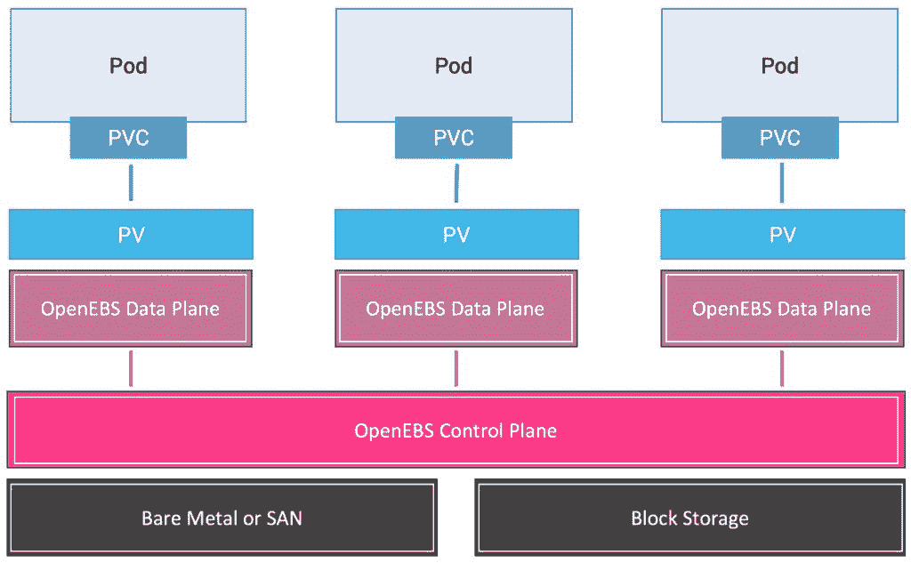
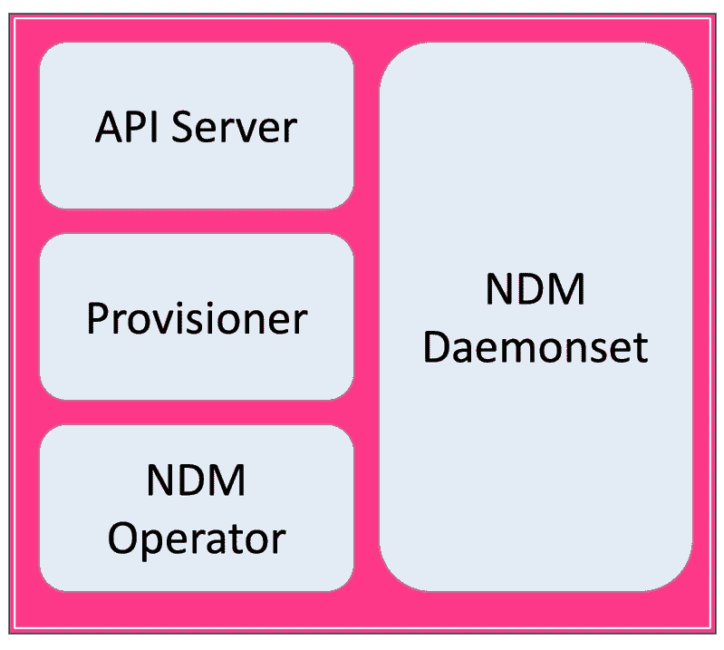
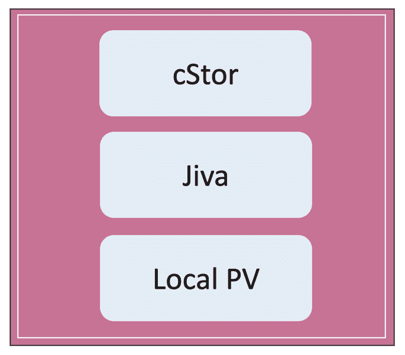
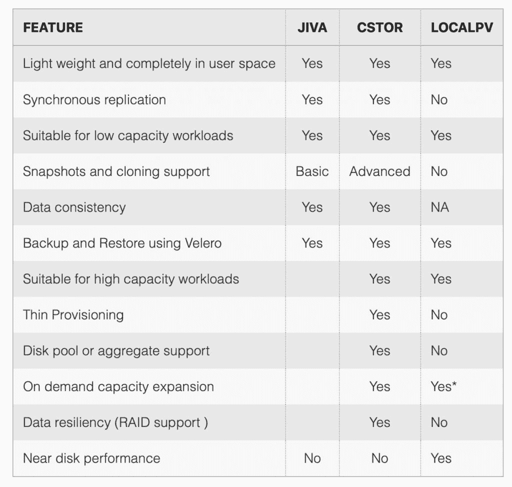

# OpenEBS 如何为 Kubernetes 带来容器附加存储

> 原文：<https://thenewstack.io/how-openebs-brings-container-attached-storage-to-kubernetes/>

在 Kubernetes 中管理有状态工作负载与部署和扩展无状态微服务有着本质的不同。在讨论在 Kubernetes 中运行有状态工作负载的不同方法的前一篇文章中，我解释了容器附加存储(CAS)是管理有状态工作负载的新兴选择之一。CAS 正迅速成为在 Kubernetes 中运行持久的、容错的有状态应用程序的首选。

[OpenEBS](https://openebs.io/) 项目是[云本地计算基金会沙箱](https://www.cncf.io/sandbox-projects/)的一部分，试图将 CAS 引入 Kubernetes 平台。它可以轻松部署在内部运行的集群中、公共云中的托管 CaaS 集群中，甚至是在隔离环境中运行的空气间隙集群中。

本文介绍了 OpenEBS 的架构，以及它为云本地应用程序配置存储后端提供的各种选项。

## 什么是集装箱附加存储？

Kubernetes 中的存储通常在集群环境之外维护。无论是 NFS 和 GlusterFS 这样的共享文件系统，还是 Amazon EBS、Azure Disks、GCE PDs 这样的块存储，存储都是作为外部资源公开的。在许多情况下，存储作为操作系统内核模块与单个节点紧密集成。甚至持久卷(PV)也与底层模块紧密耦合，使它们成为单一的遗留资源。

CAS 使 Kubernetes 用户能够将存储实体视为微服务。CAS 有两个元素—控制平面和数据平面。控制平面被部署为一组处理低级存储实体的自定义资源定义(CRD)。数据平面作为靠近工作负载的机架集合运行。它负责将实际的 IO 事务转换为读写操作。

控制平面和数据平面之间的清晰分离提供了在 Kubernetes 上运行微服务的相同优势。这种架构将持久性从底层存储实体中分离出来，增加了工作负载的可移植性。它还为存储带来了横向扩展功能，使管理员和操作员能够随着工作负载动态扩展卷。最后，CAS 确保数据(PV)和计算(Pod)始终以超融合模式共存，以提供最佳吞吐量和容错能力。

OpenEBS 是一个基于 CAS 原则的架构良好的解决方案。让我们仔细看看这个架构。

### OpenEBS 架构

OpenEBS 像其他平台一样，如 [Istio](https://istio.io/) service mesh，遵循云原生设计和架构的最佳实践。它有一个控制平面、数据平面和集成了标准命令行界面(如 kubectl 和 helm)的工具。

【T2

OpenEBS 控制平面靠近存储基础架构。它管理来自连接到集群每个节点的 SAN 或块存储的存储卷的生命周期。控制平面直接负责调配卷、启动快照、制作克隆、创建存储策略、实施存储策略，以及将卷指标导出到外部系统，如 [Prometheus](https://prometheus.io/) 。OpenEBS 存储管理员处理控制平面，以管理集群范围的存储操作。

数据平面靠近位于卷 IO 路径中的工作负载运行。它运行在用户空间中，同时管理 PV 和 PVC 的生命周期。数据平面提供了具有不同功能的存储引擎选择。

### OpenEBS 控制平面

open EBS 控制平面通过 API 服务器对外公开。它作为一个 Pod 运行，公开 REST API 来管理卷和策略等资源。首先将包含声明的 YAML 文件提交给 API 服务器，这将启动工作流。API 服务器调用 Kubernetes 主服务器中的 API 服务器来调度数据平面中的卷单元。

控制平面的 provisioner 组件通过标准的 Kubernetes 外部存储插件实现动态配置。当应用程序基于现有的存储类创建 PVC 时，OpenEBS provisioner 会基于存储类中提到的原语创建一个 PV，并将其绑定到 PVC。

节点设备管理器(NDM)是 OpenEBS 控制平面的重要组件。Kubernetes 集群中的每个节点都运行一个 NDM DaemonSet，它负责发现新的块存储设备，如果它们与过滤器匹配，它会将其报告给 NDM 操作员，以将其注册为块设备资源。NDM 充当控制平面和连接到每个节点的物理磁盘之间的管道。它维护 etcd 数据库中已注册的块存储设备的清单，这是集群的唯一真实来源。

### OpenEBS 数据平面

如果控制平面靠近物理存储和 Kubernetes 主机，则数据平面靠近节点中运行的工作负载和应用程序。它运行对 pod 公开的存储引擎。

存储引擎是持久卷的 IO 路径的数据平面组件。在 OpenEBS 架构中，用户可以根据特性和配置策略为不同的工作负载选择不同的存储引擎。例如，可以从读取量大的共享 CMS 工作负载中为基于 IOPS 的高可用性数据库工作负载选择不同的存储引擎。

OpenEBS 数据平面提供了三种存储引擎选择:cStor、Jiva 和 Local PV。

cStor 是 OpenEBS 的首选存储引擎。这是一个轻量级、功能丰富的存储引擎，专门用于数据库等高可用性工作负载。它提供企业级功能，包括同步数据复制、快照、克隆、数据精简配置、数据高弹性、数据一致性以及按需增加容量或性能。cStor 的同步复制只需要一个副本就可以为有状态的 Kubernetes 部署提供高可用性。当有状态应用程序希望存储提供高数据可用性时，cStor 被配置为具有 3 个副本，其中数据被同步写入所有三个副本。由于数据被写入多个副本，在不同的节点中终止和安排新的 Pod 不会导致数据丢失。

Jiva 是 OpenEBS 早期版本中包含的第一个存储引擎。Jiva 是可用选择中最简单的，它完全在用户空间中运行，具有标准的块存储功能，如同步复制。Jiva 是运行在节点上的小型应用程序的理想选择，这些节点可能没有添加额外的块存储设备的选项。因此，它不适合需要高性能或高级存储功能的任务关键型工作负载。

OpenEBS 的第三个也是最简单的存储引擎是本地持久卷(Local PV)。本地 PV 代表直接连接到单个 Kubernetes 节点的本地磁盘。借助该插件，Kubernetes 工作负载可以使用熟悉的卷 API 来消耗高性能本地存储。OpenEBS Local PV 是一个存储引擎，它可以从工作节点上的本地磁盘或主机路径创建持久卷或 PV。不需要复制、快照或克隆等高级存储功能的云原生应用程序可以依赖本地 PV。例如，单独处理复制和 HA 的 StatefulSet 可以基于 OpenEBS 配置本地 PV。

除了上述存储引擎之外，OpenEBS 社区还在构建其他存储引擎，这些引擎目前处于 alpha 版本中。例如，即将推出的 MayaStor 数据引擎；用 Rust 编写的低延迟引擎将在几个月后推出，目标是需要接近磁盘性能以及 API 访问块存储的应用程序。一种称为 ZFS 本地 PV 的本地 PV 已经获得了一些采用，它解决了围绕本地 PV 的问题，如提供 RAID 功能、本地快照和克隆支持。

请参考 OpenEBS [文档](https://docs.openebs.io/docs/next/casengines.html)，了解每个存储引擎的详细比较和首选使用案例。

OpenEBS 通过容器连接存储方法将软件定义的存储的优势扩展到了云原生环境。它代表了一种在微服务和云原生应用环境中处理存储的现代方法。

在下一部分中，我将带您了解在亚马逊 EKS 配置和部署 OpenEBS 的步骤。敬请期待！

*贾纳基拉姆·MSV 的网络研讨会系列“机器智能和现代基础设施(MI2)”提供了涵盖前沿技术的信息丰富、见解深刻的会议。在 [http://mi2.live](http://mi2.live) 注册参加即将到来的 MI2 网络研讨会。*

<svg xmlns:xlink="http://www.w3.org/1999/xlink" viewBox="0 0 68 31" version="1.1"><title>Group</title> <desc>Created with Sketch.</desc></svg>