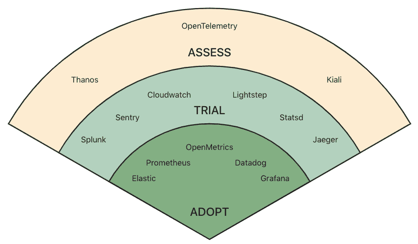
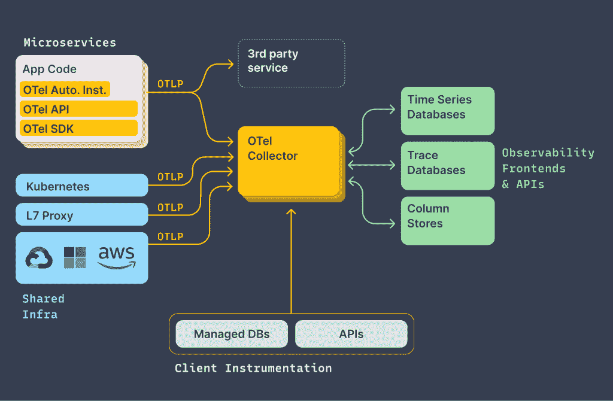

# OpenTelemetry 如何作为可观测性的缺失入口

> 原文：<https://thenewstack.io/how-opentelemetry-can-serve-as-observabilitys-missing-on-ramp/>

随着基础设施变得越来越复杂，使用可观察性工具和技术来深入了解应用程序的性能变得越来越重要。随着越来越多的组织将他们的应用部署在拼凑的多云和本地基础设施上，可观察性不仅提供了应用如何运行的可见性，还提供了应用如何变化以及它们如何交互的可见性。可观察性也有助于发现潜在的问题领域，深入评估对每个用户的个人体验的影响。

但是像许多组织热衷于采用的任何技术一样，可观察性的采用存在障碍。例如，跟踪、度量和日志经常与可观察性混淆，而不是作为提取通过可观察性实现的洞察力所需的原材料的数据源。

组织通常会混合搭配不同的可观察性工具，以满足其应用程序和基础设施的特定需求。总之，[云本地计算基金会](https://cncf.io/?utm_content=inline-mention)[在 2020 年 9 月发布的“终端用户技术可观察性雷达”](https://radar.cncf.io/2020-09-observability)报告称，一半的受访公司使用至少五种可观察性工具，三分之一的受访公司使用超过 10 种可观察性工具。

关于可观测性工具的 CNCF 准备报告。

尽管如此，如果没有高质量的遥测技术，或者来自被测量源的高质量性能数据，这些工具都无法正常工作。然而，高质量的遥测技术往往是以开发人员花费在仪器上的时间为机会成本，和/或通过专有代理锁定供应商。为了正面解决这一问题，CNCF [OpenTelemetry](https://opentelemetry.io/) 项目提供了供应商中立的集成点，帮助组织获得原材料——“遥测”——为现代可观测性工具提供燃料，并且在集成时花费最少的精力。

“在这种环境下，OpenTelemetry 提供的互操作性至关重要，因为它有助于培育创新，因为新工具是为以前未解决的问题而构建的，”[云本地计算基金会(CNCF)生态系统副总裁 Cheryl Hung](https://uk.linkedin.com/in/cheryljhung) 说。“互操作性还有助于公司采用新工具，因为他们可以放心，格式和标准将是交叉兼容的，并避免局限于单一工具或供应商。”

CNCF 的谢丽尔·洪

由松散耦合的 API、协议规范、SDK 和基础设施组件组成， [OpenTelemetry](https://opentelemetry.io/) 还允许后端访问遥测数据，而无需安装额外的软件或在使用新供应商的工具时插入新代码。OpenTelemetry collector 是一个轻量级的基础设施，它为遥测数据提供了一个交换和复用点，可以作为代理或可水平扩展的池来运行。

分析公司[企业管理协会(EMA)](https://www.enterprisemanagement.com/) 的分析师 [Torsten Volk](https://www.linkedin.com/in/torstenvolk) 说，OpenTelemetry 的遥测库标准化，使符合 OpenTelemetry 规范的应用程序代码能够自动检测，尤其重要。“自动检测解决了开发人员没有完全检测他们的代码的重大风险，因此，产生了可能带来重大操作风险的监控盲点，”Volk 说。

OpenTelemetry 还应该进一步简化并最终自动化代码检测。Volk 说，DevOps 团队可以更好地从来自日志、指标和分布式跟踪的发布和运营数据的联合流分析中受益。

“糟糕的代码规范是 IT 运营难以理解服务、应用程序、数据库和底层存储、网络和计算基础设施之间的相互依赖关系的根本原因，”Volk 说。“代码工具的标准化和最终的自动化将为今天的先进 AIOps 平台带来更完整的遥测数据流，以进行三角测量并用于更高质量的预测、建议和更快的根本原因分析。”

## 困惑障碍

如上所述，关于什么是可观测性以及如何利用遥测数据获得洞察力的困惑仍然比比皆是。正如 observability 软件提供商 [Lightstep](https://lightstep.com/?utm_content=inline-mention) 的首席执行官和联合创始人、OpenTelemetry 项目的联合创始人 Ben Sigelman 解释的那样，一个堆栈通常包括(1)遥测层，(2)潜在的多个存储层，这取决于 observability 提供商的特定组合，以及(3)价值层，其中 observability 解决实际的业务问题，无论这些问题涉及核心监控、性能分析、事件解决、CI/CD 还是其他问题。

“由于我们的行业仍然把可观测性作为一个概念，所以有一种将‘遥测’与‘可观测性’混淆的趋势，”Sigelman 说。“也就是说，可观测性永远不会比遥测更好，这就是 OpenTelemetry 如此重要的原因:它提供了一条通往高质量遥测的道路，避免了开发人员花费时间手动检测的机会成本，也避免了供应商对专有代理的锁定。”

照片:Lightstep

应用性能监控公司 [Dynatrace](https://www.dynatrace.com/?utm_content=inline-mention) 的高级产品营销经理 [Logan Franey](https://www.linkedin.com/in/loganfraney) 指出，“随着基础设施变得越来越复杂，如何利用可观察性来深入了解应用和运营性能变得越来越重要”，寻求实施可观察性的组织面临着几个方面的挑战。

“但就像许多(如果不是大多数)组织热衷于采用的任何技术一样，无论是有状态存储还是云原生基础设施的身份和访问管理，observability 的采用都存在障碍，”Franey 说。“例如，跟踪、度量和日志经常与可观察性混淆，而不是将这些功能视为帮助组织实现可观察性的手段，作为组织可以依赖的有用数据点和洞察力的渠道。”

## 使用案例

作为一个寻求满足 OpenTelemetry 项目兼容性规范的供应商的例子， [LogDNA](https://logdna.com/?utm_content=inline-mention) 为 Kubernetes 指标和基数数据分析提供了一个仪表板。

LogDNA 产品经理迈克尔·施(Michael Shi)说:“为了实现这种体验，我们选择创建自己的(报告功能)，以便能够收集我们认为对开发者来说最重要的信息。”。“随着 OpenTelemetry 测试版的不断成熟，我们当然愿意支持 OpenTelemetry 导出程序来进一步丰富日志。”

OpenTelemetry 的追踪方面“真的很棒——它们绝对是同类中最好的，” [Tom Wilkie，](https://uk.linkedin.com/in/tomwilkie)observability 软件提供商 [Grafana Labs](https://grafana.com/) 的产品副总裁，同时也是 [Prometheus](https://prometheus.io/) 的维护者说道。"它们有很大的、非常广泛的支持，并且有非常丰富的原语集."

Wilkie 注意到 Grafana 已经是 OpenTelemetry 的用户，并在内部使用 OpenTelemetry 跟踪软件来跟踪 Grafana 的速度。“我认为 Tempo 是第一个真正倾向于统一和仪器化的 OpenTelemetry 原生跟踪系统，”Wilkie 说。

他说，对于衡量标准，还需要做更多的工作。“如果你看看度量，OpenTelemetry 实际上是在一年左右前从零开始的，”威尔基说，“如果你把它与类似于 OpenMetrics 项目的东西进行比较，该项目来自普罗米修斯，我们已经研究了几十年，如果你包括谷歌所做的工作，那么你就会明白为什么它只是不太成熟，仍然需要时间。”

作为 Wilkie 和 Grafana 对普罗米修斯的贡献的一部分，Wilkie 说“我们正在与 OpenTelemetry 团队合作，我们正在努力确保 OpenTelemetry 具有普罗米修斯兼容性。”在过去的十年中，我们建立了 Prometheus 及其相关仪器库和 Prometheus 的最佳实践，“我们期待着在未来的几周和几个月里与[OpenTelemetry team]合作。”

对于 OpenTelemetry 日志记录，“我只是不认为它真的存在，”威尔基说。“我们给用户和客户的建议是使用 OpenTelemetry(用于跟踪)，但使用 Prometheus 进行度量，并使用 open metrics 和 Prometheus 客户端，”在所有系统中，我们觉得 Prometheus 真的是最先进、最成熟的，而且真的是吸取了所有真正艰难教训的一个。"

对于日志，对于 Loki，“我们对代理采取‘想用什么就用什么’的方法——例如，Loki 接受来自 [Fluentd](https://www.fluentd.org/) 、 [Fluentbit](https://fluentbit.io/) 、 [logstash](https://www.elastic.co/fr/logstash) 、 [Docker](https://www.docker.com/) 以及 [Promtail](https://grafana.com/docs/loki/latest/clients/promtail/) 的日志，Wilkie 指出。

威尔基说:“我们对应用程序中使用的日志库并没有特别的看法——我们对 logfmt 和 json 结构的日志略有偏好，但总的来说，Loki 可以处理任何格式的日志。同上，您可以使用几乎任何代理来发送日志——我们为所有代理都提供了插件——如果您想要一个代理来处理普罗米修斯度量、OpenTelemetry traces 和 Loki 日志，我会鼓励您查看 Grafana 云代理。"

然而，一个常见的误解是 OpenTelemetry 是“一件大事”，“这导致了对项目成熟度的许多误解，”Sigelman 说。

“OpenTelemetry 是一个广泛的项目，尤其是一个有意分离的项目。许多关键部分都是稳定的，可以在生产中使用——例如，主要语言中的跟踪支持，OTel 收集器已经广泛用于当今知名企业的生产中。其他更广泛的部分——或对广泛语言的支持——则不太成熟。这都是设计好的，”西格曼说。Sigelman 说:“由于 OTel 的广度和非耦合性，OTel 的成熟度应该根据每个组件进行评估。

通过 Pixabay 的特征图像。

<svg xmlns:xlink="http://www.w3.org/1999/xlink" viewBox="0 0 68 31" version="1.1"><title>Group</title> <desc>Created with Sketch.</desc></svg>