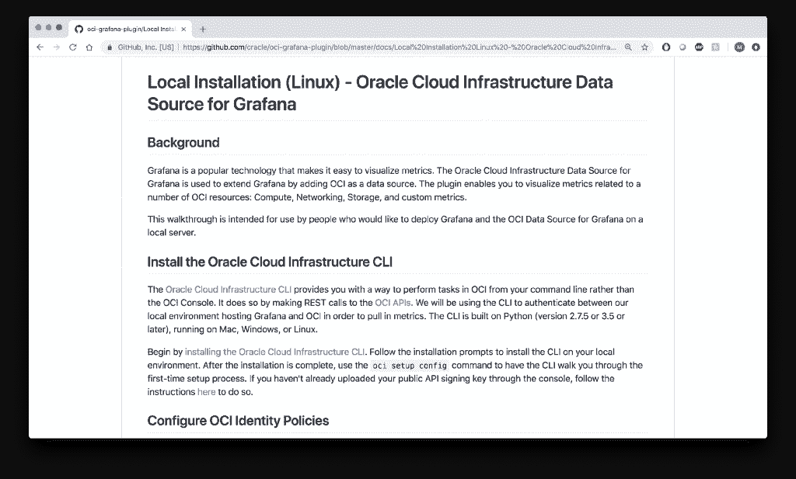
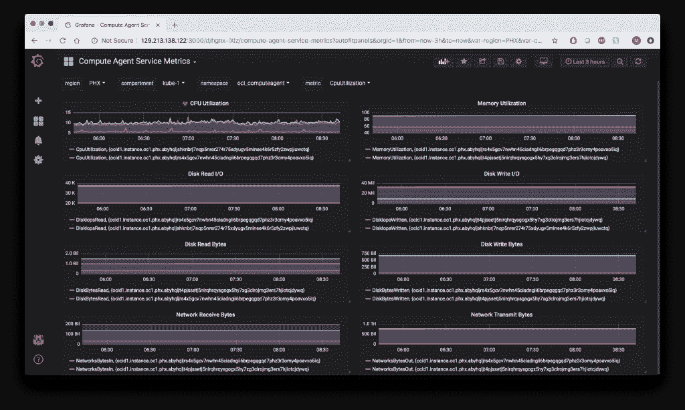

# Oracle 如何嵌入云原生仪表板 Grafana

> 原文：<https://thenewstack.io/how-oracle-plugs-into-the-cloud-native-dashboard-grafana/>

[甲骨文](https://www.oracle.com/cloud-native/)赞助本帖。

 [米奇·博塞尔

Mickey Boxell 是 Oracle 云本地实验室团队的解决方案架构师。他专注于构建客户可部署的云原生/容器原生解决方案，以弥合开源社区和核心 Oracle 云基础设施服务之间的差距。这包括与 Kubernetes 平台相关的解决方案教程、示例代码、技术博客文章。](https://www.oracle.com/cloud-native/) 

开发人员和企业都越来越担心供应商锁定和云蔓延。由于整个行业缺乏标准化，供应商锁定已成为采用云原生服务的主要障碍。如果采用新技术意味着由于专有标准，公司可能会发现自己无法从一个供应商处迁移，那么公司就不愿意采用新技术。

与此同时，跟踪和管理不断增长的提供商和服务列表已成为一项挑战。开源软件通过强调可移植性和互操作性，简化了分布式环境中云服务的采用和管理。然而，云提供商如何选择与开源技术合作至关重要。

除了我们在开源领域的深厚传统，甲骨文还加倍支持[云计算原生计算基金会](https://www.cncf.io/)的白金级赞助，并为生态系统做出贡献。将社区理解为创新的倍增器，将 Fn 项目作为完全开放的功能即服务发布似乎是显而易见的(FaaS)。接着是相应的托管服务 Oracle Functions，这是为用户提供补充云路径的自然的下一步。

从我们经过认证并由[管理的基于开放标准的 Kubernetes 服务](https://docs.cloud.oracle.com/iaas/Content/ContEng/Concepts/contengoverview.htm)，到云原生 Java 微服务框架 [Helidon](https://helidon.io/) ，以及[Weblogic Kubernetes operator](https://github.com/oracle/weblogic-kubernetes-operator)的发布，Oracle 相信能够为所有用户提供更加开放的云原生开发选项。

所有这些 DevOps 范例和实践的核心是领先的分析仪表板实用程序 [Grafana](https://grafana.com/) 。为此，我们很高兴为 Grafana 推出 Oracle 云基础设施数据源。Oracle 通过 API 访问来自 [Oracle 云基础设施](https://cloud.oracle.com/en_US/cloud-infrastructure)监控服务的原生云基础设施数据和指标，并使用开源工具进行分析和测试。

我们选择了 Grafana，这是一个领先的分析和监控开源平台，因为它在行业中很受欢迎，并且符合我们用户的需求。Grafana 是一个针对时间序列数据的开源可视化和警报工具。它设计了一个插件架构，允许您捕获许多不同来源的数据，并将其可视化在一个仪表板上。这种方法通过向用户提供跨提供商的资源整合视图，解决了云蔓延的问题。

[我们的监控服务](https://docs.cloud.oracle.com/iaas/Content/Monitoring/Concepts/monitoringoverview.htm)为 Oracle 云基础设施服务和资源提供现成的聚合指标。我们还通过开放的 API 提供这些指标。我们与 Grafana 合作，将监控服务作为 Grafana 数据源公开。这意味着您可以在 Grafana 实例中可视化 Oracle 云基础设施数据，并使用它来创建美观实用的仪表盘。

## 使用插件

您可以在 Grafana Labs 网站的 Oracle Cloud infra structure Data Source for Grafana 页面上找到有关使用该解决方案的更多信息，并在 Oracle Cloud Native Labs 页面上找到一个自述文件，其中包含详细安装演练的链接。

在设置身份和访问管理以及将插件配置为 Grafana 数据源之后，您可以使用查询编辑器来创建 Oracle 云基础架构资源的图表。导航回主页控制面板，然后单击新建控制面板。从可用仪表板类型列表中选择图形。单击面板标题，然后单击编辑，将指标添加到仪表板。从可用选项列表中选择适当的区域、隔离专区、名称空间和度量，以创建您的第一个图表。

除了查询编辑器之外，我们还启用了许多特性，包括维度、模板和自定义指标名称空间。维度可以用来增加你的图表的特异性。例如，您可以使用它们来查看可用性域级别而不是区域级别的指标，或者根据特定的虚拟机 imageID 来筛选使用情况。模板化使您能够动态地与图形交互，以便可视化关于您的环境的附加信息。使用查询模板将创建一个可供选择的动态变量列表，允许用户在区域或区间或其他变量之间快速切换。我们还支持创建自定义指标命名空间，除了默认情况下可用的本机 Oracle 云基础架构资源之外，还可用于从其他来源获取数据。例如，可以对应用程序进行检测，以收集有关单个操作的统计数据，然后可以将这些数据提取到 Grafana 中并进行可视化。

## 结论

Grafana 的 Oracle 云基础架构数据源提供了管理 Oracle 云基础架构资源以及来自其他供应商的私有、公共和混合云资源的灵活性。这证明了我们继续致力于为我们的用户提供开源解决方案。想了解更多关于甲骨文对开源和云原生空间贡献的信息，请访问 http://cloudnative.oracle.com/。

[云本地计算基金会](https://www.cncf.io/)是新堆栈的赞助商。

通过 Pixabay 的特征图像。

<svg xmlns:xlink="http://www.w3.org/1999/xlink" viewBox="0 0 68 31" version="1.1"><title>Group</title> <desc>Created with Sketch.</desc></svg>