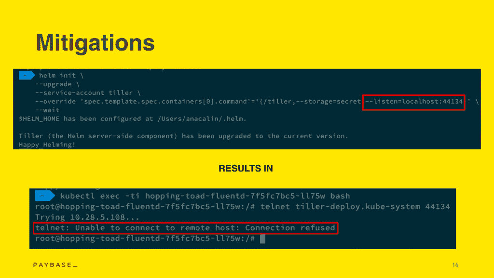
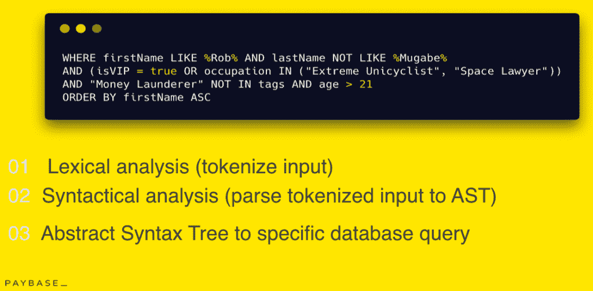
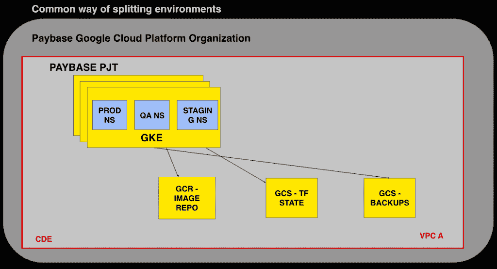
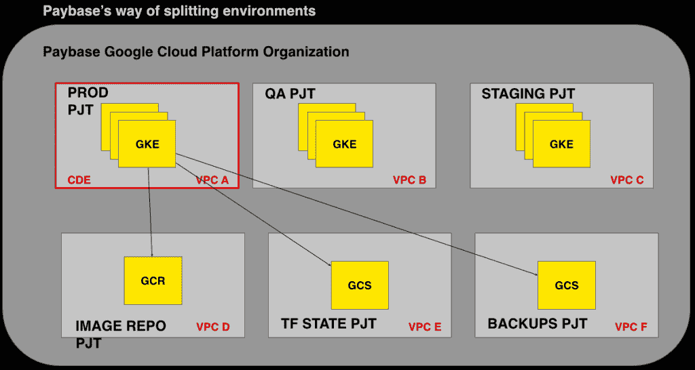
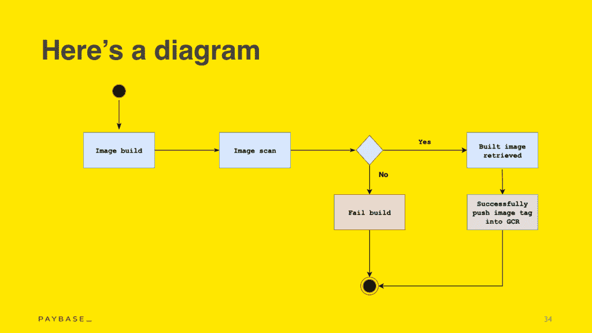

# Paybase 如何克服默认的 Kubernetes 安全设置以实现 PCI DSS 合规性

> 原文：<https://thenewstack.io/how-paybase-overcame-default-kubernetes-security-settings-for-pci-dss-compliance/>

“想象一下，你在一个复杂的支付平台的基础设施上工作了一年多，但在渗透测试不到 30 分钟的时间里，整个生产集群就完全暴露了。我们说的是能够绕过防火墙规则，获得你无法获得的谷歌云服务——所有这些都是在一个小小的容器内完成的。”

安娜·卡林(Ana Calin)最近在 T2 举行的 QCon 伦敦会议(QCon London talk)上谈到了通过 Kubernetes 在云中实现灵活支付的风险和回报，她就是这样开始演讲的。Calin 是 T4 Paybase T5 的系统工程师，这是一家 API 驱动的支付服务提供商，专注于市场、gig 共享经济和加密货币。凭借难以获得的 [PCI DSS(数据安全标准)Level One](https://www.incapsula.com/web-application-security/pci-dss-certification.html) 合规性，Paybase 旨在让客户更容易进行监管。当这些企业决定是自己成为受监管的支付机构，还是通过与第三方整合来节省资金时，他们的解决方案非常方便。

Calin 提供了一些方法，他们能够克服 Kubernetes 托管解决方案中的一些默认安全障碍，以实现最高级别的合规性——尽管监管机构通常缺乏对容器技术的了解。

## 防止 Kubernetes 妥协的两种方法

这种妥协来自于 Paybase 生产集群的内部基础设施渗透测试，该测试在客户积极使用之前进行。测试人员最终通过在容器中提供的访问权限，获得了他不应该获得的 Google 云服务的访问权限。

Calin 分析了造成这种安全危害的原因，以及采取了哪些缓解措施来防止未来的攻击。这不是一个详尽的 Kubernetes 安全入门，而是一个团队关于他们默认发现的错误的故事。

### 薄弱环节#1:谷歌 Kubernetes 引擎

Google Kubernetes Engine (GKE)是 Google 云平台的 Kubernetes 托管服务，1.12.0 之前的版本带有一些默认不安全的选项:

*   计算引擎范围—这是从 GKE 到谷歌计算引擎(GCE)的读写访问范围
*   默认服务帐户-默认情况下，这与 GCP 的编辑角色相关联。GCP 的服务帐户允许在给定的 GCP 服务和其他服务之间进行编程访问。默认情况下，任何 Google 项目提供的默认服务帐户都具有编辑角色和编程访问权限，可以编辑 Google Cloud 中的任何服务，包括更改防火墙规则。
*   默认情况下，旧元数据端点处于启用状态。通过查询 GKE 集群中的元数据端点，您可以以 kubelet 的身份访问 Kubernetes API，kube let 是在集群中的每个 Kubernetes 节点上运行的代理，它确保容器在 pod 中运行。您可以使用它从任何节点或计划的 pod 读取机密。在 1.12.0 版本中，默认情况下这是禁用的，但任何以前的版本仍然存在风险。

Calin 警告说，如果不指定非默认的服务帐户，并且不禁用节点的元数据端点，有人就可以访问 Kubernetes APIs 的某些秘密。

### 薄弱环节 2:舵柄

Helm 是一个开源工具，用于简化 Kubernetes 应用程序的安装和管理。 [Tiller](https://helm.sh/docs/glossary/) 是 Helm 的服务端组件，负责管理图表的发布，这些图表是打包在一起的 Kubernetes 模板化资源。

Helm 的文档已经建议您永远不要在集群中提供所有默认选项的 Tiller，但是，在 Paybase，虽然该平台仍在开发中，没有用户，但他们保留了这些默认选项，并计划在产品上线前更改它们。

“我们这样做了，但我们说我们以后会改变它，并决定保留默认设置，以便进行渗透测试，看看设置会在多大程度上受到损害，”Calin 说。

Tiller 自带 [mTLS(相互传输级安全)客户端和服务器之间基于密钥的认证](https://en.wikipedia.org/wiki/Mutual_authentication)，默认禁用。任何危及 Tiller 安全的人——比如 Calin 的 pen tester——都拥有集群管理权限，这是 Tiller 正常工作所需的集群管理 Kubernetes 基于角色的访问控制(RBAC)角色。然后，他们可以随意删除或提供任何内容。

为了减轻这种情况，Calin 说要用 mTLS 来启用 Helm。或者，你可以在你的集群中运行不带舵柄的舵轮-“[不带舵柄的舵轮](https://rimusz.net/tillerless-helm/)”。

至少，她建议将 Tiller 绑定到 localhost，这意味着 Tiller 将只监听运行它的 pod 的 IP 地址。

## 安全性和弹性:安全的 Kubernetes 集群

在提供了可能使您的集群处于风险中的两种配置之后，Calin 进入了他们发现的更安全的 Kubernetes 集群所必需的基础知识——因为没有什么是不可穿透的。

她提到了最低特权原则，她说你应该只允许工程师做他们工作绝对需要的事情。

Calin 还建议您根据需要使用 [Kubernetes 网络策略](https://kubernetes.io/docs/concepts/services-networking/network-policies/)来限制对某一组 pod 的流量访问，或者应用启用授权规则的 [Istio](https://istio.io/) 设置来限制流量访问。

> “无论你在构建什么，你都应该始终假设它会失败，有人会破坏它。”—安娜·卡林，薪酬基础

她继续说，您应该编写 [pod 安全策略](https://kubernetes.io/docs/concepts/policy/pod-security-policy/)，以便“如果您的集群通过容器受到危害，攻击者只能部署具有特定权限的 Pod，并且被限制将主机文件系统挂载到新创建的 Pod 中。”

对所有软件的一个很好的保证是启用基于角色的访问控制(RBAC)。默认情况下，提供 Kubernetes 托管服务的主要云提供商 Google Cloud、Azure 和 AWS 都启用了 Kubernetes RBAC，但是，这只是最近才在 Azure 的 Kubernetes 服务下启用。

并且始终在集群中使用安全扫描图像。

Calin 说一个有弹性的 Kubernetes 集群应该:

*   考虑到失败和弹性，
*   具有稳定的可观测性堆栈，
*   被测试了很多，包括混沌工程。

## 克服 Kubernetes 对 PCI DSS 合规性的挑战

Calin 将 Paybase 的[一级支付卡行业数据安全标准(PCI DSS)](https://en.wikipedia.org/wiki/Payment_Card_Industry_Data_Security_Standard) 合规性描述为一项巨大的成就。这是对支付服务提供商(PSP)的要求，但大多数金融机构选择支付年度罚款，而不是达到这一合规水平。2017 年，[超过 80%的企业](https://www.goanywhere.com/blog/2017/02/03/8-shocking-pci-compliance-statistics)仍然不合规。

由于大多数金融机构仍然在传统的遗留体系结构上运行，当金融监管机构对分布式系统没有充分了解时，这一点尤其如此。

PCI 请求。6.5.1 声明您的应用程序不能容易受到注入缺陷的影响。为了选中这个框，Paybase 利用了 PQL (Paybase 查询语言)，这是一种特定于领域的语言，由内部开发，受 SQL 的启发。Calin 说 PQL 是抗注入的，因为它不允许变化的语法，并且具有数据库不可知的额外好处。

PCI 请求。2.2.1 表示，作为一个兼容的 PSP，您只需要在每台服务器上实现一个主要功能，以防止需要不同安全级别的功能出现在同一台服务器上。

当然，正如 Calin 所说，“我们没有任何实际的服务器，标准也没有提到虚拟机，更不用说容器了。”

对于这个需求，Paybase 将“服务器”翻译成“可部署的单元”,如 pod 或 container。如果这种解释被广泛接受，那么容器就成了帮助遵从的合理解决方案。对工资基数来说是这样。他们通过使用限制不同服务流量的网络策略、应用不同的 Pod 安全策略，以及仅使用内部可信、扫描和批准的映像来满足要求。

PCI Req，6.4.4 要求 PSP 在系统上线或投入生产之前从系统组件中删除所有测试数据和帐户。

Calin 描述了“云提供商的正常方式是有一个组织，然后一个主要项目，然后在那个项目[亚马逊网络服务帐户]下，你有所有的服务。AWS 建议您应该有一个帐户用于计费，然后另一个帐户用于应用程序的其余部分。然后，您可以在同一个集群内的 Kubernetes 命名空间级别对其进行拆分。”

这样，从 PCI 兼容的角度来看，你的范围将是谷歌云平台中的一切，因为一切都封装在同一个虚拟专用网络或 VPC 下。

相反，对于每个环境，Paybase 都有不同的项目。然后他们有一些额外的项目，用于重要的事情，如图像存储库、备份和地形状态(T2)。这导致将 PCI 的范围缩小到生产项目，从而创建了符合法规要求的关注点分离、更容易的 RBAC 和风险降低。

 

最后，PCI 请求。11.2.1 要求 PSP 执行季度内部漏洞扫描，以解决这些漏洞，然后重新扫描，证明所有高风险漏洞都已消除。

“当你在容器上运行时，你没有这样的内部基础设施。相反，我们确保所有在集群中使用过的图像都被扫描过，没有通过漏洞扫描的图像不会被创建，”Calin 说。

“当开发人员将代码推送到我们的源代码管理时，会运行一些集成测试，并触发一个构建映像步骤。然后，如果映像构建成功，它会扫描映像中的每个包，如果映像除了低[风险]之外没有任何漏洞，它会成功地将映像标签推入 GCR[谷歌云存储库]。如果扫描失败(发现高于中等风险的漏洞)，我们的开发人员就没有任何办法将该图像发布到 GCR，”她继续说道。

在 Paybase，新的映像构建每天都在发生，因为它们运行的是由实体分隔的分布式整体，因此所有不同的应用服务都运行在同一个映像上。这可确保我们每天扫描映像中的软件包，这意味着群集中出现带有漏洞的旧软件包的可能性非常低。

## 开源安全是一个持续的旅程

“安全不是一个时间点，而是一个永无止境的持续旅程。这只是意味着我们的工作更加安全，而不是 100%安全——没有完全安全这回事，”Calin 说。

她继续说，你肯定可以使用像 Paybase is 这样的开源软件，并且仍然可以获得很好的安全性。

“这只是需要一定的工作量，但我们是工程师，我们喜欢挑战，”她说。

虽然 Calin 喜欢好的挑战，但她确实主张尝试改变 PCI 合规现状。她分享了这样一个故事:Paybase 雇佣了一名对容器和谷歌云服务有着一般了解的审计员，但他们仍然不得不花大量时间解释这一切是如何工作的。

“这不应该是我们的工作。这应该是培训合格安全顾问的人的工作，”卡林说。

最后，她建议工程师和团队中的每个人都应该参与进来，让你的公司符合标准。

“他们(工程师)知道变得顺从有多痛苦，他们会更加珍惜为了保持顺从他们必须做的事情，”Calin 说。

管理 Kubernetes 项目的云本地计算基金会是新堆栈的赞助商。

<svg xmlns:xlink="http://www.w3.org/1999/xlink" viewBox="0 0 68 31" version="1.1"><title>Group</title> <desc>Created with Sketch.</desc></svg>