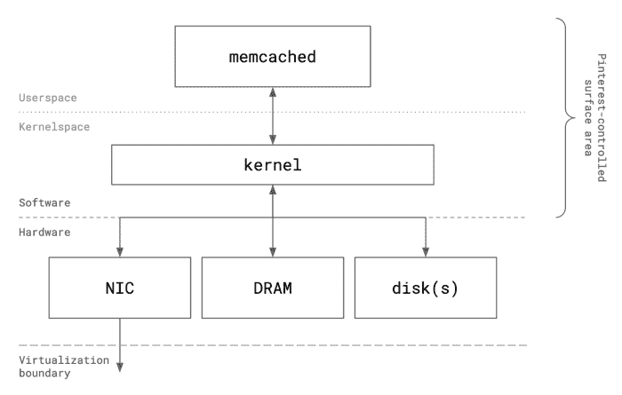
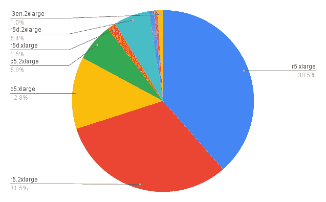
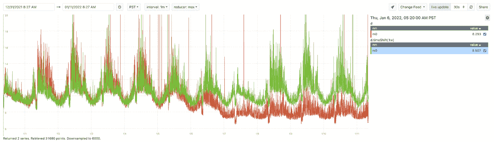
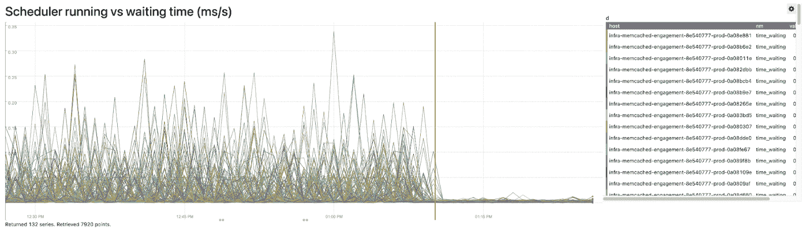
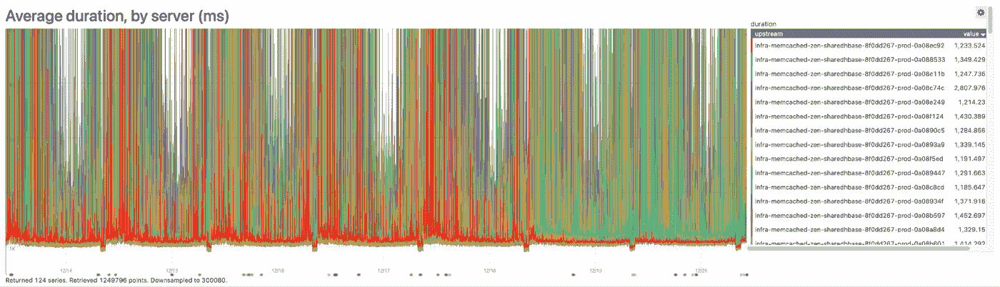

# Pinterest 如何调优 Memcached 以大幅提升性能

> 原文：<https://thenewstack.io/how-pinterest-tuned-memcached-for-big-performance-gains/>

Pinterest 社交媒体网站使用基于 [memcached](https://memcached.org/) 的缓存即服务平台来全面削减应用延迟，最大限度地减少总体云成本足迹，并满足严格的站点范围可用性目标。

Pinterest 基于 memcached 的缓存系统非常庞大——超过 5000 个来自[亚马逊网络服务](https://aws.amazon.com/?utm_content=inline-mention)的 EC2 专用实例，这些实例跨越了针对计算、内存和存储维度优化的各种实例类型。作为一个整体，该机群在大约 460TB 的活跃内存和磁盘数据集上每秒处理大约 1.8 亿个请求，大约 220 GB/s 的网络吞吐量，这些数据集分布在大约 70 个不同的集群中。

拥有如此庞大的舰队，任何优化，无论多小，都会产生放大效应。因为 memcached 的每个副本都在各自的虚拟机上作为独占工作负载运行，Pinterest 工程师能够微调 VM Linux 内核，以优先考虑缓存的 CPU 时间。一项配置更改将延迟降低了 40%,并使整体性能更加平稳。

此外，通过观察数据模式并将其划分为工作负载类别，Pinterest 工程师将 EC2 实例专用于特定工作负载，从而降低成本并提高性能。

[Pinterest 存储和缓存软件工程师林义杰](https://www.linkedin.com/in/kevin-lin-2963a7139/)[在上周发布的博客文章](https://medium.com/pinterest-engineering/improving-distributed-caching-performance-and-efficiency-at-pinterest-92484b5fe39b)中，讨论了该公司在生产中大规模运行 memcached 的一些经验。以下是几个亮点。

对公共云环境中虚拟机上运行的 memcached 的性能优化可用外围应用的高级描述

## 科学理论在起作用

为了确定可能的优化领域，Pinterest 建立了一个受控环境，以创建结构化、可重复的工作负载来进行测试和评估。以下变量考虑了多年来对关键路径生产流量影响最小的高级测试。

*   服务器端:这包括请求吞吐量、网络吞吐量、资源利用率和硬件级参数(NIC 统计数据，如每个队列的数据包吞吐量和 EC2 许可耗尽、磁盘响应时间和进行中的 I/O 请求等)的指标。).
*   缓存请求百分比延迟、超时和错误率、每服务器可用性(SLIs)的客户端指标，以及顶级应用程序性能指标，如 RPC P99 响应时间。
*   合成负载生成:这种实践在历史上以检测最大负载下的性能改进或退化而闻名。Pinterest 使用了 [memtier_benchmark](https://github.com/RedisLabs/memtier_benchmark) ，这是一个开源工具，可以针对 memcached 集群生成负载。
*   生产影子流量:这是模拟真实生产流量的过程，目的是大规模评估系统性能。Pinterest 使用脸书的 [mcrouter](https://github.com/facebook/mcrouter) ，这是一个开源的 memecached 协议路由代理，在 Pinterest 车队中作为客户端侧边站部署。

## 结果出来了

### 云硬件

Pinterest 将其各种不同的工作负载划分为以下工作负载类别。每个类都被指定到一个固定的优化 EC2 实例类型池，以允许纵向扩展，从而实现更高的成本效率。因为水平扩展可以随时缓解出现的瓶颈，但不是最具成本效益的方法。Pinterest 对垂直可伸缩性更感兴趣。

工作负载类别:

*   吞吐量(计算)
*   数据量(内存和/或磁盘容量)
*   数据带宽(网络和计算)
*   延迟要求(计算)

以下工作负载配置文件是从上面的类创建的:

*   中等吞吐量，中等数据量| r5
*   高吞吐量、低数据量| c5
*   高数据量、宽松的延迟要求| r5d
*   海量数据、宽松的延迟要求| i3、i3en

Pinterest memcached 车队的 EC2 实例类型分布

当选择 EC2 实例并确定哪个集群将到达哪个实例时，主要归结为这些标准:CPU、内存大小和磁盘速度。

将数据模式分解为工作负载类别，并为每个工作负载类别分配特定的 EC2 实例，可以降低成本，同时提高 I/O 性能。添加 memcached 插件 [extstore](https://github.com/memcached/memcached/wiki/Extstore) 提高了存储效率，同时成比例地减少了云集群的占用空间。

这些实例使用级别为 RAID0 的 Linux 软件 RAID 进行配置，以便将多个硬件时钟设备合并到一个逻辑磁盘中，从而减少用户空间消耗。Pinterest 在两个磁盘之间均匀地条带化读写，因此 RAID0 将最大理论 I/O 吞吐量提高了一倍，在 MTTF 出现问题的情况下，有效磁盘响应时间减少了两倍。

Pinterest 清楚地表明，在理论故障率增加的情况下，extstore 硬件性能的提高是非常值得的。该基础架构位于公共云上，因此可以自我修复，mcrouter 能够立即处理服务器更改。

### 计算

memcached 文档将“计算效率”*定义为在不增加请求延迟的情况下，实例 CPU 使用率每增加一个百分点，单个实例可以处理的请求的额外速率。*根据这个定义，优化计算效率可以通过允许 memcached 以更低的 CPU 使用率提供更高的请求速率而不改变延迟特性来衡量。

Pinterest 上一半的缓存工作负载是计算受限的(纯粹是请求吞吐量受限)。Pinterest 的目标是在不影响服务能力的情况下缩小集群规模。

随着 Pinterest 的大部分工作负载在专用 EC2 虚拟机上运行，这为在硬件-软件边界进行优化提供了独特的机会，而过去的优化都是围绕硬件修改进行的。

Memcached 在 Pinterest 的有状态数据系统中有些独特，因为它是唯一的主要工作负载，在部署它的每个 EC2 实例上都有一组静态的长期工作线程。因此，Pinterest 调整了进程调度，请求内核优先考虑 memcached 的 CPU 时间，代价是故意扣留主机上其他进程的 CPU 时间，比如监控守护进程。

这包括在一个实时调度策略 SCHED_FIFO 下运行 memcached，该策略具有高优先级——指示内核在 memcached 线程可运行时，通过抢占(实质上是饥饿)所有非实时进程，有效地允许 memcached 独占 CPU。下面是在 SCHED_FIFO 实时调度策略下调用 memcached 的示例

`$ sudo chrt — — fifo <priority> memcached …`

在推广到所有计算密集型集群后，这一行的变化将客户端 P99 延迟降低了 10%至 40%,并全面消除了 P99 和 P999 延迟中的虚假峰值。由于这种优化，稳态运行 CPU 使用率上限提高了 20%,而没有引入延迟回归，memcached 的整个车队总成本减少了 10%。

当实时调度部署到相应的专用 memcached 集群时，一项服务的客户端 P99 缓存延迟的周与周比较。

在启用实时调度(数据从/proc 文件系统中的 schedstat 收集)之前和之后，memcached 等待内核执行所花费的时间与挂钟时间的比率。

在金丝雀主机上启用实时调度后，虚假延迟峰值的稳定(红色系列)。

<svg xmlns:xlink="http://www.w3.org/1999/xlink" viewBox="0 0 68 31" version="1.1"><title>Group</title> <desc>Created with Sketch.</desc></svg>