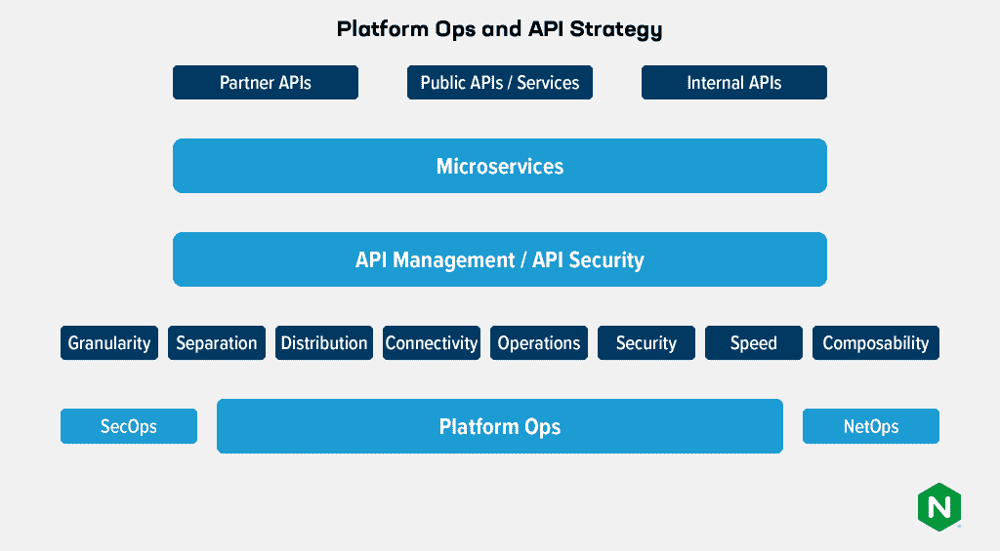

# 平台运营团队应该如何考虑 API 策略

> 原文：<https://thenewstack.io/how-platform-ops-teams-should-think-about-api-strategy/>

这篇博客是由四部分组成的系列文章的一部分。

1.  [*打造 API 至上的文化和公司* *(上篇)*](https://thenewstack.io/creating-an-api-first-culture-and-company-part-1/)
2.  [*创造 API 至上的文化和公司(第二部分* *)*](https://thenewstack.io/creating-an-api-first-culture-and-company-part-2/)
3.  *[像管理四星级餐厅一样管理你的 API(第三部分)](https://thenewstack.io/manage-your-apis-like-a-4-star-restaurant/)*
4.  *平台运营团队应该如何考虑 API 策略(本文)*

平台运营团队负责为开发人员和应用团队选择工具和解决方案。他们还越来越多地在管理和选择 API 以及为使用 Kubernetes 等现代平台构建 API 策略方面发挥作用。

 [Karthik Krishnaswamy

Karthik 是 F5 旗下 NGINX 的产品营销主管。他拥有芝加哥大学布斯商学院的 MBA 学位和伊利诺伊理工学院的计算机科学学位。他来自印度南部的钦奈，现在住在加州圣何塞。](https://www.linkedin.com/in/kkrishnaswamy/) 

那么，平台运营团队需要将哪些关键能力融入到支持其 API 和 API 策略的技术中呢？Gartner 列出了五个关键属性:粒度、分离/隔离、分布、连接和运营。我们认为还有三个:安全性、速度和可组合性。其中一些功能最好由 API 管理(APIM)解决方案和开发人员门户来提供。其他服务最好通过 API 网关、入口控制器或应用交付控制器提供，具体取决于操作环境和编排技术。

老实说，所有这些能力或多或少都是相互依赖的，一个人的策略会影响到其他人。此外，平台运营团队需要与安全运营(SecOps)、网络运营(NetOps)和开发人员运营(DevOps)团队密切合作，以交付完整的解决方案。以下是对这八大公司的分析，以及如何为每一家公司制定策略。

## 粒度

粒度定义了 API 的功能以及它们被设计来执行多少任务。API 粒度是一个热点问题，平台运营团队可以帮助解决或澄清这个问题。争论的焦点是复杂性和全面性之间的基本权衡:API 是越简单越好(执行一个主要功能)，还是越复合越好(执行多个基本但密切相关的功能)。REST 的支持者倾向于简单的 API，而 GraphQL 的支持者倾向于复合类型。

传统上，大多数开发人员将几个非常基本的 REST APIs 堆叠在一起，组成一个服务的必要功能。另一方面，GraphQL 鼓励 API 定义包含更广泛的功能，以减少往返和延迟，代价是更复杂的 API 结构和文档。作为您的 API 策略的仲裁者，平台运营团队需要对所需的和可接受的 API 粒度水平有强烈的意见。随着您开始采用 Kubernetes，API 粒度考虑变得更加紧迫，Kubernetes 使用 API 进行所有通信。

## 分离

分离是恢复力的一个关键因素。API 必须在很大程度上相互独立，以便一个 API 的故障对其他 API 的影响最小。此外，分离使得切换、弃用和更新 API 版本变得更加容易。平台运营团队应与 API 团队合作，在第 4 层和第 7 层强制分离 API，并分配适当的基础设施和资源来满足每个 API 的性能需求。例如，这可能意味着向故障转移集群添加一个高度关键的 API，或者如果应用程序流量遵循 sun，则向不同的数据中心位置循环调用 API。

## 分布和可发现性

如果您希望创建一个自助式 API 文化，那么您分发 API 以供消费的方式非常重要。在某种程度上，分发 API 仅仅意味着将它们发布到您的 API 管理解决方案或目录中，即您的组织用来构建 API 的工作空间和工具带。分发也可能意味着根据应用或服务需求，创建带有 API 建议的参考设计。

平台运营团队可以帮助 API 团队定义如何创建和分发 API。例如，可能需要在开发管道中的软件的登台和开发环境中部署新版本的 API，以利用新特性。为了有效地管理和保护这些 API 的流量，您需要在这些环境以及公共云和内部部署等其他环境中部署 API 网关。API 发布、分类和分发的方式会强烈影响开发人员构建应用程序和调用资源的方式。平台运营团队必须创建合理的发布和分发政策和实践，允许开发人员快速行动，但不能草率行事。

与分发相关，在生产中发布和使用的每个 API 都必须是可通过编程发现的。句号。这是一个铁定的规则，原因有很多。首先，安全团队需要了解每一个 API，以确保它受到保护，不被滥用。如果一个 API 不容易被发现，但是一些恶意行为者设法发现了它，那么可能要过很长时间你才会意识到有问题。可发现性只是发行的第一步。与分发相结合的自动可发现性是版本控制的关键要素，并且通常是快速更新 API 的最佳途径。

## 连通性

控制 API 如何与第三方和内部连接的规则和策略是现代应用程序的重要基础。在高层次上，连接性策略规定了 API 及其消费者之间的约定条款。在更精细的层面上，平台运营团队需要确保 API 能够满足服务级别协议，并在分布式环境中快速响应请求。

与此同时，连接性与安全性重叠:API 连接性规则对于确保数据不会丢失或泄露、业务逻辑不会被滥用以及暴力帐户接管攻击不会以 API 为目标至关重要。这是 API 网关的领域。不幸的是，大多数 API 网关主要是为南北流量设计的。东西向流量政策和规则同样重要，因为在现代云原生应用中，内部 API 和微服务之间的东西向流量实际上远多于往来于外部客户的南北向流量。

## 操作

运营能力的各个方面与我们正在讨论的大多数其他战略能力重叠。也就是说，平台运营应该认为自己是所有平台的首席运营官，包括 API。有人必须确保所需的基础设施和资源正在运行、更新、安全、高性能，并且足以满足 API 和应用程序的要求。

运行 API 网关或 API 管理解决方案的团队通常承担主要责任，但平台运营团队是基础架构和资源的最终提供者，为应用程序和 IT 提供云原生方法。因此，平台运营必须与 API 特定基础设施的运营商一起制定 API 策略和资源计划。

由于 API 通常既是单点故障，也是应用程序中最关键的元素之一，平台运营需要将最关键的 API 视为皇冠上的宝石，并设计弹性和高可用性。这需要分析哪些 API 是最关键的，它们预计会承受什么类型的流量和负载，以及采取什么步骤来确保 API 在需要时可用并运行良好。

## 安全性

对于云原生环境，API 既是通向外部世界的网关，也是在应用程序和敏感环境内部进行横向遍历的逻辑路径，这使得 API 安全性在外部和内部都至关重要。因此，毫不奇怪，随着 API 在过去五年中激增并更加深入地嵌入到企业基础设施中，针对它们的攻击也急剧增加。

API 安全实践(如防止 DoS 攻击)同样适用于内部 API，即使 DoS 是由于配置错误(例如，设置重试或保持活动参数会产生大量流量)而导致的疏忽。

平台运营团队需要与安全运营团队(包括红队和蓝队)合作，为所有 API 创建威胁模型，并在每个 API 的基础上制定适当的控制可观察性和保护级别。这就是 API 发现发挥关键作用的地方；它可以确保没有未受保护的 API 和意外。

Web 应用程序防火墙(WAFs)在消除威胁方面也发挥着关键作用。API 可观察性和度量工具可以是平台运营、安全运营、网络运营和开发运营团队之间的协作。实际上，每个团队都需要理解 API 流量才能做好自己的工作。

## 速度和灵活性

Platform Ops 的目标之一是帮助开发人员更快地行动，更快地交付代码。这延伸到使开发者更容易创建、保护、发布、维护、监控和版本化 API。APIM、API 网关和 API 目录都是为此而创建的。

平台运营团队必须将这种对速度和敏捷性的需求转化为一系列切实可行的措施。这些可能包括为新 API 创建已知路径，以便快速审查并向大型企业中的全局防火墙和负载平衡器注册，使新 API 能够从安全团队接收快速威胁建模，并使 API 发布者能够轻松访问维持其 API 的低延迟所需的 CPU、内存和网络资源。

作为负责使 API 快速和敏捷的协调者，平台运营团队需要监督一个全面的清单，以确保 API 创建者可以快速获得他们需要的东西。

## 可组合性

与分离和粒度密切相关，可组合性表示从现有组件构建复合应用程序和服务的容易程度。没有它，应用程序团队被迫复制功能并重新发明轮子。云原生和微服务设计的标志是 Unix 的精神，即由许多擅长其特定工作的较小工具组成解决方案。API 是一种强力胶，它使组件和模块能够轻松地通信和连接，即使它们是用不同的语言编写的，从而使可组合性变得有效。

在很大程度上，APIM 解决方案通过生成 API 参考设计和规范来确保 API 兼容性，从而帮助增强可组合性。Platform Ops 通过确保 APIM 以一致的方法整齐地映射到应用程序开发实践，帮助提供无痛且易于扩展的可组合性。一致性是可组合性和兼容性的关键，可组合性和兼容性转化为敏捷性和安全性等其他好处。

## 结论:平台运营就是 API 运营

如果您现在还没有猜到，那么很明显，平台操作在某种程度上就是 API 操作。如果没有一个由 Platform Ops 指导的可靠的 API 策略，组织的开发工作可能会退化为一堆部分可组合的软件模块，这些模块通过部分兼容的 API 与部分兼容的安全和网络策略相链接。

希望改善其组织的 API 体验的平台运营团队可以看看这里讨论的八种功能是如何重叠和关联的，然后在不过分宽松或危险的情况下构建互补的策略和方法。

API 是平台方法的强力胶。能够协作创建和执行智能 API 策略的平台运营团队将使所有其他团队(开发、开发运维、安全运维、网络运营)的工作更加轻松、安全和高效。

<svg xmlns:xlink="http://www.w3.org/1999/xlink" viewBox="0 0 68 31" version="1.1"><title>Group</title> <desc>Created with Sketch.</desc></svg>