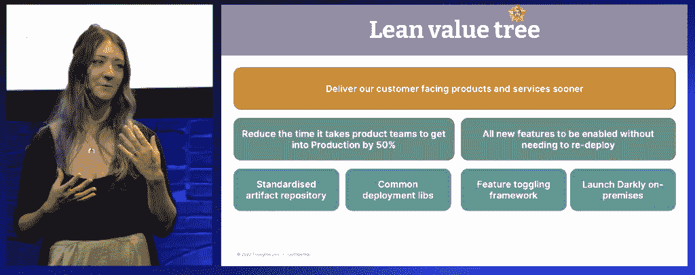
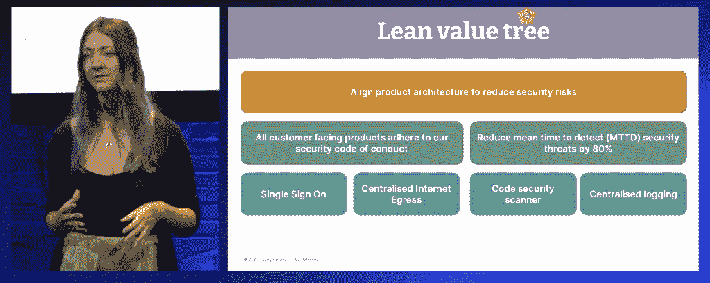
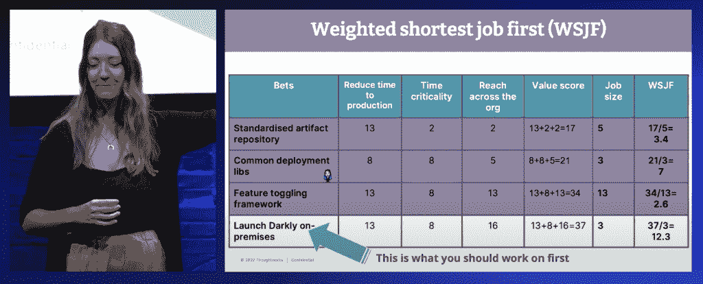
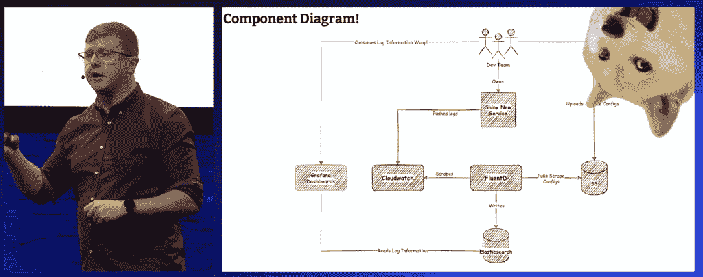
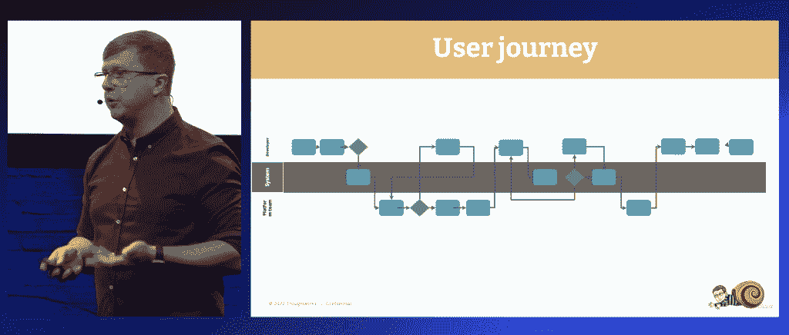
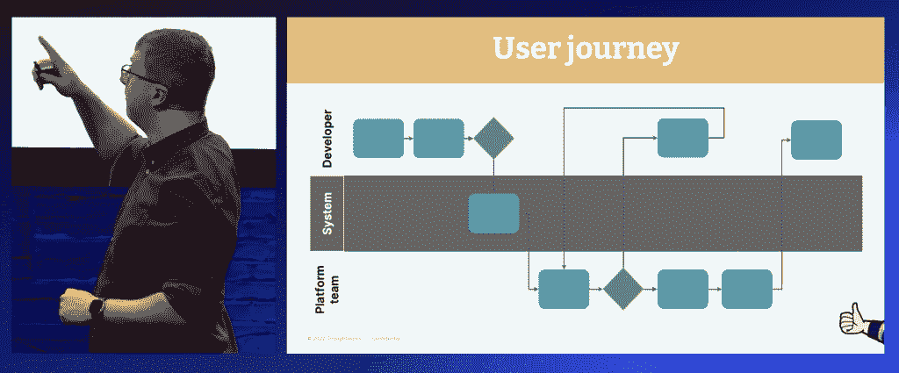

# 平台团队如何协调利益相关方

> 原文：<https://thenewstack.io/how-platform-teams-can-align-stakeholders/>

“我对基础设施一无所知。我根本不是技术人员，但我很幸运地为一些不同的客户做过基础设施和平台产品方面的工作。”

这就是咨询公司 [Thoughtworks](https://www.thoughtworks.com/en-us/about-us) 的商业分析师 Poppy Nicolle Rowse 所以我们为什么要关心她在说什么？因为 [平台工程](https://thenewstack.io/platform-engineering-wont-kill-the-devops-star/) 都是为了让技术产品的商业价值最大化。它是关于打破业务和技术之间的另一个筒仓。平台工程的核心是让工程师更接近业务驱动力，并让企业更好地理解技术工作的价值。

她当时的同事兼 Deliveroo 技术负责人 Chris Shepherd 带来了丰富的基础设施实践经验。

“当我们谈论基础设施时，我们指的是开发人员构建优秀产品所需的所有东西。因此，安全性、可伸缩性、性能，所有你需要的好东西，都要建立在这些好东西的基础上，”Rowse 说。

“但是你倾向于看到的是开发团队，基础设施团队，一次又一次地构建相同的东西，以达到相同的结果，”Shepherd 继续说道。

这就是平台和平台团队能够以更简单的方式提供这些构建模块以减少浪费的地方。但是你仍然需要人们去采纳它。而不是外部客户。你面临着更大的挑战:说服你的同事使用你的产品。并让企业继续资助它。让我们向 Rowse 和 Shepherd 学习如何与利益相关方合作并保持一致，以实现平台工程的成功。

## **确定开发人员的范围**

“当我们谈论用户时，我们指的是开发者。我们指的是消费你的产品的团队，”罗斯如是说。

这意味着你应该像对待付费客户一样对待你的内部客户。但我们知道大多数公司都不是。 [专注于平台工程的 Puppet 2023 年 DevOps 报告](https://www.puppet.com/resources/state-of-platform-engineering?utm_source=thenewstack&utm_medium=website&utm_content=inline-mention&utm_campaign=platform) 发现，组织一直对其平台团队的产品管理技能投资不足。大约三分之一的受访者的团队中甚至没有产品负责人，大约一半的受访者没有纯粹的产品经理，但有人在履行 DevOps 或工程职责的同时处理产品经理。

该报告发现，接受平台工程取决于采用具有紧密反馈循环的产品思维模式，以确保“他们正在构建解决用户面临的问题的系统。”木偶团队发现高效的内部产品团队需要同样的步骤:

*   用户研究
*   产品路线图
*   征求反馈
*   重复
*   发射
*   维持
*   营销

如果三分之一的受访者甚至没有经前综合症，你能想象有内部营销人员或用户研究员的人有多少吗？

“我们实际上需要与我们的消费者交谈，弄清楚对他们来说什么是最重要的，”Rowse 说，这是通过 [发现或范围界定阶段](https://fulcrum.rocks/blog/discovery-phase-software-development) 开始的，以弄清楚你的客户想要什么。她推荐敏捷实践事件风暴或模型风暴，这是一种行为驱动开发的实践，让所有利益相关者——包括那些开发者客户——在便笺上记下领域，然后将它们分组并组织成逻辑流程。它被称为风暴，因为它开始有点混乱，但随后为所有想法的考虑创造了一个安全的环境。它可以放在一面墙上，也可以放在一个视觉协作工具上，比如壁画、Miro 或 Jamboard。

“你要把所有不同的痛点。这为您提供了一个漂亮的视觉热图，“好的，我们可以看到存在许多棘手问题的区域。这是我们可能需要集中一些努力的地方，”Rowse 说，他建议不仅在平台工程之旅的开始阶段，而且在投入生产和日常运行时都要进行事件风暴会议。

## **为每个角色的棘手问题制定计划**

“我知道你们的用户是开发人员，我也知道你们中的很多人是开发人员，所以你们会想，‘好吧，我已经知道这里什么是最好的，什么是最合适的。’但实际上并不是所有的用户都是一样的，”她说。嵌入开发团队或借用开发人员来帮助构建平台是克服平台工程师假设开发团队想要什么的方法。

从一开始，Rowse 就提醒我们要让广泛的利益相关者参与进来:“与不同的团队交流。和你那些已经跑了五年的团队聊聊。与你的新团队交谈，他们正在从头开始生产全新的产品。与你的新员工交谈。与在那里工作多年的人交谈，获取广泛的信息。让他们都在同一个房间里。和他们一起做一次风暴。”否则，她继续说，“主持异步会议，比较地图，找出他们不同的地方和重复工作的地方”——这往往成为第一要务。

Rowse 然后提出了一个有趣的观点，仅仅因为它是一个共同的痛点，并不一定意味着平台团队必须为它创造一些新的东西。平台团队可能只是促进团队间分享知识的对话。

它也会因团队而异，这就是为什么她建议构建不同的客户角色。基础设施专家可能只是想继续构建他们自己的东西，而您的前端开发人员——突然不得不学习他们工作描述之外的云工程——对这个过程感到非常沮丧，不一定具备自己交付基础设施和自己开发东西的技能或能力

如果平台工程对你的组织来说是新的，Rowse 建议:“对范围和谁是你的客户要有明确的目标。可能你已经有了一大堆遗留的东西，而且，实际上，这些东西对于迁移到[云]上来说有点太混乱太糟糕了，所以实际上你要专注于构建能够真正加速你的新产品交付的基础设施产品。或者，实际上，您已经有了一些正在开发的产品，它们是您组织中的重中之重，所以您真的要缩小这些产品的范围，并确保您支持这些产品的交付。”

请记住，归根结底，这是关于增加工程的商业价值。

“不要以为人们只是因为你建造了这个奇特的东西，并在上面花费了大量的时间，就会来这里，”罗斯警告说。

这意味着不断地与开发人员客户互动，并向他们寻求反馈，尤其是在构建阶段。她建议说，要确保你正在打造的是他们想要的、可以使用的东西。你在吸引他们方面投入的越多，他们就越愿意使用它——因为它越符合他们的需求。

## **“建筑学”和对准**

由于平台团队是为几个或所有的开发团队服务的，所以重要的是要调整跨组织的价值观，然后记录和沟通基于这些价值观的任何架构决策。

Rowse 说要启动共享战略，如 [精益价值流图](https://www.atlassian.com/continuous-delivery/principles/value-stream-mapping) :

*   视力
*   可衡量、可实现的目标
*   赌注，支持目标的可交付成果

“我们实际上可能构建的东西实际上非常不同，这取决于您的愿景，”这意味着围绕愿景的一致性是关键，Rowse 说，阐明了您希望从基础架构平台中获得什么。“也许是成本。可能只是你所有不同开发者的痛点，让你的开发者开心。也许是因为你在团队中没有能力，所以你需要这些超级易用的集中式产品。”

她还提供了一个改编版的 Scaled Agile Framework 的 [加权最短工作优先(WSJF)](https://www.scaledagileframework.com/wsjf/) 作为一种消除私有化客观性的方法，寻求用最少的努力获得最大的成功。

“这一点非常重要，不仅是为了获得优先权，也是为了获得一致性，并确保所有非技术利益相关方真正理解您将在此提供的价值。因为你已经花了那么多时间去做，所以你相当有信心这将会实现你的愿景和战略，”罗斯如是说。

Shepherd 还强调，平台团队必须与最广泛的利益相关方进行沟通。图表、文件和 [沃德利地图](https://thenewstack.io/simon-wardley-on-mapping-our-way-to-a-common-language/) 都要早传阅，经常传阅。

他评论说，平台团队应该比产品团队活得长，“因为你正在构建其他团队将要运行的东西，对吗？”科技领域的员工变化非常快。他说，为了让一个组织采用平台思维，你需要接受“架构学”——这包括关于平台为什么以这种方式构建、路线图及其背后的技术愿景的文档。

“这是向前看的，但也是向后看的，以帮助未来的工程师理解已经做出的决定和你正在建造的东西，”谢泼德说，他指着 [C4 模型](https://c4model.com/) 作为他们可视化“建筑学”的最佳方式:

*   **上下文图**–在非常高的层次上描述
*   **容器图**–放大各种组件及其连接方式
*   **组件图**–如何在您的环境中使用和配置
*   **代码图**——实体关系和类，尤其是在构建自己的实体关系和类时，突出了一些怪癖

并不是每个图都与每个利益相关者相关，但是，随着传呼机的传递和角色的改变，这个架构对某些人来说总是有价值的。

这也受到架构决策记录的支持，在您的代码存储库中有:

*   决定
*   制作日期
*   为什么的背景
*   决定
*   后果(可能包括许可证或订阅)
*   谁在房间里

## **你建了，他们会来吗？**

对利益相关者来说，保持一致固然很好，但是你的开发者客户真的想要使用你崭新的、价值驱动的平台吗？它到底有多大用处？

“花在用户身上的时间真的很宝贵，”谢泼德说，“但是花在用户身上的时间去了解你的系统是浪费精力。”

他认为，从一开始，你就必须以自助服务体验为目标，尤其是在入职阶段。只要有可能，这应该通过“一劳永逸”来实现，理想情况下，用户只需与操作员互动一次，或者至少将操作步骤减少到最少。

当然，他说，吃你自己的山茱萸，经历每一个步骤，比如入职，尽可能使其顺利。

保持最低限度的可行产品心态，建立足够多的产品以获得反馈，然后进行迭代。因为，就像面向外部的 SaaS 产品一样，你在平台工程上的成功取决于拥有用户。

[https://www.youtube.com/embed/m6nlREbQ6LQ?feature=oembed](https://www.youtube.com/embed/m6nlREbQ6LQ?feature=oembed)

视频

<svg xmlns:xlink="http://www.w3.org/1999/xlink" viewBox="0 0 68 31" version="1.1"><title>Group</title> <desc>Created with Sketch.</desc></svg>