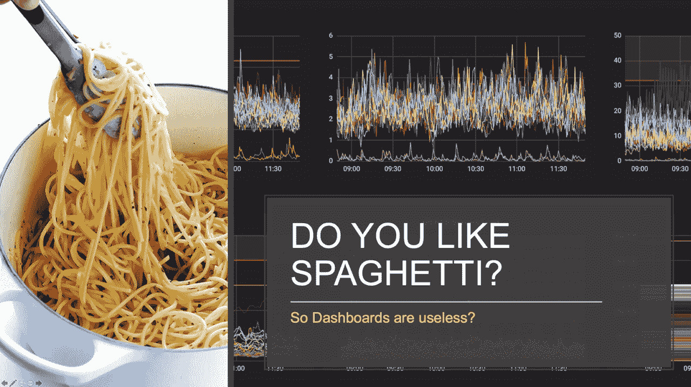
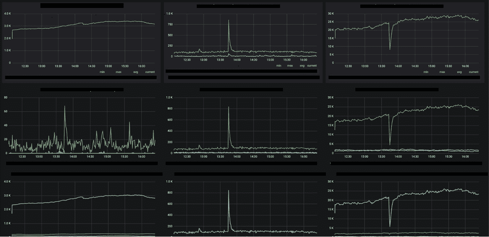

# Playtech 如何通过可观察性修复指标过度收集

> 原文：<https://thenewstack.io/how-playtech-fixed-metrics-over-collection-with-observability/>

[InfluxData](https://www.influxdata.com/) 赞助了这篇文章。

 [凯特琳·克劳馥

凯特琳是 InfluxData 的客户营销经理。](https://www.linkedin.com/in/caitlincroft/) 

据《T2》报道，每天有 2.5 万亿字节的数据产生。由于物联网(IoT)和传感器的增长，近年来数据量呈指数级增长。收集的大部分数据都是在过去两年中收集的。例如，[美国每分钟产生](https://www.iflscience.com/technology/how-much-data-does-the-world-generate-every-minute/)超过 250 万千兆字节的互联网数据，全球超过一半的在线流量来自[移动设备](https://www.domo.com/learn/data-never-sleeps-5?aid=ogsm072517_1&sf100871281=1)。

[Gartner](https://www.gartner.com/en/information-technology/glossary/dark-data) 将暗数据定义为“组织在日常业务活动中收集、处理和存储，但通常不会用于其他目的的数据。”虽然公司有时出于合规性原因不得不存储数据，但这些数据也是为了分析而保存的，这种情况从未发生过。[根据 IBM 负责分析的高级副总裁 Bob Picciano](https://siliconangle.com/2015/10/30/ibm-is-at-the-forefront-of-insight-economy-ibminsight/) 的说法，传感器产生的 90%的数据从未被使用，60%的数据在几毫秒内就失去了价值。[CIO.com](https://www.cio.com/article/2941015/solving-the-unstructured-data-challenge.html)指出，在组织中，非结构化数据约占黑暗数据的 90%,但企业意识到他们的非结构化数据有可能改善他们的运营。

公司热衷于收集更多关于他们的网站、产品、运营和客户的信息。但最符合公司利益的是，只收集他们将使用的数据，并确保他们有效地使用这些数据。

## Playtech 使用 InfluxDB 来提高可观测性

Playtech 是全球最大的在线游戏软件供应商，在伦敦证券交易所上市。自 1999 年以来，它一直致力于通过不断的创新开发来创造行业最佳的产品和内容。Playtech 成立于爱沙尼亚的塔尔图，拥有 5000 名员工，分布在 17 个国家。多年来，它推出了新产品，收购了组织，进入了新的市场，并建立了合作伙伴关系，以保持其作为在线游戏行业领导者的地位。

InfluxDB 是 Playtech 运营的重要组成部分，因为它让他们的团队能够观察到所有系统。Playtech 拥有 50 多个多品牌网站，分布在世界各地。Playtech 使用 InfluxDB 进行生产系统级监控和组织级监控。除了监控典型的后端系统，如网络和 CPU 使用情况，它还跟踪客户体验。通过映射其所有产品、客户、网站和品牌，他们能够将某些问题与开发它的工程团队联系起来。

## 从数据面条到数据清晰

在 2019 年伦敦时尚日[，【Playtech 的技术架构师和](https://influxdays.com/past-events-london-2019/)[时尚达人](https://www.influxdata.com/blog/community-showcase/influxaces/alex-tavgen/)Aleksandr Tavgen 指出，开始时尝试解决一个小的关键问题比尝试一次解决所有问题更容易。他说从尝试解决一个关键部分开始，通过增加新的测量值。通过做增量修改，大家会更容易理解数据。“如果你有 90 亿个指标，没人会看它们，”Tavgen 说。

虽然收集正确的数据很重要，但数据呈现的方式同样重要。正如 Tavgen 指出的那样，如果仪表板显示了公司的所有指标，就很难理解仪表板——它看起来像“数据意大利面条”数据过饱和的令人困惑的仪表盘实际上会让生活变得更糟。

正如在上面的仪表板中看到的，一个图表上显示的指标数量没有多大用处。当组织知道如何有效地使用仪表板和可视化时，它们是非常有用的。塔夫根指出，人类大脑很容易识别模式。“对我们来说，”塔夫根说，“快速浏览仪表板比进行复杂的查询更容易。”

查询需要很长时间，仪表板应该能够为任何人提供数据的快速快照。在他的 2019 年伦敦时尚日(InfluxDays London 2019)演讲中，Tavgen 指出，并不需要所有的指标或日志。有时，可以用一个数据子集来解决公司的问题，而不是处理数百万个指标和事件。

Playtech 发现处理数百万个指标非常困难，原因有很多:任何团队都很难一次理解数百万个指标，相关的运营成本太高。因此，其团队已经确定了哪些指标对业务最为关键。Playtech 对大量的事件不感兴趣；如果一切都在他们的“正常行为”参数下工作，他们不想处理一切。此外，并非所有异常读数都值得关注。可能会有假阴性和假阳性，部分原因是异常值。如果存在合理的问题，Playtech 希望能够深入研究指标和事件数据。

Playtech 在世界各地拥有超过 76 个数据中心，拥有 InfluxDB 的本地实例:

*   代理每分钟都在收集重要指标。
*   数据被收集并存储在 InfluxDB 中，作为真相的中央单一版本。
*   指标有助于全球运营的 KPI。
*   他们使用机器学习来帮助预测问题何时出现。
*   由于操作分布在全球各地，它们需要应对不可预测的网络延迟。

正如下面的截图所示，拥有多个简单的仪表板比一个装满“数据面条”的仪表板更有用、更有效

Playtech 并不总是需要关联或获取所有的数据。Tavgen 表示，他们只需要能够按需访问他们的活动数据。例如，如果他们在组织级别上部署变更，他们可以在事件发生时查询数据。对于 Playtech 来说，如果意味着更好的性能，损失几个数据点也没关系。虽然保留所有数据点以防万一很有吸引力，但随着时间的推移，指标将增长得如此之快，任何人都很难理解所有的指标。

Tavgen 还指出，其他公司也面临这些问题。例如，优步已经在一千多个数据库中收集了大约 90 亿个指标。Tavgen 说，“如果你有 90 亿个度量标准，没人会去看。”如果 Playtech 在仪表板上显示所有的指标，它看起来就像“数据意大利面条”大量的指标会导致仪表板不可用。

## 使用 InfluxDB 作为中央指标存储

Playtech 选择 InfluxData 的时间序列数据库平台有多种原因。InfluxDB 为该公司的指标、事件和跟踪提供了[集中存储](https://www.influxdata.com/solutions/metrics-as-a-service-maas/)。该公司的工程师能够深入研究历史数据，为未来做更好的准备。他们依靠卡夫卡来确保事件的顺序不变。他们利用 T2 流量来整合不同来源的数据。他们能够检验他们的理论。

Playtech 是利用对组织最重要的数据的一个很好的例子。与其处理过多的数据，导致仪表板看起来像“数据意大利面”，不如确保其仪表板显示重要的数据。

*要了解 Playtech 如何使用 InfluxData，请查看[完整报道](https://www.influxdata.com/customer/playtech/)。如果您有兴趣分享您的 InfluxDB 故事，请点击[此处](https://www.influxdata.com/get-hoodie/)。*

通过 Pixabay 的特征图像。

*目前新栈不允许直接在本网站评论。我们邀请所有希望讨论某个故事的读者通过推特或脸书与我们联系。我们也欢迎您通过电子邮件发送新闻提示和反馈:[feedback @ thenewstack . io](mailto:feedback@thenewstack.io)。*

<svg xmlns:xlink="http://www.w3.org/1999/xlink" viewBox="0 0 68 31" version="1.1"><title>Group</title> <desc>Created with Sketch.</desc></svg>