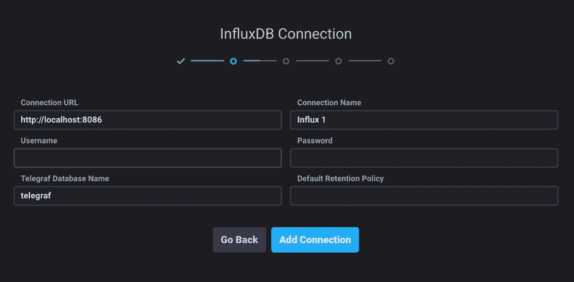

# InfluxData 的 Chronograf 中的预定义仪表板如何简化指标

> 原文：<https://thenewstack.io/how-predefined-dashboards-in-influxdatas-chronograf-make-metrics-simple/>

[InfluxData](https://www.influxdata.com/) 赞助了这篇文章。

我经常谈论度量标准。通常，我一边看 YouTube 上猫*而不是*跳跃的视频，一边嘀咕监控的重要性。现在，我们将讨论一种可以轻松访问这些指标的方法。就像我是一个有时希望看到猫失败的动物爱好者，我是一个有时需要可视化数据的命令行爱好者。

## 问题是

可视化数据是一个特别困难的问题，但是当我们使用可视化工具时，我们不希望必须考虑这个问题。我们希望我们的数据能够尽可能快捷方便地获得。鉴于此，我特别兴奋地看到了 Chronograf 的最新版本(1.7.3)，其中包括改进的 onboarding，这正是我所寻找的。

## 体验

 [凯蒂·法默

凯蒂和她的丈夫以及两条狗住在加州的奥克兰(其中至少有一条会和她聊一些有趣的科技话题)。她喜欢试验代码，破坏东西，并试图修复它。她在科罗拉多州丹佛市的图灵软件与设计学院学习编码，这给了她一个绝好的机会，在她知道如何修复之前就把东西弄坏了。](https://www.influxdata.com/) 

我正在使用 MySQL 作为我的几个 Rails 应用程序的数据库，并且我希望当不可避免地出现问题时有一个仪表板来访问(毕竟，这些应用程序是由 past Katy 开发的，她不可信)。关于我的数据库，我关心一些特定的指标，当事情开始出错时，我不一定想写一个查询。

## 使用 Telegraf 收集指标

关于数据库的指标存在于内部性能数据库中，对于 MySQL 来说是 *performance_schema* 数据库(以及更易于阅读的 *sys* 数据库)。现在，我们可以查询这个数据库来找到我们要找的东西，但是我们可以通过使用 [Telegraf MySQL 插件](https://github.com/influxdata/telegraf/tree/master/plugins/inputs/mysql)将这些指标直接发送到 InfluxDB 来加快这个过程。如果您认为将指标从一个数据库发送到另一个数据库听起来很愚蠢，那么您是对的——但如果我们的计划是长期保存数据或从中构建有用的可视化，那就不是这样了。请记住，我们想要的是一个仪表板，以便在事情出现危险时查看。

## 构建仪表板

我们已经完成了最难的部分，这相当简单:Telegraf 正在将我们的 MySQL 指标发送到 InfluxDB。现在让我们做更简单的部分:在 [Chronograf](https://www.influxdata.com/time-series-platform/chronograf/) 中构建仪表板。

安装 Chronograf (1.7.3 或更高版本)后，我们受到热烈欢迎，这是 1.7.x 系列的新功能。

通过这些入门步骤，我们可以配置我们的 InfluxDB 设置，或者暂时将它们保留为默认设置。

当我们到达“仪表板”部分时，我们可以看到为我们的源提供了建议的仪表板；在这种情况下，MySQL 和 System(收集本地 CPU 使用情况、内存等信息。)的建议。除了通过 Telegraf 发送这些指标之外，我们不需要做任何事情。所以，让我们把两者都设置好！谁知道我们(好吧，*我*可能会打破什么？

onboarding 中剩下的工作就是设置 Kapacitor，但是我们可以暂时保留默认设置，然后继续。

我们已经设置好了超时空格拉夫。我们点击了大概五次，所以希望我们不会累到不能再点击几次。我们所要做的就是访问 Dashboards 选项卡，查看我们预定义的控制面板的运行情况。

我们在设置过程中选择的两个仪表板都列出来了(MySQL 和 System ),但是让我们确保它们实际上可以工作。

看看所有这些漂亮的指标。我们可以看到 MySQL 连接的数量、每秒的查询次数、每秒发送和接收的字节数等等。我所要做的就是利用我已经从 Telegraf 收集的指标。

让我们检查一下系统仪表板。

像往常一样，我的本地机器需要重新启动，但在其他方面工作得很好。

## 摘要

在 Chronograf 中设置预定义的仪表盘比以往任何时候都更容易，这是我一直在等待的。虽然这个功能以前就有，但是有点笨重，而且不方便。现在，我可以做我最擅长的事情了:点击默认设置。还有针对 Kubernetes、Redis、Apache 等指标的预定义仪表板，因此我们可以尽可能轻松地监控对我们至关重要的服务。用 InfluxDB 设置最新版本的 Chronograf，告诉我它是如何为你工作的——我将在慢动作中观看狗错过食物的片段。

说真的，谷歌一下。

[InfluxData](https://www.influxdata.com/) 是新堆栈的赞助商。

凯蒂·法默的原创作品。

<svg xmlns:xlink="http://www.w3.org/1999/xlink" viewBox="0 0 68 31" version="1.1"><title>Group</title> <desc>Created with Sketch.</desc></svg>