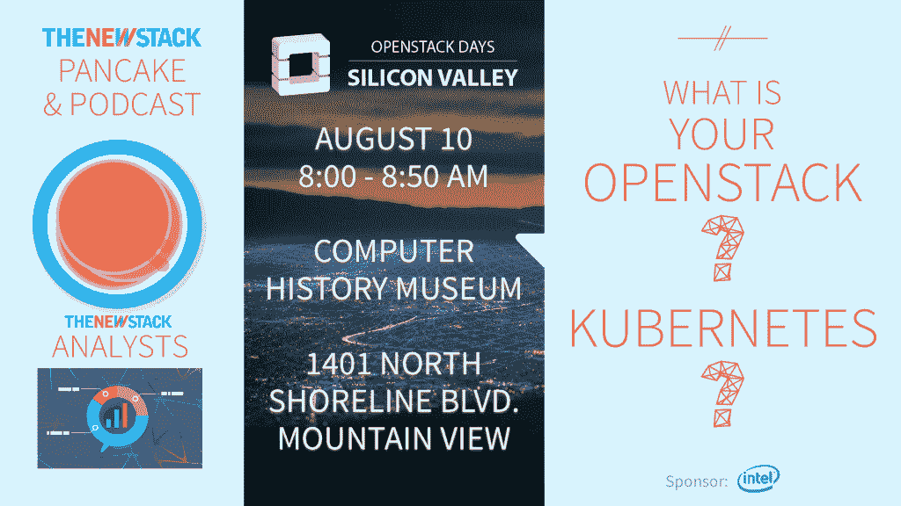

# 项目 Calico 如何超越软件定义的网络的限制

> 原文：<https://thenewstack.io/how-project-calico-transcends-the-limits-of-software-defined-networking/>

Project Calico 是一个用于容器的开源第三层虚拟网络系统，可以部署在各种当今的平台和设置上，包括混合环境。虽然集中控制可以快速导致底层软件定义网络(SDN)达到负载能力，但 Project Calico 取消了中央控制器，有助于缓解开发人员的这一痛点。

在这一集的[The New Stack Makers](https://thenewstack.io/podcasts/)embedded below 中，我们探索了[项目 Calico](https://www.projectcalico.org/) 希望如何简化和发展软件定义的网络，以及 Calico 与[法兰绒](https://coreos.com/flannel/docs/latest/)的合作，以构建 [Canal](https://thenewstack.io/project-calico-flannel-join-forces-policy-secured-networking/) 基于策略的安全网络软件。在 Gluecon 2016 上，New Stack 创始人亚历克斯·威廉姆斯(Alex Williams)与 Tigera 联合创始人亚历克斯·波利特(Alex Pollitt)坐在一起，听取他对这些问题以及更多问题的看法。

[与 Tigera 联合创始人 Alex Pollitt 合作的 Calico 项目幕后](https://thenewstack.simplecast.com/episodes/behind-the-scenes-of-project-calico-with-tigera-co-founder-alex-pollitt)

Pollitt 首先讨论了新开源项目 Calico 与其他同类 SDN 工具的不同之处。

“有了 Project Calico，就没有集中的控制器了。它使用 etcd 作为高级键值存储。然后，我们有一个运行在每台主机上的代理，它有一个算法，以分布式方式准确计算主机必须做什么。这有利于水平规模，随着向容器的转移，这变得很重要，”Pollitt 说。

Pollitt 继续解释说，传统的虚拟机可能运行几天、几个月甚至几年，主机上可能有十几个容器。随着越来越多的组织转向基于云和以微服务为中心的方法，Pollitt 指出容器的[性质](https://thenewstack.io/tns-research-multiple-clouds-multiple-orchestrators-what-a-mess-part-2/)改变了开发人员处理大规模工作的方式。

“在 Calico 模型中，渲染是完全分布式的。Pollitt 解释说:“当您向 Calico 网络添加多一台主机时，您就增加了更多的计算能力。正是这种权力的增加，同时消除了发展过程中的障碍，项目 Calico 希望在未来的日子里将它区分开来。

特征图片由 Poirotte 通过[维基共享](https://en.wikipedia.org/wiki/Calico_cat#/media/File:Chaton_tricolore.jpg)、 [CC-BY-SA 4.0](https://creativecommons.org/licenses/by-sa/4.0/) 发布。

<svg xmlns:xlink="http://www.w3.org/1999/xlink" viewBox="0 0 68 31" version="1.1"><title>Group</title> <desc>Created with Sketch.</desc></svg>