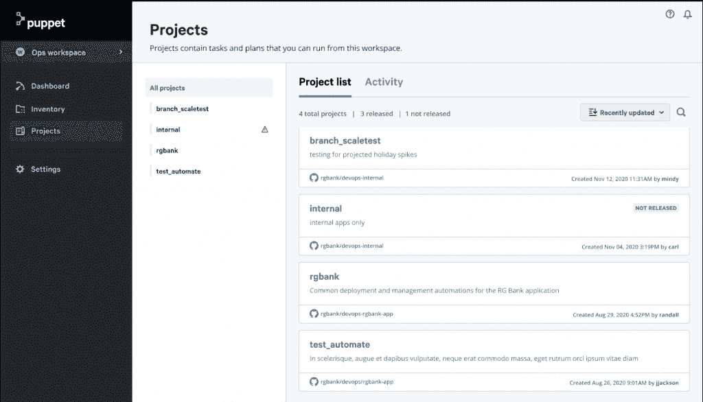
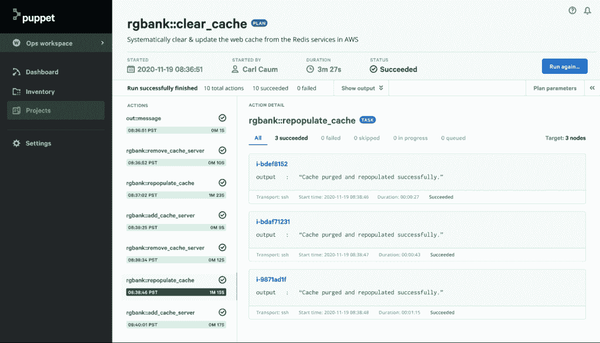

# Puppet Connect 如何帮助 DevOps 转向自助服务模式

> 原文：<https://thenewstack.io/how-puppet-connect-helps-devops-shift-to-self-service-model/>

[傀儡](https://puppet.com/)赞助本帖。

Puppet 通过即将发布的 [Puppet Connect](https://puppet.com/products/puppet-connect/) 进一步扩展了其产品的自动化功能。该平台旨在支持开发运维团队在多云和内部环境中使用自助式部署和运营模式。

Puppet Connect 的生产版本将于 2021 年初推出，它将为开发运维团队提供一个以无代理方式进行应用生产和管理的 API。不同的 DevOps 团队成员可以依靠该平台进行项目协作，通常是远程协作，同时保持合规性。该平台旨在让用户在开始和共享项目之前，避免花费大量时间配置基础设施和运营管理，并克服其他潜在的障碍。

Puppet Connect 在 [Puppetize Digital 2020](https://puppet.com/puppetize/) 周推出，因此是“Puppet 的第一款产品，允许团队拥有自己的空间来管理他们自己的自动化和库存报告库，”Puppet 的首席产品经理 Carl Caum 说。

Caum 说，通过 Puppet Connect，团队可以与其他团队工作区共享他们团队工作区的自动化，而其他用户可以在自己的库存上运行与他们共享的自动化。他说，该平台部分通过允许用户建立针对其基础设施资源或服务的任何部分的编排工作流来实现这一点，无论该资源或服务是通过 WinRM、SSH 还是远程 API 进行管理。

“跨团队边界共享自动化的简单性是促进自助服务自动化的关键，我们当前的产品都没有着手解决这一问题，”Caum 说。

例如，对于开发人员来说，Puppet Connect 可以帮助减轻他们在开始新项目之前必须完成的大量前期工作。开发人员可以使用该平台预先编写的自动化功能，并通过服务菜单访问其他工具和流程，根据需要启动项目。

[企业管理协会(EMA)](https://www.enterprisemanagement.com/) 的分析师 [Torsten Volk](https://www.linkedin.com/in/torstenvolk) 告诉新堆栈:“Puppet Connect 旨在使独立于云的基础设施代码成为 DevOps 管道的一部分，以使软件开发人员能够编写一次相同的代码。”。“它允许开发人员和 It 运营工程师在不同的云上部署和操作这些代码，而无需更改代码，也不会破坏合规性控制。”

Volk 说，仅仅是“在项目之间重用多种代码功能”的能力就意味着“非常成功并且是商业成功不可或缺的”DevOps 团队和“努力完成项目”的团队之间的差异。

Puppet Connect 提供的其他工作区界面功能包括:

*   Puppet Connect 中的工作区是 IT 组织中每个团队拥有自己的清单、报告、集成和自动化来执行日常工作的区域。
*   工作区消除了 IT 组织管理复杂的 RBAC 规则的需要，这些规则将每个人限制在他们完成工作所需的内容。
*   有了工作区，每个团队都获得了精心策划的体验，而没有管理上的复杂性。

Caum 指出，由于 Puppet Connect 基于 Puppet 的开源 [Bolt](https://puppet.com/open-source/bolt/) 引擎，这是一种允许用户跨分布式基础设施自动执行现有命令和脚本的工具，用户可以访问 [Puppet Forge](https://forge.puppet.com/) 上预先构建的计划。例如，Puppet Forge 已经提供了超过 6000 个具有 [Bolt 计划](https://puppet.com/docs/bolt/latest/writing_plans.html)的模块，因此用户可以立即使用 Puppet Connect 运行这些模块，而无需安装代理。

Caum 说，“Puppet Connect 由 Bolt 提供支持”，因为 Bolt 可以通过“多种传输”控制资源，包括 SSH、WinRM 和远程 HTTP-link API。“这使 Puppet Connect 客户能够将基础设施视为一组资源、服务和动作，可以作为更大的编排工作流的一部分进行控制，”Caum 说。

根据 EMA 的说法，事件驱动编程降低了开发人员和 DevOps 团队以协作方式尝试新事物的门槛。例如，EMA 研究表明，DevOps 团队将大约 20%的时间花在研究和解决相同的公共云问题上，他们已经为基于一组非常相似的公共云基础架构和平台组件的先前项目解决了这些问题，Volk 说。

“通过 Puppet Connect，DevOps 团队可以依靠其能力，通过发布和共享内容供组织内的其他人自助使用，来整理和扩展他们的自动化专业知识，”Volk 说。

事实上，Puppet 委托的[“2020 年 DevOps 状态报告”](https://puppet.com/resources/report/2020-state-of-devops-report/)显示了自助服务能力在 DevOps 发展的更高阶段是如何被看到的，Caum 说。Caum 说，Puppet Connect 作为一种新的自助服务解决方案，“让组织能够以标准和可扩展的方式实现更多自动化”。

由[伊莱恩·卡萨普](https://unsplash.com/@ecasap?utm_source=unsplash&utm_medium=referral&utm_content=creditCopyText)在 [Unsplash](https://unsplash.com/photos/qgHGDbbSNm8?utm_source=unsplash&utm_medium=referral&utm_content=creditShareLink) 上拍摄的特写图片。

<svg xmlns:xlink="http://www.w3.org/1999/xlink" viewBox="0 0 68 31" version="1.1"><title>Group</title> <desc>Created with Sketch.</desc></svg>