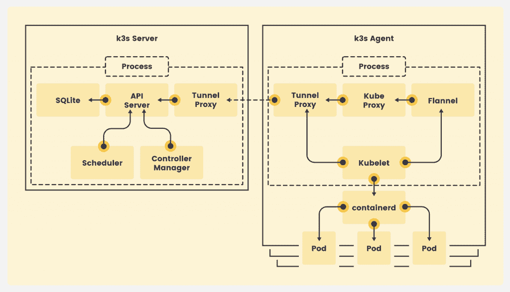
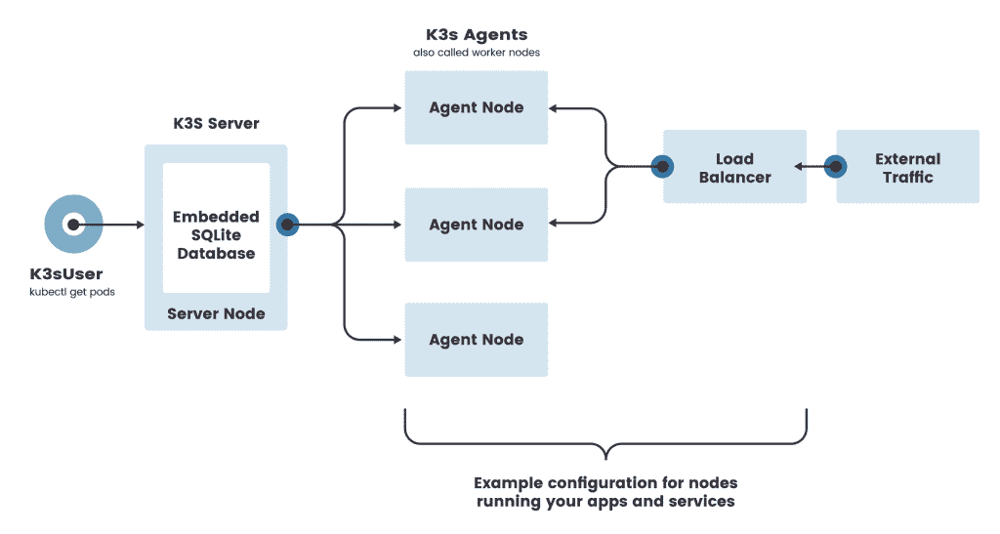
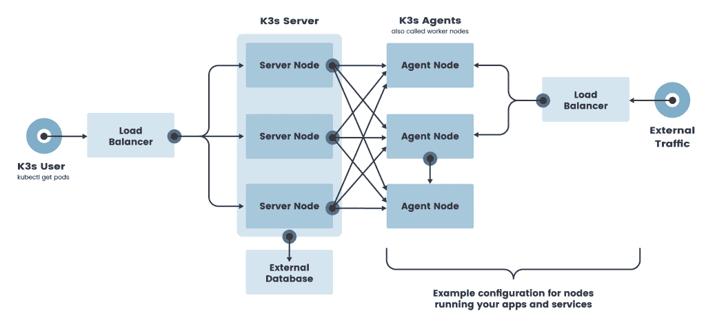

# Rancher Labs 的 K3s 如何使在边缘运行 Kubernetes 变得容易

> 原文：<https://thenewstack.io/how-rancher-labs-k3s-makes-it-easy-to-run-kubernetes-at-the-edge/>

Kubernetes 无处不在——在开发人员的笔记本电脑、Raspberry Pi、云、数据中心、混合云甚至多云中。它已经成为现代基础设施的基础，对底层计算、存储和网络服务进行抽象化。Kubernetes 是一个公平的竞争环境，它隐藏了各种基础设施环境之间的差异，从而将多云变成了现实。

Kubernetes 还成为编排的通用控制平面，不仅仅是容器，还包括各种资源，包括虚拟机、数据库，甚至 SAP Hana 实例。

尽管发展迅速，但 Kubernetes 给开发者和运营商带来了许多挑战。关键挑战之一是在边缘运行 Kubernetes。与云或数据中心相比，优势非常不同。它在高度受限的环境中远程运行。与运行在数据中心的同类设备相比，边缘设备只占用一小部分计算、存储和网络资源。边缘设备与云的连接时断时续，它们大多在离线环境中运行。这些因素使得很难在边缘部署和管理 Kubernetes 集群。

[牧场主实验室](https://rancher.com/)，即将成为[SUSE 的一部分](https://thenewstack.io/suse-will-gain-a-foothold-in-the-kubernetes-ecosystem-with-rancher-purchase/)，创造了 [K3s](https://k3s.io) ，这是一种为边缘高度优化的 Kubernetes 口味。尽管 K3s 是 Kubernetes 的一个简化的微型版本，但它并没有损害 API 的一致性和功能性。从 kubectl 到 Helm 再到 Kustomize，几乎所有云原生生态系统的工具都与 K3s 无缝协作。事实上，K3s 是一个 [CNCF 认证的](https://www.cncf.io/certification/software-conformance/)，符合 Kubernetes 的发行版，随时可以部署在生产环境中。几乎所有运行完整 Kubernetes 集群的工作负载都可以在 K3s 集群上运行。

Kubernetes，10 个字母的单词，通常被社区称为 K8s。由于 K3s 正好是 Kubernetes 内存占用大小的一半，Rancher Labs 为它的新分布找到了一个五个字母的单词“K3s”。

## 近距离观察 K3s 架构

K3s 的美在于简洁。作为单个二进制文件(大约 100MB)打包和部署，您只需几秒钟就可以运行一个成熟的 Kubernetes 集群。安装体验就像在集群的每个节点上运行脚本一样简单。

K3s 二进制文件是一个自给自足的封装实体，它运行 Kubernetes 集群的几乎所有组件，包括 API 服务器、调度程序和控制器。默认情况下，K3s 的每个安装都包括足以运行 Kubernetes 工作负载的控制平面、kubelet 和 containerd 运行时。当然，可以添加只运行 kubelet 代理和 containerd 运行时的专用工作节点来调度和管理 pod 生命周期。

与传统的 Kubernetes 集群相比，K3s 中的主节点和工作节点之间没有明显的区别。可以在任何节点上调度和管理 pod，而不管它们扮演什么角色。因此，主节点和工作节点的命名不适用于 k3s 集群。

在 k3s 集群中，运行控制平面组件和 kubelet 的节点称为服务器，而仅运行 kubelet 的节点称为代理。服务器和代理都有容器运行时和 kubeproxy 等价物，后者管理集群中的隧道和网络流量。

在典型的 k3s 环境中，您运行一个服务器和多个代理。在安装过程中，如果传递服务器的 URL，节点就成为代理；否则，您最终会运行另一个具有自己的控制平面的独立 k3s 集群。

那么，牧场主实验室是如何设法降低 k3s 的足迹的呢？首先，他们去掉了 Kubernetes 的许多可选组件，这些组件对于运行一个最小集群来说并不重要。然后，它添加了一些基本元素，包括 containerd、法兰绒、CoreDNS、CNI、Traefik 入口控制器、本地存储供应器、嵌入式服务负载平衡器和集成网络策略控制器。所有这些元素都打包成一个二进制文件，并在同一个进程中运行。除此之外，发行版还支持现成的舵图。

上游的 Kubernetes 发行版充斥着大量很容易被排除的代码。例如，存储卷插件和云提供商 API 极大地增加了发行版的规模。K3s 方便地省略了所有这些以最小化二进制文件的大小。

另一个关键区别是管理集群状态的方式。Kubernetes 依靠分布式键值数据库 [etcd](http://www.etcd.io) 来存储集群的整个状态。K3s 用一个叫做 SQLite 的轻量级数据库取代了 etcd，SQLite 是一个成熟的嵌入式场景数据库。许多移动应用程序捆绑 SQLite 来存储状态。

通过在至少三个节点上运行 etcd，Kubernetes 控制平面变得高度可用。另一方面，SQLite 不是成为链条中最薄弱环节的分布式数据库。为了实现控制平面的高可用性，K3s 服务器可以指向外部数据库端点。支持的数据库包括 etcd、MySQL 和 PostgreSQL。通过有效地将状态委托给外部数据库，K3s 支持多个控制平面实例，使集群高度可用。

Rancher Labs 正在试验一个名为 [DQLite](https://dqlite.io/) 的 SQLite 分布式版本，它可能最终成为 K3s 的默认数据存储。

K3s 最好的一点是它的“包含电池但可更换”的方法。例如，我们可以用 Docker CE 运行时替换 containerd 运行时，用 Calico 替换法兰绒，用 Longhorn 替换本地存储，等等。

关于 K3s 架构的详细讨论，强烈推荐大家观看 K3s 的架构师 [Darren Shepherd](https://www.linkedin.com/in/darrensshepherd/) 的这个 [KubeCon 2019 会议](https://www.youtube.com/watch?v=-HchRyqNtkU)。

[https://www.youtube.com/embed/-HchRyqNtkU?feature=oembed](https://www.youtube.com/embed/-HchRyqNtkU?feature=oembed)

视频

## K3s 部署方案和拓扑

K3s 发行版支持多种架构，包括 AMD64、ARM64 和 ARMv7。凭借一致的安装体验，K3s 可以在 Raspberry Pi Zero、NVIDIA Jetson Nano、英特尔 NUC 或亚马逊 EC2 大型实例上运行。

在需要单节点 Kubernetes 集群来维护部署清单的相同工作流的环境中，请在服务器或边缘设备中安装 K3s。这为您提供了使用现有 CI/CD 管道和容器映像以及舵图或 YAML 文件的灵活性。

如果您需要运行在 AMD64 或 ARM64 架构上的高可用性边缘集群，请安装一个 3 节点 etcd 集群，然后安装 3 个 K3s 服务器和一个或多个代理。这为您提供了一个生产级环境，并为控制平面提供了高可用性。

在云中运行 K3s 集群时，将服务器指向一个托管数据库，如 [Amazon RDS](https://aws.amazon.com/rds/) 或 [Google Cloud SQL](https://cloud.google.com/sql/) 来运行一个具有多个代理的高可用性控制平面。每台 K3s 服务器都可以在不同的可用性区域中运行，以获得最长的正常运行时间。

如果您在具有可靠、始终在线连接的边缘计算环境中运行 K3s，请在云中运行服务器，在边缘运行代理。这为您提供了在云中运行高度可用和可管理的控制平面，同时在远程环境中运行代理的灵活性。

最后，您可以在 5G 边缘位置部署 K3s HA 控制平面，如 [AWS 波长](https://aws.amazon.com/wavelength)和 Azure Edge Zones 环境，并在设备中运行代理。这种拓扑反映了智能建筑、智能工厂和智能医疗的场景。

在 K3s 系列的下一部分中，我将向您介绍在边缘环境中部署 HA 集群的步骤。敬请关注。

贾纳基拉姆·MSV 的网络研讨会系列“机器智能和现代基础设施(MI2)”提供了涵盖前沿技术的信息丰富、见解深刻的会议。在 [http://mi2.live](http://mi2.live) 上注册参加即将举行的 MI2 网络研讨会。

<svg xmlns:xlink="http://www.w3.org/1999/xlink" viewBox="0 0 68 31" version="1.1"><title>Group</title> <desc>Created with Sketch.</desc></svg>