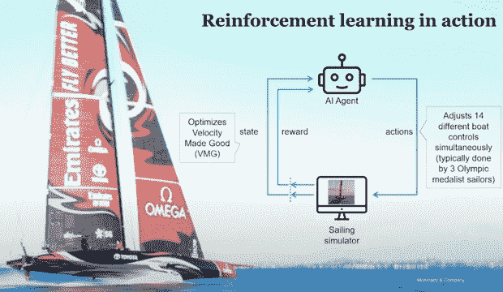
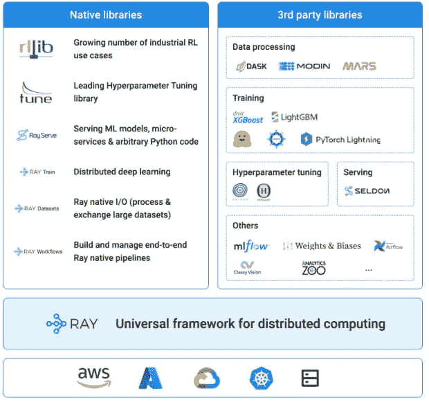
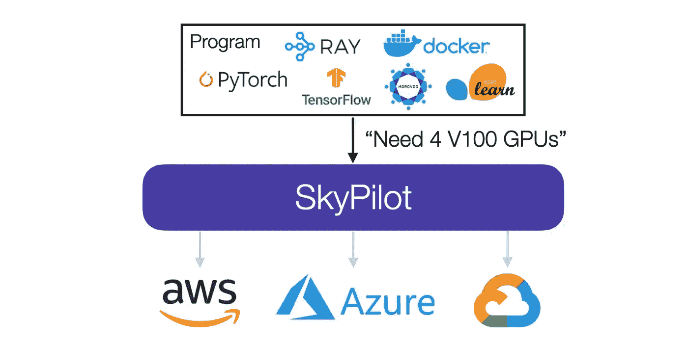

# 分布式人工智能框架 Ray 如何帮助 ChatGPT

> 原文：<https://thenewstack.io/how-ray-a-distributed-ai-framework-helps-power-chatgpt/>

据 Databricks 和 Anyscale 的联合创始人、柏克莱大学计算机科学高级教授扬·斯托伊察所说，2023 年将是“分布式人工智能框架”之年不用说，他已经参与了创建这样一个工具，形式是 Anyscale 的开源 [Ray platform](https://www.anyscale.com/ray-open-source) 。在其他用途中，Ray 有助于为 OpenAI 开创性的 ChatGPT 提供动力。

我采访了斯托伊察，以找出雷到底在做什么，以及更一般地说，在这个生成式人工智能的新时代，需要什么来扩展人工智能软件。我们还讨论了“[天空计算](https://thenewstack.io/sky-computing-the-next-era-after-cloud-computing/)的最新成果，这是斯托伊察和他的团队在 2021 年提出的一个术语，他们在一篇论文中提出了一种基于互操作性和分布式计算的云计算新形式。

## 雷是什么？

根据斯托伊察的说法，Ray 是一个“分布式计算生态系统即服务”，在过去几年中，它一直专注于“支持机器学习工作负载”他说，它在 2016 年作为伯克利的一个班级项目开始开发，目标是实现“分布式训练”(意为机器学习的数据训练)。伯克利也是 Apache Spark，一个数据处理引擎的制造地。但斯托伊察表示，他们很快发现 Spark 并不是深度学习工作负载的最佳选择。

“Spark 非常适合数据处理和经典机器学习，”他解释道。“但当时[2016][……]深度学习风起云涌，深度学习需要 GPU。无需深入 Spark 的细节，因为它是基于 Java 的，所以不太支持 GPU。”

随着产品开发的继续，伯克利团队——包括斯托伊察的 Anyscale 联合创始人，以及他的研究生 Robert Nishihara 和 Philipp Moritz——变得更加雄心勃勃。在分布式训练之后，他们增加了对强化学习的支持。

“可以说，强化学习是一种非常复杂的动物，”斯托伊察说，“因为它需要你做很多事情——它需要你训练一个代理，与模拟器或环境进行交互，获得环境的状态，然后基于此做出决定。[……]而且许多强化学习应用程序也使用模拟器，比如游戏或制造模拟器。所以你必须进行模拟，所有这些都要按比例进行。”

Ray 的第一个使用案例是帮助新西兰队卫冕美洲杯，这是世界上最负盛名的帆船比赛奖项。与一级方程式赛车类似，美洲杯冠军依靠最先进的技术取胜。为了在 2022 年获胜，新西兰团队使用 Anyscale 的 [RLlib](https://www.ray.io/rllib) ，这是一个基于 Ray 的强化学习 Python 框架，[全天候运行帆船模拟](https://www.anyscale.com/blog/sailing-to-victory-with-reinforcement-learning)

通过 Anyscale 的图形

在其网站上，Anyscale 将 Ray 定位为“扩展 Python 的最简单途径”。根据斯托伊察的说法，Ray“就像是 Python 的扩展”,而且和 Python 一样，有一组针对不同用例的 Ray 库。笨拙地命名为 RLlib 是为了强化学习，但也有类似的库用于训练、服务、数据预处理等。

## 为什么 OpenAI 使用 Ray

在其案例研究论文中，Anyscale 将优步、Shopify 和 Instacart 等公司列为 Ray 的用户。当然，目前最有趣的用例是 OpenAI 如何将其用于 ChatGPT。我向斯托伊察询问了更多细节。

“我希望我知道得更多……open ai 非常神秘，”他笑着说。然而，他提到了*为什么* OpenAI 依赖于 Ray 的分布式扩展技术的原因。他说，如果你为训练最先进的机器学习模型绘制计算需求图，该图“每 18 个月增长至少 10 倍。”他补充说，这一增长率自 2010 年以来一直存在。

如果这个公式听起来很熟悉，你会记得[摩尔定律](https://en.wikipedia.org/wiki/Moore%27s_law)指出，密集集成电路(IC)中的晶体管数量大约每两年翻一番。斯托伊察说，人工智能的培训需求每 18 个月增加 10 倍，这意味着个人电脑本身的功能不足以满足培训人工智能模型的需求。

“摩尔定律正在放缓，”斯托伊察说，“所以你会看到这些机器学习工作负载的需求与单个节点或单个处理器的能力之间的差距越来越大。很明显，最终支持这些工作负载的唯一方法是分配这些工作负载。”

他认为加速器，如 GPU，将有助于缩小差距，“但他们不会解决问题。”同样，他说这个问题不仅仅是关于计算能力，而是计算机内存处理 ML 负载的能力。

## 管理数据和使用 Kubernetes

作为帮助处理这些 ML 需求的一种方式，Ray 帮助编排接收和处理数据的过程。

“这是一个非常通用、易于使用、Python 原生的分布式计算平台，”斯托伊察说，并补充说，它是“进行训练、数据摄取、再处理——所有这些事情的基础。”

图片通过 Anyscale，通过 Google[点击此处](https://cdn.thenewstack.io/media/2023/01/b5802015-3_kubeflow_and_ra.max-1000x1000-1.png)查看完整视图。

这种管理复杂计算过程的能力听起来有点像 Kubernetes 为云计算基础设施所做的事情(即，大规模地协调它以部署应用程序)。

“雷，这是一个水平以上，”斯托伊察说，在回应，指的是计算堆栈。“因为雷是给程序员用的。[……]它还对资源等进行一些管理，但它是在 Kubernetes 之上的。”

他指出，谷歌最近在 GCP 上建立了一个[机器学习平台，结合使用了 Ray、Kubernetes 和 Kubeflow。](https://cloud.google.com/blog/products/ai-machine-learning/build-a-ml-platform-with-kubeflow-and-ray-on-gke)

## 天空计算更新

最后，我向斯托伊察询问了关于[我们 2021 年 8 月关于“天空计算”的对话](https://thenewstack.io/sky-computing-the-next-era-after-cloud-computing/)的最新情况，他和他的伯克利同事将这个术语称为互操作云计算的新时代。11 月，他的伯克利实验室[宣布了 SkyPilot](https://medium.com/@zongheng_yang/skypilot-ml-and-data-science-on-any-cloud-with-massive-cost-savings-244189cc7c0f) ，一个开源的“天空计算的云间代理”，作为实现这一愿景的第一步。

“给定一个任务及其资源需求(CPU/GPU/TPU)，”伯克利分校的杨宗衡解释说，“SkyPilot 会自动计算出哪些位置(区域/地区/云)有运行该任务的计算，然后将其发送到最便宜的位置执行。

伯克利图片

SkyPilot 运行在云计算层之上，所以(和 Kubernetes 一样)和 Ray 的工作没有直接关系。然而，有趣的是，SkyPilot 的早期用例是在云上运行 ML 培训。因此，似乎 SkyPilot 被定位为现代 ML 依赖技术堆栈中 Ray 的补充部分。

## 解决不断增长的计算需求

如果说伊恩·斯托伊察的工作有一个吞吐量的话——从他帮助建立的大规模数据公司，到他与学生一起做的天空计算工作——那就是他想为他所谓的“这个世界的计算需求”找到解决方案随着 ML 对企业和整个社会变得越来越重要，计算将需要分布。斯托伊察说，Ray 是这个平台(Anyscale 也运行一个托管服务版本的 Ray)。至于他的天空计算概念，这是关于分配云计算的负载和成本，这是 Ray 之下的一层。

最后，斯托伊察希望看到更多的开源 ML 模型出现，因为许多企业将会不舒服地依赖于一家公司的 ML——比如 OpenAI，特别是现在微软即将拥有 49%的股份。当然，更多的 ML 模型会增加对分布式计算解决方案的需求。但是别担心，离子斯托伊察会保护你的。

<svg xmlns:xlink="http://www.w3.org/1999/xlink" viewBox="0 0 68 31" version="1.1"><title>Group</title> <desc>Created with Sketch.</desc></svg>