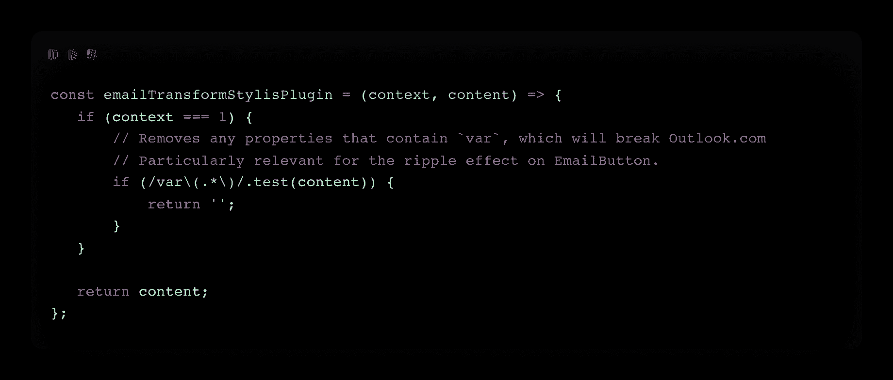
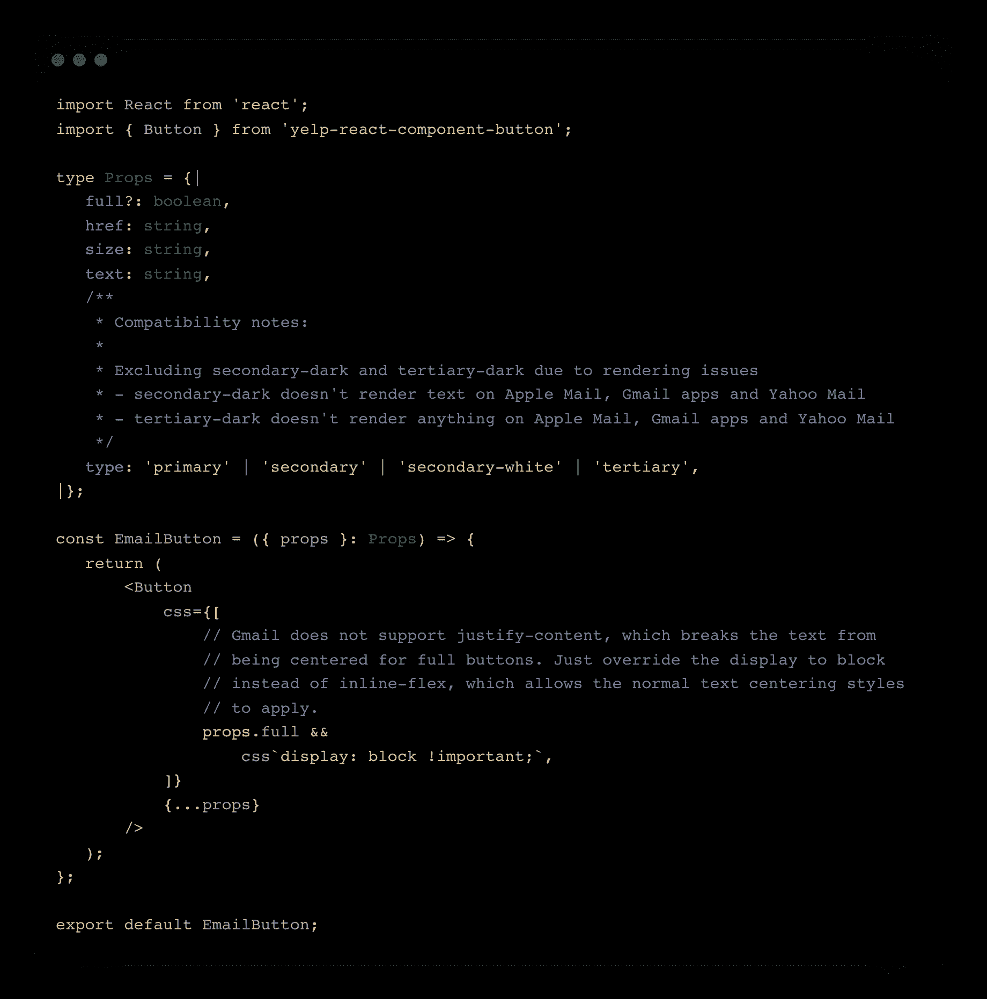
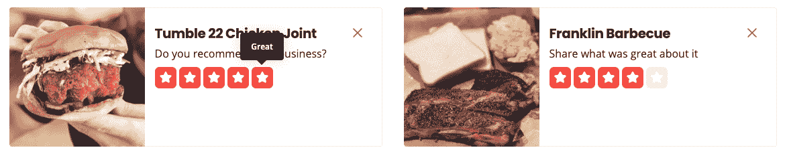
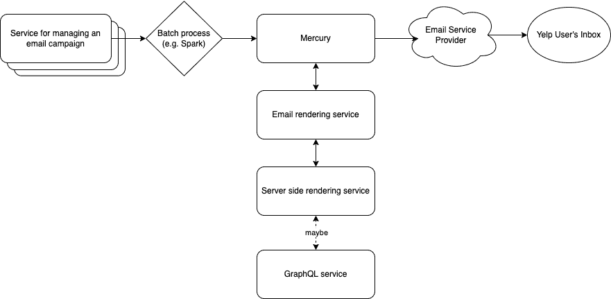
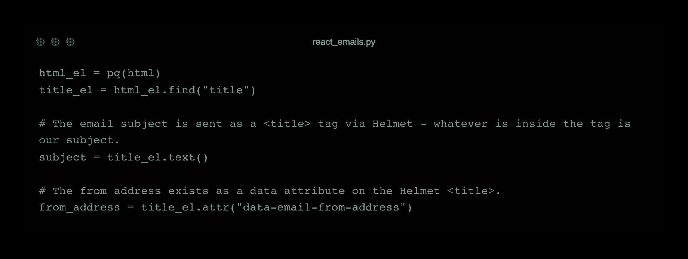

# Yelp 通过 React 实现电子邮件营销平台的现代化

> 原文：<https://thenewstack.io/how-react-modernized-yelps-email-marketing-platform/>

众包推荐服务 [Yelp](https://www.yelp.com/) 已经用 [React](https://reactjs.org/) 取代了传统的电子邮件模板语言 Cheetah，而没有增加任何额外的维护需求。

Yelp 软件工程师[杰克·盖伊](https://www.linkedin.com/in/jackaguy/)在一篇有趣的[博客文章](https://engineeringblog.yelp.com/2022/07/writing-emails-using-react.html)中详细介绍了这一过程，他说，自发布以来，该系统已经开发了十几种新的电子邮件类型，并发出了数百万封电子邮件。

无论你对电子邮件营销活动有什么个人感受，你都可以看到 Yelp 的电子邮件营销平台做了一些非常酷的事情。了解到部分业务确实包括电子邮件营销，工程团队没有继续使用过时的系统，而是通过使用“相同但不同的方法”解决了不一致的电子邮件工作流、具有挑战性的入职和测试以及维护不佳的系统等问题

Yelp 重新调整了其 web React 组件的用途，并为其电子邮件平台使用了服务器端渲染，而没有增加任何额外的维护或工程成本。新系统改善了开发者的体验，因为它将熟悉的工作流程从网络带到了电子邮件活动中。

React 是一种模板语言，它只提供最基本的功能。它执行许多自定义功能，但它也可以代表一个模板。Yelp 采用了这个想法，即组件的模板方面，改变了一些细节，并根据电子邮件活动的特定需求重新调整了它们的用途。这是什么意思，是怎么做到的？

## **重新利用 Web 组件**

*   **步骤 1** :添加前缀为 email 的组件包装器，以进行特定于 email 的修改
*   **步骤 2** :在 JavaScript 中使用 CSS，这将允许 JavaScript 逻辑修改样式以满足电子邮件客户端  的要求
*   **步骤 3** :为离群值创建自定义电子邮件组件

### ***第一步:组件包装器***

电子邮件功能远不如网络功能强大。点击或更改事件，如悬停、动画或高亮显示通常不包含在电子邮件中。为了区分 web 组件和电子邮件组件，电子邮件组件用前缀“email”包装(例如， *Text - > EmailText，Container->Email Container*等。).

下图显示了按钮组件的电子邮件版本的示例。它的 web 对应物支持一个 *onClick* 处理程序，由于一个受限的组件 API (Yelp 使用 [Flow](https://reactflow.dev/docs/api/react-flow-props/) props 类型)，该处理程序不会被传递到电子邮件中。

 

### ***第二步:JavaScript 中的 CSS***

电子邮件兼容性标准与本节非常相关，所以为了快速介绍，考虑电子邮件客户端(Gmail、AOL、Yahoo ),就像你考虑不同浏览器一样。每个电子邮件客户端都有一套不同的兼容性标准，开发人员可以决定在这些要求范围内工作，或者决定不值得他们花时间去尝试满足这些标准(hello Internet Explorer 11)。

Yelp 使用 JavaScript 的 [Emotion](https://emotion.sh/docs/introduction) CSS 库。Guy 报告说，Stylis 插件是情感库的一部分，它允许 Yelp“保持其 web 组件的封装，同时仍然保留我们在电子邮件中有效使用它们所需的调整”，允许开发人员在组件渲染时系统地转换他们的风格。

由于每个客户端都有自己的一套标准，管理电子邮件活动发送的服务也有自己的一套标准，所以 JS 中 CSS 的条件呈现功能非常有益。

下图展示了 Stylis 插件，该插件有助于解决在属性值中使用“ *var* ”的兼容性问题。

没有 CSS 在 JSS 的能力，有条件地呈现 CSS，盖伊认为 Yelp 将“可能被迫添加一个电子邮件特定的道具与一些分支逻辑，有条件地删除 CSS。”这将增加“维护负担，并引入我们的 web 组件不会有的电子邮件呈现问题。”

### ***第三步:创建自定义邮件组件***

有些情况下，存在根本的不兼容性，电子邮件组件是从头开始编写的。这方面的一个例子是评级选择器。在网站上，评级选择器允许用户开始评论

在电子邮件活动中，Yelp 仍然希望用户点击一个星级来开始评论，但他们无法复制电子邮件客户端悬停时的突出显示行为。JSS 的 CSS 插件或包装组件不能解决这个问题，所以 Yelp 创建了一个定制的 *EmailRatingSelector* 受原始设计的启发，但更适合静态渲染。

### **服务器端渲染**

一旦创建了组件，服务器端呈现就变得至关重要，因为它将 React 组件转换成 HTML 进行发送。与遵循可预测曲线的网络流量不同，电子邮件流量通常是在预定的活动中发送的，这些活动一批包含数千到数百万封电子邮件。

对传统 SSR 系统的初步测试突出了一个严重的瓶颈，每秒钟只有几十封电子邮件，这对于生产级别的活动来说是不可接受的。Yelp 在其他地方扩展服务器端渲染方面有丰富的经验，并且拥有投资新的服务器端渲染系统所需的经验，该系统可以轻松扩展到每秒发送数千封电子邮件。

下图详细描述了后端开发人员的电子邮件开发流程。

Yelp 详细描述图表的一步一步的过程如下:

*当后端开发人员为大规模电子邮件活动编写一批邮件时(通常使用*[*Spark*](https://spark.apache.org/)*)，他们会将邮件发送请求排队发送到我们的内部通知系统 Mercury(由我们的数据管道和*[*Kafka*](https://kafka.apache.org/)*提供支持)。这些发送包含基本信息，如发送到的用户及其所属的活动，以及包含呈现模板所需数据的有效负载。这些发送请求由我们的电子邮件渲染微服务中的工作人员接收，这又触发了对我们的 SSR 服务碎片的请求(有效负载变成了 React props)。shard 返回 HTML 格式的电子邮件，然后转发给邮件发送管道的其余部分。*

使用现有的 SSR 基础设施呈现电子邮件的另一个好处是可选的 [GraphQL](https://thenewstack.io/why-backend-developers-should-fall-in-love-with-graphql-too/) 查询。因为 React 已经连接到了 [Apollo](https://thenewstack.io/apollo-introduces-a-graphql-platform-for-shared-data-graphs/) ，所以不需要额外的工作来将数据包含在任何电子邮件模板在线查询中。

### **后处理和发送**

这是这个过程中的最后一步，它包括清理 SSR HTML 的原始状态，因为它是为在 web 浏览器中渲染和水合而定制的。Yelp 使用 [pyquery](https://pypi.org/project/pyquery/) 来收集无关的脚本标签和属性。以下代码:

电子邮件客户端有一些限制，如 *<样式>* 标签字节限制，这使得有必要将 *< head >* 标签 CSS 移动到 HTML *元素 style=""* 属性中。有许多开源选项可以帮助完成这项任务。

Yelp 工程师发现，这种新的基于 React 的电子邮件系统符合他们保持低维护成本的目标，同时为开发人员提供了一种易于使用的新系统，具有最新的设计。虽然其中一些细节是 Yelp 特有的，但该系统是可以复制的。有关此过程的更多具体细节，请查看[原文](https://engineeringblog.yelp.com/2022/07/writing-emails-using-react.html)。

<svg xmlns:xlink="http://www.w3.org/1999/xlink" viewBox="0 0 68 31" version="1.1"><title>Group</title> <desc>Created with Sketch.</desc></svg>