# Redis 如何简化微服务设计模式

> 原文：<https://thenewstack.io/how-redis-simplifies-microservices-design-patterns/>

 [艾伦·泰尔托

艾伦是 Redis 实验室的现场首席技术官。他在分布式系统、事件驱动架构、云原生平台和内存数据库技术方面拥有丰富的经验。](https://www.linkedin.com/in/allenterleto/) 

微服务架构越来越受欢迎，但却被广泛误解。虽然大多数人在概念上同意微服务应该是细粒度的和面向业务的，但通常缺乏对架构的权衡和复杂性的认识。例如，DevOps 架构师通常会减少 Kubernetes 部署的微服务，或者应用程序开发人员将实现归结为使用 Spring Boot。虽然这些技术是相关的，但是容器编排和开发框架都不能独自克服微服务架构的缺陷——特别是在数据层。

[Martin Fowler](https://martinfowler.com) 、 [Chris Richardson](https://www.youtube.com/watch?v=q5Z8-cwGBXQ) 和其他思想领袖长期以来一直致力于解决与微服务架构相关的[权衡](https://martinfowler.com/articles/microservice-trade-offs.html)，并定义了指导成功实施的[特征](https://martinfowler.com/articles/microservices.html#CharacteristicsOfAMicroserviceArchitecture)。这些包括 ***原则******隔离******授权自治团队*****s*****拥抱最终一致性*** ，以及 ***基础设施自动化*** 。虽然遵循这些原则可以避免早期采用者和 DIY 者感到的痛苦，但将它们纳入架构的复杂性放大了对最佳实践和设计模式的需求——特别是当实施扩展到数百个微服务时。

随着 Redis 迅速成为微服务架构的主流，值得讨论的是它如何简化设计模式的实现，如有界上下文、异步消息传递、基于编排的 sagas、事件源、CQRS、遥测等。

在 2022 年纽约 RedisDays 上，我主持了一场关于这个主题的会议，所以如果你喜欢音频版本，请随意观看[录制的演示文稿](https://www.youtube.com/watch?v=8CmAFMfuLqo)。

## 设计模式最好是可视化的。先来个图……

下面的架构图是微服务设计模式的组合。如果看起来很忙很复杂，不要气馁。我们将把这个事件驱动的支付处理工作流模型分解成许多嵌入式设计模式。我们将讨论每个模式所解决的挑战，以及如何通过使用 Redis 来简化它们的实现。由于某些模式是其他模式实现的基础，我们将按照允许它们相互建立的顺序来介绍它们。

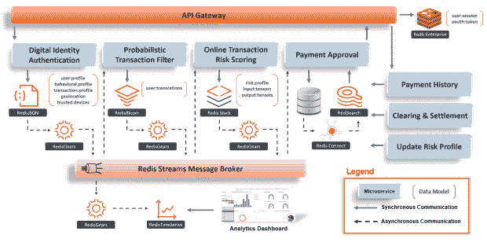

到本文结束时，读者将能够识别出他们曾经看到混乱的微服务设计模式。想象一下尼奥最终看到了母体背后的代码。目前:

## **设计模式:有界上下文- >领域驱动设计**

我们的第一个挑战是从逻辑上将业务划分为微子域，这样每个子域都可以由一个小型的 ***授权的自治团队*** 来支持。每个子域的范围应受到其团队管理其支持微服务的生命周期的能力的限制——从开始到后期制作。这种从从事临时项目到自主领域所有权的转变激励了对微服务设计所有方面的责任，并支持敏捷的决策制定，从而导致*缩短上市时间*。

> 想想前缀“micro ”,暗指支持其有限业务子域内的微服务的整个生命周期所需的团队规模。

在我们的模型架构的上下文中，让我们从支付处理领域开始组织设计过程——包括欺诈检测、支付、结算等等。由于这个范围对于一个小团队来说可能太复杂而难以管理，所以让我们选择将他们的所有权范围缩小到欺诈检测子域。

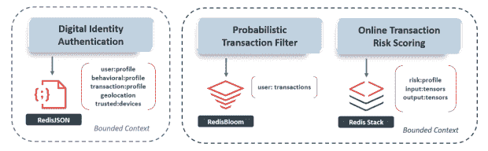

上图显示，欺诈检测由工作流的前三项微服务组成，包括数字身份、统计分析和基于机器学习的在线交易风险评分。由于它们的范围对于一个小团队来说可能仍然太宽而难以管理，所以让我们将欺诈检测进一步分成两个子域，这最终看起来更易于管理。

在一个非常高的层面上，我们刚刚遵循的过程被称为[域驱动设计(DDD)](https://dddcommunity.org/learning-ddd/what_is_ddd/) ，它由推荐模式支持，将每个微服务的范围和所有权声明绑定到一个称为[有界上下文](https://martinfowler.com/bliki/BoundedContext.html)的业务子域。但是等一下 Redis 在哪里？

注意，每个微服务都有自己的专用数据库用于 ***隔离*** 。拥有紫色有界上下文的 ***授权自治团队*** 选择[redis son](https://redis.com/modules/redis-json/)支持他们的“数字身份认证”微服务，选择 [RedisBloom](https://redis.com/modules/redis-bloom/) 支持他们的“概率事务过滤器”微服务。与此同时，拥有绿色有界上下文的独立团队选择作为其功能库，以支持实时“在线交易风险评分”。

虽然每个微服务都需要自己的最佳数据模型来处理其独特的数据访问模式和服务级别协议，但 Redis 使他们不必评估、部署和管理三个不同的数据库。事实上，有了 Redis Enterprise，他们可以在一个多租户集群上部署所有三个产品，而不会耦合他们的发布周期，也不会成为吵闹的邻居。

## **设计模式:异步消息传递- >服务间通信**

现在，我们已经为每个微服务确定了一个有界的上下文和最佳数据模型，我们的下一个挑战是在不违反 ***隔离*** 的情况下实现它们之间的通信。这可以通过 ***拥抱*** ***最终一致性*** 来解决，它假设服务间通信的接收端的微服务在出站传输期间将不可用，但是一旦恢复可用性就可以消费消息。
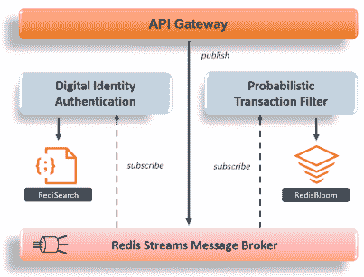

服务间通信的推荐模式是[异步消息传递](https://microservices.io/patterns/communication-style/messaging.html)，使用发布-订阅消息代理作为其事件分发中心。在这种模式下，生产者可以发布一个事件，而不需要知道是否有消费者在听，同样，该事件的消费者可以在方便的时候做出反应，或者完全忽略它。这通常是事件驱动架构的基础。

由于我们已经选择 Redis 作为多个微服务的主数据库，我们可以通过使用它来简化我们的架构，通过 [Redis 流](https://university.redis.com/courses/ru202/)来实现这种模式。Redis Streams 是一种不可变的时序日志数据结构，它允许生产者发布多个消费者可以订阅的异步消息。这确保了发布事件的微服务与消费事件的微服务保持分离，因此不存在对可用性和发布周期的交叉依赖。

此外，Redis 流可以被配置为处理不同的交付保证、支持消费者组以及其他本质上类似于 Apache Kafka 主题分区的细微差别。

## **设计模式:基于编排的 Saga - >分布式事务**

现在我们已经启用了服务间通信，我们的下一个挑战是处理跨越多个有界上下文的事务，而不违反 ***隔离*** 。在过去，这很难实现，因为事务范围内的所有操作都是针对提供行锁定、死锁检测和回滚功能的单个 RDBMS 执行的。一旦数据分布在多个数据库中，两阶段提交协议(2PC)就成了分布式事务的标准。然而，尽管这两种方法都有效，但它们在设计时并没有考虑到 ***最终一致性*** 。

> 如果我们假设在分布式事务期间依赖关系将不可用，那么我们还应该假设频繁的回滚将导致整个系统的不可用性——这既不是云原生的，也不会缩短上市时间。

这可以通过放松对 ACID 保证的严格要求来解决，几十年来，ACID 保证一直支撑着大多数传统架构中的关系数据库。尽管关系数据库在微服务架构中仍有一席之地，但它们的相关性变得更加取决于具体情况。例如，如果参照完整性不是一个需求，那么一个 ***授权的自治团队*** 为什么不选择用一个专门构建的 NoSQL 数据库来优化他们的微服务，以处理他们特定的数据访问模式和 SLA。

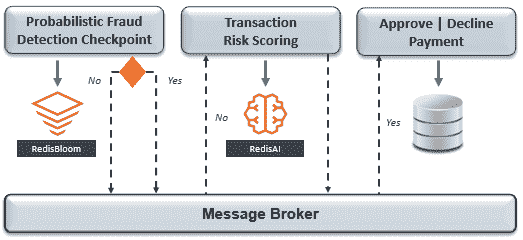

回想一下，我们的支付处理工作流由多个微服务组成，这些微服务被组织到独立的有界上下文中，并由 NoSQL 数据库 Redis 提供支持。在这种情况下，处理分布式事务的推荐模式是基于[编排的传奇](https://microservices.io/patterns/data/saga.html)，它执行一系列隔离的本地事务，并发布事件以促进工作流阶段之间的转换。

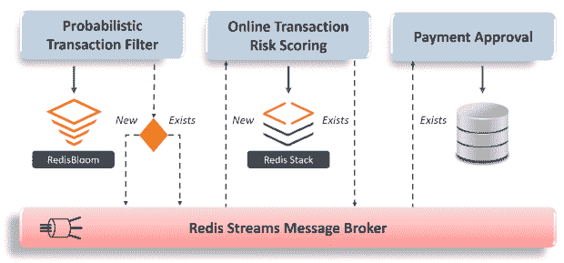

参与 saga 的每个微服务将只监听自己的工作流相关事件，这将通知它执行本地数据库事务，并随后将其自己的事件发布到消息代理。这种事件驱动的编排可以包括用于回滚目的的补偿微服务和用于复杂业务流程的决策服务。

值得注意的是，在基于编排的传奇中，没有中央编排器，这避免了参与微服务的发布周期之间的耦合。然而，它并不总是正确的解决方案。在有些情况下，强一致性是绝对必要的——比如账户转账。在这种情况下，基于编排的 saga 可能更适合，或者依赖于同一受限环境中微服务之间的 2PC。

## **设计模式:消息中继- >一致性**

既然我们已经编排了跨越多个有界上下文的事务，我们的下一个挑战是减轻微服务的数据库和消息代理之间不一致的风险——即使 Redis 用于两者。回想一下，在前两个设计模式中，每个微服务都在本地提交到其数据库，并随后发布一个事件。如果使用某种变化的 [dual writes](https://thorben-janssen.com/dual-writes/) 模式来实现这一点，通信可能会丢失，部分分布式事务可能会成为孤儿——尤其是在云环境中。

> 代码复杂性可以添加到每个微服务中，以处理各种故障和不一致的情况，但是考虑到这种工作在数百个团队中成倍增加，以及不正确实现的风险，所有这些都没有增加商业价值。

为了避免不同应用程序级实现的成本和差异，推荐的模式是使用消息重放。Redis 通过使用 [RedisGears](https://redis.com/modules/redis-gears/) ，简化了这种模式的实现，也称为 [write-behind](https://github.com/RedisGears/rgsync) 。RedisGears 是一个内存中的计算引擎，它在 Redis 中作为一个辅助线程运行，以监听更改数据事件，按时间顺序持久地存储它们，并在消息代理可用时发布它们。这可以通过 ***基础设施自动化*** 在每个 Redis 数据库上统一启用或升级。

## **设计模式:遥测- >可观测性**

既然我们已经降低了主数据库和辅助数据平台之间不一致的风险，我们的下一个挑战是测量整个架构中的微服务及其支持的业务事务的健康状况——称为[可观察性](https://www.martinfowler.com/articles/domain-oriented-observability.html)。

> 在一个充满数百个**隔离的**和**最终一致的**组件的分布式系统中，可观测性是必须具备的。

可观察性建立在三个支柱上——度量、日志和可追溯性。我们将首先关注指标，这些指标通常存储在时序数据模型中，可以处理大量的时序事件和时间点查询。最理想的情况是，实时跟踪指标，以便可以检测到 SLA/SLO 异常，并在出现异常时进行潜在的缓解。

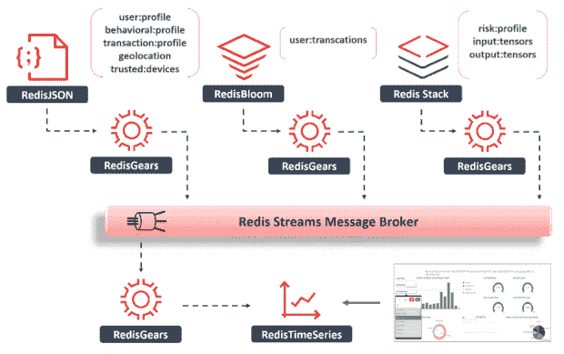

为了观察分布式系统的健康状况，我们首先需要它的数据。推荐的模式是遥测，即自动收集和传输来自远程监控源的数据。Redis 通过构建其 [write-behind](https://github.com/RedisGears/rgsync) 功能来将数据无缝地接收到另一个 Redis 数据模型中，从而简化了这种模式的实现。注意 Redis，我们只需要一个平台来实现这个模式。

既然 RedisTimeSeries 中提供了指标，我们可以跨多个维度实时查询它们—业务 KPI、应用 SLA/SLO、基础架构利用率等。例如，下面是如何使用 [RedisInsight](https://redis.com/redis-enterprise/redis-insight/) 可视化基础架构级别的指标。

以及如何使用 [Grafana](https://grafana.com/) 、 [Datadog](https://www.datadoghq.com/blog/monitor-redis-enterprise-clusters-with-datadog/) 、 [New Relic](https://newrelic.com/instant-observability/redis-enterprise/f15b39b2-bdc3-46d2-b28f-04ddbe23e299) 、 [Dynatrace](https://www.dynatrace.com/hub/detail/redis-enterprise-for-dynatrace/) 和其他可观察性平台来可视化业务级指标。

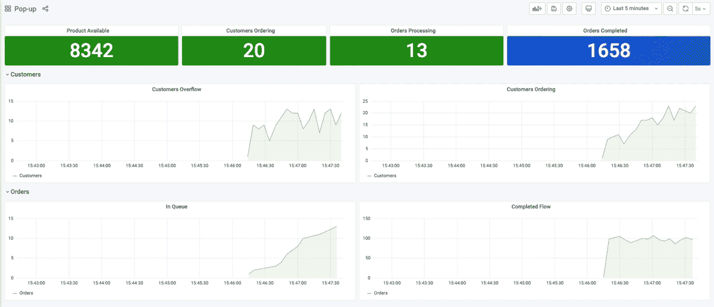

## **设计模式:事件源- >审计和重放**

现在我们已经实现了度量数据的遥测，我们的下一个挑战是实现可观察性的剩余支柱——日志记录和可追溯性。与度量不同，时序数据模型不会有利于日志的固有属性，因为它们不能被聚合或降采样。相反，它们需要一个不可变的、按时间顺序排列的数据结构，可以用于审计、恢复或按事件发生的顺序重放事件链。

由于微服务需要 ***隔离*** ，所以它们不能依赖共享的 RDBMS 来维护捕获 monolith 中所有事件的事务日志。因此，推荐的模式是 [event sourcing](https://martinfowler.com/eaaDev/EventSourcing.html) ，它在一个不可变的、按时间排序的日志中记录每一个数据更改事件——在微服务数据库级别。这种模式在大多数事件驱动架构中都很常见。

事件源通常使用消息代理和事件存储的组合来实现。回想一下，我们已经实现了使用 [RedisGears](https://redis.com/modules/redis-gears/) 来中继更改数据事件并将它们存储在 [Redis Streams](https://university.redis.com/courses/ru202/) 中的模式——一种不可变的时间排序日志数据结构。因此，Redis 可以用作数据库、消息代理和事件存储，所有这些都可以作为同一集群上的多租户组件独立使用。

既然我们已经捕获了 Redis 流中的变更数据事件，我们就可以使用不同的可观察性过滤器(微服务 ID、作业 ID、事务关联 ID 等)将它们可视化。

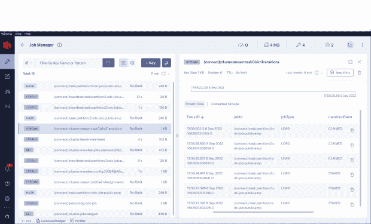

Redis 流还可以增加事件源的价值，超越单个微服务的范围，允许外部流程作为独立的消费者群体订阅其事件流。这允许在业务流程、领域、甚至架构级别上进行系统范围的分析。

## **设计模式:命令查询责任分离(CQRS) - >性能**

请注意，当我们定义与欺诈相关的有界上下文时，我们忽略了支付处理工作流的最后阶段。这是因为它的 ***授权自主团队*** 选择了非 Redis 数据库来支持它的微服务。

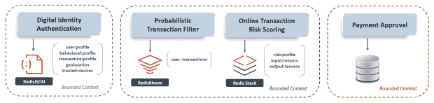

因此，现在让我们假设“支付批准”微服务由一个基于磁盘的数据库支持，该数据库没有针对查询性能进行优化。因为它大概有很强的持久性保证，所以它是记录保存的逻辑选择——但是，如果它的有界上下文也包括一个需要相同数据进行查询的微服务呢？没有 Redis 作为记录系统，我们如何优化查询性能？

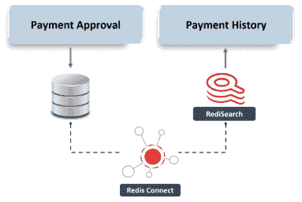推荐的模式是 [CQRS](https://martinfowler.com/bliki/CQRS.html) ，它分离了数据集的写操作——命令——和读操作——查询的责任。通过使用单独的数据库实现 CQRS 优化了数据结构或数据模型，以适应隔离双方的数据访问模式和单独的 SLA。由于我们的目标是读取优化我们的查询，数据复制的方向将从基于磁盘的数据库流入 Redis 即 MongoDB、Cassandra、RDBMS 等。很简单，对吧？

这里有一个难题——要实现这个模式，我们需要解决近乎实时的连续数据复制，维护异构数据库之间的 ***最终一致性*** ，并转换数据以避免命令和查询数据结构之间的阻抗不匹配。这听起来应该很熟悉，因为当 Redis 是源数据库时，我们使用 RedisGears 作为消息中继，但是由于大多数其他数据库不支持 write-behind，我们将需要一个外部实现来复制更改数据事件。

在这种情况下，我们可以通过使用能够与命令和查询数据库集成的变更数据捕获(CDC)框架来简化 CQRS 的实施。CDC 框架通常使用[事务日志跟踪](https://microservices.io/patterns/data/transaction-log-tailing.html)或[轮询发布](https://microservices.io/patterns/data/polling-publisher.html)模式来扫描命令数据库上的数据变更事件，并将它们作为转换后的有效负载复制到查询数据库。

## **设计模式:共享数据- >复用性**

既然我们已经解决了 Redis 不是记录系统时的性能优化问题，我们的下一个挑战是处理由不同的有界上下文分隔的微服务之间的共享数据。下面是一些可以用 Redis 简化的解决方案模式:

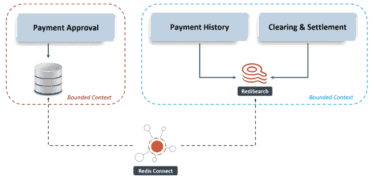

但是请等一下——虽然这些选项解决了几个有限上下文之间的共享数据，但是我们如何在全球范围内解决这个问题呢？

全局数据的推荐模式是专用于 API 网关的 ***隔离*** 数据库。然而，由于流经该体系结构的每个事务都有可能访问该数据库，因此我们必须将业务连续性、可伸缩性和性能作为选择该数据库的关键成功标准。幸运的是，这正是 Redis Enterprise 在数千个生产部署中大放异彩的地方。

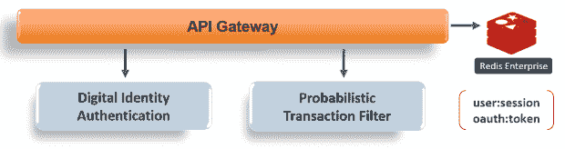

Redis Enterprise 是任务关键型会话数据、身份验证令牌和短暂数据存储的事实上的标准，这是因为它的大规模亚毫秒级性能和 99.999%的 SLA 以及它的主动-主动跨集群复制。

## **结论**

微服务架构可以改变游戏规则，击败市场竞争，减少组织云迁移的障碍。随着数字化转型的顺利进行，作为云原生微服务重新平台化的动力只会增加。

但是就像生活中的所有事情一样，微服务也有权衡。幸运的是，最佳实践设计模式是有据可查的，像 Redis 这样的平台可以帮助我们简化它们的实现。虽然这篇文章只是触及了等待挑战的表面，但我希望它能够让读者**识别他们曾经看到混乱**的模式，并通过使用 Redis 而不是缓存来降低实现的复杂性。

*Redis 于 2022 年 9 月 14 日更新了这篇文章。*

<svg xmlns:xlink="http://www.w3.org/1999/xlink" viewBox="0 0 68 31" version="1.1"><title>Group</title> <desc>Created with Sketch.</desc></svg>