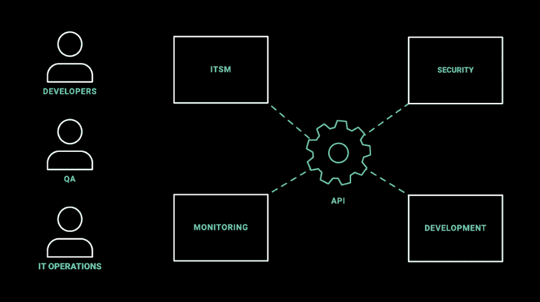
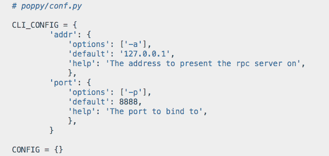

# SaltStack 如何在云主导的世界中重塑自我

> 原文：<https://thenewstack.io/how-saltstack-reinvented-itself-for-a-cloud-dominated-world/>

作为一名 IT 架构师，Robert Dale 加入 [MAN Energy Solutions](https://www.man-es.com/) 时，他注意到的第一件事是，在全球最大的船舶发动机和涡轮机公司之一维持 CIS 合规性并不像他希望的那样容易。

例如，为了符合 CIS，为自定义脚本设置了命令和策略。“只有一个人知道如何让它工作——他已经不在了，”戴尔说。"拥有和维护成本很高。"

然后，Dale 找到了一个替代系统，他说他觉得这个系统可以在几个大型环境中自动执行许多安全和管理任务。他说， [SaltStack](https://www.saltstack.com/) 配置和远程执行管理工具，又名 Salt，符合要求。戴尔说，有了它，他能够自动执行原本繁重的手动任务，包括安装大量试点和删除或添加 CIS 合规性检查，而无需扩展编码或手动配置。

“我有一个庞大的环境，我需要使其符合要求，并随着新检查的到来调整或扩展这种符合性，如果没有用户界面，这将很难扩展到不同技能水平的所有员工。我也不需要重新设计或改造它，”戴尔说。“我只需将它连接到我的企业评估和修复，就大功告成了。”

在管理如此庞大的网络时，保持合规性以前是一项重大挑战，通常需要 IT 安全团队数月的工作。Dale 现在表示，更新 CIS 合规性策略可以在 30 分钟内完成。“这是一个在列表中选择这个政策而不是那个政策的问题，然后你就完成了，”戴尔说。“补救也变得非常简单。”

Salt 因对安装构成挑战而受到批评。然而，虽然 Dale 指出 Salt 的文档可能“有点模糊”，但他声称 Salt 的安装很简单。

“你可以用一个脚本在一个节点上安装 Salt，点击‘运行’就可以了，”Dale 说。

## 重新发明

Dale 的经历反映了 SaltStack 如何通过去年发布的 [SaltStack Enterprise 6.1，](https://www.saltstack.com/products/saltstack-enterprise/)寻求强调 SecOps 的自动化，尤其是在多云和内部环境中的大型云原生部署。它说，通过 API，Salt 的企业版经常扫描不同的远程系统的漏洞，而自动化功能可以修复大多数漏洞。

Salt 今天提供的安全功能和自动化也背离了 Salt 作为一个通用分布式管理平台提供商的初衷。这并不是说 Salt 即将过时，而是在云原生工具和直接到云平台可用的今天，Salt 以及其他竞争解决方案不再像以前那样受欢迎。然而，特别是随着 [SaltStack Enterprise 6.1](https://www.saltstack.com/products/saltstack-enterprise/) 的发布，SaltStack 为 SecOps 增加了自动化功能，这也代表了 Salt 开发人员的一个新方向。因此，SaltStack 在许多方面重塑了自己。

它试图解决的主要问题之一是帮助 DevOps，更具体地说，SecOps 团队在部署云供应商提供的应用程序和平台时，在某些情况下上传了数百个漏洞。

“我们无疑已经重塑了自己，”SaltStack 首席技术官兼创始人 [Thomas S. Hatch](https://www.linkedin.com/in/thhatch) 说。“我们针对 SecOps 的新方法不是云提供商所关注的。”

当 Hatch 选择 SaltStack 时，他发现组织不太需要通用的应用程序部署和基础架构供应工具。“这些平台在现代 CI/CD 世界中不太重要，”Hatch 说。“当我有意识地——我不得不说——做出不受欢迎的决定时，特别是在内部，现在很流行。我会说，‘我很高兴我赌对了。’"

“并不是说 Salt 作为分布式管理平台的核心自动化功能已经过时。这是因为考虑到，特别是对于向原生云迁移的大型基础设施，他们需要基础设施的重要组件实现自动化，以供应特定的服务服务器，”Hatch 说。

“当然，大型云供应商提供分布式管理平台，但他们提供的安全扫描功能远不安全。Hatch 说:“从安全的角度来看，很多人认为仅仅扫描基础设施就足够了，这真的令人震惊。”。

从本质上讲，SaltStack enterprise 实现了 SecOps 流程的自动化。哈奇说:“当我们与我们的客户以及来自媒体和投资者的许多人交谈时，他们回来说我们在赛科普斯所做的事情是革命性的，因为它完全改变了整个安全方法的工作方式。”。

## 大跳跃

如今，SaltStack Enterprise 背后的概念主要是为 SecOps 团队提供跨多云和本地基础架构自动发现和修复安全漏洞的选项。SaltStack 表示，通过这样做，salt stack Enterprise 6.1 通过一个 API 为 SecOps 带来了自动化，该 API 扫描 IT 系统的漏洞，然后提供现成的自动化工作流来修复这些漏洞。

通过这种方式，SaltStack 将自己定位为“NoOps 的通用自动化支柱”，[企业管理协会(EMA)](https://www.enterprisemanagement.com/) 的分析师 [Torsten Volk](https://www.linkedin.com/in/torstenvolk) 说。

“在当今的分布式应用世界中，每当您在数据中心或公共云上启动微服务时，都有可能出现安全和合规性问题。Volk 说:“Salt 的分散但集中管理且接近实时的消息总线似乎很适合在这些不断变化和扩展的环境中实现一致的问题响应。“在当今世界，专注于对安全和合规性事件的快速自动响应似乎是正确的，因为披露客户帐户数据的新闻可能会很快导致数十亿美元的罚款和公关损失。”

SaltStack 也符合一种新兴的环境，在这种环境中，云原生安全工具变得更加容易获得。然而，选择正确的工具集当然会在这个由过多的安全和开源选项组成的碎片化市场中带来挑战。

SaltStack 等运营管理平台结合了安全用例，例如,“反映了开发人员和团队越来越多地利用更广泛的工具来实现安全成果的现实，”451 Research 的首席分析师 [Fernando Montenegro](https://ca.linkedin.com/in/fsmontenegro) 说。

“这对用户来说是一件好事—安全性现在可以更多地嵌入到现有流程中—但确实给许多利益相关者带来了挑战。对于最终用户组织，您如何确保安全团队和其他团队(如 DevOps)之间的协作能够很好地工作，以确保在没有太多摩擦的情况下实现安全目标？”黑山说。“对于供应商来说，挑战不仅在于竞争更加激烈，而且他们的购买决策现在也更加复杂:对于‘销售’安全产品的人来说，他们现在可能需要了解运营管理工具如何也能提供这种功能。”

黑山说，与 DevOps 创新保持同步的需求“影响到每一个供应商，而不仅仅是 SaltStack。”现有方法的多样性推动了许多创新，正如团队现在可以轻松地研究开源和社区工作一样。对于云环境上的部署，云提供商自己提供的运营管理框架也带来了压力。"

## 流行的推动

SaltStack 6.2 的发布引入了一个组件，“允许我们实际上与安全工具链的其余部分集成，”SaltStack 的工程副总裁[莫·阿卜杜拉](https://www.linkedin.com/in/abmoe/)说。“如今，人们已经在扫描漏洞或确定漏洞优先级的工具上投入了大量资金。因此，我们没有要求人们扔掉已经产生价值的东西，而是在前端创建了许多许多与扫描工具的集成，并自动转换结果，无需手动操作，”阿卜杜拉说。“然后，开箱即用，我们有自动化补救的基准，因此客户只需点击一个按钮就可以选择。”

类似于随着组织越来越多地转向云原生和更分布式的环境，SaltStack 如何重塑自己以解决蓬勃发展的 SecOps 需求，Hatch 率先推出了开源[面向插件的编程(POP)](https://github.com/saltstack/poppy) 项目来解决另一个问题。Pop 于 11 月在 SaltConf2019 上推出，旨在允许开发人员使用 Python 创建代码或模块，POP 集成到分布式架构中，当然包括云原生和 Kubernetes 环境。因此，开发人员可以创建应用程序和代码，并依靠 POP 来处理与配置 YAML、SSH 隧道和其他基础设施相关任务相关的繁琐任务。

“我还没有发现 POP 不支持的 Python 项目，”Hatch 说。“典型 Python 安装程序的一个愚蠢问题是，你必须确保基础设施方面的一切都是兼容的。哈奇说:“有了 Python 代码，一切都可以和 POP 一起工作——你所要做的就是下载它。”。

Volk 说，通过 SaltStack 的新企业版，POP 可以允许不同的团队从事他们自己的项目，而不会“在试图将他们的代码合并回整个平台时遇到或产生协调开销”。这意味着开发人员应该能够以更快的速度和更少的工作量提供新的功能，例如实现安全最佳实践或解决特定类型的合规性问题。观察 POP 能在多大程度上实现这一期望将是一件有趣的事情，”Volk 说。

SaltStack 是新堆栈的赞助商。

通过 Pixabay 的特征图像。

*目前，新堆栈不允许在该网站上直接发表评论。我们邀请所有希望讨论某个故事的读者通过 [Twitter](https://twitter.com/thenewstack) 或[脸书](https://www.facebook.com/thenewstack/)访问我们。我们也欢迎您通过电子邮件发送新闻提示和反馈: [feedback@thenewstack.io](mailto:feedback@thenewstack.io) 。*

<svg xmlns:xlink="http://www.w3.org/1999/xlink" viewBox="0 0 68 31" version="1.1"><title>Group</title> <desc>Created with Sketch.</desc></svg>