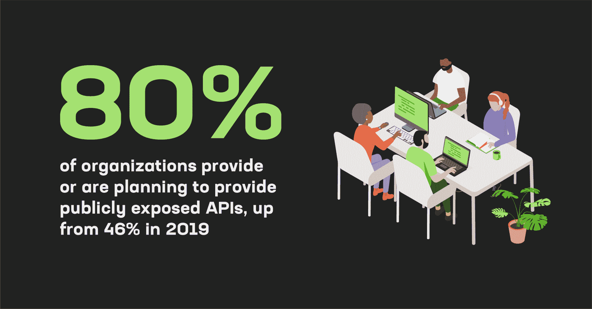
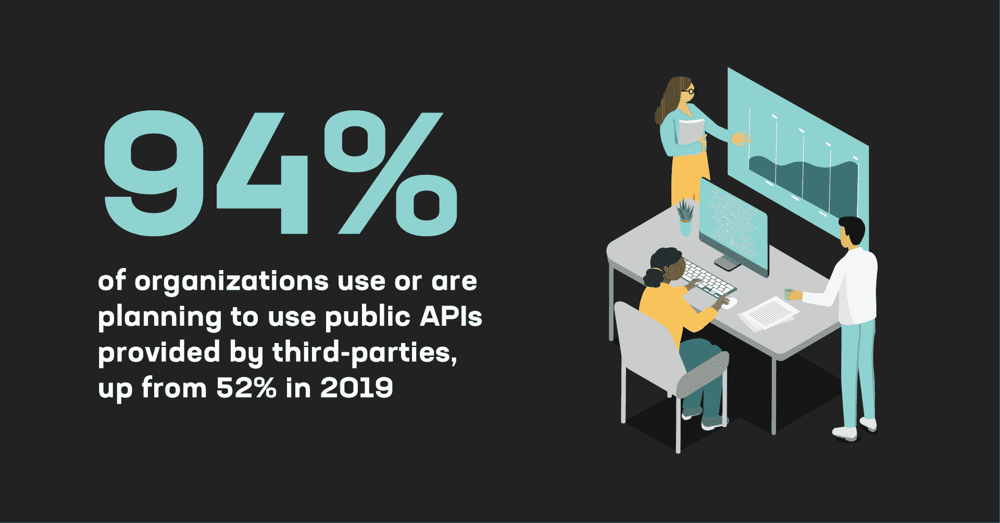

# 你的 API 网关有多安全？

> 原文：<https://thenewstack.io/how-secure-is-your-api-gateway/>

快速，你的组织使用多少 API？我们谈论的是内部产品、外部服务，甚至是基础设施管理，如亚马逊的 S3 对象存储或 Kubernetes。如果你不知道答案，你并不孤单。在一次又一次的调查中，首席信息官和首席信息官们承认，他们没有一份所有 API 的准确目录。然而[在继续采用以 API 为中心的技术范式(如云原生计算和微服务)的推动下，更多使用 API 的趋势是不可避免的。](https://www.f5.com/pdf/reports/f5-office-of-the-cto-report-continuous-api-sprawl.pdf)

根据 Gartner 软件工程研究主管 Mark O'Neill 分享的[统计数据，2022 年:](https://www.linkedin.com/posts/markwoneill_how-have-api-trends-changed-pre-pandemic-activity-6971460039060373504-u7Xz/)

*   98%的组织使用或计划使用内部 API，高于 2019 年的 88%
*   94%的组织使用或计划使用第三方提供的公共 API，高于 2019 年的 52%
*   90%的组织使用或计划使用合作伙伴提供的私有 API，高于 2019 年的 68%
*   80%的组织提供或计划提供公开的 API，高于 2019 年的 46%

## API 网关仍然是关键的基础设施组件

为了应对这种快速增长及其带来的管理和安全挑战，首席信息官、[平台运营](https://www.nginx.com/resources/glossary/what-is-platform-ops/)团队和云架构师正转向 [API 网关](https://www.nginx.com/resources/glossary/api-gateway/)来集中管理 API 流量。API 网关有助于发现、管理、观察和保护网络上的 API 流量。

事实上，API 网关是一种可以由[反向代理](https://www.nginx.com/resources/glossary/reverse-proxy-server/)或[负载平衡器](https://www.nginx.com/resources/glossary/load-balancing/)执行的功能，并且越来越多地由[入口控制器](https://www.nginx.com/resources/glossary/kubernetes-ingress-controller/)执行。我们知道这是事实，因为许多 NGINX 开源用户专门配置他们的 NGINX 实例来管理 API 流量。

然而，这需要相当大的定制，因此毫不奇怪，许多 [DevOps](https://www.nginx.com/resources/glossary/devops/) 团队选择部署一个 API 网关，该网关已经配置为处理 API 管理的一些最重要的用例，如 [NGINX Plus](https://www.nginx.com/products/nginx/api-gateway/) 。

API 网关通过充当访问 API 的外部应用程序的控制和访问中心点来提高安全性。他们可以实施身份验证和授权策略，以及实施速率限制和其他安全措施来防止恶意攻击和未经授权的访问。

此外，API 网关可以加密传输中的数据，并提供可见性和监控功能，以帮助识别和防止安全漏洞。API 网关还可以区分流量的优先级，强制执行服务级别协议(SLA)或围绕 API 使用的业务决策，并节省网络和计算资源。

一旦安装并完全部署，API 网关往往很难移除。因此，确保您第一次选择正确的 API 网关是非常必要的。赌注很高。并非所有 API 网关都提供相同级别的安全性、延迟、可观察性和灵活性。

有些依赖于底层的开源技术，这可能导致安全漏洞或可靠性方面的困难。其他可能需要繁琐的集成步骤，并产生不可预见的流量延迟。所有这些都会影响您的 API 网关的安全性，需要在选择过程中加以考虑。

## 引擎盖下的东西非常重要

市场上的大多数 API 网关解决方案都是建立在开源软件的修改版本之上的。NGINX，HAProxy，Envoy，Traefik 都是常用的。然而，许多 API 网关解决方案是闭源的(它们使用包装在专有代码中的开源)。也就是说，这种专有解决方案仍然完全依赖于开源组件的底层安全性。

这可能会造成严重的安全漏洞。当在作为专有 API 网关解决方案基础的开源项目中公布漏洞时，网关供应商可能需要几个月的时间来推出安全补丁，因为对反向代理层的任何更改都需要回归测试和其他质量保证措施，以确保修复不会影响稳定性或性能。攻击者知道这一点，并经常将这些产品中暴露的和未打补丁的开源层作为目标。

底线呢？您需要知道哪些技术是您的 API 网关的一部分。如果您需要一个高度安全的 API 解决方案，那么模块和基础组件对第三方的依赖，无论是开源的还是专有的，都会产生不可接受的风险。

## 使用软件材料清单审核您的安全依赖项

创建软件材料清单(SBOM)是评估潜在漏洞的最常用方法之一。简而言之，SBOM 是组成应用程序的所有软件组件的详细清单，包括商业软件和开源软件。要了解有关 SBOMs 的更多信息，请阅读"[为您的操作系统创建软件材料清单](https://thenewstack.io/create-a-software-bill-of-materials-for-your-operating-system/)"

一旦您对您的软件体系有了全面的了解，您就可以评估您的所有项目是否符合您的安全性和合规性标准。您会经常发现许多工具内部都嵌入了依赖关系。一些项目得到了积极维护，并根据标准化的服务级别协议发布了针对已知 CVE(常见漏洞和暴露)的补丁。

但是许多主要的开源项目都不是商业实体，所以他们可能不会发布关于漏洞披露或有保证的补丁时间的 SLA，这使您更容易受到 CVE 的攻击。反过来，这可能会无意中使您的服务不符合所需的标准。出于这些原因，您需要验证 SBOM 中的每个组件是否都符合要求。

您可以阅读“[如何为监管市场准备您的应用](https://thenewstack.io/how-to-prepare-your-apps-for-regulated-markets/)”了解更多关于审计您的软件技术堆栈的信息。

## 与其他安全控制的轻松集成至关重要

虽然 API 网关是 API 安全性的一个关键部分，但它们只是一个元素。大多数运行 API 网关的组织还需要在网关前安装一个 [web 应用防火墙](https://www.nginx.com/resources/glossary/what-is-a-waf/) (WAF)来阻止攻击( [OWASP API 安全 10 强](https://owasp.org/www-project-api-security/)等)。如果他们的基础设施是分布式的，他们需要不止一个 WAF。在较大的企业中，API 网关需要与管理所有进出流量的全局防火墙集成。

即使较新的 API 安全解决方案有助于应对 API 发现和威胁分析等挑战，也依赖于与 API 网关的强大集成。这些工具通常依赖 API 网关来了解 API 流量，并通常与 API 网关一起应对任何新出现的威胁。

在所有情况下，API 网关和安全工具之间的紧密集成对于维护有效的安全性至关重要。如果您可以使用单一监控解决方案来跟踪防火墙和网关流量，那将是最方便的。

这可能是一个具有挑战性的集成，特别是如果一个组织在多云或混合环境中运营。集成挑战还可能意味着网关配置的更改需要更新 WAF 或全局防火墙，从而增加团队工作量，或者——最糟糕的情况是——减慢应用程序开发团队的速度，他们必须等待防火墙或网关配置请求被同步。

## 不同环境中的策略粒度可能会有很大差异

理论上，无论在什么环境中运行，API 网关都可以执行相同的策略。如果您必须在不同的环境中从不同的组件组合中构建您的 API 网关，那么实际情况就大不相同了。

例如，一个 API 管理解决方案可能将一种底层开源技术用于其 API 网关的内部或托管安装，而将另一种技术用于云服务。底层的基本反向代理本身，或者两种实现之间的功能不匹配，也可能严重限制策略粒度和由此带来的所有安全优势。

出于这些原因，运行广泛的概念验证(POC)以密切模拟实际生产流量至关重要。这是确保 API 网关解决方案能够为您不断增长的 API 群提供所需的策略粒度和控制类型的唯一方法。

不适当的策略粒度和控制会导致不太灵活的安全功能，通常会将 API 网关降低为一个钝器，而不是管理 API 环境中快速变化的攻击面所需的精细手术刀。

## 速度对应用程序开发团队很重要

对于应用程序团队和 API 所有者来说，API 网关在安全传递流量的同时执行策略的速度有多快至关重要。缓慢的 API 会通过强制相关进程等待来影响应用程序的整体性能，从而导致糟糕的用户体验。

被迫处理缓慢的 API 的团队更有可能绕过安全系统或推出自己的系统来提高性能和更好地控制用户体验和依赖性。这相当于影子 IT 的 API，如果 API 没有被正确地锁定、测试和监控，它会产生相当大的安全风险。

API 网关本身必须很快。但是同样重要的是，要考虑 WAF 和 API gateway 的组合所产生的延迟影响。理想情况下，这两者紧密集成，减少了降低数据包速度的需要。这也是为什么接近生产的 POC 对于做出正确决策至关重要的另一个原因。

## 结论:您的 API 网关安全里程可能有所不同——明智地选择

API 是技术基础设施和可组合、松散耦合的应用程序的未来。随着越来越多的组织转向云、微服务和其他去耦和分布式计算模式，它们的快速扩散可能会加快。

即使您逆潮流而动，向 monoliths 的相反方向发展，您的应用程序仍然需要管理 API 来与世界其他地方进行通信，包括合作伙伴、客户、存储层、Stripe 等支付提供商、cdn 等关键云服务等。

API 网关是一项需要慎重考虑的重要采购。最重要的考虑自然是安全。

我们在这篇文章中列出的四个标准——可靠的底层技术、与安全工具的轻松集成、跨环境的策略粒度和低延迟——只是 API 网关在投入生产之前需要检查的许多框中的几个。

明智选择，深思熟虑，愿 API 力量与你同在！

<svg xmlns:xlink="http://www.w3.org/1999/xlink" viewBox="0 0 68 31" version="1.1"><title>Group</title> <desc>Created with Sketch.</desc></svg>