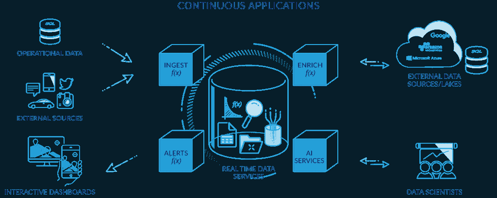
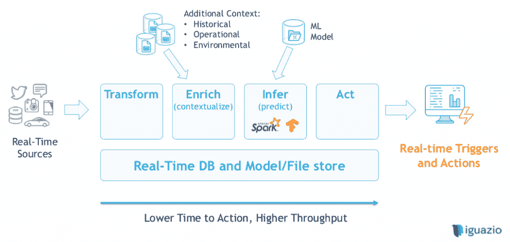

# 无服务器平台如何驱动事件驱动的人工智能管道

> 原文：<https://thenewstack.io/how-serverless-platforms-could-power-an-event-driven-ai-pipeline/>

*本文是关于将持续集成和交付(CI/CD)实践引入机器学习的系列中的[文章。查看新的堆栈，了解未来的部分。](https://thenewstack.io/build-and-deploy-a-machine-learning-model-with-azure-ml-service/)*

事件驱动的人工智能(AI)可以带来更快、更智能的决策，但需要对组织流程和团队组成进行重新定位，以及采用混合架构结构，充分利用无服务器并将其与有状态数据库存储相结合。

无服务器平台提供商 [Iguazio](https://www.iguazio.com/) 的联合创始人兼首席架构师 [Orit Nissan-Messing](https://www.linkedin.com/in/oritn) 表示，事件驱动的人工智能可以通过将事件发生和驱动行动所需的数据之间的时间减少到不到一秒来产生即时见解。它可以用外部数据实时刷新数据模型。此外，it 可以利用云通过持续的开发和部署实践来保持敏捷性。

她指出,[无服务器](https://thenewstack.io/serverless-101-how-to-get-serverless-started-in-the-enterprise/)可能是创建这种实时人工智能管道的理想选择，但也有一些不足，特别是缓慢的性能和缺乏并发性；以及管理复杂功能和多个事件数据源的挑战。

如果这些挑战可以被克服，无服务器架构可以帮助建立人工智能管道，将自动化带到一个新的水平。目前，无服务器工作流通常由 API、函数和事件组成，以自动化流程并采取重复的操作(同时记录发生的一切)。未来有了人工智能管道，这种自动化会变得更加复杂。除了在无服务器工作流中触发事件之外，工作流还可以同时引用以前运行该工作流的每个实例，并查看何时达到最佳结果。然后它可以选择重复成功的行动。

## 无服务器架构中人工智能的直接用例

人工智能管道可以通过利用历史数据和背景来帮助提高典型业务工作流的性能，并使用该数据模型来采取积极的行动。

一些例子包括:

*   **在基于位置的应用程序中显示数据**:基于位置的应用程序需要获取消费者的 GPS 信号，了解他们以前的购买行为，知道其他具有类似档案的客户购买了什么，然后提供相关内容来帮助消费者做出购物决定。在客户关闭通知之前，可能还需要知道您可以向客户提出建议的频率。
*   **风险管理**:当客户从一家企业大量购买需要运输的实物产品，或者增加服务的使用费时，对客户支付账单或每月账户的能力进行风险评估是非常有用的。人工智能数据模型可以预测何时允许客户增加他们通常的月支出，或推迟付款。
*   **基础设施监控**:在 IT 或物理过程中，如制造或管理运输和物流，了解哪里的路线拥堵非常有用，因此可以通过替代路线推动交通。这可能还涉及审查关于谁受到交通延误造成的慢到达的影响的数据，以便企业可以根据 SLA 或客户价值做出权衡决策，接下来应该优先考虑哪个客户群。
*   **个性化内容**:无论是通过显示推荐内容，还是利用个人和细分的消费者行为，企业都可以决定在个人读者访问单页应用网站时向他们显示什么内容。

所有这些案例都是从以前采取这些行动的时间中潜在的数千个数据点中提取的，在无服务器的情况下，可以立即查看数据模型并做出决策，例如，在不到四分之一秒的时间内做出反应。

Nissan-Messing 表示，无服务器的人工智能管道要经历四个阶段:

*   **转换**:首先从实时来源获取数据，需要将其转换为通用格式，以便与其他可用数据一起添加到模型中，这包括使用自然语言处理从文本或语音中提取有意义的数据。
*   **丰富**:然后，通过引入其他数据源，如以前实例的历史记录或其他环境数据，如天气或交通状况，将这些实时数据放入上下文中..
*   **推断**:无服务器流水线流程现在能够利用机器学习模型，根据实时数据和上下文丰富来预测最佳结果。
*   **动作**:无服务器管道现在可以根据成功结果的概率触发下一个动作。

但是在能够构建这个工作流之前，实际上还需要几个步骤。首先，企业必须准备好数据科学组织基础设施。

## 创建支持数据科学的组织

电信和支付平台 [Africa's Talking](https://africastalking.com/) 向开发者提供大量开放 API，用于管理支付、购买通话时间，以及将网络语音和消息集成到应用和服务中。虽然该组织尚未将无服务器技术用于其不断增长的人工智能操作，但该技术已在组合中。

目前，平台基础设施使用 Mesos 和 Kubernetes 的组合来管理容器和简化应用程序部署。这使得该公司可以试验工作流，开发人员可以编写、打包和部署代码，而不必直接与服务器交互。对于该公司来说，开始使用人工智能管道首先意味着成为一项以数据为导向的业务。非洲首席数据科学家凯瑟琳·余思敏负责管理这项活动。

“我们目前非常重视分析，”余思敏说。“数据分析是当前基础架构所能做到的，因此它是唾手可得的。为了实现更好的数据驱动决策，我们希望数据科学人员加入产品团队。因此，我们有一名数据科学家处理信息，一名处理支付和通话时间，一名处理语音，”她指着该业务的三个主要产品流说。

“将我们的数据科学家安排在产品团队中是我们从经验中学到的东西:最初，我们的业务组织在更传统的团队中，如人力资源和财务业务部门，但我们看到了鼓励人们真正擅长一件事的价值。因此，当我们在运行一个产品时，我们希望你成为这个产品团队的数据专家。除此之外，我还负责查看无服务器、数据科学和大数据生态系统中的工具，并与数据工程和基础设施团队协调，以决定团队使用哪些工具，”余思敏说。“我的强项是 Spark，但这需要弄清楚 Spark 如何与 Kubernetes 一起工作，以及日志放在哪里。我最终被拉进了更多关于基础设施的讨论。”

但是作为数据科学团队的领导，这是有意义的，并允许她的团队成员更多地关注于为他们正在工作的每个产品绘制数据模型。

余思敏解释说:“在产品团队中，数据科学家随后致力于规划基础设施成熟时我们想要做的事情。“Infra 不允许你对问题有一个很好的概述。最大的问题之一是有许多不同的服务有数据。基础架构的稳健性会影响您整合数据的敏捷程度，以及您如何从数据中丰富洞察力。”

如果不能引入多个数据源，数据模型就有重复过去糟糕的业务决策的风险。没有人可以幸免:最近亚马逊的人脸识别人工智能模型被证明在 38%的情况下错误识别了一些人脸。这些类型的不准确性通常是由于来自一个来源的数据太多，而不是帮助训练模型的数据源多样化。

为了避免在非洲对话的数据建模中出现这种错误，余思敏已经在考虑一些新的方法，比如建立一个内部伦理审查委员会。

无服务器人工智能管道的优势之一可能是，它作为一种基础设施方法，能够利用更多样化的数据源，并在触发决策事件时包括它们。

## 克服人工智能中的无服务器限制

在 Iguazio，Nissan-Messing 和联合创始人 Eran Duchan 帮助创建了开源无服务器平台。

“我们正在与 Nuclio 一起解决多重挑战，”日产梅辛说。该软件从许多不同的事件源获取事件，包括发布/订阅流、HTTP、MQTT、Azure event hub 和 AWS Kinesis。

“通过 Iguazio，我们能够提供一个分布式应用程序和数据库层，可以通过非阻塞调用非常快速地处理数据，这样我们就可以在同一个过程中并行处理许多事件，克服了大多数无服务器人工智能管道方法缺乏并发性的缺点，”Nissan-Messing 说。“这极大地增加了我们运行的进程数量，并且通过无服务器计算可以自动扩展。我们还创建了一个系统，它不仅允许您拥有某些状态，还允许您保持与数据库的连接打开，从而减少无服务器的启动/停止特性，这种特性会降低性能。”

Nissan-Messing 指出，在工作流程的每次运行之后，应该记录数据，然后添加到训练模型中，但是计算过程最好在更传统的设置中完成。

“在无服务器中训练数据模型不是最好的主意，”Nissan-Messing 警告说。“现有的机器学习框架非常强大。我们有每周更新模型的客户，也有不经常向模型中添加新数据的客户，这取决于客户的用例。训练模型的成本需要大量的计算，所以除非值得，否则你不会想太频繁地这样做，因为训练模型需要几个小时。”

成功地为人工智能管道使用无服务器将需要许多过程的组合。有一个基础设施管道，可以转换、丰富、推断和行动。但在此之前，我们能够在无服务器基础设施之外计算训练模型。在此之前，是设计一个数据模型，允许不同范围的来源。在此之前，需要建立组织流程和团队组成，以便为数据丰富的决策制定做好最好的准备。

*本文中的图片摘自 Orit Nissan-Messing 于 2018 年 10 月在纽约无服务器大会上发表的演讲《无服务器与人工智能》*

<svg xmlns:xlink="http://www.w3.org/1999/xlink" viewBox="0 0 68 31" version="1.1"><title>Group</title> <desc>Created with Sketch.</desc></svg>