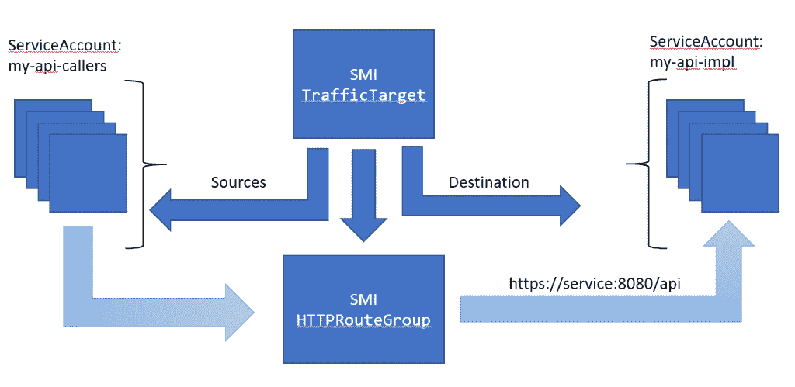
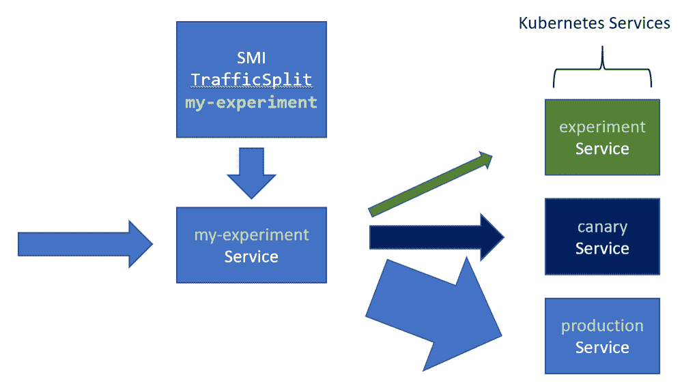
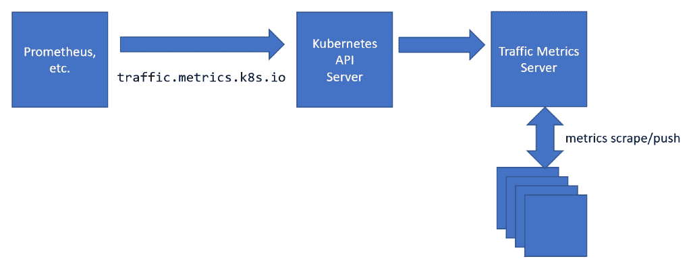

# 服务网格如何转变云原生应用开发

> 原文：<https://thenewstack.io/how-service-mesh-transforms-cloud-native-app-development/>

 [Brendan Burns，微软

杰出工程师 Brendan Burns 是 Kubernetes 的联合创始人，现在是微软的杰出工程师，领导 Azure 容器服务(AKS)、Azure 容器实例、Azure 云外壳和 Azure 资源管理器的开发工作。他和家人住在华盛顿州西雅图。](https://azure.microsoft.com/en-us/?v=17.14) 

Kubernetes 具有变革性的原因有很多，但最重要的原因之一是它的 API 是为开发人员设计的。在 Kubernetes 中，您可以创建部署和服务，而不是机器、磁盘和网络等基础设施对象。您仍在使用计算、网络和存储，但您创建的资源与应用程序开发保持一致。

然而，在 Kubernetes 的容器或 pod 中运行流程并不是全部。一个应用不仅仅是它的运行代码，它还被它的网络通信所定义。这些消息和特征，如拓扑、路由、度量和访问控制，定义了分布式系统及其容器映像。

因此，很明显，定义应用通信的面向应用的 API 是云原生开发人员体验的关键部分，这些 API 通常被称为服务网格 API。服务网格 API 使应用程序开发人员能够使用开发人员友好的声明性资源来表达他们的分布式应用程序的连接性。如何实现这种应用程序连接的具体细节留给特定的网格实现，如 Consul、Linkerd、Istio 或 Envoy。

> 一个应用不仅仅是它的运行代码，它还被它的网络通信所定义。这些消息和特征，如拓扑、路由、度量和访问控制，定义了分布式系统及其容器映像。

服务网格用户和服务网格实现之间的解耦是 Kubernetes 关键设计原则的一个例子。即模块化可组合性和使用声明性 API 的基础设施的去耦分层。这个设计原则导致 Kubernetes 由许多通用的可插拔 API 组成。这方面的例子包括允许 Kubernetes 跨 Azure、AWS、Google 等平台工作的云提供商绑定；以及 CNI(容器网络接口)、CSI(容器存储接口)和 CRI(容器运行时接口)，它们一般定义了容器如何与计算、网络和存储进行交互。

[服务网格接口](https://smi-spec.io/) (SMI)为服务网格概念提供了相同的通用 API。SMI 是一个通用接口，它以一种实现中立的方式呈现核心服务网格概念。它捕捉了服务网格中的核心思想，但提供了任何特定服务网格实现之上的抽象，如 Istio、Linkerd 或 Consul。

将 API 规范从实现中分离出来已经在整个 Kubernetes 生态系统中创造了价值，同样的价值也可以在服务网格技术中实现。通用 API 使人们能够构建可移植的应用程序，这些应用程序可以轻松地从本地迁移到基于云的集群，或者在各种公共云之间迁移。此外，标准化我们对通用接口的讨论使全球社区能够讨论，更重要的是，教授相同的概念和资源集，而不管它们是如何实现的。公共接口意味着开发人员可以构建有用的工具，供整个生态系统使用。

也许最重要的是，一个通用的 API 将证明像服务网格这样的新技术是可行的。当 API 和实现紧密绑定在一起时，采用一个新的 API(或一组 API)是一个令人担忧的选择。如果一段时间后，实现变得不合适，那么改变实现需要大手术和重新学习概念和工具，因为 API 和实现是紧密结合在一起的。一个通用的 API 改变了这个等式，因为用户从 API 的实现中抽象出来，实现可以交换，几乎没有变化。这意味着采用网格的成功并不局限于任何特定实现的成功，这反过来意味着采用像服务网格这样的新技术风险更小。

服务网格接口被设计成易于理解和实现的简单 API，因此它仅由四个概念定义:

*   路由定义了通过 HTTP 或 TCP 进出应用程序的路径
*   TrafficTarget 描述了应用程序是否可以在一组特定的路由上调用(或接收调用)。

*   TrafficSplit 描述了如何在两个(或多个)Kubernetes 服务之间进行流量分割，以便进行实验。

*   TrafficMetrics 描述了用于获取应用流量统计信息的通用指标端点。

有了这个 API，可以用面向开发人员的方式定义应用程序的核心面向应用程序的结构。

当然，这种接口的主要问题是它是“最小公分母”,因此对任何人都没有用。这一直是接口 API 的一个问题。解决这个问题的方法是包含特定于供应商的注释，以及规范随时间的演进。我们在这一演变中的灵感来自 OpenGL，尽管通用 API 和特定图形卡功能之间存在类似的紧张关系，但它仍然取得了成功。在 SMI 中，特定于 API 供应商的注释将一直存在，并且不可移植。然而，随着时间的推移，最受欢迎的特定于供应商的特性将被包含并添加到规范中。通过这种方式，演进希望确保大多数用户能够通过 SMI API 成功地管理他们的服务网格。

Kubernetes 标志着向面向应用和开发者的云 API 转变的开始。SMI 是这条路上重要的下一步。

<svg xmlns:xlink="http://www.w3.org/1999/xlink" viewBox="0 0 68 31" version="1.1"><title>Group</title> <desc>Created with Sketch.</desc></svg>