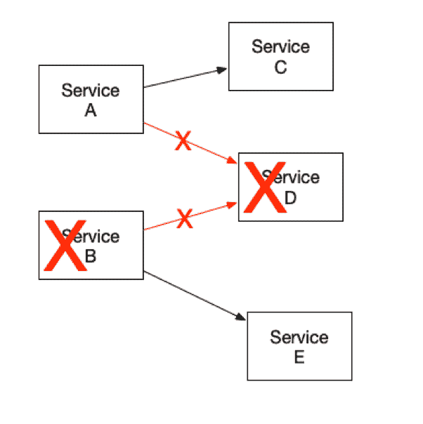
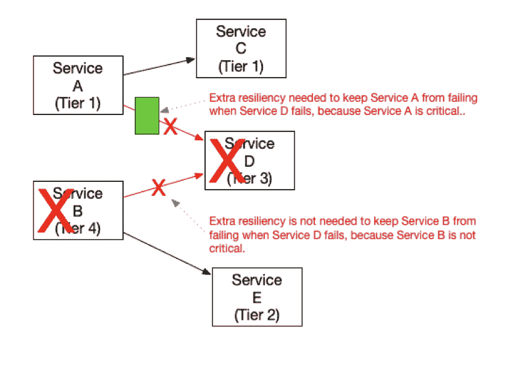

# 服务层如何帮助避免微服务灾难

> 原文：<https://thenewstack.io/how-service-tiers-can-help-to-avoid-microservices-disasters/>

关闭整个应用程序很容易。只要一个服务失败，组成应用程序的整套服务就会像纸牌搭的房子一样崩溃。非关键服务的一个小错误对整个应用程序来说都是灾难性的。

当然，有许多方法可以防止依赖服务失败。但是，在非关键服务中增加额外的弹性也会增加复杂性和成本，有时并不需要。

请看下图，如果服务 D 对于服务 A 的运行并不重要，会发生什么情况？为什么服务 A 会因为服务 D 失败而失败呢？如果高度关键的服务 A 可以在没有弹性的情况下生存，为什么服务 D 应该有高弹性？

您如何知道服务依赖链接何时重要，何时不重要？服务层是帮助管理这一点的一种方式。

## 什么是服务等级？

服务层只是一个与服务相关联的标签，它表明服务对您的业务运营有多重要。服务层使您能够区分任务关键型服务和有用且有帮助但不重要的服务。

通过比较相关服务的服务层级别，您可以确定哪些服务依赖性最敏感，哪些不太重要。

## 将服务等级标签分配给服务

系统中的所有服务，无论大小，都应该分配一个服务等级。以下部分概述了一个帮助您起步的标准(您可以根据需要对这些建议进行调整，以适应您的特定业务需求)。

### 一级

第 1 层服务是您系统中最重要的服务。如果某项服务的故障会对客户或公司的利润产生重大影响，则该服务被视为第 1 级服务。

以下是第 1 层服务的一些示例:

*   登录服务:让用户登录到您的系统的服务；
*   信用卡处理器:处理客户付款的服务；
*   许可服务:告诉你给定用户可以访问什么特性的服务；
*   接受订单服务:让顾客在你的网站上购买产品的服务。

1 级服务失败是您公司的一个严重问题。

### 第二层

第 2 层服务对您的业务很重要，但不如第 1 层服务重要。第 2 级服务中的故障可能会以明显和有意义的方式导致客户体验下降，但不会完全阻止您的客户与您的系统进行交互。

第 2 层服务也是对您的后端业务流程有重大影响的服务，但您的客户可能不会直接注意到。以下是第 2 层服务的一些示例:

*   搜索服务:在您的网站上提供搜索功能的服务。
*   订单执行服务:一种使您的仓库能够处理订单并发货给客户的服务。

第 2 级服务的故障将对客户产生负面影响，但并不代表整个系统出现故障。

### 三级

第 3 级服务可能对客户产生轻微、不明显或难以察觉的影响，或者对您的业务和系统产生有限的影响。

以下是第 3 层服务的一些示例:

*   **客户图标服务:**在网站页面上显示客户图标或头像的服务；
*   **推荐服务:**根据客户当前正在查看的内容显示他们可能感兴趣的替代产品的服务；
*   **今日消息服务:**在网页顶部向客户显示提醒或消息的服务。

客户可能会也可能不会注意到第 3 层服务出现故障。

### 第 4 层

第 4 级服务是指在发生故障时不会对客户体验造成重大影响，也不会对客户的业务或财务造成重大影响的服务。

以下是第 4 层服务的一些示例:

*   销售报告生成器服务。生成每周销售报告的服务。虽然销售报告很重要，但发电机服务的短期故障不会产生重大影响；
*   营销邮件发送服务。一种生成定期发送给客户的电子邮件的服务。如果此服务关闭一段时间，电子邮件生成可能会延迟，但这通常不会对您或您的客户产生重大影响。

## 如何使用服务层

服务层影响系统的两个方面:对问题所需的响应能力和服务之间的依赖性。

### 响应性

服务的服务等级级别决定了解决服务问题的速度。当然，问题的重要性越高，解决的速度就应该越快。但是，一般来说，服务等级越低，问题的重要性可能越高，解决问题的速度也应该越快。中低严重性的 1 级问题可能比高严重性的 4 级问题更重要，影响更大。

### 属国

 [李·艾奇逊

Lee 拥有 30 年的经验，致力于设计和构建大规模、基于云、面向服务的 SaaS 应用。他在构建高度可用的系统方面有专门的知识。李是新遗迹战略建筑的高级主管。在 New Relic 的最后四年里，他设计并领导了 New Relic 平台和基础设施产品的建设，并帮助 New Relic 设计了一个可靠的基于服务的系统架构，该架构随着他们从一个简单的 SaaS 初创公司发展成为一个高流量的公共企业而扩展。](https://twitter.com/leeatchison) 

考虑到给予较高重要性的服务(较低的服务等级数)的响应性的差异，这影响了服务之间的依赖关系图以及您对服务依赖关系的假设。

如果第 4 层(低优先级)服务调用第 1 层(高优先级)服务，那么对于第 4 层服务来说，假设第 1 层服务总是响应可能是安全的，如果出于某种原因它没有响应，那么第 4 层服务简单地让自己失败通常是可以接受的。毕竟，如果您的应用程序的第 1 层服务出现故障，将会立即采取重大措施来尝试解决该服务问题。第 4 层服务也关闭的事实不会产生影响。想想这样一种情况，您的 web 应用程序因为用户无法登录而停机(第 1 层服务问题)。当天的营销电子邮件可能会延迟一点(4 级服务问题)，这有多大关系？

但是反过来就不对了。如果第 1 层服务依赖于第 4 层服务，则该第 1 层服务必须制定应急计划和故障转移恢复计划，以应对第 4 层服务可能出现故障的情况。毕竟，您不希望第 1 层服务仅仅因为优先级低得多的第 4 层服务不起作用而失败。例如，您不希望您的 web 应用程序因为无法在每个页面的角落显示客户的头像而失败。您将希望优雅地恢复，只是不显示头像，但继续让您的应用程序正常工作。

## 一个例子

看一下下图。在此图中，我们为每个服务分配了服务层。根据上述规则，请注意，我们需要在服务 A 和服务 D 之间增加额外的弹性，因为服务 A 的优先级(第 1 层)高于服务 D(第 3 层)。因此，鉴于服务 D 的优先级较低，服务 A 需要保护自己免受服务 D 故障的影响。

现在看一下服务 B。服务 B 也依赖于服务 D，但是在这种情况下，根据我们上面的规则，服务 B 不需要它和服务 D 之间的额外弹性。这是因为服务 B 的优先级(第 4 层)低于服务 D(第 3 层)。因此，在服务 D 不可用的时候，服务 B 发生中断是更容易接受的。在这个例子中，服务 D 更重要。

通过仔细分析您的服务和适当的层分配，您可以确定将您的开发、测试和弹性工作的重点放在服务间依赖的哪里，首先优先考虑最关键和最易受攻击的接口，而不过度投资于不太关键的接口。

## 服务等级是标签

如上所述，服务层提供了一个“标签”系统，为您提供系统中每个服务的重要性信息。您可以使用该标签来确定问题升级策略、程序和优先级。

但是，如果一个服务无法调用一个依赖服务，您也可以使用该标签来确定必要的回退和恢复的数量和类型。您做什么以及如何响应取决于您调用的是高层服务还是低层服务。

<svg xmlns:xlink="http://www.w3.org/1999/xlink" viewBox="0 0 68 31" version="1.1"><title>Group</title> <desc>Created with Sketch.</desc></svg>