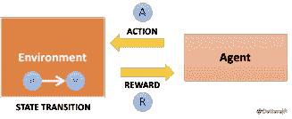
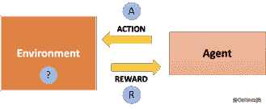
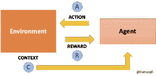

# 解决多臂土匪问题如何推进机器学习

> 原文：<https://thenewstack.io/how-solving-the-multi-armed-bandit-problem-can-move-machine-learning-forward/>

[Dattaraj Rao](https://www.persistent.com/)

[Dattaraj Jagdish Rao 是《Keras to Kubernetes:机器学习模型到生产的旅程》一书的作者。这本书谈到了 ML 模型的生命周期和为机器学习开发 DevOps 周期的最佳实践。Dattaraj 领导 Persistent 的人工智能研究实验室，负责在整个公司推动人工智能/人工智能的思想领导力。他领导的团队探索计算机视觉、自然语言理解、概率编程、强化学习、可解释人工智能等领域的最先进算法。并且展示了在卫生保健、银行和工业领域中的适用性。](https://www.persistent.com/)

[机器学习](https://thenewstack.io/category/machine-learning/) (ML)通常被认为是有监督的(从标记数据中学习)或者无监督的(在原始数据中寻找模式)。一个很少被谈论的 ML 领域是强化学习(RL)——我们训练一个代理通过“观察”一个环境而不是从一个静态数据集学习。RL 更被认为是人工智能(AI)的一种真正形式——因为它类似于我们人类通过观察和通过试错来学习新事物的方式。在本文中，我们探索了一种称为“多臂强盗”的特殊 RL 问题公式，并了解了它如何应用于各种各样的事情——从改进网站的设计到使临床试验对患者更有效。

如下图所示，一个典型的 RL 问题被建模为一个具有状态(S1)的环境，它被我们的代理观察到，并通过采取动作(A)被改变为状态(S2)。这个动作将环境的状态从(S1)转换到(S2)，作为回报，代理得到奖励(R)。回报可能是正面的，也可能是负面的。在一系列这样的试验和错误中，代理学习一个最优策略，根据状态采取行动，最大化长期回报。

例如，在国际象棋游戏中，玩家采取的行动会改变棋盘的状态，可能会有即时奖励，如获得或失去一枚棋子，以及赢得或输掉游戏的长期奖励。RL 在游戏行业中被大量使用，你可以想象这些代理和环境变得越来越复杂。

图 1:纯强化学习

RL 问题的一个更简单的抽象是多臂土匪问题。多臂土匪问题不考虑环境及其状态变化。在这里，代理人只观察它采取的行动和得到的回报，然后试图设计出最优策略。

“bandit”这个名字来源于赌场的类比，在赌场中，我们有多台吃角子老虎机，我们必须决定是继续玩单台机器(剥削)还是转向一台新机器(探索)，所有这些都是为了最大化我们的奖金。我们对这些机器的状态一无所知——只知道我们采取的行动和得到的奖励。在这里，我们需要纯粹通过采取行动和观察回报来在多个选择之间做出决定。这些算法最终会尝试在探索和利用之间进行权衡，以确定最佳策略。

图 2:多支武装匪徒问题

通过网站设计的例子，我们可以更好地理解多臂强盗算法。比方说，我们有一个新版本的网站，需要确定它与旧版本相比表现如何。让我们假设我们有一个有效的反馈机制，通过它我们知道用户喜欢或不喜欢的版本(奖励)。我们这里的动作是向用户呈现网站的选项 A 或 B。我们的环境是访问网站的用户。我们的奖励是收到的反馈。

最明显的策略是将用户随机分成两组，向一组显示网站 A，向另一组显示网站 B。因此，如果我们有 100 个用户，我们会随机显示 50 个选项 A 和另外 50 个选项 b。然后根据哪个网站更受欢迎，我们决定一个设计。这是纯粹探索的方法。这样做的缺点是，我们要等到所有 100 个用户都看过网站后再做决定。因此，如果选项 B 真的很糟糕——我们在那个选项上浪费了宝贵的用户时间。当你考虑将这种方法用于医学临床试验时，这种效果会非常糟糕。如果我们有两种药片 A 和 B 用于治疗一种疾病，而药物 B 是低质量的——使用这种方法，我们让更多的患者接触低质量的药物，只是为了收集更多的数据。

另一种方法是不断平衡勘探和开采。比方说，对于 20%的用户，我们随机显示网站 A 或 B，以了解哪个更受欢迎，其余 80%的用户，我们显示首选的网站设计。20%这个数字可以根据你想做的探索程度进行调整。此外，你可能会决定探索。进一步开发一段时间后，继续监控反馈。对于每个选项。在这里，我们试图在探索和开发之间取得平衡。存在许多类型的这种算法来解决多臂土匪问题，但本质上它们管理探索与开发的权衡，并开发采取行动的策略。

另一种在研究界越来越受关注的方法被称为上下文强盗，如下图 3 所示。在这里，我们不是随机地管理探索与开发的权衡，而是尝试获取一些关于环境的上下文，并使用它来管理操作。这里的上下文不同于我们之前讨论的传统 RL 问题的状态。背景只是我们对环境的一些了解，帮助我们采取行动。

例如，如果网站 B 使用 30 岁以下的人喜欢的设计元素，那么对于 30 岁以下的用户，我们可以选择“利用”这种上下文信息，并总是显示网站 B。上下文强盗广泛用于个性化广告等领域，以向消费者显示相关广告。我们可以看到，在网站设计和临床试验等领域也是如此，拥有合适的环境可以大大提高我们的行动效率。上下文强盗也被广泛应用于推荐系统中，在这种系统中，我们使用显式或隐式的反馈，试图为用户获得推荐的项目列表。

传统上，如果我们想向用户推荐商品，可以使用内容和协同过滤等方法。上下文过滤试图根据几个因素对相似的项目进行聚类，并向用户推荐相似的项目。协作过滤使用“群体智慧”方法，用户对项目的评级用于提供推荐。在开始提供有意义的建议之前，这两种方法都需要大量的数据。使用上下文强盗可以将上下文与推荐关联起来，并且可以很好地处理新项目和新用户。亚马逊用这些方法推荐产品，网飞用这些方法推荐电影。拥有用户背景是一种无价的资产，可以帮助提供非常相关的建议。

图 3:上下文强盗

在 Persistent AI Research Lab，我们已经看到银行、医疗保健和工业垂直行业的企业对 RL 的许多创新使用，以便更好地了解用户行为，并提出捕捉相关用户上下文的高级 ML 系统。我们认为，下一代认知系统的正确组合是用从领域知识中获得的上下文来增强来自数据的洞察力。强化学习为构建学习机器提供了重要的机会，这些机器能够感知上下文，并能够根据它们工作的环境调整它们的行为。

通过 Pixabay 的特征图像。

<svg xmlns:xlink="http://www.w3.org/1999/xlink" viewBox="0 0 68 31" version="1.1"><title>Group</title> <desc>Created with Sketch.</desc></svg>