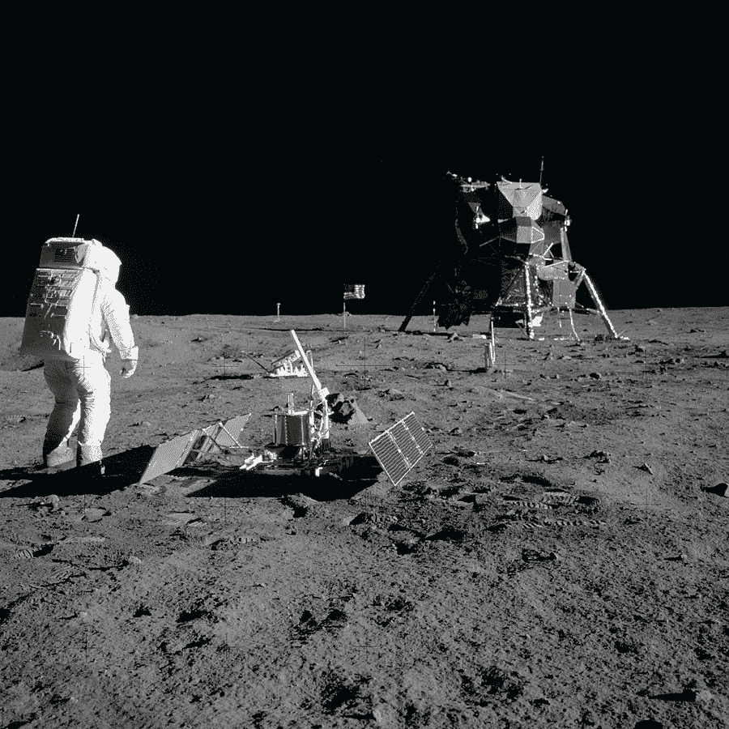
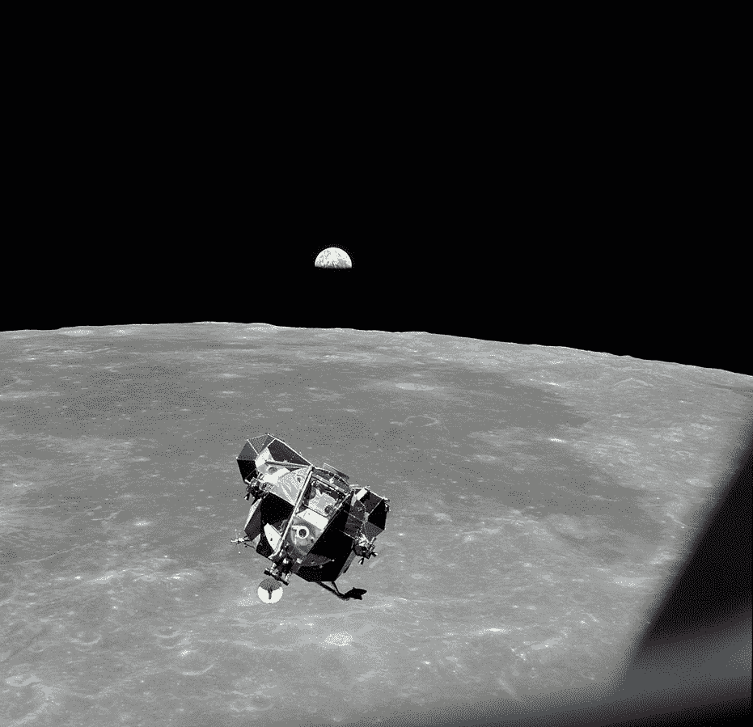

# 太空爱好者如何利用数据重现阿波罗 11 号

> 原文：<https://thenewstack.io/how-space-enthusiasts-used-data-to-recreate-apollo-11/>

我记得 1969 年 7 月 20 日。我爸爸指着天空说:“现在上面有人睡在月亮上。”

随着美国宇航局历史性的阿波罗 11 号任务 50 周年纪念日的临近——也是三名宇航员于 7 月 16 日升空的日子——一个网站汇集了他们整个任务的惊人细节再现。“如果你曾经希望你能乘坐火箭飞船升空，与尼尔·阿姆斯特朗和巴兹·奥德林一起在月球上漫步，一个完美的网站正在让这个梦想成真，”[在《休斯顿纪事报》上写道。](https://m.chron.com/life/article/Blast-off-with-Neil-Armstrong-and-Buzz-Aldrin-14046439.php)

“实时阿波罗 11 号”通过汇集和仔细同步真实多媒体的巨大宝藏，承诺整个登月任务的每一个时刻，包括:

*   NASA 任务控制中心的所有电影片段。
*   宇航员拍摄的所有机载电影镜头和影片，加上他们机载录音机的所有音频。
*   2000 张照片。(例如，发射后 2 分 44 秒，一架空军飞机在 40，000 英尺的高空拍摄了火箭的外部。)

该网站解释说，所有的镜头，加上来自太空和月球表面的电视传输，“都经过精心制作，记录了任务期间的每一个瞬间，每张照片和每一句话也是如此”。这一切都汇集在一个身临其境的体验中，并被小心地同步到“地面经过时间”，这是整个任务的官方主时钟。您还可以从视频画面切换到“仪表板”视图，跟踪与地球的距离、速度以及他们八天任务中的特定一天。

“阿波罗之声”的公共事务官员杰克·金在该网站的评论栏中解释说，倒计时的进展是由公众事务官员宣布的。但除此之外，还有来自任务控制中心的音频——也是实时播放的。50 个数字还原的任务控制音频首次在这里公开。它们总共超过 11，000 小时。

## 会见船员

但是谁对这种爱的劳动负责呢？

12 月，《名利场》 [的一篇文章承认了“铁杆平民太空爱好者”社区，其中许多人参与了网站的创建。](https://www.vanityfair.com/hollywood/2018/12/apollo-11-50th-year-anniversary?verso=true)

“实时阿波罗 11 号”归功于六个人，从 Ben Feist 开始构思，以及像研究、任务数据恢复、音频恢复和编程这样的事情。但是他有自己的故事，他对科学的热情变成了更多的东西。12 月《名利场》杂志称他为“职业……多伦多一家广告公司的技术主管”。但是他把业余时间的大部分时间都用在了运用他令人敬畏的编码技能来创造如此惊人的太空历史再现上，比如 Apollo17.org[，这是另一个追踪美国宇航局自 1972 年以来最后一次载人登月任务的网站，同样是实时的。](https://apollo17.org/)

在 Reddit 上，Feist 透露，阿波罗 17 号网站花费的时间是(更新的)阿波罗 11 号网站的三倍——因为“我不知道我在工作时到底在做什么。”

他很快在 GitHub 上分享了它的代码——然后继续扩展代码来创建新的阿波罗 11 号网站。但是，根据 Feist 在 BenFeist.com 的个人网站，当 Goddard 航天中心的 Noah Petro 博士邀请 Feist 在阿波罗 17 号 44 周年纪念日发表演讲时，阿波罗 17 号的站点已经给了 Feist 在 NASA 一些真正的信誉。“在独自研究了这么多年最终成为个人激情项目后，我终于有机会参观美国国家航空航天局，并解释了我对历史资料所做的工作以及我发现的月球勘测轨道飞行器数据的独特用途……我利用自己与软件开发部门高级客户交谈的经验，全力以赴地进行了介绍。”

它变成了一个基于对空间的共同热爱的合作的鼓舞人心的例子。美国宇航局火山学家雅各布·布莱彻(Jacob Bleacher)博士询问 Feist 是否也可以包括从月球表面收集样本的时刻——Feist 在几周后添加到阿波罗 17 号站点的一个功能，也包括在阿波罗 11 号站点中。这是右上角的“天体材料样本”按钮。

Feist 写道，这一切都感觉像是胜利的一圈——一个要告诉孙子们的故事——但随后又与美国宇航局的首席探索科学家和行星地质学家举行了另一次会议。他们告诉他，NASA 一直在努力解决一个长期的痛点:来自 NASA 所有尖端传感器的数据激增，以及如何组织和可视化这些数据。Feist 说他很高兴他的想法可以帮助他们解决问题，这引起了美国宇航局首席探索科学家的惊讶回复。

“我们不会解决它。你就是。”

最终，他们邀请他加入到新墨西哥州一个火山区的任务中，并做另一次演讲(和阿波罗 17 号最后一名幸存的成员一起)。他开始了美国宇航局中性浮力实验室(宇航员排练太空行走的水下水池)的另一个项目。

这一切都导致了一个非常快乐的结局:

**在整个冒险过程中，每次我遇到新的人或有了新的对话，我都会试图找到一种增加价值的方式——帮助。不求事；提供东西。这一立场在去年秋天诺亚和雅各布打电话问我是否有兴趣全职为美国宇航局项目工作时达到了顶峰。雅各布说:“你的名字出现在 2019 年的许多事情上，如果你只是让她* e .工作会更容易。”一旦我恢复了镇静，我回答说:“是的。”*

这篇文章写于不到八周前，以本·费斯特现在是美国国家航空航天局的独立承包商和顾问的消息结尾

## 图片的更多部分

在黑客新闻的一次讨论中，Feist [透露](https://news.ycombinator.com/item?id=20193710)他的下一个“项目”将会可视化[阿波罗 13 号任务](https://en.wikipedia.org/wiki/Apollo_13)。但上个月，Feist 谈到了人类首次在月球上行走，自豪地告诉《休斯顿纪事报》，阿波罗 11 号现场呈现了“有史以来最完整的任务历史电影镜头。”在对黑客新闻的评论中，他对它的实际实现保持谦虚，写道“没有流行的 JS 框架。就布局而言，用户界面几乎是我能想到的任何东西，然后我的一个朋友帮忙设计了一下，这样看起来就不像是开发人员设计的了。”

他后来补充说，这个卓越的网站“只是一堆 JS 和一些 JQuery。值得注意的一点是，这个架构中没有服务器端服务。浏览器自己完成所有的工作。”

还有其他一些附加功能，包括一个“评论”按钮，当它的时间戳到达时会闪烁，提醒观众有一个新的/刷新的文本。虽然阿波罗 11 号是一个为期 8 天的任务，但有一个“任务里程碑”按钮，可以让你快速导航到特定的亮点(包括“001:06:00 阿姆斯特朗向柯林斯提供一些口香糖。”)所有的音频都经过精心策划——例如，左耳是空间到地面的传输，而“中置”音频是为机载录音保留的。(你也可以单独播放任务控制音频，并伴有正在进行的发言人图表。)

当奥尔德林和阿姆斯特朗在月球上度过他们的一天时，迈克尔·柯林斯是驾驶控制舱的宇航员。50 年后的今天，88 岁的柯林斯正和其他人一样享受着“阿波罗 11 号实时”的现场直播。

甚至还有一份文字记录——完全可以搜索——这让我想到了任务控制中心显然很开心的一个时刻。“你可能有兴趣知道，因为你已经在路上了，休斯顿占星家鲁比·格雷厄姆说，所有迹象都适合你的月球之旅，”他们一度开玩笑说。“她说尼尔很聪明，迈克有很好的判断力，巴斯可以解决复杂的问题……”

一个“分享”图标会打开一个弹出窗口，里面有你当前*时刻的 URL 以及相应的文字记录。屏幕顶部还有一个“时间导航器”，下面还有两个额外的栏，用于跳转到特定的时刻(用照片或文字记录的摘录来表示)。甚至还有一个图标，让你同步任务到当前时间*今天*。*

但还有另一种导航方式，随着 50 周年纪念日的临近，这可能会被证明是有用的。该界面还包括一个“现在”按钮，允许你进入 50 年前的某个时刻。

有些人已经在谈论贯穿整个八天任务。

“贯穿整个任务是非常有益的，”Feist 告诉休斯敦纪事报。“你会真正了解机组人员和控制人员的个性。这感觉很现实，就好像它正在发生…

“如果我可以的话，全人类都会从繁忙的生活中抽出一点时间，关注并惊叹人类在共同努力下所能取得的成就。”

* * *

# WebReduce

<svg xmlns:xlink="http://www.w3.org/1999/xlink" viewBox="0 0 68 31" version="1.1"><title>Group</title> <desc>Created with Sketch.</desc></svg>