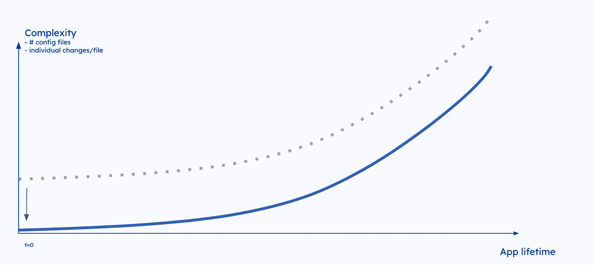
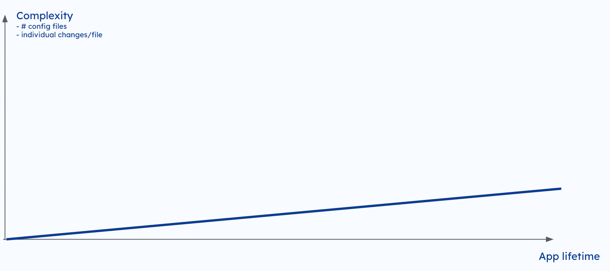

# 静态配置管理如何扼杀开发人员的生产力

> 原文：<https://thenewstack.io/how-static-config-management-kills-developer-productivity/>

您知道静态配置管理设置是开发人员出错的主要原因吗？采用静态方法进行配置管理在规模上行不通？虽然许多人对为什么和如何有一个模糊的理解，我们在这里帮助打破事情。

## 为什么现在的配置管理如此糟糕

假设一个组织已经搞清楚了 CI/CD，并且或多或少处于控制之下，那么每个单独的组件都应该遵循一个结构化的模式。与开发人员和工具链之间的日常交互相关的“80%案例”在大多数情况下都得到了充分的优化。

作为一个行业，我们在过去的 10 年里一直在努力实现“git-push 更新，变革已经展开”的目标。我们忽略的是，如果你超越任何组件的简单更新，会发生什么。更具体地说，当您改变服务(和基础架构)之间以及跨环境的关系时，这是我们在应用和基础架构配置中管理的事情。

我们的配置管理方法在很大程度上决定了每个开发人员执行这些“超越简单的映像更新的操作”的难易程度这包括从加入到服务、改变环境变量到在环境之间升级、添加服务或基础设施组件、处理依赖关系或回滚的一切。

有两种“竞争”的配置管理方法:静态配置管理和动态配置管理。在本文中，我们旨在讨论为什么“保持静态”可能是您组织中的头号生产力杀手，以及为什么“走向动态”可以帮助提高生产力、降低变更失败率和减少安全事故。

## 配置管理方法

让我们从剖析这两种方法之间的差异开始。通过使用静态方法，我们混合了配置中特定于环境和与环境无关的元素。单个开发人员需要理解、操作和维护所有工作负载和环境之间的依赖性。关于工作负载如何与最终环境中的哪种资源相关的答案必须在部署之前提供。

如果您遵循[动态配置管理](https://humanitec.com/blog/what-is-dynamic-configuration-management) (DCM)的方法，开发人员会创建工作负载规范，描述他们的工作负载成功运行所需的一切。该规范用于动态创建在特定环境中部署工作负载的配置。借助 DCM，开发人员无需为其工作负载定义或维护任何特定于环境的配置。

配置需要包含工作负载及其依赖资源之间的所有关系。这意味着使用静态方法配置的工作负载需要团队管理更多的配置文件。工作负载越多，文件就越多，这使得静态配置管理无法在不严重影响工作效率的情况下扩展到 50 个以上的服务。这不仅直接影响开发人员和运营团队的生产力，还会增加变更失败率和安全事故。

## 一个配置文件并不复杂，但是尝试管理数百个文件

“我的单舵图表并不复杂”是你经常从经验不足的架构师那里听到的一个论点，他们认为“我们的静态设置很好，可以扩展。”但是尽管单个配置文件(不管格式如何)并不复杂，缩放会改变一切。事情变得如此复杂，以至于由于需要理解、操作和维护这些文件而产生了巨大的开销和成本。

正如我们强调的，静态设置必须在每个环境中为每个工作负载维护大量单独的配置文件。这是必要的，因为必须在部署之前提供工作负载及其依赖关系之间的确切关系。

由服务数量引起的静态设置复杂性的增加可以通过快速计算来证明:假设我们的应用程序有 10 个服务和依赖项，并且部署在四个环境中。在我们的标准云原生设置中(假设我们在 21 个工作日内每天部署三次)，这将产生 300 到 600 个配置文件，每个月多达 30，000 个版本(600*21*3)。复杂性不仅取决于文件的数量，还取决于文件之间的差异。像静态舵图这样的格式允许用户以数百种不同的方式表达环境的相同期望状态。所以静态配置管理倾向于拥有大量的文件，这些文件在风格和结构上有很大的不同。如果将配置的复杂性与应用程序的生命周期对应起来，您可以观察到指数级的增长。

采用这种方法的低绩效团队很可能会陷入灾难性的境地，因为他们的应用程序数量会进一步增加复杂性。

## 静态配置管理可能是您生产力低下的首要原因

数百个配置文件损害工程组织的生产力有几个原因。

### 维护开销

大量的配置文件需要有人来操作和维护。对于任何普通的运营团队来说，这需要花费大量的时间来修改静态配置文件中的内容。这可能包括构建新的环境、服务或资源，调试部署，并试图弄清楚应用程序的各个部分是如何配合的。大多数组织已经将静态配置管理的成本内部化了。错误的设置可以简单地通过雇佣下一批运营同事来弥补，这些同事将在 ServiceNow 或吉拉遭受同样的重复罚单。

### 开发人员的认知负荷

作为开发人员，静态设置也令人难以置信地耗费精力。您必须了解并操作配置和工作负载，包括它们在所有环境和服务中的依赖性。如果你在交换团队，你首先要花大量的时间去弄清楚哪一部分与另一部分相关。如果您需要将一个服务绑定到您的架构中，添加一个资源或者甚至一个新的环境，您可能不得不花费时间来弄清楚如何挖掘大量的文件和格式。或者像你的大多数同事那样做:问运营部，申请一张罚单。这在安全性要求高的环境中尤其容易发生，在这种环境中，没有其他方法可以对资源或体系结构进行重大更改，这需要通过安全流程。如果您不知所措，或者更确切地说，专注于您的 React 堆栈，您可能会一遍又一遍地听到这并不复杂，您应该只是“构建并运行它”

### 可靠性

数百个文件也构成了一个很大的攻击面，既包括导致变更失败率的错误(想想连接到测试数据库的生产工作负载)，也包括安全事件。在一些设置中，我们观察到 90%的变更失败率归因于配置中的错误以及 80%的安全事件。

## “服务模板”黑客只是把你的问题推到未来

虽然减轻上述问题的正确答案是动态配置管理，但是团队经常回避修复根本原因。也许是因为他们没有花时间去理解 DCM，他们低估了问题的规模，或者他们认为他们可以应用快速修复来解决大多数问题。

最常用的“快速解决方案”是在创建新服务时尝试标准化。团队认为这将对标准化、可靠性和可维护性产生持久的影响。例如，他们使用 GitHub 模板或更花哨的选项，如服务目录和开发人员门户网站，使开发人员能够轻松构建配置良好的“Spring Boot 服务”但是由于文件之间缺乏持续的标准化，他们实际上只是把问题推到了未来。事实上，如果您比较两年前从模板开始的配置设置，您几乎不会注意到差异。

## 通过动态配置管理实现持续标准化

为了真正驯服复杂性这头野兽，我们需要减少文件的数量，我们需要不断地标准化，而不仅仅是在第一天。这就是 DCM 发挥作用的地方。其思想是，开发人员不需要处理数百个文件，而是每个服务只使用一个文件，最终的配置文件是根据部署的上下文创建的。这个文件是一个工作负载规范，比如[Score](https://score.dev)(GitHub 上的 7k+ stars)，它在短时间内获得了巨大的关注。

影响是惊人的。让我们回想一下在静态设置中导致 300 到 600 个配置文件的 10 个服务和依赖资源的例子。使用 DCM，同一应用程序可以配置 10 个文件(加上必要的基本配置和模板)。这比静态设置减少了 95%。

如果我们现在绘制复杂性与应用程序生命周期的关系图，我们可以看到，我们不仅标准化了第 1 天，还标准化了第 n 天。复杂性不是呈指数增长，而是呈线性增长。

## 开始动态配置管理

动态配置管理是现代 IT 组织的一个范式转变。这是对头号生产力杀手的解决方案:静态配置管理产生的复杂性。

DCM 起源于平台工程的发展趋势。它是在工程团队试图构建更大规模的平台时开发的，这些平台通过设计推动标准化并引入关注点分离，而没有从开发人员那里抽象出上下文。正因为如此，DCM 现在已经扩展到平台工程社区之外，并且正在被迅速采用。

想了解更多关于 DCM 的知识？查看这篇[文章](https://humanitec.com/blog/what-is-dynamic-configuration-management)和[标题评分](https://score.dev)，了解更多关于如何结合使用这一开源工作负载规范和[平台编排器](https://humanitec.com/blog/what-is-a-platform-orchestrator)来启用 DCM 的信息。

<svg xmlns:xlink="http://www.w3.org/1999/xlink" viewBox="0 0 68 31" version="1.1"><title>Group</title> <desc>Created with Sketch.</desc></svg>