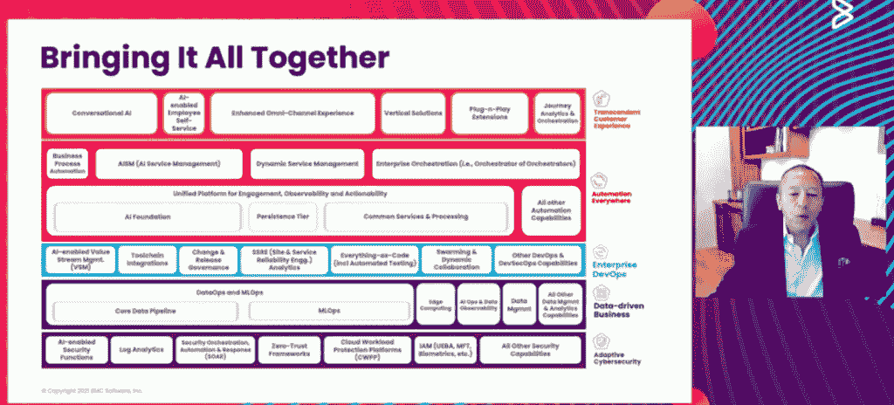

# StreamWeaver 如何支持 BMC 的更新愿景

> 原文：<https://thenewstack.io/how-streamweaver-supports-bmcs-updated-vision/>

BMC Software 最近对 StreamWeaver 的收购反映了 BMC 计划如何满足其客户的数据操作和 AIOps 需求，因为这些客户在日益以数据为中心的[和分布式环境中工作](https://thenewstack.io/category/data/)。

BMC 代表的发言反映了提供数据流集成和管理工具和平台的 StreamWeaver 将如何增强 BMC 的 Helix 服务和运营管理平台，提供改进的可观察性和跨分布式环境的云迁移，主要通过 AIOps 实现。

StreamWeaver 拥有丰富的能力来集成云环境，这将进一步加快 Helix AIOps 路线图，“以实现数据驱动的业务和出色的客户体验，”BMC 首席产品官 [Ali Siddiqui](https://www.linkedin.com/in/ali-siddiqui-4bb3921) 在 10 月下旬举行的 BMC 用户大会 [BMC Exchange 2021](https://exchange.campus.bmc.com/#lct=entrance) 上发表主题演讲时说道。

## AIOps 集成

Siddiqui 在主题演讲中表示，作为 BMC“双倍下注于 Helix”的一部分，StreamWeaver 还将提供 BMC AIOps 集成，如改进的大型机服务器发现、应用程序映射和数据驱动的业务洞察。

这些功能包括与基于分布式微服务的架构的集成、自动化补救以及对整体开发运维的增强支持。BMC 还希望 StreamWeaver 以及进一步的产品和服务创新将有助于它通过应用人工智能和机器学习(ML)分析能力来更好地支持客户，以实现业务目标。

*BMC 总裁兼首席执行官 Ayman 谈到“自主数字企业”需要什么*

在更高的层面上，BMC 总裁兼首席执行官 Ayman Sayed 在主题演讲中表示，作为一家提供 IT 服务和工具数十年的传统企业，BMC 也在寻求适应客户的现代 IT 和业务需求，这些客户寻求成为“自主数字企业”。

“自主数字企业是一种模式，通过这种模式，公司通过使用技术，使关键特征能够在行业中获胜和扩张，”赛义德说。“从关注客户和以客户为中心开始，获取数据并将其转化为可行见解的能力涉及业务产品和敏捷性，即快速运行业务计划的能力，以及对我们周围随时发生的所有变化做出快速响应的能力。”

他表示，这代表着思维方式的转变，也标志着传统五年战略模式的转变，在传统模式下，每一步都是提前规划好的。赛义德说，在这种新方法中，“不管我们遇到什么，因为我们将变得敏捷，然后我们将能够调整和发展我们的产品，同时关注客户并利用到来的数据。”

事实上，StreamWeaver(以及未来可能的其他收购)将提供的工具和流程，以及持续的产品开发，将进一步支持 BMC 的使命，帮助其客户改进业务推理和决策流程，这些流程在很大程度上是由 AIOps 和数据驱动的。

换句话说，从分布式数据源收集数据并将其汇集到数据湖中只是一个起点，而分析和应用以数据为中心的推理来改善客户体验的能力才是关键。

Forrester 分析师诺埃尔·尤汉纳(Noel Yuhanna)在今年早些时候的报告《[企业数据架构支持数据运营》(Enterprise Data Fabric Enables Data ops)中写道:“组织正在意识到，仅仅将大量不同的数据放入云或数据湖不会神奇地创造出有意义的见解，除非进行进一步的集成、转换、丰富和编排。”](https://www.forrester.com/go?objectid=RES153219)

Yuhanna 写道:“在混合和多种来源之间传递连接的数据并不简单，特别是随着数据量、复杂性和快速摄取需求的增长。”“组织希望使数据民主化，以允许业务用户自己访问和利用所有数据，从而支持更快、更准确的业务决策。”

## 加强决策过程

对于 BMC 这样的传统玩家来说，StreamWeaver 反映了它的新主人如何通过将人工智能和[机器学习](https://thenewstack.io/category/machine-learning/)能力注入 Helix 和其他平台来寻求现代化，[企业管理协会(EMA)](https://www.enterprisemanagement.com/) 的分析师 [Torsten Volk](https://www.linkedin.com/in/torstenvolk/) 告诉新堆栈。

Volk 表示，在 [DevOps](https://thenewstack.io/category/devops/) 和 IT 运营数据的背景下，从分布式微服务应用程序中发现和摄取运营数据的能力对于帮助用户充分利用 AI/ML 功能来最大限度地降低运营成本，同时最大限度地提高敏捷性至关重要。

沃尔克说，实现数据驱动型企业的愿景是“当今企业计算的最重要目标”。“任何有助于创建和持续增强连接 DevOps 中所有相关数据源所需的数据模型的工具都直接有助于提高 AI/ML 的影响，从而使整个组织能够以业务 KPI 驱动的方式解决短期、中期和长期问题。”

<svg xmlns:xlink="http://www.w3.org/1999/xlink" viewBox="0 0 68 31" version="1.1"><title>Group</title> <desc>Created with Sketch.</desc></svg>