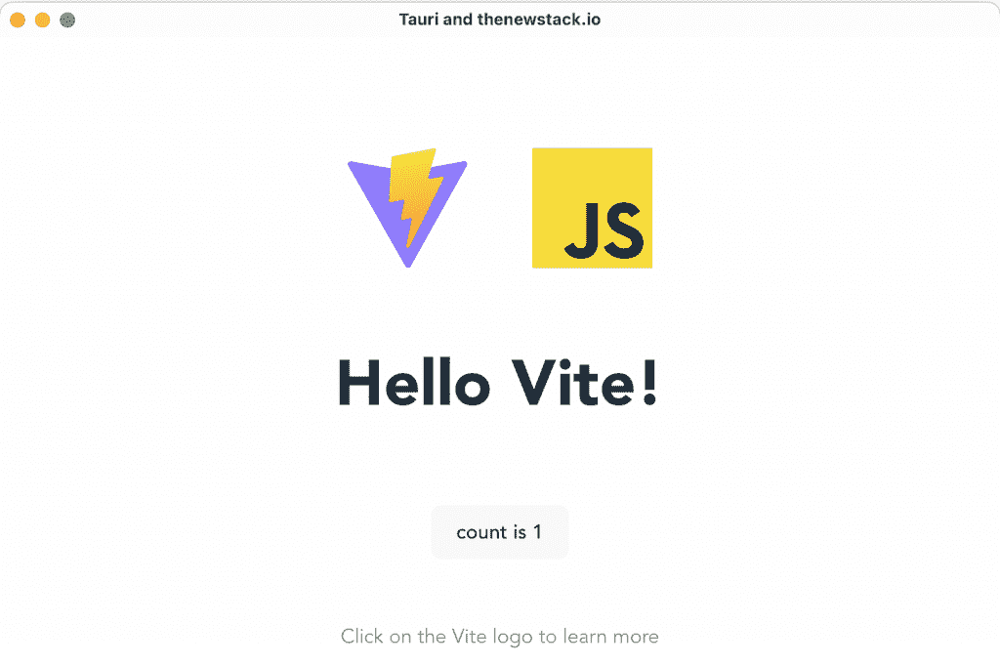
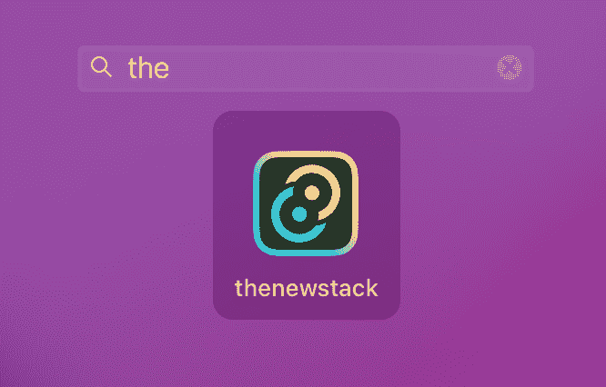

# Tauri 如何将网页设计转化为简洁的原生应用

> 原文：<https://thenewstack.io/how-tauri-turns-web-designs-into-compact-native-apps/>

"开源，小安全，为什么要毁灭世界？"——**[Tauri](https://tauri.app/)**的主要开发者之一在 [Changelog](https://changelog.com/podcast/497) 播客上描述了他的动机，这让我反思开发者如何选择制作小型原生应用。Tauri 是为“关注安全、尊重隐私和环保”(即体积小、功耗低)的软件工程社区而构建的。这如何映射到普通开发人员的决策？

找出最好的技术来编写一个可维护的应用程序，最终会在你所处的位置、你所知道的以及可用的东西之间取得平衡。

如果你在公司防火墙后开发，你可能不得不面对现实允许的一切。小应用通常是工具，其中一些需要以一种基于网络的工具不被信任的方式来了解你的系统。但是仅仅为了效率，使用目标机器的原生 UI 和窗口系统是有意义的。

那么 Tauri 在哪里呢？

Tauri 是一个用任何前端框架和 Rust 核心构建桌面应用程序的框架。每个应用程序由两部分组成:

*   Rust 二进制文件创建窗口并向这些窗口公开本机功能
*   一个你选择的网络前端，在窗口内产生用户界面

Tauri 电梯间推介一开始可能听起来有点矛盾——使用 web 技术构建本地应用程序。显然，显示 HTML、JS 和 CSS 的最佳方式是在浏览器中——但这并不是故事的结尾。这些技术已经成为将信息放在屏幕上的事实方法，现在不管目标是什么，使用它们来构建 UI 都是合法的。这个想法已经进化了；我是用[概念应用](https://www.notion.so/)写这篇文章的，它被[电子](https://www.electronjs.org/)包裹着，共享相同的初始概念。(话虽如此，但这款应用的容量高达 668MB！)

Tauri 的核心是用 [Rust](https://thenewstack.io/the-case-for-rust-as-the-future-of-javascript-infrastructure/) 写的，这对我来说是一门新的语言，但我不打算过多地参与其中。简单地说，Rust core 控制本机窗口和消息传递，允许模拟类似 web 组件的浏览器。虽然这种类型的模块化移交倾向于形成复杂的架构图，但它确实有助于在本地级别上实现更有序的方法。用户界面问题与操作系统问题分离得很好。如果我在花园里看到一个烛台，我知道我在玩[的《独领风骚》](https://store.steampowered.com/app/794800/ClueCluedo_The_Classic_Mystery_Game/)——因为它不应该出现在那里。

> 💡Tauri 是一个用任何前端框架和 Rust 核心构建桌面应用程序的框架。

我可能更喜欢少写 JavaScript，但我是一个实用主义者。毕竟，世界上大多数 UI 都是为 web 编写的。所以在我的试驾中，我使用了给定的 [Vite 示例](https://tauri.app/v1/guides/getting-started/setup/vite/)的启动指南。Tauri 将自己呈现为一种类似胶水的技术，专注于工具链，这意味着它可能会让新开发人员感觉有点粗糙，因为你会顺便接触很多部分。当你吃自助餐时，总是很难说出是什么让你生病的。相反，它非常适合利用有经验的前端开发人员的知识。

我将使用 mac 按照指南中的步骤操作。我知道一个先决条件是 Rust，但我也认为我的节点设置已经完全过时了。

在我的 shell 中，我检查我有所有重要的 Xcode 库:

现在我已经安装了节点版本管理器( **nvm** )，但我想我会安装一个更新但稳定的节点:

我得到了一个兼容版本的 **npm** 。

然后我去找铁锈本身:

```
>  curl  --proto  '=https'  --tlsv1.2  [https://sh.rustup.rs](https://sh.rustup.rs/) -sSf | sh

```

因此，在重新装上外壳，看到“cargo”这个词后，我现在有了一台更生锈的 Mac。如果你猜到 [Cargo](https://crates.io/) 是 Rust 的 **build system 和 package manager，**你就猜对了**。**

在通过修改我的注册表设置修复了一个奇怪的错误之后，我能够按照指南的建议使用 npm 了。我从用来设置配置的问题中选择了一个不错的普通版本:

现在工作目录中有了正常的节点开发元素，包括一些简单的 HTML，一些 CSS，一点处理计数器的 javascript，一个“package.json”，一个节点模块文件夹和你能看到的 logo 图片。在一个名为“src-tauri”的子目录中，我们看到了 rust world 的更多内容，以及一个文件“tauri.conf.json”。该文件保留了我为应用程序标题窗口选择的名称，以及应用程序作为文件出现时的名称。

所以让我们运行开发流程:

我得到了下面这个非常好的默认应用。它在一个计数按钮中有一点逻辑(当你按下它时它会增加)，如果你点击两个图标中的任何一个，它会在外部浏览器中打开相应的网页。否则，它只是一个漂亮的原生窗口。



我们也可以做一个发布版本，这将构建一个完全可安装的应用:

由此产生。创建的 dmg 文件允许我以正常的 Mac 方式通过拖动到应用程序文件夹来安装，正如我的 Launchpad 搜索所确认的:



这是我的应用程序文件夹中的一个 9MB 的文件。足够小。所以我做了一个非常简单的应用程序，但是工具链是可以理解的，并且在我的旧机器上相当快。

在我离开之前，让我们看看是否可以使用 Tauri 将应用程序变得更小一些。我注意到“tauri.conf.json”中的“allowlist”提到了将要构建的模块。现在，这个应用程序唯一需要的特殊功能是在外部浏览器上打开 HTML 页面的能力，所以使用文档，我尝试了这个快速破解:

```
...
"tauri":  {
    "allowlist":  {
        "all":  false,
        "fs":  {
            "all":  true
        },
        "shell":  {
            "open":  true
        },
        "http":  {
            "request":  true
        }
    }
},
...

```

生成的版本缩小到 8MB，但仍然可以使用。

从 9MB 到 8MB 当然是一种有效的速成饮食，更重要的是，强调控制大小是多么相对容易。

现在更深入的研究需要对 Rust 有更多的了解，但是这种语言现在很流行，所以这可能是一个有意义的任务。正如我提到的，Tauri 更多的是一种带有一些工具的方法论，而不是一个完整的平台方法。对于希望将网页设计转化为小型应用的工程团队来说，这看起来是一个强有力的选择。

<svg xmlns:xlink="http://www.w3.org/1999/xlink" viewBox="0 0 68 31" version="1.1"><title>Group</title> <desc>Created with Sketch.</desc></svg>