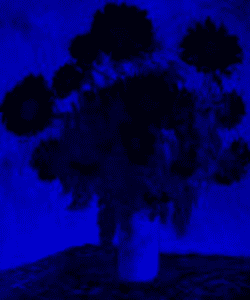
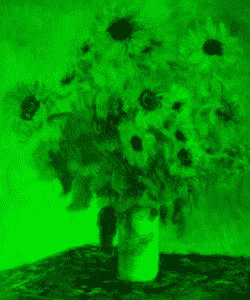
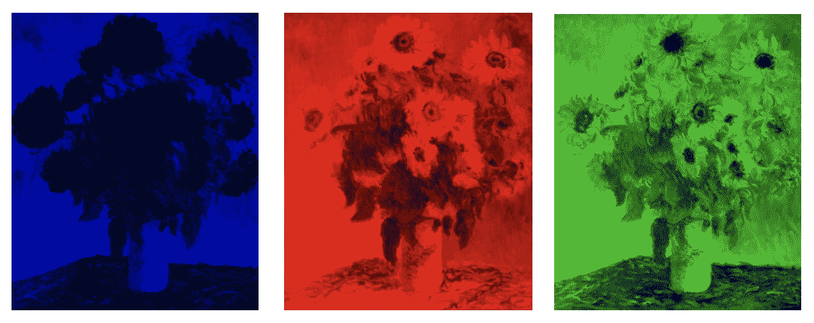

# “可观察性的三大支柱”是如何忽略全局的

> 原文：<https://thenewstack.io/how-the-3-pillars-of-observability-miss-the-big-picture/>

[蜂巢](https://www.honeycomb.io/)赞助本帖。

 [丹尼尔·费希尔

Danyel Fisher 是 Honeycomb.io 的首席设计研究员。他将自己对数据可视化的热情集中在帮助 sre 快速清晰地了解他们的复杂系统上。在加入 Honeycomb 之前，他在微软研究院工作了 13 年，研究如何帮助人们更快地从大数据分析中获得洞察力。](https://www.linkedin.com/in/danyelfisher/) 

可观察性是应用于生产软件系统的一个相对较新的概念。为了解释这意味着什么以及如何实现它，一些人试图用“[可观察性的三个支柱](https://thenewstack.io/the-3-pillars-of-observability/)”将它分成三个部分——将它分成指标、跟踪和日志。但我认为这忽略了观察一个系统意味着什么的关键点。

可观察性衡量您根据信号和外部可见输出了解系统内部状态的程度。这个术语描述了**的一种内聚能力**。可观察性的目标是帮助你清楚地看到整个系统的状态。

当您将这三个“支柱”统一到一个内聚的方法中时，以几种新的方式理解您的系统的完整状态的新能力也出现了。这种新的理解并不存在于支柱本身:当你采取统一的方法时，它是各个部分的集合。简单地用单个组件来定义可观测性忽略了更大的图景。

## 自己考虑能力

描述这个系统如何组合的一个很好的类比是使用滤色透镜。滤色镜会滤除某些波长的信息，以加强其他波长的信息。当你需要聚焦于特定的红色色调时，使用红色镜头会有所帮助，这是你应该使用的工具。但是为了看到更大的画面，你需要能够实时看到所有生动的颜色。

例如，假设您注意到一个生产服务似乎出了问题。让我们看看不同的镜头是如何看待这个问题的。

## 监控和指标

触发了一个警报，通知您传入的连接数高于指定的阈值。这是否意味着用户的生产体验很差？那就不清楚了。但是这第一个镜头，**监控工具**(即度量标准)，可以告诉我们一些我们可能需要知道的非常重要的事情。

度量透镜将系统的状态反映为一个时间序列的数字，这些数字基本上被用作度量标准。在任何给定的时间，每个度量的表现是超过还是低于我们关心的阈值？这当然是重要的信息。当我们可以对您的时间序列进行分割，并对每台机器或每个端点使用不同的时间序列时，指标变得更加重要。

指标监控工具(如 Prometheus)可用于在指标超过预定时间长度的指定阈值时触发警报。大多数度量工具允许您汇总少量标签的性能。对于您触发的警报，这可能有助于您简单地看到哪个服务遇到了问题，或者在哪些机器上发生了问题。

 为了更精确地缩小范围，您需要使用[高基数](https://www.vividcortex.com/blog/what-is-cardinality-in-monitoring)来查看您的指标——以跟踪成百上千个不同的值。这可以让您创建比较足够多的时间序列的视图，以便您可以推断出更细粒度的见解。您可以确定哪些特定的服务端点遇到了错误，或者关于哪些用户正在使用它们的信息。

打个比方，指标可以表示为一个放大镜，在你的数据上有一个蓝色的透镜。在这种情况下，您对生产中正在发生的事情的看法看起来有点像这样。

## 描摹

我们在生产中仍然有一个有问题的服务。使用高基数指标，我们能够确定什么正在失败，以及哪些用户受到了影响——但是原因仍然不清楚。下一个镜头，**追踪**，可以告诉我们一些非常重要的事情，我们可能需要知道，以便找到答案。[跟踪](https://www.honeycomb.io/blog/get-deeper-insights-with-honeycomb-tracing/)帮助您查看单个系统调用，并理解返回结果所采取的单个底层步骤。

跟踪工具(例如 Jaeger)提供了对底层组件发生的事情的极好的可见性。跟踪可以让您看到诸如哪个组件花费的时间最长或最短，或者特定的底层函数是否导致了错误。跟踪是一种非常有用的方法，可以更深入地调查由您的度量系统触发的警报。

例如，您可能能够使用从您的度量仪表板中找到的信息来查找与遇到问题的端点相同的跟踪。跟踪可以直观地向我们显示，发出的有问题的请求中最慢的部分，或者单个跟踪*跨度*，是对特定数据库的系统调用。这个跨度比平常要长得多。

但是，我们已经遇到了连续性的障碍。从度量工具到跟踪工具的过程是不平坦的。它们是两种不同类型的工具，收集不同类型的数据。为了理解这个跨度比通常要长得多，您需要以某种方式关联两个工具之间的信息。该过程可能非常耗时且容易出错，通常无法提供调试生产问题所需的快速准确性。您需要关联两者的关键数据可能在两个系统中都不可用。【T2

例如，您的指标可能表明某些用户的页面加载时间在特定页面上达到峰值。但是，除非我们的度量系统和跟踪系统共享相同的底层数据，否则我们可能无法找到反映加载时间特定变化的跟踪。我们可能不得不搜索一个完全不同的系统来寻找样本痕迹，以说明我们正在努力寻找的问题。

在我们的类比中，描摹可以表示为一个带有红色透镜的放大镜。从这个角度来看，照片看起来非常不同——但是有足够多的共同属性，我们可以成功地识别一些共同的部分，并经常在图像之间保持定向。在这个镜头下，一些部分比其他部分更突出，而一些细节方面则完全消失。

## 记录

我们的跟踪工作向我们展示了潜在问题发生在哪里:在对某个数据库的某个特定调用中。但是为什么数据库调用变慢了呢？要继续找到问题的根源，您需要检查在系统或软件级别发生了什么。第三个镜头是 **logs** ，它提供了对原始系统信息的必要洞察，可以帮助我们弄清楚您的数据库发生了什么。

例如，在该数据库的日志中滚动，您可能会发现该数据库发出的一些警告，表明它当时超载，或者您可能会发现特别慢的查询，或者您可能会发现事件队列变得太长。一旦你知道去哪里找，日志有助于揭示一个问题。

但是微观层面观点极其有限。例如，如果您想知道这个特定问题发生的频率，您需要返回到 metrics 工具来检查这个特定数据库队列的历史(假设您有这个问题的度量)。

像其他镜头一样，在工具之间切换的过程——在这种情况下，从跟踪到记录——需要一组新的搜索、一组新的交互，当然还需要更多的时间。

打个比方，我们可以把原木想象成一个绿色的透镜。

## 把镜片放在一起

不幸的是，一些可观测性解决方案只是简单地将这些镜头的视图混为一谈。他们这样做是因为*分离*能力，这取决于观察者来确定差异。

这是个不错的开始。正如我们所看到的，有些属性在一个视图中完全看不见，但在另一个视图中却很容易看到。并排比较有助于缩小这些差距。在这个例子中，每张图片都更清晰地展现了不同的方面:蓝色的图片最好地展示了花的轮廓；红色显示小花的细节；绿色似乎最能突出阴影和深度。

但是这三个独立的透镜有其固有的局限性。可观察性不仅仅是一次看到每一件东西的能力；这也是理解更广阔的图景的能力，以及看到这些部分如何组合起来向您展示您的系统的状态。

## 各部分的总和越大

你的系统的真相是，每个镜头突出的方面并不是在真空中单独存在的。只有一个底层系统运行着它所有的丰富属性。如果我们将这些维度分离出来—如果我们从日志和跟踪中分别收集指标监控—那么我们可能会忽略这样一个事实，即这些数据反映了一个底层系统的状态。

一种统一的方法收集并保存这种丰富性和维度性。为了看到全貌，我们需要平稳、精确、高效和连贯地浏览数据。当这些镜头被统一到一个工具中时，我们可以做一些事情，例如快速发现一个痕迹中包含在其他痕迹中重复出现的异常，包括找出在哪里出现以及出现的频率。

可观察性工具不仅仅需要这些基本镜头，它们还需要维护一组遥测数据和存储，这些数据和存储保留足够丰富的上下文，以便我们可以从指标的角度查看系统事件，跟踪**和**日志——一次完成。监控、跟踪和日志不应该是不同的数据集。相反，它们应该是同一个整体的不同视图。这些镜头不是用来观看独立的画面的。每一个都只是让某些方面变得更加清晰。可观察性工具应该使得度量折线图(或热图)上的任何点都连接到相应的轨迹；任何跟踪范围都应该能够查询日志数据视图。

可观察性的力量不仅仅来自于不必切换环境。拥有一个单一的数据存储还可以实现对数据进行可视化切片等功能。换句话说，你可以看到两组事件在所有不同的维度(即场)上有什么不同。这种分析是孤立的度量系统根本无法显示的(因为它们不存储单个事件),或者对于日志记录系统来说，这种分析是极其令人疲惫的。

手动连接这些镜头意味着需要自己进行关联，以发现不明显的问题。对于我们的类比来说，这就像看到一个区域在绿色和红色镜头中都是浅色的，并且直觉地认为共同的颜色实际上必须是黄色。一些艺术家可能能够推断，一个系统可以为你做数学，或者你可以在图像之间来回翻转，盯着比特对比的地方。

可观察性让你看到你的生产软件系统的美丽和完整的画面。你不需要技巧和经验就能在脑海中组合这些镜头来推测哪种黄色可能是个问题。你所需要的是不小于整体总和的部分。

*从今天开始你的可观察性之旅，看看我们的电子指南“ **[开发者可观察性](https://info.honeycomb.io/observability-for-developers)** ”*

通过 Pixabay 的特征图像。

目前，新堆栈不允许直接在该网站上发表评论。我们邀请所有希望讨论某个故事的读者通过推特(Twitter)或脸书(T2)与我们联系。我们也欢迎您通过电子邮件发送新闻提示和反馈:[反馈@thenewstack.io](mailto:feedback@thenewstack.io) 。

<svg xmlns:xlink="http://www.w3.org/1999/xlink" viewBox="0 0 68 31" version="1.1"><title>Group</title> <desc>Created with Sketch.</desc></svg>