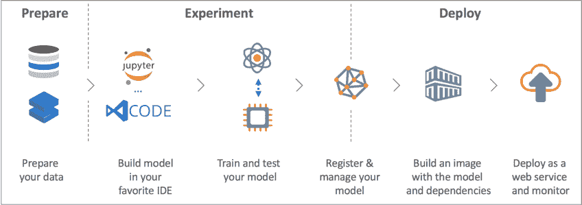
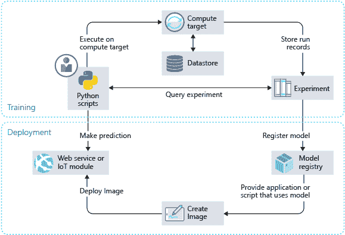
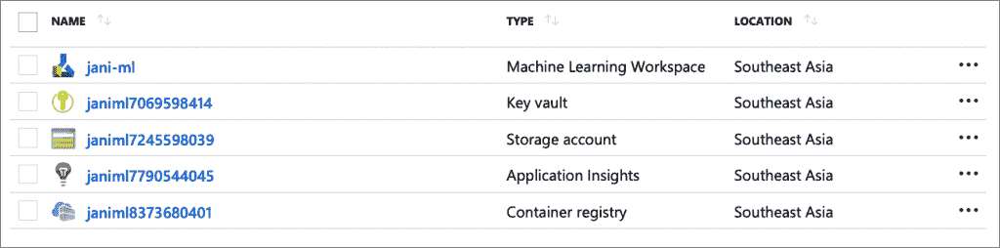
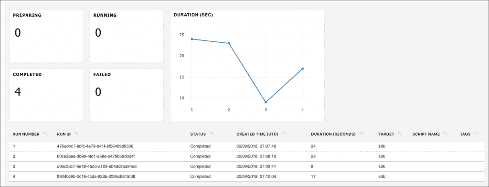

# Azure ML 如何简化基于云的机器学习

> 原文：<https://thenewstack.io/how-the-azure-ml-streamlines-cloud-based-machine-learning/>

微软是首批加入机器学习 PaaS 潮流的公共云提供商之一。从认知 API 到高级的基于 GPU 的深度学习虚拟机，Azure 拥有用于构建和部署机器学习模型的全套工具。

最近，在微软 Ignite，该公司宣布了一项改进的服务，旨在标准化和简化 Azure 上的 ML 开发。这个新平台被命名为 [Azure ML Service](https://azure.microsoft.com/en-in/services/machine-learning-service/) ，旨在匹配不断发展的机器学习模型的不断变化的动态。微软希望让 Azure 成为构建、管理和托管机器学习模型的首选云。

目前，在预览版中，Azure ML 服务似乎是微软朝着正确方向迈出的一步。该服务使用 Python API，可以很容易地与现有的 ML 项目集成。它在本地和基于云的开发之间取得了恰当的平衡。任何可以通过门户交互完成的事情都可以通过 Python API 编写脚本。

微软将笔记本作为 Azure ML 的首选环境。开发人员可以在本地工作站上使用 Jupyter 笔记本，在云端使用 Azure 笔记本，或者使用 Databricks 笔记本进行数据准备。这些笔记本可以使用 Python APIs 与其他 Azure 服务(如计算和存储)无缝集成。

我可以集成 Azure ML，在我基于 Ubuntu 16.04 的本地测试床上运行实验，该测试机运行由 NVIDIA GPU 支持的 TensorFlow。

Azure ML 非常类似于亚马逊的 SageMaker。这两种服务都依赖笔记本进行开发，对象存储用于存储数据集，容器注册用于模型管理，容器引擎用于服务。Azure ML 的关键区别在于对 AutoML 的支持，它甚至可以用于回归和分类任务。近期我会发表亚马逊 SageMaker vs. Azure ML 的深潜分析。

> 像 AWS 一样，微软也将笔记本作为 Azure ML 的首选环境。

Azure ML 服务由多个组件组成。一旦完成配置，它就可以成为初学者和有经验的数据科学家的强大测试平台。该平台为模型训练和模型托管提供了工具和 API。

让我们仔细看看 Azure ML 服务的架构。

### 工作区

在 Azure ML 中，工作空间充当与机器学习项目相关的所有资产和工件的逻辑边界。从数据集到笔记本到训练模型到超参数再到容器图像，一个工作空间可以容纳所有内容。开始使用 Azure ML 的第一步是在公共云中创建一个工作区。

当您通过门户访问工作区时，您将看到以下资源:

每个工作区都有一个与之关联的配置，这是一个简单的 JSON 文件，包含 Azure 订阅、资源组和工作区名称等细节。Azure ML 的 Python API 使用这种配置将当前环境与基于云的工作区关联起来。

### 开发环境

一旦创建了工作空间，就可以使用配置来创建基于 Jupyter 笔记本(本地)、Azure 笔记本(云)、Python IDEs(如 VS Code 或 PyCharm(本地))或数据科学虚拟机(云)的开发环境。将开发环境与 Azure ML 工作区连接起来的唯一先决条件是 Python API，它可以用一个 pip install 命令安装。

将环境连接到工作空间后，下一步是创建一个实验，该实验跟踪训练模型所涉及的所有迭代。

### 实验—目标计算环境

实验需要一个目标执行环境来训练模型。目标执行环境可以是任何计算平台，从本地 Python 虚拟环境到高级 Azure Batch AI。支持的平台包括本地计算机、数据科学虚拟机、Azure Batch AI 和 Azure HDInsight。根据模型的复杂程度，用户可以选择由 GPU 和 FPGAs 支持的从简单到最复杂的计算环境。

### 实验—目标存储环境

定义计算环境后，Azure ML 服务需要知道输入数据集的位置。如果数据集存储在本地计算机上，则需要将其复制到 Azure 存储以进行集中访问。有一个 Python API 来执行这项任务。一些标准软件包，如 Pandas 和 MatPlotLib，可用于探索和可视化数据。

### 评估者—评估训练跑步

下一步是根据确定的数据集和计算目标开始培训。开发人员可以自由选择他们所选择的框架来训练模型。Azure ML 服务没有规定培训框架。它可以与流行的框架一起工作，包括 Scikit-learn、Keras、TensorFlow、CNTK、MXNet 和 PyTorch。对于 PyTorch 和 TensorFlow 作业，Azure Machine Learning 还提供了各自的自定义 PyTorch 和 TensorFlow 估算器，使这些框架易于使用。

Azure ML 希望您包含一个评估器，记录每次迭代的准确度和精确度。评估器是所选训练框架和 Azure ML 服务之间的桥梁。估计器报告的最精确迭代用于最终确定和注册模型。每次迭代的输出都存储为 PKL 文件或任何其他可序列化的格式。Azure ML 没有为最终确定模型强加任何特定的格式。唯一的期望是推理中使用的脚本知道如何反序列化模型。

开发人员可以通过加载样本数据、预测结果和评估结果来测试模型。他们可以使用 ROC 曲线和混淆矩阵等标准技术来评估训练过程的每次运行。

当培训过程在目标计算环境中运行时，可以从 Azure Portal 监控进度。还可以通过 RunDetails API 在笔记本中对其进行监控。

### 模型注册

训练的最后一步是将模型注册到 Azure ML workspace，它可用于推理。此步骤将最终确定的模型从培训环境上传到工作区。

### 模型推理

有了经过训练和评估的模型，就可以用于大规模的推理。部署模型有两个步骤——创建容器映像和托管 web 服务。Azure ML 为两者都公开了 API。容器映像由最终确定的模型、超参数、对模型进行评分的脚本以及定义运行时依赖关系的 YAML 文件组成。这个自包含的 Docker 映像将拥有从训练好的模型执行推理所需的一切。

最后，图像可以部署到一个托管环境中，在那里它作为 web 服务公开。托管 web 服务的目标环境可以是 Azure 容器实例(ACI)、Azure Kubernetes 服务(AKS)、Azure IoT Edge 和现场可编程门阵列(FPGA)。

在即将发表的一篇文章中，我们将使用 Azure ML 基于 StackOverflow 数据集构建并托管一个预测开发人员工资的模型。敬请期待！

微软是新堆栈的赞助商。

<svg xmlns:xlink="http://www.w3.org/1999/xlink" viewBox="0 0 68 31" version="1.1"><title>Group</title> <desc>Created with Sketch.</desc></svg>