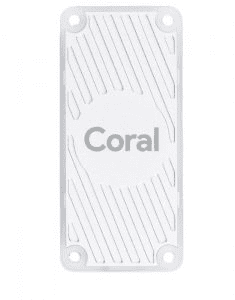

# 谷歌 Coral Edge 平台如何为设备带来人工智能的力量

> 原文：<https://thenewstack.io/how-the-google-coral-edge-platform-brings-the-power-of-ai-to-devices/>

工业物联网(IoT)和人工智能(AI)的兴起正在使边缘计算对企业具有重要意义。许多垂直行业，如制造、医疗保健、汽车、运输和航空，都在考虑投资边缘计算。

边缘计算正迅速成为生成数据的设备和处理数据的公共云之间的管道。在机器学习和人工智能的背景下，公共云用于训练模型，边缘用于推理。

## **云 TPU:加速云端的 ML 训练**

为了加速云中的 ML 培训，公共云供应商如 AWS、Azure 和谷歌云平台(GCP)提供了 GPU 支持的虚拟机。如今，NVIDIA 的 GPU 是 ML 研究人员和数据科学家在云中训练模型的最首选加速器。

GPU 被设计为通用处理器，用于并行执行计算密集型计算。鉴于它们执行矩阵加法和乘法的速度，GPU 被广泛用于视频渲染和高性能计算(HPC)等场景。ML 训练和推理是 GPU 支持的最新用例之一。尽管 GPU 是 ML 训练的首选，但它们并不是专门为它设计的。

机器学习一直是谷歌许多产品和服务的核心。为了加速 ML 工作，谷歌建立了一个定制的 ASIC(专用集成电路)，称为张量处理单元(TPU)。与 GPU 不同，TPU 针对神经网络所需的大规模并行计算进行了高度优化。谷歌一直在将 TPU 用于各种应用，如搜索、照片和翻译。TPU 是利用谷歌在机器学习领域的丰富经验和领先地位从头设计的。

【T2

随着在云计算领域的积极投资，谷歌已经向 GCP 客户公开了一些内部工具和平台。云 TPU 是向 GCP 用户提供的服务之一。

云 TPU 使客户能够使用 TensorFlow 在谷歌的 TPU 加速器硬件上运行机器学习工作负载。云 TPU 旨在实现最大的性能和灵活性，以帮助研究人员、开发人员和企业构建 TensorFlow 计算集群。高级 Tensorflow APIs 帮助开发人员让模型在云 TPU 硬件上运行。云 TPU 以合理的价格提供训练 TensorFlow 模型的最佳性能。它们是公共云中最便宜的 ML 加速器。

## **边缘 TPU:在边缘加速 ML 推理**

最近，谷歌宣布推出 Edge TPU，这是专为单板计算机和片上系统设备设计的云 TPU 的缩小版。虽然边缘 TPU 可以用于训练 ML 模型，但它是为推理而设计的。【T2

谷歌建议使用其人工智能平台和 AutoML Vision 等云服务来训练 TensorFlow 模型，并将其转换为在 Edge TPU 上运行。TensorFlow Lite 是 TensorFlow 的一种风格，适用于移动设备和低功耗环境。现有的 TensorFlow 模型可能会转换为在 iOS 和 Android 上运行的 TensorFlow Lite 格式。相同的 TensorFlow Lite 模型可以针对边缘 TPU 进一步优化。Google 有一个 web 编译器和一个命令行来为 Edge 转换 TF Lite 模型。

Edge TPUs 模块占地面积小，非常适合嵌入无人机、相机和扫描仪等设备。

## **Coral:编程边缘 TPU 的平台**

在生产中部署 Edge TPU 之前，需要对其进行编程以运行特定的张量流模型。为了使开发人员能够轻松编程和调试用于推理的模型，Google 建立了一个名为 Coral 的平台。它是硬件和软件的结合，使开发人员能够快速原型化人工智能解决方案。

目前，有两种 Coral 设备可供开发人员在边缘编程 AI——Coral Dev Board 和 USB 加速器。

Coral Dev 板是一种单板计算机，带有可拆卸的模块上系统(SOM ),采用 Edge TPU。说到外观，它很像树莓皮。该设备配有恩智浦 i.MX 8M SOC CPU、集成的 GC7000 Lite 图形 GPU，当然还有用于 ML 加速的 Edge TPU。该设备拥有 1 GB LPDDR4 内存和 8 GB eMMC。它运行 Mendel Linux，这是一种专为设备优化的 Debian 风格。

Coral Dev 板是一个独立的设备，可以拥有自己的摄像头模块，用于实时推断图像和视频。它还有一组与 Raspberry Pi 头兼容的 GPIO。针对 Edge TPU 优化的 TensorFlow Lite 模型可以在设备上本地运行。Coral Dev Board 的关键用例是 edge 解决方案的快速原型制作，这些解决方案使用 TensorFlow 模型来解决计算机视觉问题。

谷歌还有另一款带有 TPU 的设备，叫做 USB 加速器。类似于 u 盘，这个设备可以插入任何 Debian 主机的 USB 端口，包括 Raspberry Pi。它配有一个 USB-C 型连接器，以获得更好的吞吐量和功率。主机需要运行 Coral SDK 来将 TF Lite 模型卸载到边缘 TPU。开发人员可以使用 USB 加速器在任何现有的 Linux 主机上构建人工智能解决方案的原型。

Coral Dev Kit 售价 150 美元，USB 加速器售价 75 美元。它们可以从谷歌列出的在线零售商那里订购。

在我即将发表的一篇文章中，我将向您介绍优化 Edge TPU 张量流模型的工作流程。敬请关注。

贾纳基拉姆·MSV 的网络研讨会系列“机器智能和现代基础设施(MI2)”提供了涵盖前沿技术的信息丰富、见解深刻的会议。在 [http://mi2.live](http://mi2.live) 注册参加即将举行的 MI2 网络研讨会

<svg xmlns:xlink="http://www.w3.org/1999/xlink" viewBox="0 0 68 31" version="1.1"><title>Group</title> <desc>Created with Sketch.</desc></svg>