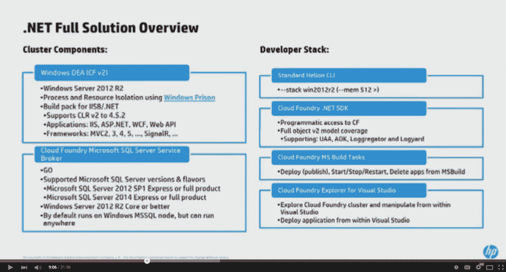
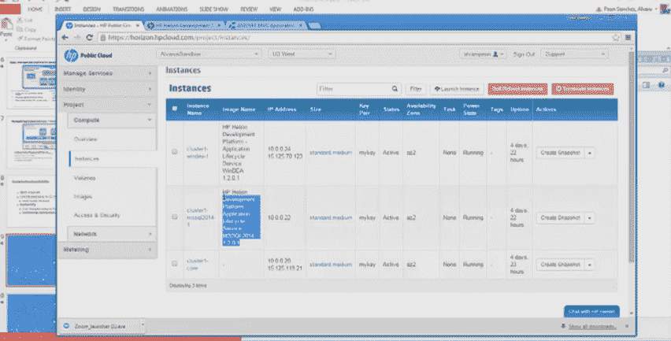

# Helion 开发平台如何提供？NET 对 Windows 开发人员的支持

> 原文：<https://thenewstack.io/how-the-helion-development-platform-offers-net-support-for-windows-developers/>

[HP Helion OpenStack](http://www8.hp.com/us/en/cloud/hphelion-openstack.html) 是一个开放、灵活、高可用的云计算平台，基于 OpenStack 技术的主干版本，而 [HP Helion 开发平台](http://www8.hp.com/us/en/cloud/helion-devplatform-overview.html)基于 Cloud Foundry 和 OpenStack 软件，提供可移植性、灵活性和多语言支持。

现在，Helion 开发平台 1.2 版。NET 支持允许 Windows 开发人员在熟悉的环境中使用他们习惯的工具工作。

在这个教程剪辑捕捉到的新栈创始人亚历克斯威廉姆斯；惠普 Helion 开发平台高级产品经理 Alvaro Peon Sanchez 惠普 Helion 杰出工程师兼工程总监 Gert Drapers 我们看到了使用 Cloud Foundry 基础设施与 OpenStack 的集成，以及 Helion 开发平台如何通过结合这两层来提供完整的端到端解决方案和服务，开发人员可以将这些服务用于他们的解决方案和应用。

[https://www.youtube.com/embed/yF1trLvM4gM?feature=oembed](https://www.youtube.com/embed/yF1trLvM4gM?feature=oembed)

视频

提供两种类型的服务:非托管服务和托管服务。MySQL 服务基于名为 [Trove](https://wiki.openstack.org/wiki/Trove) 的 OpenStack 技术，该技术提供企业级应用程序管理，因此，如果出现问题，自动备份可以帮助恢复。

目前，Windows 不支持内核级别的容器，但与微软在进程和资源隔离方面的合作导致了 Windows 监狱的创建，它尽可能接近今天 Windows 中可以拥有的容器。

同样值得注意的是 SQL server integration，这是一个用 Go 编写的 service broker，它为应用程序创建一个数据库和适当的安全上下文来与数据库对话，允许应用程序与 SQL server 对话并拥有一个 SQL server 实例。所需要的只是改变配置连接。

一旦指定了堆栈，告诉控制器这是一个 Windows 应用程序。NET SDK 允许编程访问 Cloud Foundry。Windows power 用户可以利用它来创建 power shell 命令并自动执行日常任务。

MS Build Tasks 在 Visual Studio 内和命令行上提供了启动、停止和发布应用程序的管理功能。此外，Explorer 允许用户连接到端点，并探索用户有权访问的对象，无论是应用程序、服务还是路由。启动、停止、重新启动、删除等应用程序操作也可以在此模块中进行管理。

核心构建块是微软的 IIS Hostable Web Core，它允许用户在自己的进程下运行 IIS 环境，为应用程序提供最高程度的保真度。

HP Helion 团队考虑了。NET 生态系统来处理 HTTP 端点，并使应用程序能够在 Cloud Foundry 环境中运行。他们首先评估了 Mono stack(的开源实现)。NET framework)在 2014 年 8 月，在微软开源公共语言运行时(CLR)主机并使其在 Linux 和 Mac 上得到正式支持之前。那时，Mono 作为一个移动平台是可行的，但是互联网 HTTP 主机栈还没有得到很好的发展。微软在 CLR 4.6 上的工作提供了更多的稳定性。与此同时，微软一直在说像 WCF 这样的框架不会进入 Mono 堆栈。

拥有大量。NET 开发人员希望保留这些技能，但他们也希望将有用的应用程序带入 Cloud Foundry 的生活方式中。因此，该团队决定采用 IIS Hostable Web Core 来提供最高保真度的托管环境。

监狱容器提供沙箱，确保进程在最低特权用户处独立运行，在监狱实例之间没有访问，同时最小化 CPU 资源。应用程序使用任何 Cloud Foundry 环境中的标准格式 buildpack 推送，但它可以配置 IIS 可托管 Web 核心。

 在教程中，我们看到公有云展示了 Windows DEA 和 SQL Server 的实例。该应用程序是在 Visual Studio 中准备的，其中我们在 Cloud Foundry Explorer 中看到了端点。

NuGet 包(VS-hosted dependency management for developers)通过项目右键菜单下载；在此对话框中，将返回对 Cloud Foundry 的搜索。NET SDK 和构建路径，并且两者都已安装，在菜单中启用“发布到 Cloud Foundry”。

帐户登录并完成配置文件后，用户可以选择在本地构建(如果发布者不愿意将他们的源代码推送到系统中)或在服务器中构建，每个应用程序都有一个已发布的配置文件，最终是一个带有数据库的 SQL Server 实例。

惠普是新堆栈的赞助商。

<svg xmlns:xlink="http://www.w3.org/1999/xlink" viewBox="0 0 68 31" version="1.1"><title>Group</title> <desc>Created with Sketch.</desc></svg>