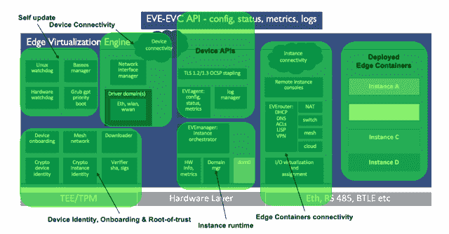

# Linux 基金会的 EVE 如何取代 Windows、Linux 进行边缘计算

> 原文：<https://thenewstack.io/how-the-linux-foundations-eve-can-replace-windows-linux-for-edge-computing/>

Linux 基金会赞助了这篇文章。

 [罗曼·沙波什尼克

Roman 是一名开源软件专家，目前在 Apache Software Foundation 和 LF Edge 的董事会任职。他是边缘虚拟化初创公司 Zededa 的联合创始人兼产品和战略副总裁。在他的职业生涯中，Roman 曾在多家知名公司担任技术领导职务，包括 Sun Microsystems、Yahoo！、Cloudera 和 Pivotal 软件。他拥有圣彼得堡国立大学的数学和计算机科学硕士学位。](https://www.linkedin.com/in/shaposhnik/) 

边缘计算能否成为全球关键业务的支柱取决于底层网络的成功与否。

认识到 Edge 支持 Edge 网络的潜力和紧迫性，Linux 基金会在今年早些时候创建了 [LF Edge](https://www.lfedge.org/) ，这是一个致力于为边缘计算创建开放、不可知和可互操作框架的伞式组织。类似于[云原生计算基金会(CNCF)](https://www.cncf.io/) 为云开发所做的工作，LF Edge 旨在加强关键参与者之间的合作，以便整个行业能够更快地发展。

Gartner [预测，到 2021 年，全球将有大约 250 亿台物联网设备投入使用。这些设备中的每一个都有能力产生大量有价值的数据。这些数据中的大部分可以用于改善业务关键型运营，但前提是我们能够及时高效地对其进行分析。如上所述，正是这些因素的结合导致了边缘计算成为当今发展最快的技术领域之一。](https://www.gartner.com/en/newsroom/press-releases/2018-11-07-gartner-identifies-top-10-strategic-iot-technologies-and-trends)

这种在边缘实现互操作性的想法尤为重要，因为构成边缘设备的硬件是如此多样化——比数据中心中的服务器多得多。然而，为了让边缘计算取得成功，我们需要能够在本地网关设备上运行应用，以近乎实时地分析和响应物联网和工业 4.0 数据。如何设计能够兼容各种硬件并在没有可靠云连接的情况下运行的应用程序？这是 LF Edge 正在帮助解决的挑战。

解决方案的一部分是[Project EVE](https://www.lfedge.org/projects/eve/),[ze deda](https://www.zededa.com/)上个月捐赠给 LF Edge 的 Edge 虚拟化引擎。我认为 EVE 为 edge 做了 Android 为手机 ***和*** 做的事情，VMware 为数据中心做的事情:将软件与硬件分离，使应用程序开发和部署更容易。

移动和服务器计算需求之间这种奇怪的(有点出乎意料的)相互作用正是 edge 如此令人兴奋的原因。作为一个开源项目，EVE 现在有一个独特的机会来融合来自各种项目的构建模块的最佳部分，如 Android、ChromeOS、CoreOS、Qubes OS、Xen、Linuxkit、Linuxboot、Docker、Kubernetes 和 unikernels(又名库操作系统——其中 AtmanOS 是我们的最爱)。如果您仍然不相信所有这些项目都有很多共同点，只需考虑以下几点:

*   今天的边缘硬件与过去功能不足的专用嵌入式硬件完全不同。所有这些设备通常都配有几千兆位的 RAM、几十(如果不是几百)千兆位的闪存和现代化的高速 CPU，默认情况下具有最新的功能(如虚拟化扩展)。简而言之，它们非常能够支持与开发人员现在在任何公共云中认为理所当然的完全相同的云原生软件抽象:容器、不可变的基础设施、12 因素应用和持续交付软件管道。从这个角度来看，边缘硬件开始变得非常像数据中心中的服务器(无论是公共云还是私有云)。同时；
*   这些盒子被放置在野外。这意味着当涉及到安全性和网络要求时，它们存在于一个看起来完全不像传统数据中心的世界中。事实上，它看起来很像移动计算平台发展的世界。[就像 iphone](https://news.softpedia.com/news/apple-s-and-our-dream-of-an-unhackable-iphone-is-finally-coming-true-521415.shtml)一样，这些盒子总是被盗、被拆卸和被黑客攻击，希望里面的秘密能够被揭露并被用作攻击媒介。在网络方面，相似性甚至更加惊人:我们的智能手机必须不断应对定义不清、不稳定和异构网络的方式(例如，在 WiFi 和 LTE 之间跳跃)为如何实现边缘计算网络建立了一个非常好的模型。

不可否认，EVE 站在所有这些开源巨头的肩膀上，尽管它还有很多自己的开源开发要做。在本文的剩余部分，我将介绍 EVE 项目的一些技术细节。

**EVE 项目概述**

从根本上说，EVE 是传统(甚至一些实时)操作系统(Linux、Windows、VxWorks 等)的替代品。)在当今的物联网和边缘部署中司空见惯。EVE 在 UEFI/BIOS 之后马上接管控制权，我们有未来的计划[围绕 Linuxboot](https://trmm.net/LinuxBoot_34c3) 让 EVE 实际上完全取代你的 UEFI/BIOS。

EVE 有三个关键组件:一个 type-1 hypervisor，直接在裸机上运行；边缘容器运行时，允许您在虚拟机或容器中运行应用程序；以及用于安全性的强化信任根实现。测试 EVE 的硬件的完整列表可在该项目的维基页面上获得，但我们预计 EVE 可以在大多数现代边缘计算硬件上运行(包括研华和超微等大公司的产品，以及 ARM 和英特尔的架构)。

一旦 EVE 实例启动并运行，它做的第一件事就是联系预定义的控制器，并从控制器接收如何配置自身以及开始执行哪些工作负载的指令。控制器根据从部署给定部署的 DevOps 收到的整体编排请求，为它所知道的每个支持 EVE 的设备构建这些指令清单。

EVE 用于与控制器对话的 API 是 LF Edge 标准化工作的一部分，我们完全期望它能够发展成为边缘虚拟化基础设施控制和监控方式的行业事实标准。你可以在 [EVE 的 GitHub 库](https://github.com/lf-edge/eve/)中看到[当前版本的 API](https://github.com/lf-edge/eve/tree/master/api/proto) 和文档。

DevOps 将部署到所有支持 EVE 的设备上的工作负载被打包为边缘容器。Edge 容器是传统 [OCI 容器](https://www.opencontainers.org/)的延伸，未来几个月，LF Edge 将继续致力于其标准化。Edge 容器扩展背后的想法是通过单一的打包和分发格式，允许虚拟机、单核和容器工作负载之间的无缝集成。

继续我们的 Android 类比，有人可能会说 EVE 正试图为 edge 做 Android 为移动所做的事情，edge 容器意味着 Edge 的[apk](https://en.wikipedia.org/wiki/Android_application_package)。

EVE 的所有功能都是由一系列相互完全隔离运行的独立 Go 微服务提供的，类似于 Qubes OS 引入的激进隔离[的开创性思想。我们的最终目标是让这些微服务中的每一个都成为一个独立的单核，直接运行在第 1 类虚拟机管理程序之上，完全不需要任何操作系统。我们计划利用](https://www.qubes-os.org/doc/architecture/) [AtmanOS](https://atmanos.org/) 社区所做的出色工作来实现这一目标。

EVE 的所有微服务和基础设施元素(想想 boot loader、Linux 内核等。)被捆绑到一个类似于 [Linuxkit](https://github.com/linuxkit/linuxkit) 的发行版中，该发行版允许我们提供[可启动的 EVE 映像](https://hub.docker.com/u/lfedge/eve)，准备部署在基于[英特尔](https://github.com/lf-edge/eve#how-to-use-on-an-amd-board)和 [ARM](https://github.com/lf-edge/eve#how-to-use-on-an-arm-board) 的边缘硬件上。

我们的信任根架构利用 TPM 和 TEE 硬件元素，为实施灵活的秘密管理、数据加密和测量启动功能提供了坚实的基础，而不会给应用程序开发人员带来任何复杂性。

最后，在连接方面，EVE 通过透明集成 [LISP 协议](https://github.com/farinacci/lispers.net)和加密路由为其边缘容器提供了灵活的网络功能。这样，EVE 可以提供开箱即用的 SD-WAN 和网状网络功能，而无需额外的集成工作。

综上所述，EVE 架构的内部结构如下所示:

虽然这种架构有时看起来很复杂，令人望而生畏，但我们正迅速投资于记录它，并使它更灵活地工作。EVE 社区分享了 [Apache 方式](https://www.apache.org/theapacheway/) 的精神，并且相信“社区优于代码”我们欢迎对整个社区有益的任何类型的贡献，而不仅仅是代码贡献:

*   提供用户反馈；
*   分享您的用例；
*   传播或合作相关产品和技术；
*   维护我们的维基；
*   改进文件；
*   贡献测试场景和测试代码；
*   添加或改进硬件支持；
*   修复错误和增加新功能。

Project EVE 最重要的部分是它是一个面向社区的开放标准，旨在使其他人更容易为 edge 创建和部署应用程序。现在代码已经通过 LF Edge 正式开源，任何人都可以贡献和探索它。

云计算原生计算基金会是新堆栈的赞助商。

来自 Pixabay 的特征图像。

<svg xmlns:xlink="http://www.w3.org/1999/xlink" viewBox="0 0 68 31" version="1.1"><title>Group</title> <desc>Created with Sketch.</desc></svg>