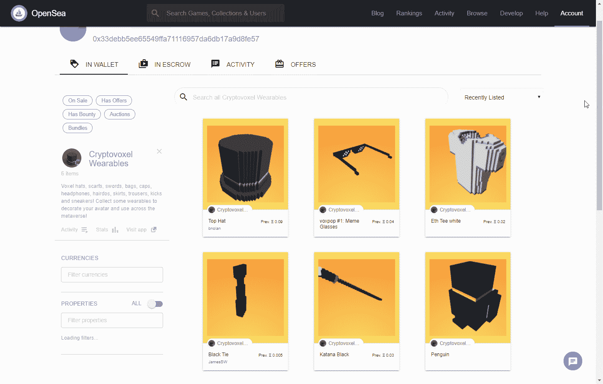

# 开放的元宇宙将如何改变我们的网络身份

> 原文：<https://thenewstack.io/how-the-open-metaverse-will-transform-our-online-identities/>

当你在 2022 年听到“元宇宙”这个词时，你可能会想到 Meta(脸书)或大型在线游戏平台之一，如堡垒之夜或 Roblox。但是互联网上也出现了“开放元宇宙”项目的热潮，其中大部分是基于网络的——有些也与 Web3 生态系统有关。我认为开放的元宇宙是互联网未来真正建立的地方。

为了了解开放元宇宙上正在开发的东西，我一直潜伏在[开放元宇宙互操作性组织](https://github.com/omigroup/omigroup/) (OMI)的 Discord 服务器中，该组织专注于“通过设计和推广身份、社交图、库存等协议来桥接虚拟世界”OMI 去年成立了 W3C 社区组织[,目的是“帮助构建我们的标准工作，并为我们自己提供一个合适的知识产权保护框架。”](https://www.w3.org/community/metaverse-interop/)

金是的第一批成员之一，也是开放技术的积极实验者。我通过 Mozilla Hubs 中的一个 3D 虚拟空间与他交谈，谈论开放的元宇宙意味着什么——特别是关于我们的在线身份——以及开发者如何参与其中。

## 头像和在线身份在元宇宙意味着什么

金是化名，这意味着他没有在网上透露他的真实身份。事实证明，这是开放的元宇宙的一个重要特征。他去年在推特上写道:“假名工作在虚拟经济中会很重要，虚拟角色天生就是一种保护隐私的技术。”。假名也反映了对金的主要影响，包括游戏文化，第一波在线虚拟现实耳机(由 Oculus 领导)，加密货币和“虚拟 ubers”。后者是“虚拟 YouTubers”的缩写——这些是使用虚拟化身的在线艺人，这种做法在日本尤其流行。

金和他的开放支持者都有 3D 头像。金在不同平台上的形象各不相同(他在我们的 Hubs call 中以一个小白机器人的形象出现)，但大多数时候他的形象可以通过以下视觉特征识别:白头发、墨镜、黑色连帽衫和黑色针织帽。

对于金来说，头像是新兴互联网的核心导航方式。“社交是虚拟现实的杀手级用例，”他告诉我。他和其他 OMI 成员花了很多时间访问各种虚拟世界，用他们的化身做实验，并创建其他数字资产。这个群体中流行的 3D 世界包括 [VRChat](https://hello.vrchat.com/) 、[体素](https://www.voxels.com/)和[web objector](https://webaverse.com/)。

元宇宙科技领域的一些大公司对 3D 头像持更为怀疑的态度。“头像在某些情况下是有用的，但不是在大多数情况下，”Unity 首席执行官 John Riccitiello 在最近的一次采访中说。“我当然不认为在亚马逊上买书需要头像，”他补充道。里奇泰洛在这一点上可能是正确的，但对于金和他的开放信徒来说，这是题外话。“自我表达和自我认同是整个事情的基石，”金说。

如果 3D 互联网是未来，那么思考这可能会对我们在网上的集体认同感产生什么影响是很有趣的。在过去的十多年里，脸书、Instagram 和 Twitter 等社交媒体服务鼓励我们在网上发布自己的照片，表达我们的各种观点。但是 3D 互联网(或者至少是开放的元宇宙部分)似乎鼓励了一种更有趣和探索性的认同感。

“在虚拟世界和电子游戏中，创造一个新的玩家标签并按照你的意愿定制你的角色只是默认的文化，”金解释道。“而社交媒体在文化方面并不完全相同。”

## 开放的元宇宙堆栈

对于想尝试 3D 互联网的开发者，金建议他们了解“虚拟化身的 VRM 和所有其他定制几何图形的 glTF” [glTF](https://en.wikipedia.org/wiki/GlTF) 是 Khronos 集团开发的三维场景和模型开放标准，常用于 Three.js、Babylon.js 等框架。

[VRM](https://vrm.dev/en/vrm/vrm_about.html) 出自 VTuber 世界，构建于 glTF 之上。这是 3D 化身的标准，由起源于日本的 VRM 联盟维护。

对我来说，元宇宙趋势令人沮丧的一面是大公司一直在谈论互操作性，然而这些公司却很少提到网络。我问金，随着 3D 互联网在 21 世纪 20 年代的发展，他是否认为网络将成为 3D 互联网的重要组成部分？

“我认为网络肯定会成为其中很大的一部分，”他回答道。“很多甚至是本地的东西都在底层使用网络，比如在后端。情绪也在改变。例如，Meta 正在为他们的 Horizons 平台开发一个 web 客户端。这并不为人所知，因为它被埋在 Twitter 的一个帖子里，但他们正在努力。”

他继续将网络描述为元宇宙的“沉睡的巨人”，因为 WebAssembly、WebGPU 和 WebXR 等网络技术标准越来越复杂。

开放元宇宙堆栈的另一个重要部分是 NFTs。金和的成员们看好“网络 3”，主要是因为它的社区和金融化动机。尤其是 NFT 是一个关键因素，因为它们潜在地为人们提供了一种拥有数字资产的方式，并且[将权利](https://thenewstack.io/can-nft-technology-expand-beyond-digital-apes-and-punks/)附加到这些资产上。

“很多人想要互操作性和所有权，”金说，“这就是这个东西的整个时代精神。但是，谁真正在做培养[…]跨不同平台移动和可验证等能力的工作呢？而且，你知道，这是一项持续的工作——现在还为时过早。”

体素中的 NFT 可穿戴设备:图片[经金](https://hackmd.io/@XR/avatars)。

尽管金认为 Web3 技术在元宇宙大有可为，但他警告说“需要[……]更好地宣传他们能做些什么。”他希望在 Web3 上看到更多“在战壕中”的工作，以“证明人们正在销售的一些概念。”M3 小组正在做一些这方面的工作，尽管还不清楚 Web3 世界中的许多人是否已经注意到了。

## 在开放的元宇宙开始

在过去的几个月里，我一直在探索 3D 互联网，甚至成功地使用 VRoid Studio(金在他的[“如何获得 gud”指南](https://github.com/M3-org/git-gud/blob/main/README.md)中推荐的工具)创建了一个基本的虚拟角色。这很有趣，所以我问金，对于想体验元宇宙的新手和开发者，他还有什么其他的建议？

“从某种 devlog 开始，在 VRoid Studio 中制作一个虚拟形象，[并]用体素或中枢制作一个世界，”他建议道。“我推荐像 [JanusWeb](https://www.janusvr.com/) 和 [A-Frame](https://aframe.io/) 这样的 WebXR 框架，因为这样你就可以从开始到结束自托管自己的虚拟空间。”

他还推荐 VRChat，因为它教会了“数百万人学习 Unity 和 Blender 来制作自己的头像和世界，从 VRChat 导出到开放平台实际上并没有那么困难。”事实上，他和 OMI 小组目前正致力于改进向开放的元宇宙出口的工具。

除了上面提到的资源，我还推荐关注[金的博客](https://xrdevlog.com/)。我钦佩金和他的朋友们为创造一个开放的所做的工作。我也相信 3D 互联网需要基于网络，所以我鼓励所有读者使用这里讨论的工具开始探索。元宇宙见！

<svg xmlns:xlink="http://www.w3.org/1999/xlink" viewBox="0 0 68 31" version="1.1"><title>Group</title> <desc>Created with Sketch.</desc></svg>