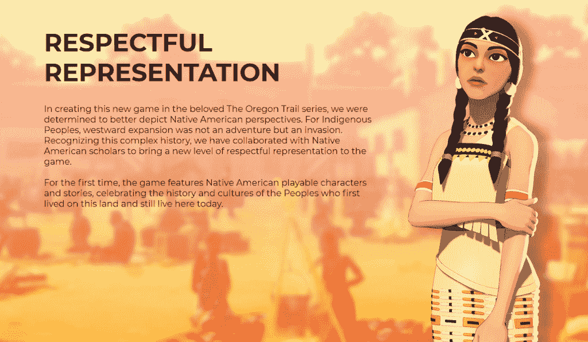
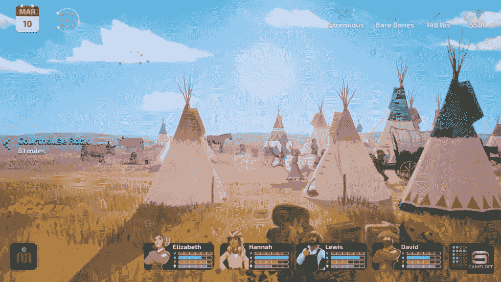
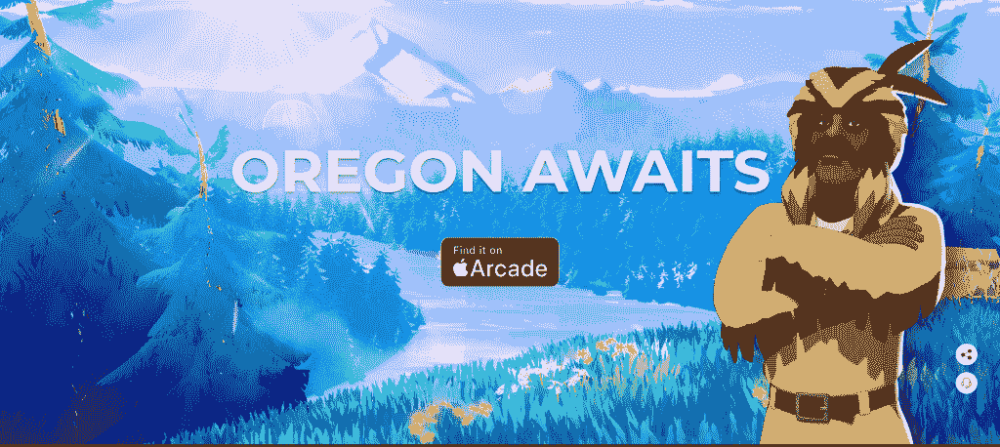
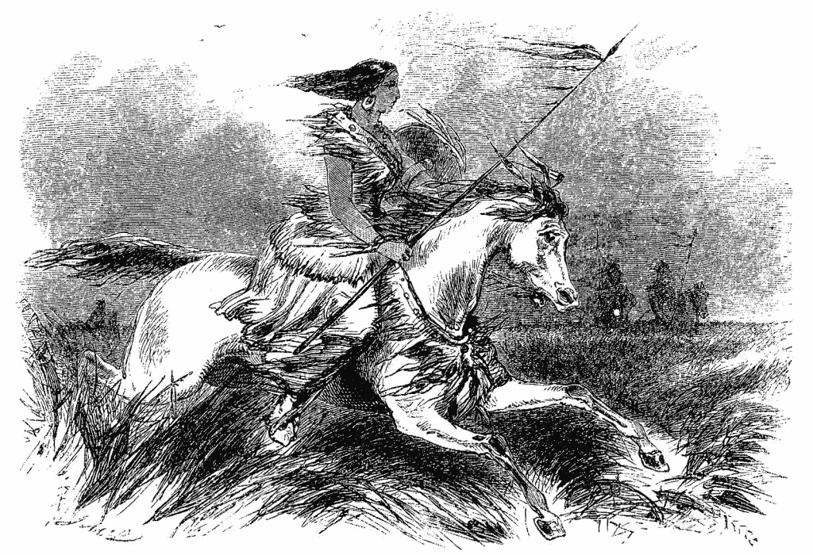

# “俄勒冈小径”视频游戏是如何演变成融入美国土著人视角的

> 原文：<https://thenewstack.io/how-the-oregon-trail-video-game-evolved-to-incorporate-native-american-perspectives/>

这是一种大约 50 年前首次出现的电子游戏。但是随着我们的世界的改变，以及我们看待历史的方式的改变，这项运动也发生了变化。今年，标志性的视频游戏《俄勒冈小径》引起了人们的极大兴趣；现在它也包括了生活在拓荒者视为未开发的边疆的美洲原住民的观点。

这款广受喜爱的视频游戏可能正试图以自己的方式创造历史。

## 开辟一条道路

当博物馆于 2015 年在纽约罗切斯特开放时，俄勒冈小径是首批进入世界视频游戏名人堂的视频游戏之一。博物馆的网站称赞这款游戏为“[有史以来发行时间最长、最成功的教育游戏](https://www.worldvideogamehalloffame.org/games/oregon-trail)”，销量超过 6500 万份，甚至可能是“有史以来最古老的连续可用视频游戏”专为俄勒冈小径设计的网页也承认，这个游戏“为在学习中使用视频游戏开辟了一条道路”，同时向孩子们介绍了计算机和历史。

但是对于一些玩家来说，这种经历是不和谐的。在一则新闻报道中，波特兰电台 KGW [采访了 38 岁的爵士半月](https://www.youtube.com/watch?v=Zaz2S8Tuh2A)，他是俄勒冈州东北部乌马蒂拉印第安人保留地联盟部落的成员。她记得自己还是个小学生的时候，在“又大又方的显示器和笨重的键盘”上玩这个游戏。但是当她[向 NW 新闻网](https://www.kcrw.com/news/shows/all-things-considered/npr-story/996007048)描述这段经历时，“我记得当时就像，‘哦，就像印第安人在你的货车里杀了人……然后就像，‘哦，我们是印第安人，你知道。"

[https://www.youtube.com/embed/Zaz2S8Tuh2A?feature=oembed](https://www.youtube.com/embed/Zaz2S8Tuh2A?feature=oembed)

视频

今年，游戏[的更敏感版本](https://www.gameloft.com/game/theoregontrail)出现在苹果街机视频游戏订阅服务上(可通过苹果应用商店的标签获得)。这个版本的俄勒冈之路现在开始承认，“对于土著人来说，向西扩张不是一次冒险，而是一次入侵。”然后它试图将他们的观点融入故事中。Gameloft 布里斯班的创意总监贾拉德·特鲁根(Jarrad Trudgen)对 KGW 说，“更尊重的表现才是我们真正想要的。”

特鲁根说，游戏团队带来了三位不同的历史学家，他们本身就是美洲原住民；专家们对游戏重启提供了反馈。

历史学家指出的一件事是:许多美洲原住民英语相当流利——尽管许多代表说的是简短、蹩脚的英语句子。“这就像一个比喻，让美洲原住民看起来很原始，而实际上当时有很多双语或多语言的美洲原住民，”Trudgen 告诉 NW 新闻网。

内布拉斯加大学的历史学家玛格丽特·胡特尔也是该团队的顾问，她说，甚至弓箭也被认为是一种刻板印象，因为到了 19 世纪中期，印度猎人几乎肯定已经获得了步枪。特鲁根告诉 NW 新闻网说，保持刻板印象“显然不是我们的本意”。“我们只是从一种天真的‘弓箭很酷’的角度来看待这个问题。”

特鲁根补充说，“我是一个白人，澳大利亚人，你知道吗？我不是这方面的专家。所以这很重要——这是应该做的事情。”

在接受 NW 新闻网采访时，胡特尔描述了她和其他历史学家推荐的一些其他变化。即使在新版本的游戏中，“最初，所有的土著人都有辫子。”但是 Huettl 研究了旧照片和图画以确保准确性，他说“我想我们建议，也许他们不一定都有辫子。”

特鲁根告诉 KGW，最终他们想把印第安人描绘成“人类——有血有肉的人物，你可以与之建立关系并产生共鸣。”

## “一种更微妙的方法”

游戏还包括来自过去的真正的美国土著人，包括来自乌鸦部落的 [Biawacheeitchish](https://en.wikipedia.org/wiki/Woman_Chief) (“女酋长”)，以及历史人物摩西·哈里斯(Moses Harris)，Gameloft [将](https://m.facebook.com/story.php?story_fbid=10165218733200506&substory_index=0&id=216238295505)描述为一位知名且受人尊敬的美国黑人登山家、毛皮猎人和马车夫。

[史密森尼杂志](https://www.smithsonianmag.com/smart-news/new-oregon-trail-game-features-playable-native-american-characters-180977744/)称智乐的新版《俄勒冈小径》是“对 1848 年白人定居者穿越美国西部的故事更细致入微的描述”

新版本保留了游戏的许多简单机制，但有令人惊叹的新背景和图形。

[https://www.youtube.com/embed/h65XDlEoFZ0?feature=oembed](https://www.youtube.com/embed/h65XDlEoFZ0?feature=oembed)

视频

城市版 2011 年的一篇文章回忆了这个游戏是如何在 1971 年开始的，当时有三个室友——都是在附近的卡尔顿学院完成学位的实习教师。即使在那时，一些老师也抱怨这款游戏使用“印第安人”一词在政治上不够敏感，但联合创始人唐·拉维奇后来将这款游戏带到了他在明尼苏达教育计算联合会(MECC)的新职位上，这是一个公共资助的实体，成立于 1973 年，为该州提供计算机服务。

除了 Rawitsch 在 MECC 的工资，游戏的三个原创者都没有分享游戏的财务成功，尽管他们在教育软件的历史上享受了自己的时刻。1978 年，MECC 将一份全州 500 台微型计算机的合同授予一个被《城市页面》描述为“两个 20 多岁的无名小卒——史蒂夫·乔布斯和史蒂夫·沃兹尼亚克”的团体这最终导致了苹果公司和俄勒冈小径游戏的巨大早期成功。

由于计算机软件是以软盘分发的，MECC 很快开始向州外的学校出售其软件集(包括 Oregon Trail)的软盘，最终提供的许可协议很快吸引了美国三分之一的学区(以及 16 个外国的学校)。

在接下来的 20 年里，这款游戏经历了更多的升级和迭代。在 2017 年一篇关于 Medium 的文章中，R. Philip Bouchard 回忆起他在最广为人知的 1985 年 Apple II 版本中担任首席设计师和团队领导的工作。布沙尔回忆说，他曾试图在游戏中加入一个缺失的元素:人性。

他写道:“1971 年的设计忽略了人的概念，因此你在整个 2000 英里的路线上旅行，从未与另一个人见面或互动。”因此，除了添加现在备受珍视的功能，如狩猎游戏、过河和现实世界的地理名称，Bouchard 还添加了用户输入玩家及其家庭成员姓名的个性化功能。

重要的是，人们被加入到游戏的画面中——尽管最终他们雄心勃勃的愿景被空间的限制所限制。布沙尔写道，“关于俄勒冈之路，我最大的遗憾是，我不得不放弃我的大部分想法，与美洲原住民进行复杂、微妙的互动…

“然而，一些更简单的想法确实成为了成品。例如，如果你雇一个当地的印第安人给你带路，你就更有可能成功穿越斯内克河——真正的俄勒冈之路也是如此。”

## 不再是“Cosplaying 征服”

那么 2021 版游戏的定论是什么呢？文化网站 Hyperallergic [发表了圣地亚哥大学非洲历史助理教授 T.J. Tallie 的回应](https://hyperallergic.com/645727/on-nostalgia-and-colonialism-on-the-new-oregon-trail/)，他专门研究比较殖民定居者、土著和帝国历史。他认识到游戏制造商的挑战的重要性，认为最初的视频游戏“从根本上塑造了多代人最初不仅如何看待土著人民，而且如何看待在美国定居的行为。它完全抹去了俄勒冈小径本身几乎每个方面的暴力结构，以及定居者对太平洋西北部土地的占领…

“孩提时代，我们不知不觉地被卷入了殖民主义的游戏化……这些游戏也是角色扮演征服，把不可挽回的破坏作为一种令人愉快的游戏形式。”

所以在玩了 2021 版本的游戏后，Tallie 发现了一个显著而明确的改进。“回想起来，土著北美人不再是这个疯狂的唯我游戏的背景人物。在历史准确的服装中，完全可玩和实现的土著角色平等地回应定居者，有充分的对话，甚至有他们自己的游戏场景。”

<svg xmlns:xlink="http://www.w3.org/1999/xlink" viewBox="0 0 68 31" version="1.1"><title>Group</title> <desc>Created with Sketch.</desc></svg>