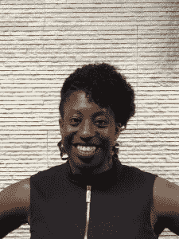

# 科技社区如何为黑人女性做得更好

> 原文：<https://thenewstack.io/how-the-tech-community-can-do-better-for-black-women/>

科技无处不在，几乎每个人都是科技消费者。很亲密，很私人，很专业。它在我们的口袋里，在我们的家里，在我们的车里，在我们的办公室里，在我们的学校里，在我们的医院里——它无处不在。这是给我们所有人的。

这意味着不再有边缘情况。技术必须由所有用户创造并为所有用户服务。否则，它将延续种族主义、不平等、[隐性和显性偏见](https://www.huffingtonpost.co.uk/entry/need-more-women-of-color-tech_n_5c92a3c7e4b08c4fec33cec5?ri18n=true)和歧视，这些已经在[很多产品中体现出来。](https://towardsdatascience.com/real-life-examples-of-discriminating-artificial-intelligence-cae395a90070)

尽管如此，在英国和美国的科技行业中，黑人女性占[不到 1%](https://www.cio.com/article/3516012/women-in-tech-statistics-the-hard-truths-of-an-uphill-battle.html#:~:text=Of%20the%2025%20percent%20of,percent%20and%201%20percent,%20respectively.) 。这是不可接受的。

根据麦肯锡的年度[职场女性报告](https://womenintheworkplace.com/)，黑人女性始终面临着更多的系统性障碍，从经理那里获得的支持更少，并且比任何其他人群都受到更严重的歧视。他们在工作场所也面临着不成比例的更高程度的性骚扰。

虽然科学、技术、工程和数学相关的工作仍然比大多数其他领域的工资高，但 STEM 领域的黑人女性的工资约为白人女性的 87%，仅为男性的 62%。

再加上新冠肺炎疫情，那里的女性更有可能失去工作，如果她们仍然有工作，也更有可能在家工作，同时还要承担照顾孩子、老人和更危险的家庭成员的重担。有色人种女性也压倒性地站在这场危机的前线。

> “我不应该用我生命中的八年时间没有遇到另一个做编码并拥有与我相同技能的黑人女性。”

—夏琳·亨特，编码黑人女性

因此，我们不能责怪黑人女性科技专业人士，她们不得不为自己迈出的每一步而奋斗——却只能沮丧地离开这个领域。但是我们可以肯定地指责科技行业——一个黑人女性为 T1 奠定了一些基础的行业。

许多人认为这是一个人才管道问题。[根据种族平等非营利代码 2040](http://www.code2040.org/faq) ，“虽然黑人和拉丁裔人获得了近 20%的计算机科学学士学位，但他们仅占顶级科技公司技术人员的 5%左右。只有 2%到 5.3%的科技高管是黑人，3.1%到 5.3%是拉丁裔。

这确实是一个留住人才的问题。只有 18%的工作场所在检查绩效评估时会注意到种族和性别的复合偏见。[离职面谈](https://hbr.org/2016/04/making-exit-interviews-count)少之又少，尽管人力资源部门推动采用敏捷实践，但似乎没有人定期回顾多样性、公平、包容和保留。

2017 年科技离职者研究仍然是我们所知的同类研究中唯一发表的研究，该研究发现，如果雇主调整了公司文化，三分之二的科技离职者会留在科技行业。

毫不奇怪，大多数科技公司对去年夏天黑人的命也是命运动的回应不是清算——而是表演性的口惠而实不至。

在新的堆栈中，我们认为科技行业应该被要求更高的标准。毕竟，我们正在建设现在和未来。那么，如何才能做得更好呢？

## 对黑人女性进行编码可以增加整个堆栈的代表性

当你缺乏社区、支持和代表时，在一个组织或一个行业内实现增长将变得非常困难。科技领域的黑人，尤其是科技领域的黑人女性，在建立自己的社区中找到了慰藉和力量。

科技松弛社区中的[有色人种妇女](https://www.wocintech.co/)是由科技行业中的有色人种妇女创建的，也是为她们服务的。

作为[编码黑人女性](https://codingblackfemales.com/about)的创始人，自 2017 年以来，首席软件工程师 [Charlene Hunter](https://twitter.com/charlenephunter) 已经在英国中部建立了这个技术社区，现在遍布英国。

这个非营利组织最初是一个聚会，作为当地黑人女性分享对话、资源和技术想法的一种方式。它很快变成了每月一次的编码会议，汇集了来自不同层次和行业的技术专家，然后吸引了公司的合作和赞助。值得注意的是，为了增加自己已知的缺乏多样性，[英国计算机协会](https://www.bcs.org/membership/become-a-member/professional-membership/)为社区提供免费会员。

编码黑人女性成员开始被提供会议门票。然后，在这些活动中演讲和举办研讨会的提议开始涌入——因为台上台下的代表性都是至关重要的。

该社区的目标很快就从提供支持扩展到提高黑人女性在科技领域的知名度。

去年 8 月，该组织与 [Niyo Enterprise](https://niyoenterprise.com/) 合作，启动了第一个[黑人训练营](https://blackcodher.com/)。这个为期六个月的项目面向英国 50 名失业或未充分就业、工资低于 25，000 英镑(34，650.00 美元)的黑人女性

新兵训练营有两个团队，每个团队每周有两个晚上专门培训未来的全栈开发人员，内容涉及一系列技能，从敏捷项目管理和测试驱动开发到数据库和网络安全，再到基于 MERN 栈的完整应用程序开发——MongoDB、Express、React 和 Node。

亨特说，一些新兵训练营的毕业生“以前没有使用命令行来构建全栈应用程序，而企业却在争夺(聘用)他们。”

在 2 月 19 日的第一个[黑人游行日](https://www.eventbrite.com/e/black-codher-demo-day-tickets-131163921821)期间，看看毕业生们的行动。第二个项目的申请现在也开放了。

亨特说，黑人 Codher 的想法是为了满足更多代表的需要，“让黑人妇女能够建立他们已经在使用的技术和应用程序。”

然而，新兵训练营通常非常昂贵，这只是又一个进入壁垒，尤其是当英国近一半的黑人和少数族裔家庭生活贫困的时候。

亨特说，黑头发可以“消除那些障碍，让人们进步”。

考虑到这一点，编写黑人女性代码的人数不断增加。虽然去年由于新冠状病毒的爆发，事情发生了迅速的变化并转移到了网上，但 meetup 每月举办两次活动，推出了[工作板](https://jobs.codingblackfemales.com/)，完成了第一次训练营，并增加了知名度和企业合作伙伴关系。

“我们需要活动继续进行，因为我们需要确保人们没事，并能继续专注于发展他们的技能和受到鼓舞，”亨特说。

亨特说，去年她还通过 Instagram 联系了一个 16 岁的程序员同伴，他正在为 10 到 14 岁的孩子组织一个 [Scratch 可视化编程](https://scratch.mit.edu/)课程。在这个由高中生组织的为期八周的课程中，有 12 名勇敢的年轻黑人女性，这些黑人女性得到了资金、背景调查和志愿者讲师招募的支持。

提高黑人女性在科技行业的代表性、包容性和地位有着巨大的价值——坦率地说，科技行业以这样或那样的方式涵盖了所有行业。编码黑人女性继续其目标，突出其社区的技能和才华，并使那些没有技能的人能够得到他们。

## 现在这个行业如何支持科技领域的黑人女性

除了雇佣这些黑人毕业生，你还能做什么？找代码的证明，不要找学位的证明。我们知道传统的四年制学位通常学习周期较慢。新兵训练营的毕业生或开源项目的定期贡献者往往有更多的相关经验，所以不要让 LinkedIn 和招聘软件过滤掉那些候选人。也许提供一个代码或白板测试——考虑为你的候选人的时间付费，因为没有人应该自愿为一份他们可能得不到的工作付出那么多努力。别忘了查看其他资源，比如 T4 BYP 网络 T5，它被称为黑人职业人士的 LinkedIn。

在你的招聘过程中要有意识和透明。多元化和包容性是你与所有招聘利益相关者分享的真正目标吗？你有什么计划使你的候选人多样化？你如何衡量这一点？它与团队、人力资源或公司 KPI 或 OKRs 相关吗？

然后你不仅仅想雇佣更多的黑人女性，你还想留住她们。你有什么创造心理安全的计划？营造一个包容的工作环境？只是不要去创建一个 D & I 委员会，并推动你的少数有色人种雇员为其服务——总是假设他们厌倦了斗争，不应该成为教育你种族主义、特权和偏见的人。相反，请一位反种族主义顾问来帮忙。

也许最重要的是，从面试开始，确保清楚少数族裔员工如何在公司内成长。提供指导和赞助机会。确保[在绩效评估中衡量偏差](https://www.cultureamp.com/blog/10-performance-review-biases-and-how-to-avoid-them/)并且不要跳过离职面谈。

虽然这篇文章强调了一个让更多黑人女性进入科技行业的伟大计划，但请记住，在你公司的所有层级都要实现多样性、公平和包容性——我们需要更多黑人女性进入各级管理层。和白人工资一样。

特征图片: [WOCinTech Chat](https://www.wocintechchat.com/blog/wocintechphotos) ，知识共享许可。

<svg xmlns:xlink="http://www.w3.org/1999/xlink" viewBox="0 0 68 31" version="1.1"><title>Group</title> <desc>Created with Sketch.</desc></svg>