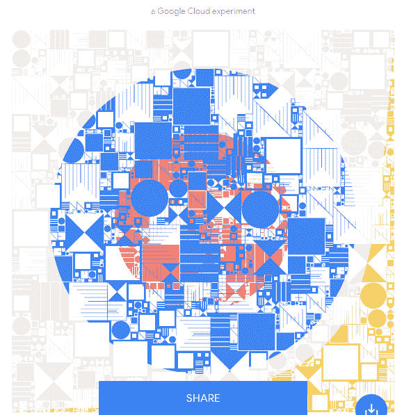

# 世界如何庆祝“圆周率日”

> 原文：<https://thenewstack.io/how-the-world-celebrated-pi-day/>

30 多年来，3 月 14 日(3/14)一直被作为“圆周率日”来庆祝，这是一种极客骄傲日，以无尽的创新方式来庆祝。这是一种在无数本土仪式上提醒世界这个数字——以及所有关心这个数字的极客——的方式，每个仪式都为数学、科学和虚数圆周率提供了自己特别的呐喊。

一整天，佐治亚理工学院的一个团队在校园周围留下了桃子派，然后在学校的 Twitter 上发布了它们的位置照片。

与此同时，麻省理工学院的生物系在 3:14(T1)准时举行了“吃馅饼聚会”。官方的“MITbloggers”YouTube 频道发布了一个引人注目的年度圆周率日视频。它用一个涉及 37 英尺的铝(更不用说焊接设备)，加上 60 磅黄油，628 磅桃子——最终，在一个 6 . 25 英尺的馅饼罐下有 400 磅木炭的配方来戏弄观众。

六个小时后，他们烤好了一个巨大的桃子派——准备和麻省理工的同学们分享。

[https://www.youtube.com/embed/kvYNJQ7OXnc?feature=oembed](https://www.youtube.com/embed/kvYNJQ7OXnc?feature=oembed)

视频

视频的结尾承认麻省理工学院继续其传统，在圆周率日通知高中毕业生他们被麻省理工学院录取——用了几个与馅饼相关的双关语。

“你不想要你的决定吗？”它询问观众，并补充说“我们知道你揉它们”——并把他们指向适当的网址。

当天最大的新闻是谷歌云开发者倡导者艾玛·相户爱 Iwao 创造了一项新的世界纪录，创造了[计算圆周率的最高位数](/google-clouds-haruka-iwao-sets-a-new-record-for-calculating-pi/)——确切地说是 31，415，926，535，897 位数。她指出，根据我们本周的一次谈话，这是首次在云上进行创纪录的计算——代表着人类自身的巨大飞跃。

TNS:我们正试图在这方面做些数学计算。如果你有 31 万亿位数，你可以在一张 DVD 上存储 4.7 千兆字节，仍然需要 300 多张 DVD 来存储它们。

EHI:我认为这听起来差不多。

**TNS:但我猜没有人会说，“你能给我所有这些圆周率数字吗，不是在云上，而是在 DVD 上！”**

EHI:在云计算出现之前，人们通常会运送硬盘。他们要求将数字存储在硬盘上，而不是 DVD 或蓝光光盘，并实际邮寄。

**TNS:我猜是大硬盘…**

*EHI:几兆兆字节。但是他们仍然需要几个磁盘来容纳所有的数字！*

[https://www.youtube.com/embed/JvEvTcXF-4Q?feature=oembed](https://www.youtube.com/embed/JvEvTcXF-4Q?feature=oembed)

视频

在她取得成就后，一位头衔为“创意工程师”的谷歌员工问了一个发人深省的问题:如果为了庆祝，我们创造了 31.4 万亿件艺术品呢？谷歌的开发者倡导者已经在 2017 年创建了一个“ [Pi API](http://pi.delivery) ”，他们现在已经将它与艾玛·相户爱 Iwao 的 31.4 万亿数字连接起来。该 API 用 Go 编写，部署在 Kubernetes 引擎集群上，可以提供数万亿种独特的模式。

因此，Mathias Paumgarten 编写了代码，从 31.4 万亿位数字中的任何地方给定一个起点，抓取几千个后续数字来创建“看似随机”的数字，然后这些数字被转换成巧妙的几何形状。“我们有 31.4 万亿位数要庆祝！”解释它的官方网页(在这里[你可以通过输入一个合适的数字来生成你自己的](https://showcase.withgoogle.com/experiment/pi/generate/))。

Pi API 页面——方便地位于 Pi . delivery——还包括一种有趣的方式来*听*数字，每个数字[映射到钢琴键盘上的一个音符](https://pi.delivery/#demosmusic)。

他们并不是唯一试图寻找新方法来实验圆周率的人。

电子音乐作曲家坎顿·贝克尔创造了一种算法，可以将圆周率的前 10 亿位数字转换成电子音乐片段，从而创作出《T21》这首持续了 114 年的歌曲。许多其他公众人物试图跟上所有的极客，在社交媒体上承认这个特殊日子的到来。

乐高官方推特[表达了它的敬意](https://twitter.com/LEGO_Group/status/1106277140339851265)。新闻播音员丹·拉瑟分享了[一些深思熟虑的评论](https://twitter.com/DanRather/status/1106262483856056322)。而且[甚至连斯莫基熊也加入了](https://twitter.com/smokey_bear/status/1106236492890943489)。谷歌趋势用数据庆祝这一时刻，分享了一张信息图，列出了美国 50 个州中搜索次数最多的馅饼。(加州搜索最多的馅饼:泥饼。)

但圆周率日也提供了一个不可抗拒的机会，让年轻学生对数学和科学感到兴奋，无数学校都在庆祝。有些学生甚至想看看他们能记住圆周率[的多少位数](https://twitter.com/therealmrcroatt/status/1106267216486506496)！

当美国宇航局喷气推进实验室的教育办公室发布第六届年度[美国宇航局圆周率日挑战](https://www.jpl.nasa.gov/edu/news/2019/3/8/nasa-rocket-science-its-easy-as-pi/)时，老师们得到了一些明星的支持，这些“有前途的”行星谜题向学生们展示了圆周率在该机构是如何使用的……美国宇航局科学家和工程师面临的现实世界的问题。”(火星上有一场尘暴，木星上有不断缩小的风暴云——所有这些都变成了需要用圆周率计算的[故事问题……)](https://www.jpl.nasa.gov/edu/news/2019/3/8/nasa-rocket-science-its-easy-as-pi/)

美国宇航局也庆祝了这一天，在下午 3:14 分整向国际空间站发射了一枚载有两名美国宇航员和一名俄罗斯宇航员的火箭。

承蒙宇航员大卫·圣·雅克(David Saint-Jacques)的好意，加拿大航天局也加入了进来，他正在国际空间站的轨道上停留 7 个月。宇航员花了一点时间提醒我们地球人，阿尔伯特·爱因斯坦也出生于 3 月 14 日，他发回了一张照片，并附上了适当的生日祝福——在太空中失重漂浮。

就连树莓派基金会[也举办了一场特别的圆周率日特卖](https://www.engadget.com/2019/03/14/these-raspberry-pi-products-are-all-marked-down-for-pi-day/)。

但是随着时间的推移，据 AccuWeather.com 的一位专职作家说，圆周率日现在正导致新的传统。“今年 3 月 14 日的圆周率日，美国女性 STEM 专业人士再次穿上紫色，让人们意识到需要更多女性从事科学、技术、工程和数学(STEM)职业。”

这是一个始于 2016 年的传统，许多参与者在推特上用#DressForSTEM 标签分享了他们的想法。

今年也见证了一个苦乐参半的里程碑。根据《三藩市纪事报》的讣告[，这将是第一个没有拉里·肖的圆周率日，他在 1988 年创立了这项活动。他们记得肖是劳伦斯·利弗莫尔国家实验室的前雇员，他于 1972 年开始在旧金山的探索博物馆工作了 33 年——在一次员工务虚会上，他想出了在 3 月 14 日纪念圆周率的主意。38 年来，肖先生总是戴着一顶印有神奇数字的红帽子，带领参观博物馆的人游行，每个人都举着一个带有圆周率数字的牌子。](https://www.sfgate.com/bayarea/article/Memorial-service-set-for-Pi-Day-creator-Larry-Shaw-12206726.php)

“他们会按照严格的顺序出发，3 在前，小数点后面跟着，然后……

14159265358979323846264338327950288419716939937510582….”

* * *

# WebReduce

<svg xmlns:xlink="http://www.w3.org/1999/xlink" viewBox="0 0 68 31" version="1.1"><title>Group</title> <desc>Created with Sketch.</desc></svg>