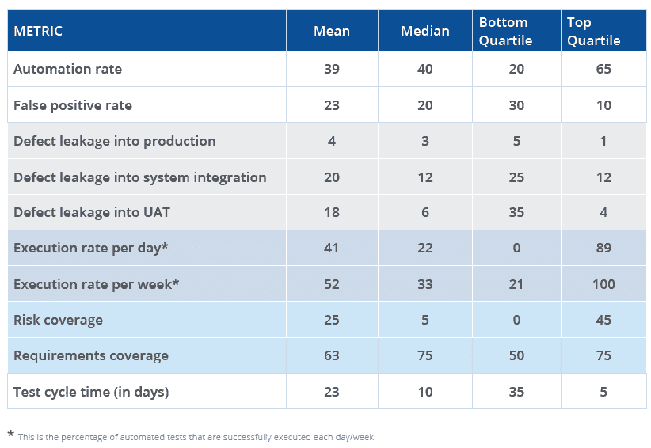

# 世界顶级组织如何测试

> 原文：<https://thenewstack.io/how-the-worlds-top-organizations-test/>

 [辛西娅邓洛普

辛西娅撰写软件开发、测试和企业自动化方面的文章的时间比她愿意承认的要长得多。她目前是 Tricentis 的内容和客户营销总监。](https://www.linkedin.com/in/cynthiadunlop/) 

软件测试的挑战被极大地低估了，并且总是得不到重视。即使是看似基本的应用程序，比如一个普通的移动应用程序，也有数量惊人的测试方法、测试路径和条件、测试设备配置等等。在当今近乎连续的发布周期中，确保每次更新都增加价值而不中断用户体验是一项艰巨的任务。

对于企业组织来说，这种困难更加严重。在这个层面上，测试必须适应:

*   平均涉及 900 个应用程序的复杂应用程序堆栈。单笔交易平均涉及 82 种不同的技术，从大型机和传统定制应用到微服务和云原生应用。
*   根深蒂固的手工测试过程是为瀑布式交付节奏和外包测试而设计的——而不是敏捷、DevOps 和对“持续一切”的驱动
*   对极高可靠性的要求。根据 IDC 的数据，企业环境中一小时的停机时间可能会造成 50 万到 100 万美元的损失。“快速行动，打破常规”在很多行业都不是一个选项。

特别是在企业层面，测试是交付延迟的头号来源，手动测试仍然普遍存在(只有 15%是自动化的)，测试成本平均占整个 IT 支出的 23%到 35%。

然而，许多顶级组织找到了突破这些障碍的方法。他们将测试转变为数字化转型计划的催化剂，加快交付速度并释放创新预算。

他们的做法有什么不同？你的组织与众不同吗？

### **介绍企业应用测试基准**

为了揭示行业领导者如何测试他们的业务和世界所依赖的软件，Tricentis 在我们的第一份 [**世界顶级组织如何测试**](http://tricentis.com/resources/how-the-worlds-top-organizations-test/) 报告中发布了我们关于世界顶级组织如何测试的研究结果，这是一项我们计划每年进行的研究。这些数据是通过与代表多个团队的高级质量经理和 IT 领导进行一对一访谈收集的。参与者代表使用各种以 QA 为中心的功能测试自动化工具的团队:开源、Tricentis 和其他商业工具。开发人员测试和安全测试活动超出了范围。

该报告侧重于从我们采访的前 100 家组织中收集的数据:财富 500 强(或全球同类组织)以及美洲、欧洲和亚太地区的主要政府机构。这里所代表的所有营利性公司的收入都在 50 亿美元或以上。

我们在这里保护每个人的隐私，但是想象一下，当你开车、工作、购物、吃喝、管理你的财务，以及在所有这些之后享受一些当之无愧的假期时，你与之互动的公司。给定平均团队规模和所代表的团队数量，我们估计这份报告显示了这些领先组织中成千上万的独立测试人员的活动。

### 关键要点

在一个超高的水平上，来自这些顶级组织的结果揭示了 39%的测试自动化，但是高误报，低风险覆盖率和令人震惊的慢测试周期。以下是一些具体的要点。

**自动化而不稳定:**平均测试自动化率(39%)相对较高，但是误报率也相对较高(22%)。这对于缺乏稳定实践(如测试数据管理和服务虚拟化)的早期测试自动化工作来说很常见。

测试与风险不一致:需求覆盖率(63%)很高，但是风险覆盖率很低(25%)。很可能，团队对每个需求投入相同水平的测试资源，而不是将他们的努力集中在对业务最关键的功能上。

**开发和测试周期不同步:**平均测试周期时间(23 天)非常不适合今天快节奏的开发周期(2018 年 87%的开发周期不到两周)。如此长的测试周期，测试不可避免地落后于开发。

**质量高(部分):**报告的缺陷泄漏率(3.75%)相当可观(通常情况下，< 10%被认为是可接受的，< 5%是好的，< 1%是例外)。然而，只有大约 10%的回答者跟踪到了缺陷泄漏，所以总体比率可能更高。跟踪这一度量的组织往往是那些具有更成熟过程的组织。

伟大的基础:组织已经在掌握测试成功的基本要素方面取得了长足的进步(采用合适的角色，建立测试环境，培养协作文化)。

**“持续的一切”还没有发生…目前:**很少有人实现> 75%的测试自动化率或采用稳定的实践，如服务虚拟化和测试数据管理。鉴于此，有限的 CI/CD 集成不足为奇。不过，所有这些都是组织的优先事项。

**最大的差距:**领先者和落后者之间最大的差距是在每天执行的自动化测试的百分比，风险覆盖，缺陷泄漏到用户验收测试(UAT)和测试周期时间方面。

**顶级改进目标:**组织希望在短期内(六个月内)做出最大改进的领域是风险覆盖、缺陷漏入 UAT、误报率和测试周期时间。

### 关于报告

[完整的 18 页基准测试报告](https://www.tricentis.com/resources/how-the-worlds-top-organizations-test/)现已发布。它包括:

*   领先者和落后者在关键软件测试和质量度量上的差异。
*   大多数组织在 CI/CD 集成、测试环境策略和其他关键流程元素方面的立场。
*   现在哪些测试设计、自动化、管理和报告方法是趋势？
*   组织在 2021 年改进测试的首要任务。

以下是您会发现的一些数据点:

在 2021 年期间，我们将继续分享我们数据集的不同分析。期待看到趋势报告:

*   按行业
*   受测技术
*   按地区
*   以及度量、实践和交付方法之间有趣的相互关系

到 2022 年，我们将发布第二版报告，其中将包括逐年趋势以及最新结果。

<svg xmlns:xlink="http://www.w3.org/1999/xlink" viewBox="0 0 68 31" version="1.1"><title>Group</title> <desc>Created with Sketch.</desc></svg>