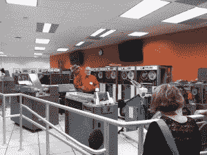

# 1963 年他们是如何用电脑制作电影的

> 原文：<https://thenewstack.io/how-they-made-films-with-computers-in-1963/>

在加利福尼亚州的山景城，有一个博物馆，旨在提供关于软件的“独特视角”，强调“[我们的计算过去通知我们的数字现在](https://computerhistory.org/about/)”的信念，并宣布他们的目标是“保护我们的集体历史”

或者，换句话说，我们可以通过欣赏另一个时代的人工制品来欣赏我们已经走了多远——以及创造它们的人。

2015 年，博物馆修复了一台 1959 年的 IBM 大型机，使其恢复了工作状态。

硅谷[计算机历史博物馆](https://computerhistory.org/blog/technology-and-art/)的最新展览是“早期计算机电影:1963-1972”

从周三开始，一直持续到 9 月 1 日，该博物馆提供了一个长达一小时的节目，令人头晕目眩地回顾过去。根据博物馆网站上的一篇博客文章[，这是一个电脑“昂贵、庞大、稀有”的时代。(大多数归政府机构、大学、企业和实验室所有。)然而，一些勇敢的人找到了他们那个时代的机器——然后用它们开创了一种全新的交流方式。](https://computerhistory.org/blog/technology-and-art/)

正如博物馆的博客文章解释的那样，“他们项目中的决定和细节经常会带来令人惊讶的结果，甚至是被证明有趣或美丽的小故障。”

## 超越眩晕

最早的电脑动画之一是阿尔弗雷德·希区柯克 1958 年的惊悚片《迷魂记》的片头字幕。眼睛瞳孔中旋转的螺旋导致一系列其他的圆形…

但这是 64 年前的事了，据新媒体艺术非营利组织 Rhizome 的一篇文章称，当时制作这种简单的效果都非常困难。为了创造完美的抽象概念，美国平面设计师索尔·巴斯最终请来了计算机图形学的先驱约翰·惠特尼，他又不得不改编一件精心制作的 850 磅重的二战时期用于瞄准防空火力的军事装备。

[https://www.youtube.com/embed/GQwp6M2q1NE?feature=oembed](https://www.youtube.com/embed/GQwp6M2q1NE?feature=oembed)

视频

作为一名默默无闻的电脑动画鼻祖，惠特尼继续尝试数字艺术，博物馆指出，他最终在 1965 年获得了 IBM 的“常驻艺术家”资助。

他们的电影节目展示了惠特尼在 1972 年创作的另一部早期电脑动画电影，名为“黑客帝国 3”

[https://www.youtube.com/embed/3_1yVfZH_jo?feature=oembed](https://www.youtube.com/embed/3_1yVfZH_jo?feature=oembed)

视频

但是博物馆以三分钟的“模拟双陀螺重力梯度姿态控制系统”开始了它的电脑动画历史——奇怪的是，这部电影在 IMDB.com 上有[的列表。它是由研究人员爱德华·e·扎亚茨(他也是这部电影的旁白)在传奇的贝尔实验室创造的，他的同事弗兰克·辛登是一名数学研究人员。](https://www.imdb.com/title/tt14472220/)

他们的想法是展示轨道上的卫星如何定向，使其始终指向地球——这是他们仅用 1963 年可用的技术完成的壮举。根据 YouTube 上的视频描述，他们的计算必须通过穿孔卡输入主机，然后输出打印到缩微胶片上。然后，一台缩微胶片绘图仪将结果绘制在阴极射线管上，在阴极射线管上依次拍摄图像，以创造出动画效果。

[https://www.youtube.com/embed/GBlQb6Me_1k?feature=oembed](https://www.youtube.com/embed/GBlQb6Me_1k?feature=oembed)

视频

“哇…这是在《玩具总动员》之前 32 年制作的 YouTube 上的一位评论者写道，并补充道“相当令人印象深刻。”

计算机历史博物馆引用扎亚茨的话来称赞这部 1963 年的动画“能够看到一个随时间演变的过程”——这是科学家们以前从未在任何其他媒体上看到过的。

扎亚茨的电影启发了肯·诺尔顿，他当时在贝尔实验室的计算机研究小组工作。计算机历史博物馆引用诺尔顿的话说，他对“技术上精确”的动画前景感到兴奋——诺尔顿接着在 1964 年的电影“动画电影制作的计算机技术”中详细解释了这一技术(可在 YouTube 上从 AT & T 档案馆获得)。

[https://www.youtube.com/embed/_Lmi6cmrq0w?feature=oembed](https://www.youtube.com/embed/_Lmi6cmrq0w?feature=oembed)

视频

这是数字电影历史上的一个突破性时刻，因为这部 16 分钟的电影完全是用电脑动画制作的*(以及插图，在非动画标题卡的情况下)。因此，这部电影最终以清晰细致的细节记录了自己的制作过程——加上一些迷人的简单描述。*

"所需电影的指令以一副穿孔卡片的形式输入计算机……因此，制作电影的工作就变成了在卡片上打出适当的指令序列。"

> 电气工程师内斯特·伯特尼克(Nestor Burtnyk)和物理学家马塞利·韦恩(Marceli Wein)正在进行计算机图形实验，他们听说了迪士尼动画制作人如何绘制一个序列的第一帧和最后一帧，然后让助理动画制作人绘制中间的帧。他们开发了软件来完成同样的任务

这个过程甚至包括创造了据说是世界上第一种嵌入式领域特定语言: [BEFLIX](https://en.wikipedia.org/wiki/BEFLIX) 。(据博物馆报道，这种语言的名字是短语“铃声”的缩写。)而且那段语言在 Knowlton 的视频里也有描述。另一张标题卡称之为“电影语言”，解释说“这种语言把图片说成马赛克。每张照片都是由各种灰色阴影的小方块组成的……”

这是一种动画技术，后来在 1965 年被工程师 [A .迈克尔·诺尔](https://en.wikipedia.org/wiki/A._Michael_Noll)使用，他在一部纪录片中解释了这一过程(YouTube 上的“CGI 终极历史”也摘录了这一过程))

[https://www.youtube.com/embed/-dXQIUEwEGQ?feature=oembed](https://www.youtube.com/embed/-dXQIUEwEGQ?feature=oembed)

视频

在七年之内，“电脑动画电影的艺术和技术都发生了巨大的变化，并将在未来对电影业、游戏业和美术产生巨大的影响，”博物馆的[博客文章](https://computerhistory.org/blog/technology-and-art/)解释道，认为电脑动画“模糊了技术专家和艺术家之间的界限。”

1968 年，[现代艺术博物馆](https://www.moma.org/)甚至展出了一个关于计算机艺术的早期展览，名为“机械时代末期的机器”根据计算机历史博物馆的一部短片，艺术家[莉莲·施瓦茨](https://en.wikipedia.org/wiki/Lillian_Schwartz)贡献了一个交互式多媒体雕塑——这导致了与贝尔实验室的诺尔顿等程序员的合作。结果是几部动画短片，她最终在 20 世纪 70 年代将这些短片转变为“一系列艺术电影”。

她的电影在重要的博物馆广泛放映，获得好评，拓展了电脑电影的审美空间

[https://www.youtube.com/embed/fNQiQsWYuX8?feature=oembed](https://www.youtube.com/embed/fNQiQsWYuX8?feature=oembed)

视频

彼得·福尔德斯(Peter Foldes)1971 年的电影《元数据》(Metadata)是最引人注目的作品之一，博物馆讲述了它的起源。电气工程师内斯特·伯特尼克(Nestor Burtnyk)和物理学家马塞利·韦恩(Marceli Wein)正在进行计算机图形实验，他们听说了迪士尼动画制作人如何绘制一个序列的第一帧和最后一帧，然后让助理动画制作人绘制中间的帧。他们开发了软件来执行相同的任务(使用道格拉斯·恩格尔伯特新发明的技术小发明——鼠标绘制的关键帧)。)

加拿大国家电影委员会的一个项目导致了他们与 Foldes(1971 年上映)的合作。

[https://www.youtube.com/embed/R6FQf3Qbqa4?feature=oembed](https://www.youtube.com/embed/R6FQf3Qbqa4?feature=oembed)

视频

## 推铅笔的鼻子

另一位使用 BEFLIX 语言创作电脑动画短片的艺术家是 Stan VanDerBeek。

计算机历史博物馆记得范德贝克已经有了手绘(和拼贴)动画的经验，在参观贝尔实验室时，他创作了一系列名为 Poemfields 的短片。一个挑战是艺术家在完成之前看不到他们的电影是什么样子。博物馆引用范德比克的话说，制作电脑电影“就像用鼻子推着铅笔学画画一样。”

但结果是自由形式视觉艺术的奇迹——尤其是当范德比克开始使用现有的电影处理技术给他的电影添加色彩时。博物馆指出，对于《第七首诗》，“范德贝克让传奇作曲家约翰·凯奇创作了这部电影的配乐。

在 YouTube 上，美国电话电报公司技术频道制作了一个视频，收集了第一个 Poemfield(1965 年)到第八个 poem field(大概是 1971 年后的某个时候)。

[https://www.youtube.com/embed/V4agEv3Nkcs?feature=oembed](https://www.youtube.com/embed/V4agEv3Nkcs?feature=oembed)

视频

*(以上视频:Poemfield 2 (1971)斯坦·范德比克庄园提供:Voir。)*

在网上搜索足够长的时间，你会发现 1972 年的一部纪录片的摘录(据说是从 VHS 磁带复制的)，显示了范德比克本人的坦率评价。“自 1965 年以来，我一直在试验这台电脑，试图找出一种使用这台机器的方法，”范德比克告诉他的观众，并补充道，“坦白地说，我不理解它，但我正在努力理解它…

“这件事有很多困难。这是一种人机关系，涉及新的语言、新的思维结构和新的方法。艺术家对机器做了什么？

[https://www.youtube.com/embed/mg_DowyLuT8?feature=oembed](https://www.youtube.com/embed/mg_DowyLuT8?feature=oembed)

视频

(以上视频:创意艺术电视，斯蒂芬·乔多罗夫提供。)

## 历史之手

有趣的是，这些早期电影是如此引人注目。在 YouTube 的一个名为“万事皆有第一次”的频道上，有一个世界上第一部 3D 电影的存档版本。1972 年，两名年轻的计算机科学家艾德·卡姆尔和弗雷德里克·帕克创作了一张艾德左手的渲染图。

根据视频的描述，这部六分钟的电影解释了手的模型是如何制作的，具体来说是用墨水绘制的 350 个三角形和多边形。

该视频展示了如何捕捉多边形的线条，然后通过添加“平滑阴影”效果将其转化为逼真的手。

该视频还包括从手指内部由计算机生成的手的怪异视图。

随着电影的继续，团队渲染了一个人造心脏瓣膜，然后是一张脸——帕克的妻子——最后是一对脸。甚至这部电影的片头字幕都是由电脑生成的。但是，尽管看起来很简单，这部电影在国会图书馆的官方条目中提到，在 1972 年完成这一壮举时，“卡特莫尔设计出了后来成为计算机图形学基础的概念。”

YouTube 频道的负责人在影片开头添加了一段历史注释。“这个片段最终被好莱坞制片人发现，并被收录到 1976 年的电影*未来世界*。”

[https://www.youtube.com/embed/QfRAfsK5cvU?feature=oembed](https://www.youtube.com/embed/QfRAfsK5cvU?feature=oembed)

视频

这部电影在另一方面具有历史意义。1982 年，年轻的艾德·卡姆尔在卢卡斯影业图形集团找到了一份工作——卡特莫尔的故事为我们的过去为我们的现在埋下了种子提供了最终的证据。因为在接下来的几年里，艾德·卡姆尔成了皮克斯的联合创始人，后来又成了华特迪士尼动画工作室的总裁。

2014 年，Catmull 反思了他将技术转化为艺术的一生

<svg xmlns:xlink="http://www.w3.org/1999/xlink" viewBox="0 0 68 31" version="1.1"><title>Group</title> <desc>Created with Sketch.</desc></svg>