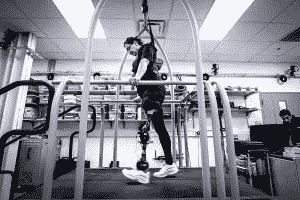
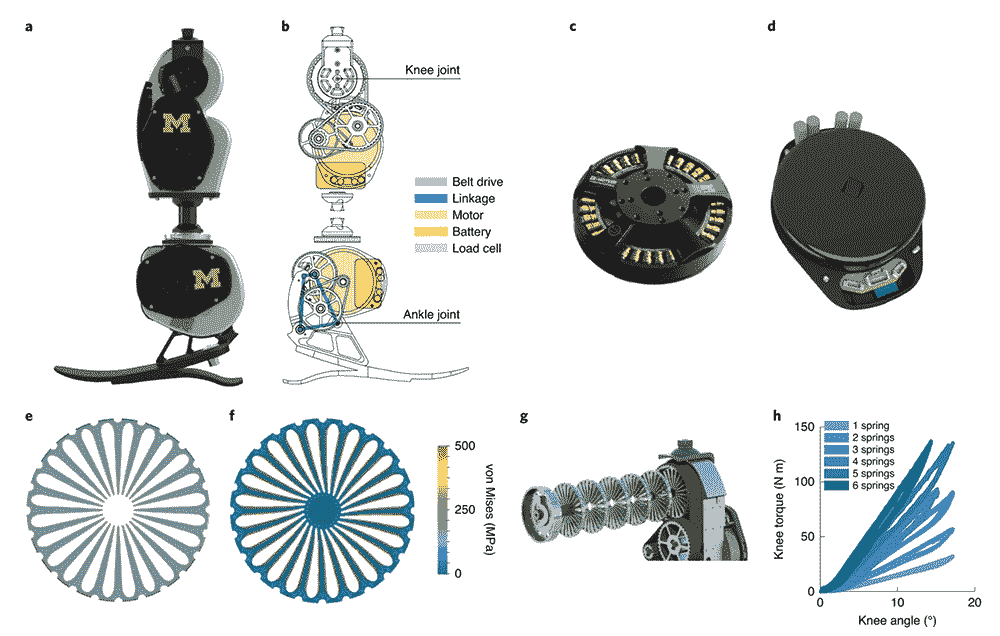

# 这种开源仿生腿如何革新假肢

> 原文：<https://thenewstack.io/how-this-open-source-bionic-leg-could-revolutionize-prosthetics/>

为了缓解仿生学的碎片化问题，密歇根大学的研究人员最近推出了[开源仿生腿](https://opensourceleg.com/)，这是一种人工智能假腿，采用低成本、易于获得的组件提供模块化设计。

虽然已经有一些用于上肢假体的开源平台，但开源腿(OSL)是第一个用于机器人下肢的系统，提供了一个更简单的替代方案，可供广大研究人员采用，从而使科学家能够专注于临床测试和更高级别的控制策略的开发，而不是从头开始。

近年来，我们已经看到了许多令人兴奋的先进假肢的新想法，从[负担得起的 3D 打印手](https://thenewstack.io/victoria-hand-project-applying-3d-printing-to-prosthetics/)，到[人工智能辅助神经假体](https://thenewstack.io/researchers-use-ai-to-give-amputees-shared-control-of-neuroprosthetic-hand/)和帮助用户[快速“调整”他们的假肢的算法](https://thenewstack.io/ai-algorithm-automatically-tunes-prosthetics-within-minutes/)。但是，由于仿生学研究团队经常在他们自己独立的筒仓中工作，该领域的进展经常以零敲碎打的方式出现，没有一个通用、统一的平台来建立和贡献新的改进——这在下肢仿生时尤为明显。加剧这种困境的事实是，研究人员经常无法获得假腿来测试他们的系统，因此不得不自己建造假腿来浪费时间，或者局限于运行不太真实的虚拟模拟。

“OSL 旨在成为一种简单、便携、可扩展、可定制且经济的硬件解决方案，用于实验室内外控制系统的开发和评估，”该团队在发表于《自然生物医学工程》的论文[中解释道](https://www.nature.com/articles/s41551-020-00619-3)

“通过 OSL，我们希望减少从事假肢研究所需的时间和资源，实现不同控制系统之间的公平比较，并提供长期的多研究技术，以加速动力假肢领域的进步。”

为了让更大的研究社区更容易访问，OSL 的创建考虑到了易于组装、定制和维护。它的设计特点是膝关节和踝关节可以独立操作，每个关节都配备了自己的板载电池、传感和控制系统，便于在实验室外和更真实的环境中进行测试。

OSL 使用开源电机控制器和嵌入式系统，使研究人员能够专注于开发更高级别的控制功能，而不是浪费时间从头开发硬件和软件。在另一项创新举措中，OSL 还采用其他行业的组件来提高性能和更精细的控制。

“我们采用了无人机行业的无刷电机，因为它们的效率和扭矩密度允许更低的传动比，从而可以使用同步带传动变速器，而不是更昂贵或复杂的替代品，这些替代品可能会有大量的产品交付时间和成本，”该团队写道。

OSL 还被设计成高度可定制的，具有几个可以根据不同要求定制的设计和控制功能，例如调整膝盖弹性，以及更换微控制器、传感器或替代不同机器人操作系统的可能性。为了让研究人员更容易构建、修改和测试 OSL，该团队提供了许多在线资源，如组装和编码的视频教程，以及零件和供应商的详细列表。

在测试过程中，参与者在医院的平地、坡道和楼梯上尝试了 OSL，并报告说，即使有不同的运动模式，从在平地、坡道上行走到爬楼梯，OSL 也感觉“支持、响应和平稳”

a)对开源部分(OSL)的渲染。b)OSL 示意图。c & d) OSL 的电动马达，集成了开源马达控制器和嵌入式系统。e)弹簧盘(侧视图)。f)由齿形内轴偏转的弹簧盘的冯·米塞斯应力分析。g)堆叠在 OSL 膝内的六个弹簧的分解图。h)内置 1-6 个弹簧的膝关节扭矩-角度关系图。

除了增加用户的舒适度，OSL 还相对便宜，根据选择的选项，价格在 10，000 美元到 30，000 美元之间。相比之下，目前市场上出售的大多数机器人假肢的价格高达 10 万美元——这使得 OSL 成为需要低成本但高性能替代品的人的潜在游戏规则改变者，以及希望在这个不断增长的领域推动研究的前瞻性科学家。

[https://www.youtube.com/embed/Rqla0u813r8?feature=oembed](https://www.youtube.com/embed/Rqla0u813r8?feature=oembed)

视频

[https://www.youtube.com/embed/tbSE0fOAJmM?feature=oembed](https://www.youtube.com/embed/tbSE0fOAJmM?feature=oembed)

视频

在团队的[论文](https://www.nature.com/articles/s41551-020-00619-3)中阅读更多内容，或者在[开源文章](https://opensourceleg.com/)中查看可用的资源和信息。

图片:密歇根大学

<svg xmlns:xlink="http://www.w3.org/1999/xlink" viewBox="0 0 68 31" version="1.1"><title>Group</title> <desc>Created with Sketch.</desc></svg>