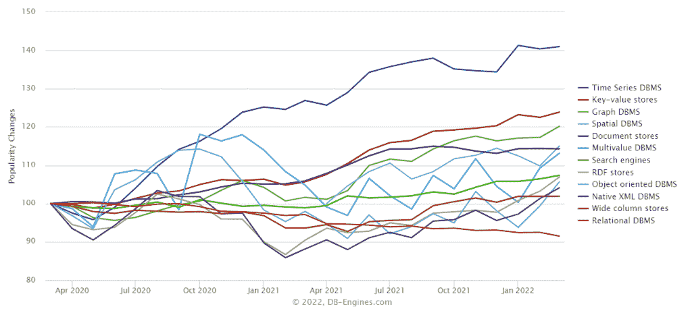
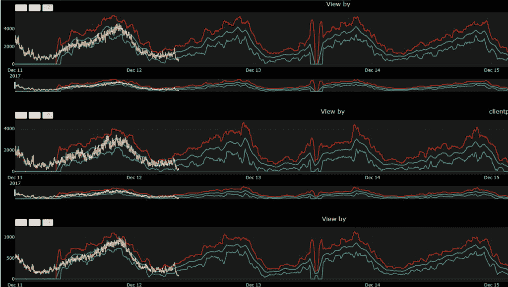

# 时序数据库如何让视频游戏开发者受益

> 原文：<https://thenewstack.io/how-time-series-databases-can-benefit-video-game-developers/>

作为开发人员，您会遇到似乎层出不穷的工具和技术。很难确定什么是值得学习的，什么只是炒作。在本文中，您将了解时间序列数据库，以及一些现实世界中的公司如何在视频游戏行业中从这些数据库中获取价值。

## 用于游戏开发的时间序列数据库

在进入[时序数据库](https://www.influxdata.com/time-series-database/?utm_source=vendor&utm_medium=referral&utm_campaign=2022-03-09_spnsr-ctn_itime-series-game-developers_tns)有助于游戏开发的一些具体用例之前，让我们先了解一下什么是 TSDBs 以及它们的优缺点。

### 什么是时序数据库？

顾名思义，时间序列数据库是一种数据存储，它针对使用[时间序列数据](https://www.influxdata.com/what-is-time-series-data/?utm_source=vendor&utm_medium=referral&utm_campaign=2022-03-09_spnsr-ctn_itime-series-game-developers_tns)进行了优化，比如指标、事件或任何其他包含时间戳作为主字段值的数据点。

 [查尔斯·马勒

查尔斯是 InfluxData 的技术营销作家。Charles 的背景包括从事数字营销和全栈软件开发。](https://www.influxdata.com/) 

使用时序数据库有两个主要好处。首先是在读取和写入数据方面的纯性能。时间序列数据库通常可以处理每分钟写入的数百万个数据点，并且能够高效地查询特定时间段内的所有数据以进行分析。

性能之外的第二个好处是开发人员的生产力。时序数据库将提供内置功能，用于处理时序数据时出现的数据转换、聚合、缩减采样、保留策略、警报和其他常见任务。

根据 [DB-engines](https://db-engines.com/en/ranking_categories) 的说法，由于这些好处，时间序列数据库是过去几年中数据库行业增长最快的部分。各行各业越来越多的公司开始意识到为他们的时间序列数据使用专门的数据库的价值。

另一方面，时序数据库并不是为所有用例而设计的。一个主要的例子就是您需要频繁更新数据的情况。时序数据库是为频繁写入新的带时间戳的数据点而设计的，很少更新这些数据点。如果您的用例需要定期更新值，那么对该数据使用更传统的关系数据库，对有意义的情况使用时间序列数据库可能更有意义。

## 时序数据库的游戏开发用例

现在让我们来看几个游戏开发用例，看看为什么像暴雪、EA、Unity 和许多其他公司使用专用的时间序列数据库来提高他们游戏的性能和可靠性。

### 用户活动跟踪

除了确保您的基础设施是可靠的，您还可以使用时序数据库来跟踪游戏中的用户活动，以更好地了解和优化您的游戏。这方面的一个例子是全球最大的游戏软件公司之一 Playtech。

Playtech 的性能要求无法通过开箱即用的解决方案来满足，因此他们选择在 InfluxDB 上构建。存储事件数据，然后使用各种经典统计模型和机器学习模型对其进行高效可视化和分析。存储的数据不仅是 CPU 和内存使用等标准基础设施指标，也是登录、支付和应用内操作等关键业务指标。

根据 InfluxDB 中存储的数据创建的 Playtech 仪表板

通过使用独立的时间序列数据库，Playtech 不必担心分析可能会降低其生产服务器的速度。查询速度更快，可以更频繁地以更精细的粒度运行。Playtech 在选择这种时序数据存储时提到的一个主要好处是 Flux 脚本语言。这种语言完全是为处理时间序列数据而设计的，并提供了许多开发人员友好的功能，可以提高开发人员的工作效率，例如组合来自多个来源的数据，转换数据，然后根据结果采取行动。Flux 和 InfluxDB 的结合允许开发人员创建自动化的管道和任务，这些管道和任务可以设置为以指定的时间间隔运行，或者基于外部触发器动态运行。

由于该系统，Playtech 能够创建一个预测警报系统，能够比之前的现成解决方案平均快 15 分钟检测到事件。

### 网络监视

对于网络游戏来说，用户体验是成功的关键。期望值比以往任何时候都高，即使很小的延迟或停机时间也会让您的玩家感到沮丧，转而选择众多的替代选项。这种类型的监控非常适合时间序列数据库，不仅适用于游戏开发，也适用于任何其他类型的应用程序监控。

Playtika 是一家游戏开发商，其游戏产品组合拥有超过 3400 万活跃用户。大多数游戏都是基于社交的，玩家之间高度互动。保持可靠性、低延迟和高正常运行时间对于业务成功至关重要。为了监控他们的社交游戏平台，Playtika 依赖于一个使用 [Kafka](https://kafka.apache.org/) 和 [InfluxDB](https://www.influxdata.com/products/influxdb-overview/?utm_source=vendor&utm_medium=referral&utm_campaign=2022-03-09_spnsr-ctn_itime-series-game-developers_tns) 的系统来实现定制指标的动态监控和警报。该系统每天处理超过 9tb 的数据，提高了整个平台的可靠性和洞察力。

## 结论

制作一个成功的视频游戏是一个挑战，所以尽一切努力增加对你有利的机会是有意义的。一个潜在的工具可能是向您的开发工具库中添加一个时序数据库。许多大型游戏开发工作室正在投资并利用这些专门的产品来使他们的游戏更加可靠，并更好地了解他们的玩家如何使用他们的平台并与他们的游戏互动。

<svg xmlns:xlink="http://www.w3.org/1999/xlink" viewBox="0 0 68 31" version="1.1"><title>Group</title> <desc>Created with Sketch.</desc></svg>