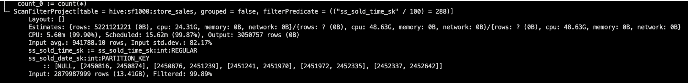

# 如何加速您的 Presto / Trino 查询

> 原文：<https://thenewstack.io/how-to-accelerate-your-presto-trino-queries/>

 [罗曼·泽德

罗曼·泽德是数据湖查询加速创新者 Varada 的高级软件工程师，也是 Presto/Trino 专家。](https://github.com/romanz) 

在用于大数据的高性能分布式 SQL 查询引擎 [Presto](https://prestodb.io/) 上运行复杂的查询需要时间。通过适当调整的 Presto 集群，您可以针对大数据运行快速查询，响应时间从亚秒到几分钟不等。

如果你能让他们跑得更快就好了。为了加速您的查询并达到最佳性能，您需要真正理解 Presto 试图做什么以及它为什么要这样做。有几个特性和操作可以极大地提高 Preso 查询的性能，它们可以在整个[查询生命周期](https://trino.io/docs/current/overview/concepts.html)中应用，以减少查询执行时间和相关的计算资源。

在本文中，我将提供实用的技巧和工作流程，帮助数据运营工程师加快查询速度。我们开始吧！

## 步骤 1:检查查询计划和统计信息

第一步是分析查询和相关的表，以理解 Presto 的执行计划。有几种选择:

1.  **使用解释或解释分析**

对您的查询运行[解释](https://trino.io/docs/current/sql/explain.html)(计划结构+成本估算)或[解释分析](https://trino.io/docs/current/sql/explain-analyze.html?highlight=analyze)(计划结构+成本估算+实际执行统计)，并评估计划，看看您是否得到了您想要的。找到最昂贵的查询片段(最大的 CPU 时间)和操作符，并检查您是否读取了太多的数据？谓词下推是否按预期工作？您的滤波器实现正确吗？或者由于选择性差，它们真的很贵吗？连接看起来正确吗(顺序和类型)？

现在，您可以更新您的表统计信息(如果没有可用的估计值或估计值过时),以改进基于成本的优化器(CBO)操作，根据需要覆盖 CBO，并优化您的查询机制，以降低成本和提高选择性。有时您会遇到分布式工作负载问题(资源利用率过高/过低或工作负载分布不均匀)，您需要通过可观察性工具进一步调查这些问题。

解释计划是一个强大的工具，但它不是非常用户友好的。即使对于最有经验的数据操作工程师来说，阅读计划并理解它们也是一项艰巨的任务。要深入了解 Presto 如何执行查询以及如何阅读 EXPLAIN，请查看 Trino 的 Martin Traverso 的精彩网络研讨会:[了解和调优 Presto 查询处理](https://trino.io/blog/2020/07/30/training-query-tuning.html)。

2.**使用工作量分析器**

大数据软件提供商 [Varada](https://varada.io/) 创建并开源了一个[工作负载分析器](https://varada.io/blog/news/open-sources-workload-analyzer-presto/)，它可以收集每个查询的详细信息和指标，以及聚合和提取信息，并提供几十个图表来描述集群性能的所有方面。使用 Workload Analyzer，数据团队可以了解每小时和每周的资源使用情况，并定义扩展规则，确定高消耗者并提高资源利用率，以及改进谓词下推。Workload Analyzer 还可以帮助数据团队显著减少 IO 和 CPU，识别“最热”数据，提高连接性能，提供更好的生产推广体验，并提前识别升级风险。

3.**使用 Presto 的网络界面**

[Trino](https://trino.io/docs/current/admin/web-interface.html) 和 [PrestoDB](https://prestodb.io/docs/current/admin/web-interface.html) 都提供了基于 web 的用户界面(UI ),用于监控 Presto 集群和管理查询。主页上有一个查询列表，以及唯一查询 ID、查询文本、查询状态、完成百分比、用户名和查询来源等信息。当前运行的查询位于页面顶部，后面是最近完成或失败的查询。查询详细信息页面包含多个信息选项卡，范围从资源利用率到实时查询计划和操作员性能数据。

下面是 Trino 的 Web 用户界面截图，显示了一个大型`store_sales`表和小型`time_dim`表(由 CBO 正确排序)之间的广播连接计划查询，该计划使用动态过滤(可以在操作员视图中看到)。高级统计信息(查询概述和资源)对于比较启用了不同优化的类似查询非常有用。

Web UI 查询概述选项卡

Web UI 查询资源利用率摘要

Web UI 查询直播计划选项卡，显示广播与 DF 的连接

Web UI 阶段(操作员)性能选项卡

4.**更新你的表格统计数据**

Presto 的 CBO 使用连接器提供的表统计来估计不同连接实现的成本，并自动选择估计成本最低的一个。因此，建议保持表统计信息最新。这可以使用 SHOW STATS 和 ANALYZE 命令来完成。 [SHOW STATS](https://trino.io/docs/current/sql/show-stats.html) 命令返回指定表或(有限)查询结果的当前统计数据，而 [ANALYZE](https://trino.io/docs/current/sql/analyze.html) 命令更新给定表的表和列统计数据。

## 步骤 2:数据格式和组织

文件格式、大小、压缩和组织对提高 Presto 查询性能大有帮助。查看 Trino 的 Dain Sundstrom 关于[配置和调整 Presto](https://trino.io/blog/2020/08/27/training-performance.html) 的精彩网络研讨会，了解有关调整和调整 Presto 部署以实现最佳性能的更多信息。

1.  **使用 ORC 或拼花地板等柱状格式。**

柱状格式已经成为大数据分析事实上的标准。将行转换为列的过程非常耗时且计算量大，但对于优化性能至关重要。我们推荐使用 [ORC](https://orc.apache.org/) 或[Parquet](https://parquet.apache.org/)——两者都比文本格式好很多——但是 ORC 更快。Presto 没有规定数据如何存储，但它将数据作为矢量化列进行处理。这意味着 Presto 只保存它处理的数据量，而不携带与处理中的查询无关的额外字段。此外，列数据通常压缩得更好，因为每个列都可以根据其数据分布单独压缩。

2.**查看文件大小并压缩数据**

文件大小是一个很大的问题。小文件会产生许多影响性能的小 IO 请求(高延迟、受到限制或 IO 容量耗尽),并使文件列表变慢。每个文件需要单独处理，这增加了调度时间和成本。我们建议使用至少 100MB 的文件大小来克服潜在的 IO 问题。

此外，始终考虑压缩数据以获得更好的性能。如果使用高压缩格式，最好选择 ZSTD 而不是 ZIP。对于低压缩，更喜欢 LZ4 而不是 Snappy。无论如何，你都应该避免使用 LZO。

3.**对您的数据进行分区和排序**

分区将表分成几部分，并根据列值(如日期或产品)将相关数据保存在一起。您可以在创建表时定义分区，分区有助于减少针对分区列上带有谓词的查询扫描的数据量，从而提高性能。此外，对数据进行排序还有助于缩小 Presto 需要读取的分区范围。如果我们对每个文件进行排序，我们可以有效地跳过不相关的块，但前提是我们要过滤已排序的列。

## 步骤 3:过滤操作

改进过滤器以获得更少的结果(高选择性)是减少延迟和扫描数据量的关键。Presto 有几个用来优化过滤操作的特性。

1.  **修剪和谓词推下** n

Presto 优化查询的一种方法是跳过不必要的数据，称为修剪。每个文件、每个条带(约 1M 行)和每个 10K 行都记录了每列的一些统计信息(例如最小值和最大值)。使用这些信息，Presto 可以跳过任何可能与查询谓词不匹配的片段。下面是带有和不带有谓词下推的查询的解释分析输出的屏幕截图。

解释不带谓词下推的查询的分析输出:读取带有复杂谓词的 2.79B 行—当前无法下推。

解释使用谓词下推的查询的分析输出:使用简单谓词读取 2.13B 行。

2.**懒读**

最后一个特性是延迟读取——延迟读取列，直到真正需要它们的数据。谓词下推在起作用的时候很神奇，但是对于很多数据集来说，根本不起作用。如果数据有大量不同的值，并且被很好地混洗，最小和最大统计数据将覆盖几乎整个范围的值，使得谓词下推无效。对于延迟读取，查询引擎总是检查评估查询过滤器所需的列，然后才读取其他列中与过滤器匹配的段(如果找到任何匹配的段)。对于大多数工作负载，除了谓词下推之外，该特性还可以节省更多的 CPU。此外，您可以利用另一个很好的优化，[延迟具体化](https://github.com/trinodb/trino/issues/49)，它允许在同一个阶段内传播延迟读取。这可以通过'`experimental.late-materialization.enabled`'配置属性来启用。

## 步骤 4:通过 CBO 加入订购和分销

查询中联接的执行顺序会对查询的性能产生重大影响。如果在执行的早期执行产生大量数据的连接，那么后续阶段将需要比必要时间更长的时间来处理大量数据，从而增加查询所需的时间和资源。Presto 的 [CBO](https://trino.io/blog/2019/07/04/cbo-introduction.html) 将总是基于表统计和资源可用性，尝试为给定的查询选择最有效的计划。这大大减少了查询处理时间。

1.  **探针侧应大于构建侧**

为了让像动态过滤这样的高级优化有效地工作，需要选择较小的维度表作为连接的构建端。基于成本的优化器可以使用连接器提供的表统计信息自动完成这项工作。因此，建议保持表统计信息最新，并依靠 CBO 在连接的构建端正确选择较小的表。

2.**优先于分区连接的广播**

Presto 中有两种类型的连接分布:

*   分区的:参与查询的每个节点仅从一小部分数据构建哈希表
*   广播:参与查询的每个节点从所有数据构建一个哈希表(数据被复制)

如果右侧(构建)表“很小”，它可以被复制到所有 join workers，从而节省 CPU 和网络的左侧重新分区成本，这对于大型左侧(探测)表来说意义重大。否则，将使用连接键对两个表进行重新分区，从而允许与右侧较大的表进行连接。

3.**大型表的协同定位连接执行**

非常大的连接操作有时会耗尽内存。协同定位连接(也称为分组连接执行)将使用更少的内存、CPU，并在 Presto workers 之间传送更少的数据。为了利用这些好处，必须确保要连接的两个表在相同的键上进行分区。当连接的两端具有相同的表分区并且分区是可寻址的时，可以一次将部分数据加载到内存中，从而可以在使用较少内存的情况下执行连接。

4.**动态过滤可以帮助选择性连接**

Presto 最近增强了[动态过滤](https://trino.io/docs/current/admin/dynamic-filtering.html)功能(由[瓦拉达](https://varada.io/blog/presto/dynamic-filtering-for-highly-selective-join-optimization/)贡献给 Trino 项目)，允许在连接表之前预过滤探头端的表。[动态过滤优化](https://trino.io/blog/2020/06/14/dynamic-partition-pruning.html)通过避免读取否则会被连接条件过滤的数据，显著提高了使用选择性连接的查询的性能。这表明查询执行时间减少了 10 倍！如果没有动态过滤，Presto 会扫描事实表中的所有数据，因为查询中没有过滤器。连接操作符最终丢弃了大部分探测端的行，因为连接标准是高度选择性的。

<svg xmlns:xlink="http://www.w3.org/1999/xlink" viewBox="0 0 68 31" version="1.1"><title>Group</title> <desc>Created with Sketch.</desc></svg>