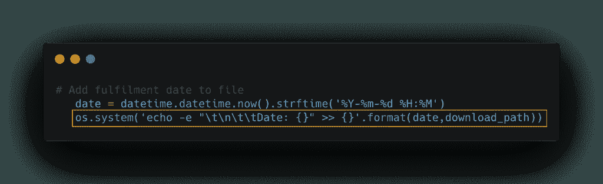
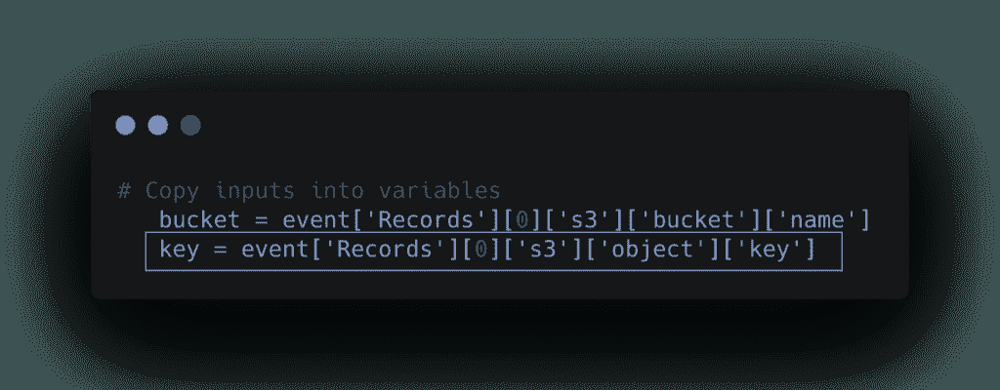
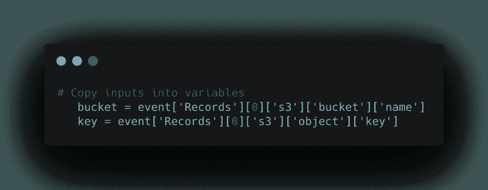
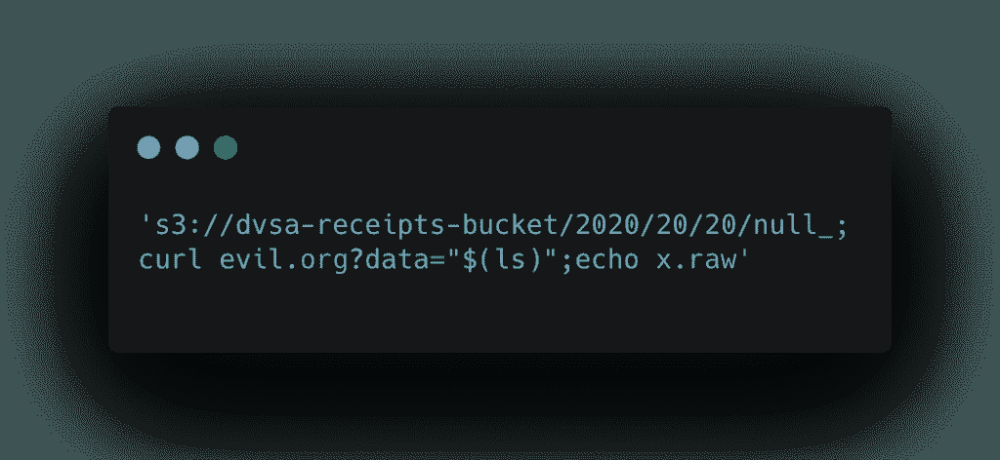
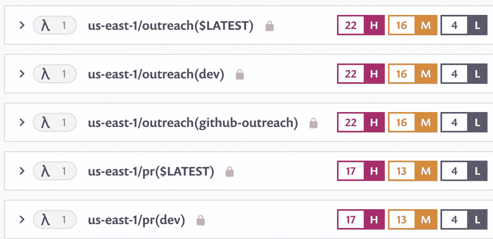

# 如何实现绝对的无服务器安全

> 原文：<https://thenewstack.io/how-to-achieve-ironclad-serverless-security/>

Snyk 赞助了这篇文章。

 [盖伊·波德贾尼

Guy Podjarny 是 Snyk 的联合创始人兼总裁。](https://www.linkedin.com/in/guypo/) 

无服务器对不同的人意味着不同的东西，所以为了尽早调整语法，这篇文章将专注于函数——如 Lambda 函数、Google Cloud 函数或 Azure 函数。基本上是运行在云之上的功能，云开箱即可为您管理这些功能及其虚拟机操作。

虽然这篇帖子将重点关注差距，并提供实际可行的方法来改善您的[无服务器安全](https://snyk.co/serverless-security-TNS)状态，但让我们从好消息开始:无服务器具有内在的安全优势，并且是为了通过设计隐式管理安全而构建的。一些例子:

1.  **未打补丁的操作系统**。无服务器基本上消除了任何服务器争论——修补、升级等——因为无服务器服务器(一种矛盾的说法)是为您维护和修补的。
2.  **DoS 攻击。** Serverless 天生具有弹性伸缩性，旨在处理大量流量；而且这还不仅限于“流量好”一项。试图造成拒绝服务的“不良流量”在无服务器上也能很好地扩展。虽然你仍然可能因流量激增而被下药或收到高额账单，但使用无服务器实现 DoS 攻击要困难得多。
3.  **长期受损的服务器。**无服务器服务器的寿命很短，也就是说，如果攻击者想要访问您的服务器、安装代理并进行恶意活动，那么对于快速拆卸的服务器来说，这通常会更加困难。因此，他们需要提前计划一次执行良好的端到端攻击，这更困难，暴露的风险也更高。

尽管如此，在选择使用无服务器技术时，仍有相当多的安全方面需要考虑。有一些好的实践，你可以应用来最小化这些风险，我称之为 CLAD 模型。

## 包层模型

*   **代码。**您的函数代码可能包含漏洞。
*   **库**。具有应用程序依赖性的库(通过应用程序引入的二进制文件)可能包含漏洞。
*   **访问**。允许对敏感数据或功能进行过度许可或访问的配置。
*   **数据**。这在无服务器操作中是一种不同的情况，因为您取走了可能存在于服务器上的临时数据。

### 给我看看代码

代码是无服务器的核心，所以让我们从一个例子开始。(摘自 [OWASP](https://owasp.org/www-pdf-archive/OWASP-Top-10-Serverless-Interpretation-en.pdf) )。

这个代码示例是 Python 中的一个 Lambda 函数，它模拟了一个编写 S3 文件的电子商务商店，该文件修改文件以更新服务完成的日期。

让我们放大这段简单代码中最可怕的部分。如果你仔细观察，你可能会注意到包含`os.system`的那一行代码——这里经常出现“有龙”，也就是说要小心行事。这里的情况也确实如此。

然而，真正的安全漏洞实际上发生在几行之后。

我们习惯于引用 S3 文件，但是 S3 实际上是对象——对象可以包含任何 UTF-8 字符，包括分号(；).

因此，有了这种可能性，当稍后调用`os.system`时，我们可以用下载路径替换花括号，这可能允许远程命令执行。如果有效载荷看起来像这样:

…这可能导致向恶意服务器发送恶意代码。

### 关键要点 1

在 serverless 中没有任何东西可以保护您免受这种攻击。(当然，这也可能发生在非无服务器操作中)。

这里要注意的重要一点不是我们信任 HTTP 输入，而是我们熟悉 S3 文件名，这在无服务器世界中是一个非常常见的错误。

虽然从总体趋势来看，我们已经学会了对 HTTP 流量保持谨慎，但是如果我们在安全环境中考虑函数，最佳实践是将每个函数都视为自己的边界。这个函数代码假设 S3 存储桶本身是安全的，攻击者不能在 S3 存储桶中创建文件。它不应该做这样的假设。

**你能做些什么:**

验证这个函数是安全的，即使它周围的函数不是绝对安全的。因为无服务器的本质是由你可以四处移动的块组成的，甚至可以以不同的方式组合。

*   **保护您的代码，小心事件输入**；不仅仅是 HTTP，还有 SNS、S3 文件名和对象。
*   把每一个功能都当作一个周界。
*   **利用共享库进行规模化。认为开发人员能够对每个功能都这样做是不现实的，所以最佳实践是创建共享的、净化的库。**

## 库:当心陈旧依赖中的“零天”

这些本质上是应用程序代码中基础设施的“点缀”。虽然我们通常认为无服务器只是代码，但这些库代表了应用程序代码中的基础结构。就像操作系统或服务器可能有未打补丁的服务(例如 NGINX)，函数可能有未打补丁的 expressjs 或其他库。这些数字可能会让你吃惊。

### 无服务器函数中的依赖性

基于 Snyk [漏洞数据库](https://snyk.co/vuln-tns)，这些是在 Snyk 扫描的项目中无服务器功能拥有的直接依赖关系的中间值——它们相当可观。复杂之处在于这些项目所使用的组件之间的依赖关系。

当我们看这些数字时，依赖关系的总数要高得多——高一个或多个数量级。有了如此大量的组件，许多组件可能会有漏洞或变得陈旧，旧的未维护版本会发现新的漏洞。

在这最后一张快照中，只关注这四个生态系统，您可以看到在过去 12 个月中披露的零日漏洞数量。即使只是简单地回顾一下数学，当考虑到许多函数、许多库及其漏洞时，出现一些重大“漏洞”的可能性(即攻击者进入的途径)也是相当高的。这是您需要解决的类似基础设施的风险。

**你能做些什么:**

首先，你需要知道你拥有什么。从库存开始，注意哪个功能使用了哪些组件。下面用 Snyk 具体演示了 lambda 函数(但这也可以通过 Github repo 来完成)。即使您没有使用 Snyk，也应该通过跟踪函数所使用的组件中的新漏洞来完成这项工作——尤其是那些在生产环境中运行的组件。

第二，你需要投资整治。事实是，您会经常收到这些警报，因为这些漏洞一直在发生。因此，您希望确保补救途径简单易行，通常是通过升级，并尽快推广。

*   查找、跟踪和修复易受攻击的库。
*   简化和自动化补救。
*   一旦你知道了你的库存，就要为零库存做好准备&尽快修复它们。

## 访问:您的功能*可以做什么*与它们*应该做什么*

虽然无服务器功能非常强大，但它们应该提供尽可能少的访问权限来运行该功能。

在无服务器中，您经常会看到这种模式(这当然不是无服务器独有的，它发生在每个生态系统中)。在这个 YAML 文件中，您用一个文件来定义多个函数——用`create`、`list`和`get`——这是有意义的，因为它们都被一起部署。一般来说，对于这种做法是好是坏有不同的考虑——但这是常见的。但是，请注意，在文件的顶部，您拥有权限:IAM 角色的集合以及允许他们做什么。

将所有这些放在一个文件中，虽然很方便，但实际上为每个函数提供了每个函数需要的权限的超集。许可很容易授予，但很难收缩。给了权限之后，撤销这些就变得非常可怕了——很难知道可能会破坏什么。所以现实是:他们从来不收缩，他们只是不断扩张扩张(直到有人加了星号)。

所以，你真的应该从一开始就制定正确的政策来减少这些特权。虽然单一的政策是更简单的方式，但投资更具体的政策会更安全。一旦你做好了这一点，你会发现自己比以前过得更好。

使用 monoliths，如果你有一个应用程序，并且它将所有这些功能集成在一个中，那么平台不允许你对不同的代码应用不同的策略。然而，无服务器功能 ***确实允许*** 您这样做，所以鼓励您利用这种内置的安全优势。

**你能做些什么:**

*   给函数最小的权限，即使这很难。
*   将实验与生产分开；虽然快速部署函数来做实验很容易，但有时(如前所述)代码或库可能会有漏洞，代码会变得陈旧，这是一种有风险的做法。假设生产功能得到了所需的适当关注和维护，任何不会得到同等关注的实验性数据都应该与更安全的环境和客户数据隔离开来。
*   跟踪未使用的权限并减少它们；如果您希望随着时间的推移提升并真正改进您的系统，您应该跟踪未使用的权限并逐渐减少它们。你可以通过日志甚至混沌工程来做到这一点——取消一个许可，并为将要发生的事情做好准备。培养这种能力使您能够随着时间的推移提高您的功能和应用程序的安全性。

## 数据:函数的输入和输出

在一天结束时，应用程序通常只是处理数据。它是一些逻辑，接收一些数据，输出其他数据；无服务器也不例外。你的功能只是处理数据，需要做好。但是，对于无服务器，您可能会担心失去存储临时数据(如会话或日志数据)的能力，这些数据可能会临时放在计算机上，或者在典型的非无服务器操作中保存在内存中。

结果是更多的数据存储在函数之外，这些数据可能存储在某些数据存储的缓存中(例如 Redis 缓存)，您需要注意如何保护这些数据。就像我们讨论函数的边界一样，你不知道谁有权访问这些数据。请参见下面的示例(同样使用 Snyk，但是您可以使用各种解决方案来实现这一点):

在这段代码中，我们检查了部署无服务器函数的 Terraform 脚本，其中在函数外部启用了日志记录(这是有意义的，因为您不希望将日志数据存储在短暂的不可变服务器上)，但是没有启用加密。在这种情况下，这只是一个建议；当它们未被加密时，就不知道谁能访问这些日志。

不要忘记数据是重要的，无服务器不会让你的数据问题神奇地消失。

**你能做些什么:**

*   **在安全存储区**(例如 KMS 或至少是环境变量)对代码保密。这可能会增加一些复杂性，因为无服务器非常“简单”。将某个键签入代码库变得很容易。但我不能强调这一点: ***不要这样做*** ，因为它很容易被偷，很难旋转。
*   **保护传输中的数据**。当数据在网络实体之间移动时，请确保在传输过程中保护这些功能，尤其是在调用第三方组件或回读数据时。因为它们不在同一台机器上，所以您不能信任这些功能进行通信的所有通道——这会使您的系统变得脆弱。
*   **清除和加密临时/会话数据。**状态缺失会有更多。如果以前使用非无服务器的临时数据，您习惯于只存储在缓存或内存中，那么使用无服务器时，您应该考虑对其进行加密。

## 总结:以 DevSecOps 为骨干构建可伸缩性

无服务器隐含地提供安全机制；然而，你必须自己处理代码、库、访问和数据。

无服务器是为可伸缩性而构建的，虽然今天您可能有一些可管理的功能需要手动审计和调查安全性，但这当然是不可伸缩的。因此，尽早在自动化和可观察性上投资是很重要的，这样才能避免明天醒来就遭遇灾难。建议从底层开始构建安全实践，并了解您拥有的功能、其组件的安全状态和权限，以便走在安全曲线的前面，而不是发现自己不得不解决一堆乱七八糟的问题。

在比技术更高的层次上，无服务器本质上是能够快速部署功能的速度——即与良好的 API 一起工作的小单元。几乎没有机会或时间让外部安全团队参与部署过程。这就是为什么唯一真正的扩展方式是通过 [DevSecOps](https://snyk.co/devsecops-TNS) 方法。其中的核心是通过给开发人员工具、所有权和授权来保护他们正在构建的东西，从而增强他们的能力。然后，安全团队的工作就是帮助开发人员越来越好、越来越容易、越来越少地完成这项工作，并确保他们确实实现了推荐的安全实践。

CLAD 模型扩展了无服务器的安全性。它适用于所有云原生开发，并且应该被认为是现代工程实践中必不可少的。

*你可以在这个[无服务器漏洞报告](https://github.com/guypod/serverless-goof)中找到更多无服务器漏洞利用示例和实用代码示例。*

通过 Pixabay 的特征图像。

<svg xmlns:xlink="http://www.w3.org/1999/xlink" viewBox="0 0 68 31" version="1.1"><title>Group</title> <desc>Created with Sketch.</desc></svg>