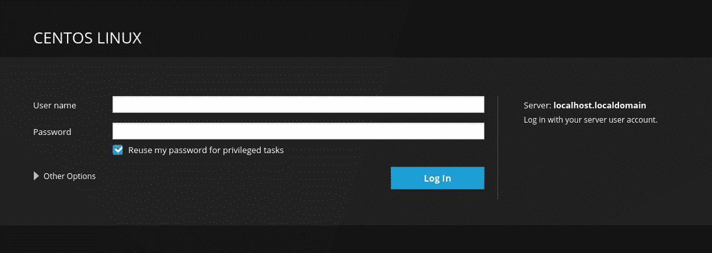
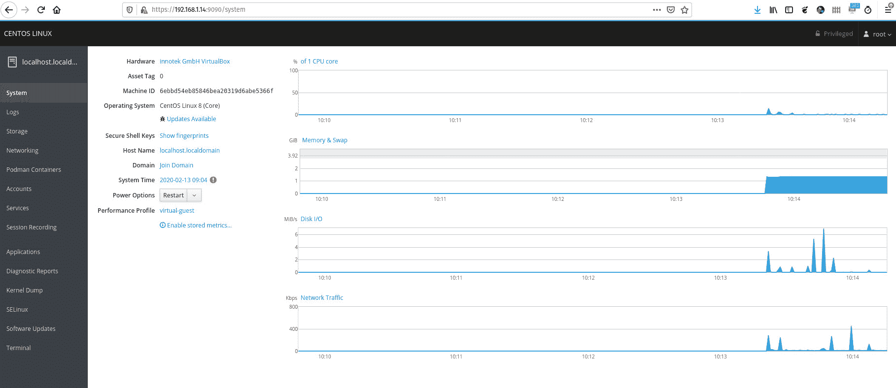
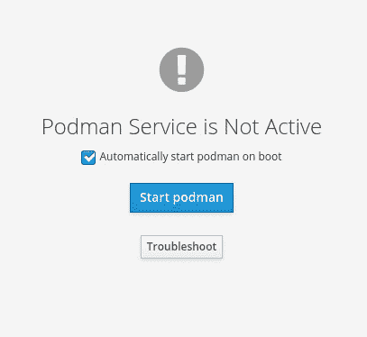
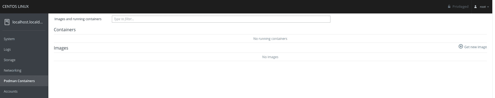
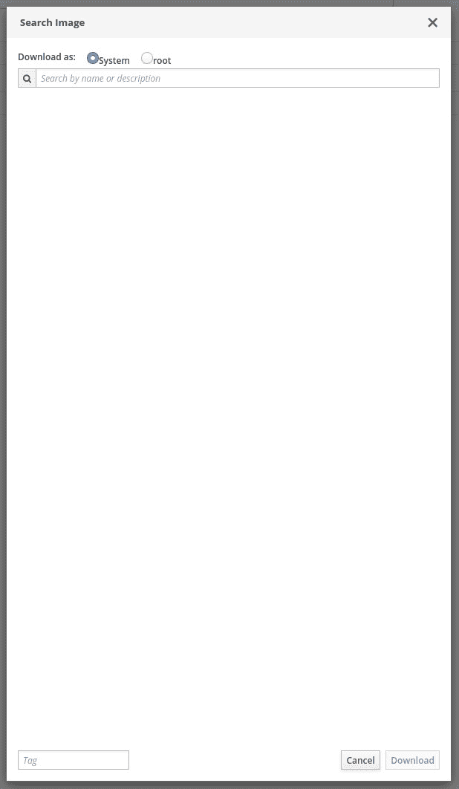
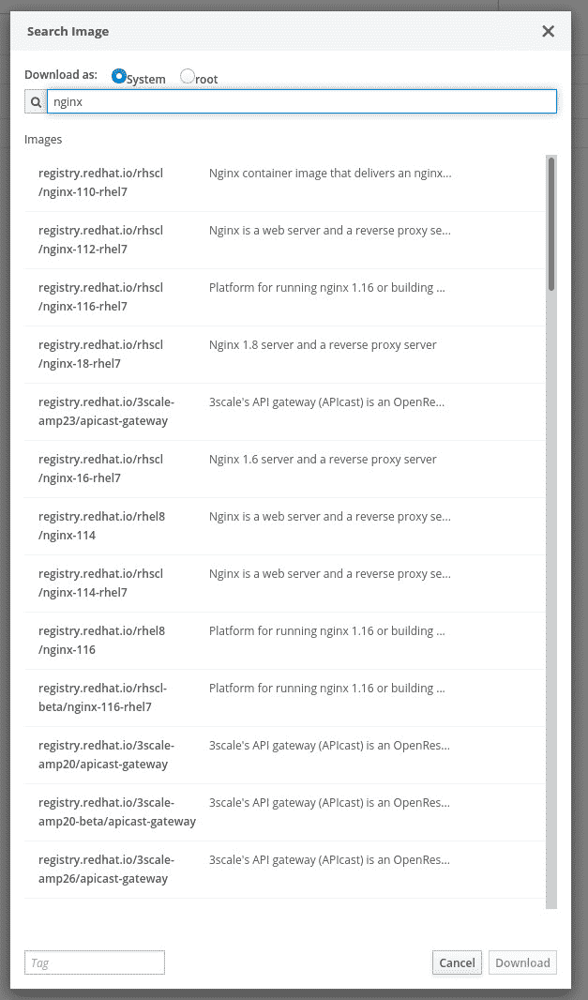
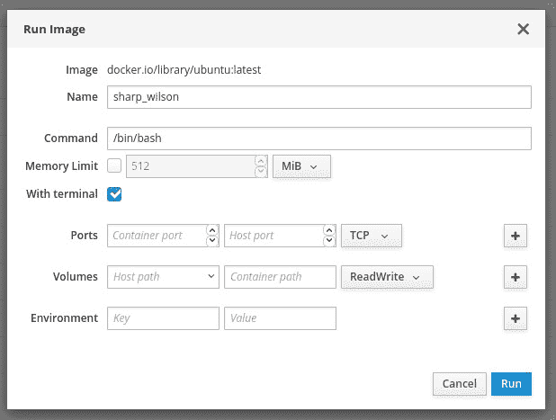
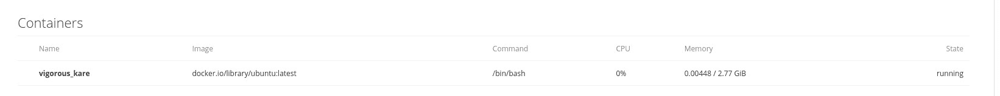

# 如何给红帽驾驶舱添加容器支持

> 原文：<https://thenewstack.io/how-to-add-container-support-to-red-hat-cockpit/>

如果你是一个[红帽企业版 Linux](https://www.redhat.com/en/technologies/linux-platforms/enterprise-linux) 或 [CentOS](https://www.centos.org/) 用户，你可能听说过 [Cockpit](https://www.redhat.com/en/blog/linux-system-administration-management-console-cockpit) ，这是一个强大的基于网络的图形用户界面，允许你管理服务器上的许多任务。使用该工具，您可以:

*   对系统性能一目了然
*   查看日志
*   管理系统存储
*   启用/禁用防火墙
*   配置网络
*   创建/管理用户帐户
*   停止/启动服务
*   查看 SSH 会话
*   查看诊断报告和内核转储
*   管理 SELinux
*   更新软件
*   访问终端

那都是现成的。您还可以向系统添加其他功能，如容器支持。请理解，如果您使用 RHEL/CentOS 8，您将添加[波德曼支持](https://thenewstack.io/check-out-podman-red-hats-daemon-less-docker-alternative/)。另一方面，如果您使用的是旧版本(比如 CentOS 7)，您仍然可以添加 Docker 支持。

我将向您介绍向驾驶舱系统添加 podman 容器支持的过程。一旦完成了这些，您就可以下载映像和部署容器了。对于任何喜欢使用方便的 GUI 工具来完成这项任务的人来说，Cockpit 是迄今为止最容易安装和运行的工具。考虑到您可以在这个工具中执行其他管理任务，将容器添加到组合中是非常有意义的。

让我们实现它。

## 你需要什么

为驾驶舱增加集装箱支撑需要的唯一东西是:

*   驾驶舱的运行实例(在 CentOS 或 RHEL 上)。
*   拥有 **sudo** 权限的用户。

就是这样。让我们变点魔法吧。我将在 CentOS 8 的最新实例上演示。

## 启用驾驶舱

在 CentOS 8 之前，你必须安装驾驶舱。另一方面，CentOS 8 是开箱即用的。即使安装了软件，它也不会被启用。所以首先要做的是启用驾驶舱。

登录您的 CentOS 或 RHEL 服务器。如果服务器具有桌面环境，请打开终端窗口。从终端发出命令:

`sudo systemctl enable --now cockpit.socket`

出现提示时，键入您的 **sudo** 密码，然后按回车键。该命令完成后，驾驶舱启用并准备就绪。

## 进入驾驶舱

在我们继续之前，让我们确保你能进入驾驶舱。将 web 浏览器指向:https://SERVER_IP:9090(其中 SERVER_IP 是托管服务器的 IP 地址)。你应该会收到驾驶舱登录的问候(**图 1** )。

**图 1:** 驾驶舱登录。

使用 root 用户的凭证登录，确保选中了**为特权任务**重用我的密码的复选框。为什么？因为目前，Podman 还不能运行无根容器，所以你需要更高的特权来使用 Podman。

然而，我们还没有增加对波德曼的支持。所以还是补充一下吧。退出驾驶舱，回到终端窗口。

## 添加 Podman 支持

为了添加 Podman 支持，您需要安装另一个应用程序。在终端窗口中，发出以下命令:

`sudo dnf install cockpit-podman -y`

一旦该命令完成，重新登录到 Cockpit(使用 root 的凭证)，您应该会看到左侧栏中列出的**pod man Containers**(**图 2** )。

**图 2:** 我们已经成功地为驾驶舱添加了 Podman 支持。

单击左侧导航栏中的 **Podman Containers** ，您将看到一条警告，提示该服务没有运行(**图 3** )。

**图 3** :驾驶舱吊舱员服务没有运行。

确保勾选了**开机自动启动 pod man**复选框，然后点击**启动 podman** 。

你现在应该看到波德曼集装箱驾驶舱仪表板(**图 4** )。

**图 4:** 波德曼集装箱仪表盘。

## 使用 Podman 容器

除非您已经使用了 podman 命令行，否则您不会在仪表板中列出任何图像或容器。让我们解决这个问题。

要下载新图像，点击**获取新图像**。在出现的弹出窗口(**图 5** )中，输入您想要下载的图像名称，然后等待结果。

**图 5** :通过驾驶舱下载集装箱图像。

一旦结果出现(**图 6** ，选择您想要的图像并点击**下载**。

**图 6:** 选择您想要使用的图像。

在 CentOS 上你会遇到一个警告。除非你是 RHEL 的用户，否则你将无法从红帽资料库下载图片。没关系，因为如果你向下滚动，你会发现其他来源的图片。

图像下载后，您会看到它列在仪表板中。单击与图像相关联的运行按钮(向右箭头)，然后您可以在弹出窗口中配置要部署的容器(**图 7** )。

**图 7:** 为部署配置您的容器。

您部署的容器现在将会在 Podman 仪表板中列出(**图 8** )。

**图 8:** 波德曼驾驶舱仪表盘中列出的一个运行容器。

这就是向基于 web 的 Cockpit 添加容器支持的全部内容。尽管您可能无法在这个工具的范围内使用所有的容器魔法，但是它可以使容器和图像的管理变得非常容易。

<svg xmlns:xlink="http://www.w3.org/1999/xlink" viewBox="0 0 68 31" version="1.1"><title>Group</title> <desc>Created with Sketch.</desc></svg>